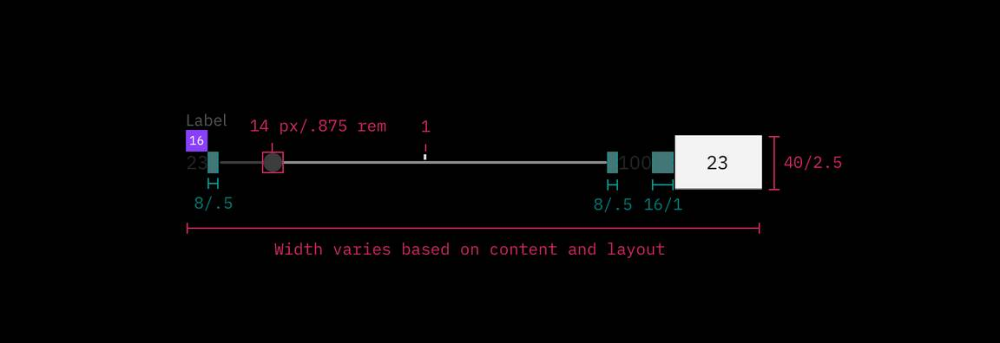

## Color

| Element       | Property         | Color token         |
| ------------- | ---------------- | ------------------- |
| Slider thumb  | fill             | `$icon-primary`     |
| Track         | background-color | `$border-subtle` \* |
| Track: filled | background-color | `$border-inverse`   |
| Label         | text color       | `$text-secondary`   |
| Rangel label  | text color       | `$text-primary`     |

<Caption>
  * Denotes a contextual color token that will change values based on the layer
  it is placed on.
</Caption>

### Interactive states

| Element        | Property         | Color token        |
| -------------- | ---------------- | ------------------ |
| Thumb:focus    | border           | `$focus`           |
| Thumb:active   | fill             | `$interactive`     |
| Track:active   | background-color | `$interactive`     |
| Label:disabled | text color       | `$text-disabled`   |
| Thumb:disabled | fill             | `$border-disabled` |
| Track:disabled | background-color | `$border-disabled` |

## Typography

Slider labels should be set in sentence case, with only the first word in a
phrase and any proper nouns capitalized, and no more than three words.

| Element     | Font-size (px/rem) | Font-weight   | Type token  |
| ----------- | ------------------ | ------------- | ----------- |
| Label       | 12 / 0.75          | Regular / 400 | `$label-01` |
| Range label | 14 / 0.875         | Regular / 400 | `$code-02`  |

## Structure

The width of a slider varies based on page content and layout.

| Element      | Property                  | px / rem   | Spacing token |
| ------------ | ------------------------- | ---------- | ------------- |
| Thumb        | height, width             | 14 / 0.875 | –             |
| Thumb:active | height, width             | 20 / 1.25  | –             |
| Track        | height                    | 4 / 0.25   | –             |
|              | margin-left, margin-right | 8 / 0.5    | `$spacing-03` |
| Label        | margin-bottom             | 16 / 1     | `$spacing-05` |
| Range label  | margin-right              | 16 / 1     | `$spacing-05` |

### Recommended

The following specs are not built into the slider component but are recommended
by design as the proper sizing for the slider tracking line.

| Element | Property  | px / rem   | Spacing token |
| ------- | --------- | ---------- | ------------- |
| Slider  | min-width | 200 / 12.5 | –             |
|         | max-width | 640 / 40   | –             |
