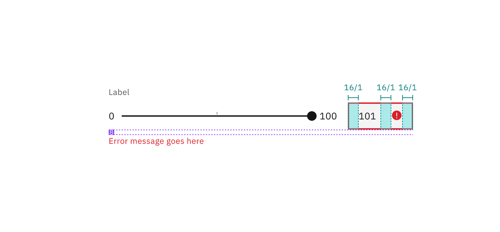
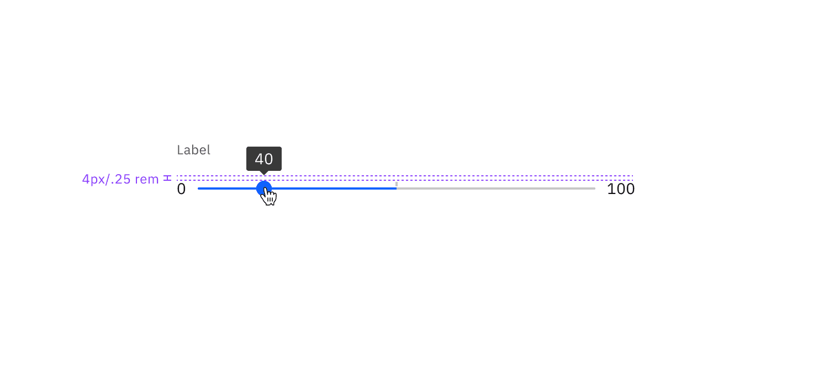
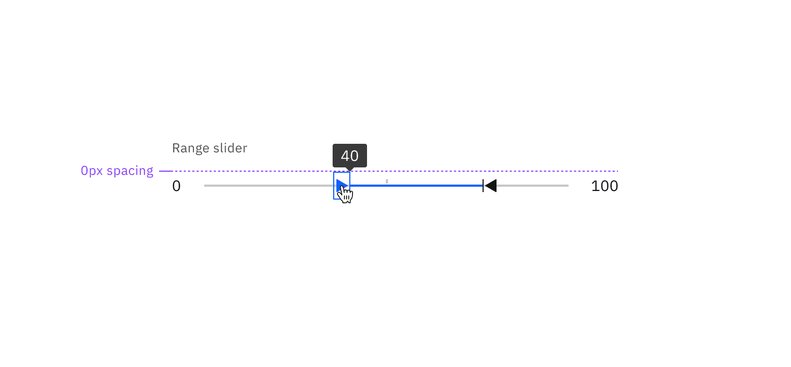

<PageDescription>

The following page documents visual specifications such as color, typography,
structure, and size.

</PageDescription>

<AnchorLinks>

<AnchorLink>Color</AnchorLink>
<AnchorLink>Typography</AnchorLink>
<AnchorLink>Structure</AnchorLink>
<AnchorLink>Size</AnchorLink>
<AnchorLink>Feedback</AnchorLink>

</AnchorLinks>

## Color

| Element       | Property         | Color token         |
| ------------- | ---------------- | ------------------- |
| Handle        | fill             | `$icon-primary`     |
| Track         | background-color | `$border-subtle` \* |
| Track: filled | background-color | `$border-inverse`   |
| Label         | text-color       | `$text-secondary`   |
| Rangel label  | text-color       | `$text-primary`     |

<Caption fullWidth>
  \* Denotes a contextual color token that will change values based on the layer
  it is placed on.
</Caption>

<Row>
<Column colLg={8}>

<Tabs>

<Tab label="Default">

</Tab>

<Tab label="Range">

</Tab>

</Tabs>

</Column>
</Row>

### Interactive states

Slider uses a number input to type in values. See
[number input](https://carbondesignsystem.com/components/number-input/style) for
more information on its interactive states.

| State     | Element         | Property         | Color token         |
| --------- | --------------- | ---------------- | ------------------- |
| Focus     | Handle          | border           | `$focus`            |
|           | Track           | background-color | `$interactive`      |
| Active    | Handle          | fill             | `$interactive`      |
|           | Track           | background-color | `$interactive`      |
| Error     | Number input    | border           | `$support-error`    |
|           | Error icon      | svg              | `$support-error`    |
|           | Error message   | text-color       | `$text-error`       |
| Warning   | Warning icon    | svg              | `$support-warning`  |
|           | Warning message | text-color       | `$text-primary`     |
| Disabled  | Label           | text-color       | `$text-disabled`    |
|           | Range label     | text-color       | `$text-disabled`    |
|           | Handle          | fill             | `$border-disabled`  |
|           | Track           | background-color | `$border-disabled`  |
| Read-only | Label           | text-color       | `$text-secondary`   |
|           | Range label     | text-color       | `$text-primary`     |
|           | Track           | background-color | `$border-subtle` \* |
|           | Track: filled   | background-color | `$border-inverse`   |

<Caption fullWidth>
  \* Denotes a contextual color token that will change values based on the layer
  it is placed on.
</Caption>

<Row>
<Column colLg={12}>

<Tabs>

<Tab label="Default">

</Tab>

<Tab label="Range">

</Tab>

</Tabs>

</Column>
</Row>

## Typography

Slider labels should be set in sentence case, with only the first word in a
phrase and any proper nouns capitalized, and no more than three words.

| Element     | Font-size (px/rem) | Font-weight   | Type token         |
| ----------- | ------------------ | ------------- | ------------------ |
| Label       | 12 / 0.75          | Regular / 400 | `$label-01`        |
| Range label | 14 / 0.875         | Regular / 400 | `$body-compact-01` |

## Structure

The width of a slider varies based on page content and layout.

### Default slider structure

| Element        | Property                    | px / rem   | Spacing token |
| -------------- | --------------------------- | ---------- | ------------- |
| Handle         | height, width               | 14 / 0.875 | –             |
| Handle: active | height, width               | 20 / 1.25  | –             |
| Track          | height                      | 4 / 0.25   | –             |
|                | margin-left, margin-right   | 8 / 0.5    | `$spacing-03` |
| Label          | margin-bottom               | 8 / 0.5    | `$spacing-03` |
| Range label    | margin-right                | 16 / 1     | `$spacing-05` |
| Error message  | margin-top                  | 16 / 1     | `$spacing-05` |
| Error icon     | padding-right, padding-left | 16 / 1     | `$spacing-05` |
| Tooltip        | padding-bottom              | 4 / 0.25   | `$spacing-02` |

### Range slider structure

| Element        | Property                    | px / rem | Spacing token |
| -------------- | --------------------------- | -------- | ------------- |
| Handle         | height, width               | 16 / 1   | `$spacing-05` |
| Handle: active | height, width               | 16 / 1   | `$spacing-05` |
| Track          | height                      | 4 / 0.25 | –             |
|                | margin-left, margin-right   | 16 / 1   | `$spacing-05` |
| Label          | margin-bottom               | 8 / 0.5  | `$spacing-03` |
| Range label    | margin-right                | 16 / 1   | `$spacing-05` |
| Error message  | margin-top                  | 16 / 1   | `$spacing-05` |
| Error icon     | padding-right, padding-left | 16 / 1   | `$spacing-05` |
| Tooltip        | padding-bottom              | 0        | –             |

## Size

The following specs are not built into the slider component but are recommended
by design as the proper sizing for the slider tracking line.

| Element | Property  | px / rem   | Spacing token |
| ------- | --------- | ---------- | ------------- |
| Slider  | min-width | 200 / 12.5 | –             |
|         | max-width | 640 / 40   | –             |

## Feedback

Help us improve this component by providing feedback, asking questions, and
leaving any other comments on
[GitHub](https://github.com/carbon-design-system/carbon-website/issues/new?assignees=&labels=feedback&template=feedback.md).
