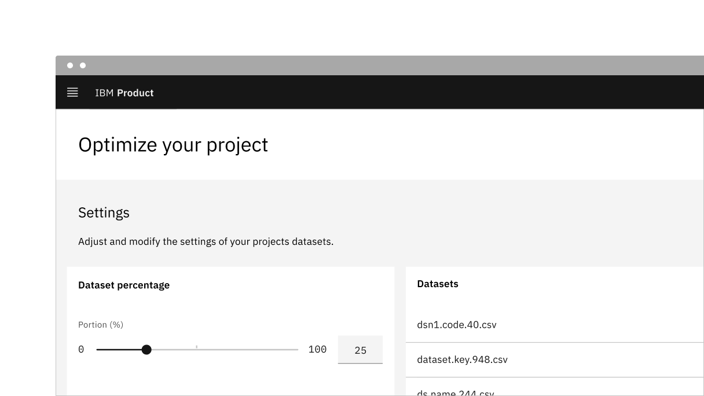
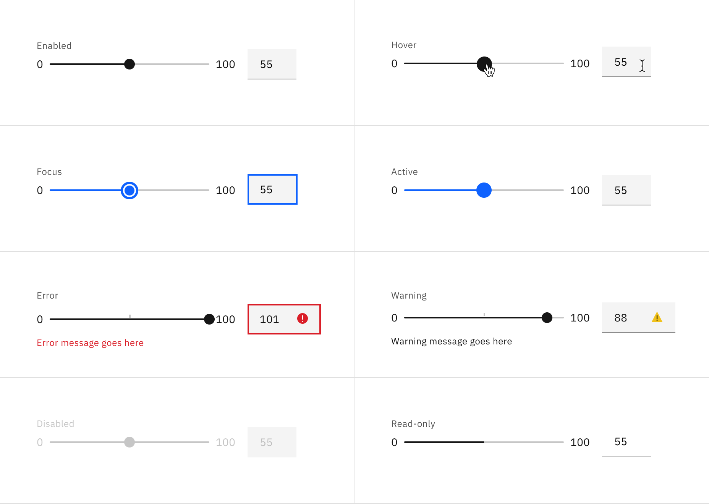

<PageDescription>

Sliders provide a visual indication of adjustable content, where the user can
increase or decrease the value by moving the handle along a horizontal track.

</PageDescription>

<AnchorLinks>

<AnchorLink>Overview</AnchorLink>
<AnchorLink>Live demo</AnchorLink>
<AnchorLink>Behaviors</AnchorLink>
<AnchorLink>Interactions</AnchorLink>
<AnchorLink>Best practices</AnchorLink>
<AnchorLink>Feedback</AnchorLink>

</AnchorLinks>

## Overview

The slider in its basic form should be accompanied by a label and a number input
that doubles as a display for the slider's current value.

The basic slider does **not** include discrete values, as the slider represents
a percentage of 0-100. In this case it is not necessary for a user to choose a
specific value, but instead generally increase or decrease an input. For
example, the user increases the slider amount and the volume of the music gets
louder.

The more complex versions should be used for selecting a specific value within a
value range.

<Row>
<Column colLg={8}>

</Column>
</Row>

## Live demo

<ComponentDemo
  components={[
    {
      id: 'slider',
      label: 'Slider',
    },
  ]}
>
  <ComponentVariant
    id="slider"
    knobs={{ Slider: ['disabled', 'hideTextInput', 'light'] }}
    links={{
      React:
        'https://react.carbondesignsystem.com/?path=/story/components-slider--default',
      'Web Components':
        'https://web-components.carbondesignsystem.com/?path=/story/components-slider--default',
      Angular:
        'https://angular.carbondesignsystem.com/?path=/story/components-slider--basic',
      Vue: 'http://vue.carbondesignsystem.com/?path=/story/components-cvslider--default',
    }}
  >
    {`
  

<Slider
  ariaLabelInput="Label for slider value"
  id="slider"
  labelText="Slider label"
  max={100}
  min={0}
  step={1}
  stepMuliplier={4}
  value={50}
/>

  `}
  </ComponentVariant>
</ComponentDemo>

## Behaviors

### States

The slider component has the following states for both the track and the text
input: **enabled**, **hover**, **focus**, **active**, **error**, **warning**,
**disabled**, **read-only**, and **skeleton**.

<Row>
<Column colLg={12}>

</Column>
</Row>

## Interactions

### Mouse

Users can trigger a value change by clicking anywhere on the horizontal track.
Users can also drag the slider handle. Either method repositions the slider and
automatically updates the value in the text input.

### Keyboard

Users can enter an exact numeric value into the text input field or use the
`up`, `down`, `left`, and `right` arrow keys to change the value. Either method
adjusts the slider handle to the corresponding position.

Users can also increment the value by using the arrow keys when the slider
receives focus. The arrow keys, in combination with the `shift` key can alter
the slider by the value of the `stepMultiplier`.

## Best practices

- The slider label should indicate what value the slider is changing.
- Range values are used to describe the range in numbers.
- Do not use for extremely large ranges, for example, 1-1000.
- Do not use ranges that are too small, for example, 1-3.

## Feedback

Help us improve this component by providing feedback, asking questions, and
leaving any other comments on
[GitHub](https://github.com/carbon-design-system/carbon-website/issues/new?assignees=&labels=feedback&template=feedback.md).
