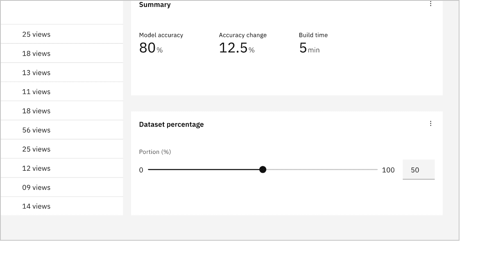

import A11yStatus from 'components/A11yStatus';

<PageDescription>

Sliders provide a visual indication of adjustable content, where the user can
increase or decrease the value by moving the handle along a horizontal track.

</PageDescription>

<AnchorLinks>

<AnchorLink>Live demo</AnchorLink>
<AnchorLink>Overview</AnchorLink>
<AnchorLink>Formatting</AnchorLink>
<AnchorLink>Content</AnchorLink>
<AnchorLink>Behaviors</AnchorLink>
<AnchorLink>Default slider</AnchorLink>
<AnchorLink>Range slider</AnchorLink>
<AnchorLink>Modifiers</AnchorLink>
<AnchorLink>Feedback</AnchorLink>

</AnchorLinks>

## Live demo

<StorybookDemo
  themeSelector
  url="https://react.carbondesignsystem.com"
  variants={[
    {
      label: 'Default',
      variant: 'components-slider--default',
    },
    {
      label: 'Controlled slider',
      variant: 'components-slider--controlled-slider',
    },
    {
      label: 'Range slider',
      variant: 'components-slider--two-handle-slider',
    },
  ]}
/>

<A11yStatus layout="cards" components="Slider" />

## Overview

A slider allows a user to select a single value or range of values available
within the slider track. The slider comes in two different variants: default and
range. The default slider is accompanied by a label and a number input that
doubles as a display for the slider’s current selected value. The range slider
has a label and two number inputs to display the slider’s selected range of
values.

### When to use

- Use when selecting a single value or range of number values.
- Use sliders when there is a need to show a selection of a single value or
  range of values.
- Use when needing to expose a variety of options or to limit the number of
  options quickly.

### When not to use

- Do not use for extremely large ranges, for example, 1-1000.
- Do not use ranges that are too small, for example, 1-3.
- Do not use complex inputted values that are not numbers.

### Variants

| Variant                                                            | Purpose                                                                                                         |
| ------------------------------------------------------------------ | --------------------------------------------------------------------------------------------------------------- |
| [Default slider](/components/default-slider/usage/#default-slider) | Default sliders allow users to select a single value within the slider track.                                   |
| [Range slider](/components/range-slider/usage/#range-slider)       | Range sliders allow users to define minimum and maximum values from a predefined range within the slider track. |

## Formatting

### Default slider anatomy

<Row>
<Column colLg={8}>

</Column>
</Row>

1. **Label:** Text describing what kind of value will be selected from the
   slider.
2. **Min value:** The minimum value that can be selected in the slider range.
3. **Max value:** The maximum value that can be selected in the slider range.
4. **Number input:** An input to specify a selected value within the slider
   range.
5. **Handle:** An indicator that can be moved on the track within the slider
   range to specify a selected value.
6. **Track:** Shows a user's available minimum and maximum values on the range
   to select from.

### Range slider anatomy

<Row>
<Column colLg={8}>

</Column>
</Row>

1. **Label:** Text describing what kind of value will be selected from the
   slider.
2. **Min value number input:** An input to specify a selected minimum value
   within the slider range.
3. **Max value number input:** An input to specify a selected maximum value
   within the slider range.
4. **Min value:** The minimum value that can be selected in the slider range.
5. **Max value:** The maximum value that can be selected in the slider range.
6. **Handles:** Two indicators that can be moved on the track within the slider
   range to specify selected minimum and maximum values.
7. **Track:** Shows a user's available minimum and maximum values on the range
   to select from.

## Content

### Main elements

#### Labels

- Labels inform users what kind of value(s) they are selecting in the slider.
- Keep the label short and concise by limiting it to a single line of text.
- Labels should be placed above the slider so the label does not become obscured
  when interacting with the handle.

#### Min and max values

- Min and max value text indicate a slider's minimum and maximum value range.
- Keep min and max value text should accurately reflect the user's selection
  using the handles or the number input.

<Row>
<Column colLg={8}>

<Caption>
  Do label the slider appropriately with the value being modified
</Caption>

</Column>
</Row>

<Row>
<Column colLg={8}>

<Caption>
  Do not use in ranges that result in non-discrete large increments
</Caption>

</Column>
</Row>

## Behaviors

### States

The default and range sliders have the following states: **enabled**, **hover**,
**focus**, **active**, **error**, **warning**, **disabled**, **read-only**, and
**skeleton**. For more information on states, visit the
[interactive state](https://carbondesignsystem.com/components/slider/style#interactive-states)
guidance on the style tab.

| State       | When to use                                                                                                                                                                                                                                                                                   |
| ----------- | --------------------------------------------------------------------------------------------------------------------------------------------------------------------------------------------------------------------------------------------------------------------------------------------- |
| _Enabled_   | When the slider is live, and a user is not directly interacting with it. The enabled state is commonly referred to as the default or normal state of the component.                                                                                                                           |
| _Hover_     | When a user’s mouse cursor is hovering over the fields or handles of the slider component. Use a tooltip on hover if the slider does not have number inputs to show the selected values                                                                                                       |
| _Focus_     | When a user tabs to or clicks on a field or handle, it becomes focused, indicating the user has successfully navigated to the component. Use a tooltip on focus if the slider does not have number inputs to show the selected values.                                                        |
| _Active_    | When a user is pressing down on the handles of the slider component and interacting with it. Use a tooltip on active if the slider does not have number inputs to show the selected values.                                                                                                   |
| _Error_     | When a slider component marked as “required” has not had an option selected, if the selected values are out of range, or if the values are not numbers . It can also be triggered due to a system error. This state requires a user response before data can be submitted or saved.           |
| _Warning_   | When you need to call the user’s attention to an exception condition. The condition might not be an error but can cause problems if not resolved.                                                                                                                                             |
| _Disabled_  | When the user cannot interact with a component and all interactive functions have been removed. Unlike read-only states, disabled states are not focusable, are not read by screen readers, and do not need to pass visual contrast, making them inaccessible if they need to be interpreted. |
| _Read-only_ | When the user can review but not modify the component. This state removes all interactive functions like the disabled state but can still be focusable, accessible by screen readers, and passes visual contrast for readability.                                                             |

## Interactions

### Mouse

Users can trigger a value change by clicking anywhere on the horizontal track.
Users can also drag the slider handle. Either method repositions the slider and
automatically updates the value in the number input for the single slider. The
closest value (minimum or maximum value) will be updated depending on where the
user clicks on the range slider. Either method repositions the slider and
automatically updates the value in the number input.

### Keyboard (default slider)

Users can enter an exact numeric value into the number input field or use the
`up`, `down`, `left`, or `right` arrow keys to change the value. Either method
adjusts the slider handle to the corresponding position.

Users can also increment the value by using the arrow keys when the slider
receives focus. The arrow keys, in combination with the `shift` key can alter
the slider by the value of the `stepMultiplier`.

### Keyboard (range slider)

Once focus is established on the range slider, the user can define a numerical
range by:

- Entering the exact value into the text field.
- Moving the slider handle with their mouse, which automatically updates the
  value in the number input.
- Using the `up`, `down`, `left`, or `right` arrow keys automatically updates
  the value in the number input and moves the slider handle to the corresponding
  value.
- The step size increment is how many increments the inputted value and slider
  handle will jump when using the arrow keys. Make sure to set the step size
  increments to reasonable values.
- `Up`, `down`, `left`, or `right` arrow keys change the value by one step size
  increment. Example: Pressing the `right` arrow key changes the inputted value
  from 59 to 60, increasing the value by 1 unit.
- `Shift +` `up`, `down`, `left`, or `right` arrow keys changes the value by 10
  step size increments. Example: Typing `shift +` and `right` arrow key changes
  the value from 60 to 70, increasing the inputted value by 10 units.
- `Home`: When focus is on an selectors, moves focus to the first range selector
  header.
- `End`: When focus is on an selectors, moves focus to the last range selector
  header.

## Default slider

The default slider, in its most basic form, is accompanied by a label, a number
input, and a slider track with a handle. Users can use the handle or the number
input to select a value from within the slider track. When needing to select a
range within the slider track, use the range slider instead.

<Row>
<Column colLg={8}>

<Caption>Example of a default slider in context</Caption>

</Column>
</Row>

## Range slider

The range slider allows users to select a range of values from the slider track.
The range slider consists of a label and two number inputs to type in values,
which will determine the minimum and maximum range within the slider track. A
user can manually input minimum and maximum values by clicking on the number
input or moving the slider's handles.

<Row>
<Column colLg={8}>

<Caption>Example of a range slider in context</Caption>

</Column>
</Row>

It is best practice to describe the range value in numbers and to not use a
slider as a date selector. To select dates, use the
[date picker](https://carbondesignsystem.com/components/date-picker/usage/)
component.

<Row>
<Column colLg={8}>

<Caption>Do describe the range in numbers</Caption>

</Column>
</Row>

<Row>
<Column colLg={8}>

<Caption>Do not use as a date selector</Caption>

</Column>
</Row>

## Modifiers

#### Sliders without a number input

If the slider does not include number inputs to display the selected values, use
a tooltip on hover, focus, and active to show the selected values.

<Row>
<Column colLg={8}>

<Caption>
  Using a tooltip to show the selected values when there are no number inputs
</Caption>

</Column>
</Row>

## Feedback

Help us improve this component by providing feedback, asking questions, and
leaving any other comments on
[GitHub](https://github.com/carbon-design-system/carbon-website/issues/new?assignees=&labels=feedback&template=feedback.md).
