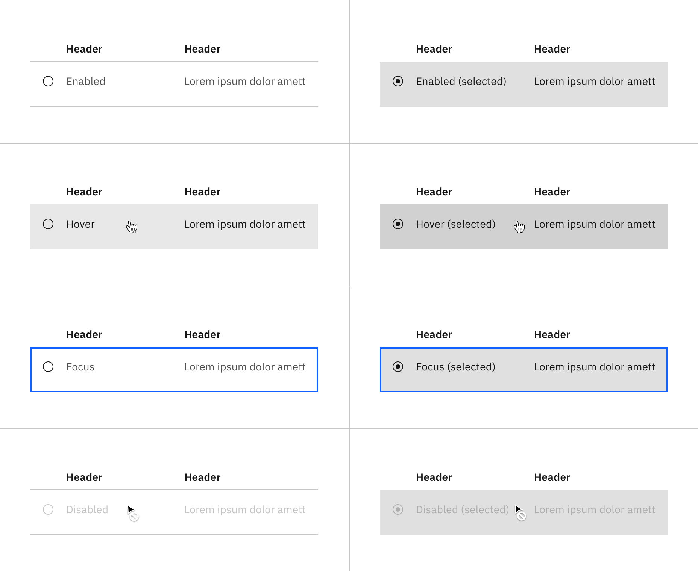
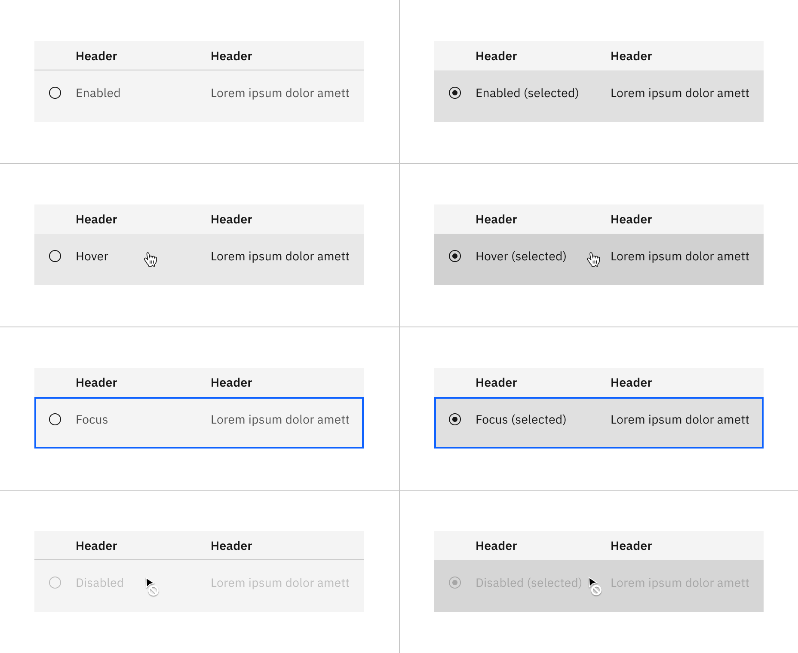
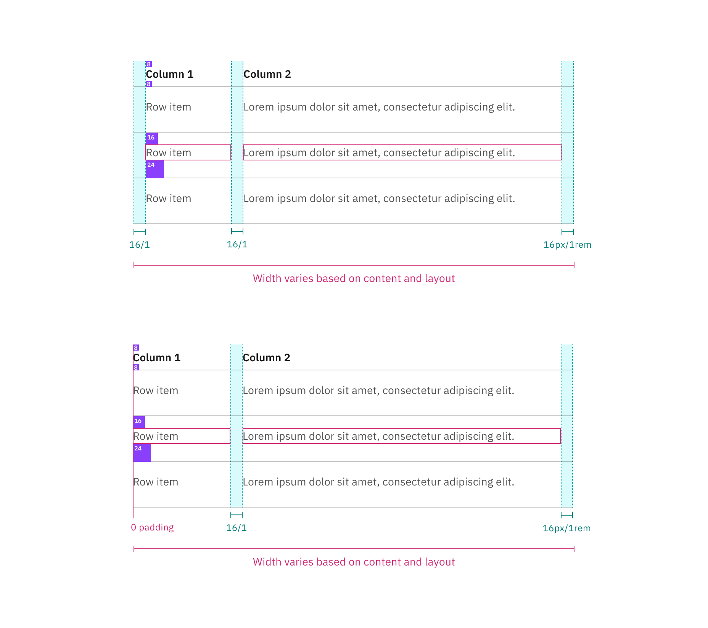
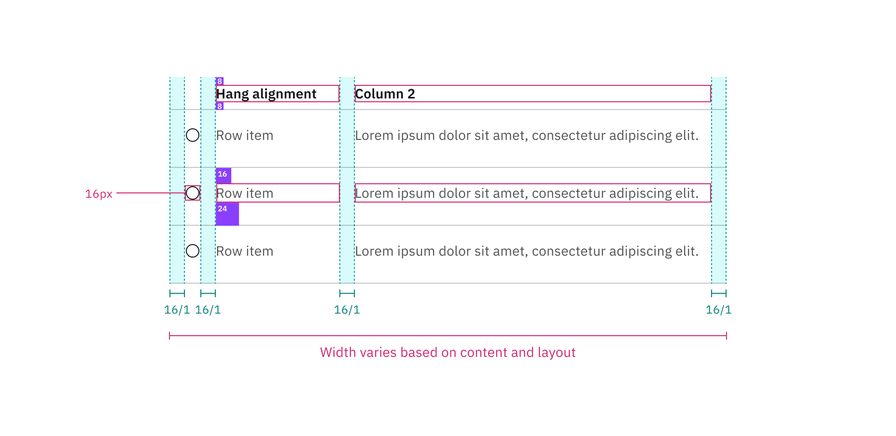
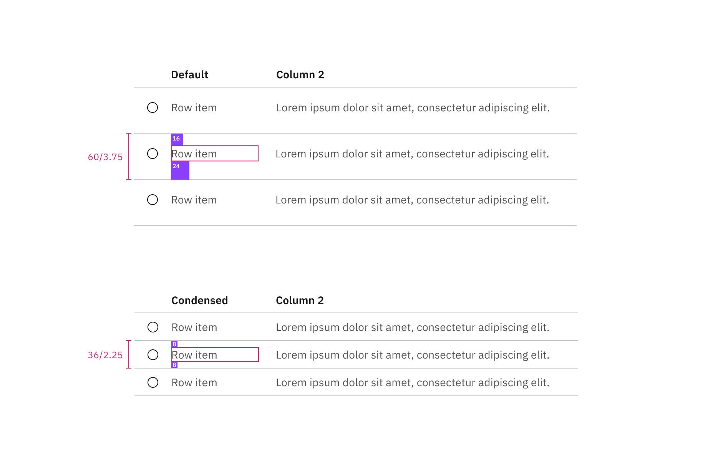

## Color

By default, structured lists have a transparent background layer. Optionally,
you can apply a colored background layer to a structured list. Structured lists
with a colored background layer are only available in the hang alignment.

| Element              | Property         | Color token         |
| -------------------- | ---------------- | ------------------- |
| Header text          | text-color       | `$text-primary`     |
| Header row divider   | border-bottom    | `$border-subtle` \* |
| Header (transparent) | background-color | transparent         |
| Header (background)  | background-color | `$layer` \*         |
| Row text             | text-color       | `$text-secondary`   |
| Row divider          | border-bottom    | `$border-subtle` \* |
| Row (transparent)    | background-color | transparent         |
| Row (background)     | background-color | `$layer` \*         |
| Icon                 | icon-color       | `$icon-primary`     |

<Caption>
  * Denotes a contextual color token that will change values based on the layer
  it is placed on.
</Caption>

<Row>
<Column colLg={12}>
<Tabs>

<Tab label="Transparent">

</Tab>

<Tab label="Background">

</Tab>

</Tabs>

</Column>
</Row>

### Interactive states

The structured list interactive states are shown below with its default
transparent background layer and its optional color background layer.

| State               | Element           | Proptery         | Color token                |
| ------------------- | ----------------- | ---------------- | -------------------------- |
| Enabled (selected)  | Row               | background-color | `$layer-selected` \*       |
|                     | Row text          | text-color       | `$text-primary`            |
| Hover               | Row               | background-color | `$layer-hover` \*          |
|                     | Row text          | text-color       | `$text-primary`            |
| Hover (selected)    | Row               | background-color | `$layer-selected-hover` \* |
|                     | Row text          | text-color       | `$text-primary`            |
| Focus               | Row (transparent) | background-color | transparent                |
|                     | Row (background)  | background-color | `$layer` \*                |
|                     | Border            | border           | `$focus`                   |
| Focus (selected)    | Row               | background-color | `$layer-selected` \*       |
|                     | Row text          | text-color       | `$text-primary`            |
|                     | Border            | border           | `$focus`                   |
| Disabled            | Row (transparent) | background-color | transparent                |
|                     | Row (background)  | background-color | `$layer` \*                |
|                     | Row text          | text-color       | `$text-disabled`           |
|                     | Icon              | inner fill       | `$icon-disabled`           |
| Disabled (selected) | Row               | background-color | `$layer-selected` \*       |
|                     | Row text          | text-color       | `$text-disabled`           |
|                     | Icon              | inner fill       | `$icon-disabled`           |

<Caption>
  * Denotes a contextual color token that will change values based on the layer
  it is placed on.
</Caption>

<Row>
<Column colLg={12}>
<Tabs>

<Tab label="Transparent">

</Tab>

<Tab label="Background">

</Tab>

</Tabs>

</Column>
</Row>

## Typography

Structured list headings should be set in title case, while all other text is
set in sentence case. All typography is left aligned.

| Element   | px / rem   | Font-weight    | Type token            |
| --------- | ---------- | -------------- | --------------------- |
| Heading   | 14 / 0.875 | SemiBold / 600 | `$heading-compact-01` |
| List text | 14 / 0.875 | Regular / 400  | `$body-01`            |

## Structure

| Element         | Property                    | px / rem    | Spacing token |
| --------------- | --------------------------- | ----------- | ------------- |
| Structured list | min-width                   | 500 / 31.25 | –             |
| Header          | padding-top                 | 16 / 1      | `$spacing-05` |
|                 | padding-bottom              | 8 / 0.5     | `$spacing-03` |
|                 | padding-right               | 16 / 1      | `$spacing-05` |
|                 | padding-left (hang)         | 16 / 1      | `$spacing-05` |
|                 | padding-left (flush)        | 0           | –             |
| Row text        | padding-top                 | 16 / 1      | `$spacing-05` |
|                 | padding-bottom              | 24 / 1.5    | `$spacing-06` |
|                 | padding-right               | 16 / 1      | `$spacing-05` |
|                 | padding-left (hang)         | 16 / 1      | `$spacing-05` |
|                 | padding-left (flush)        | 0           | –             |
| Icon            | height, width               | 16px        | –             |
|                 | padding-left, padding-right | 16 / 1      | `$spacing-05` |

### Default structure

<Caption>
  Spacing and measurements for default structured list with hang and flush
  alignment | px / rem.
</Caption>

### Selectable structure

<Caption>
  Spacing and measurements for selectable structured list with hang alignment |
  px / rem.
</Caption>

## Size

There are two structured list sizes: default and condensed.

| Element  | Size      | px / rem  |
| -------- | --------- | --------- |
| Row item | Default   | 60 / 3.75 |
|          | Condensed | 36 / 2.25 |

<Caption>Default and condensed sizes for structured lists</Caption>{' '}
