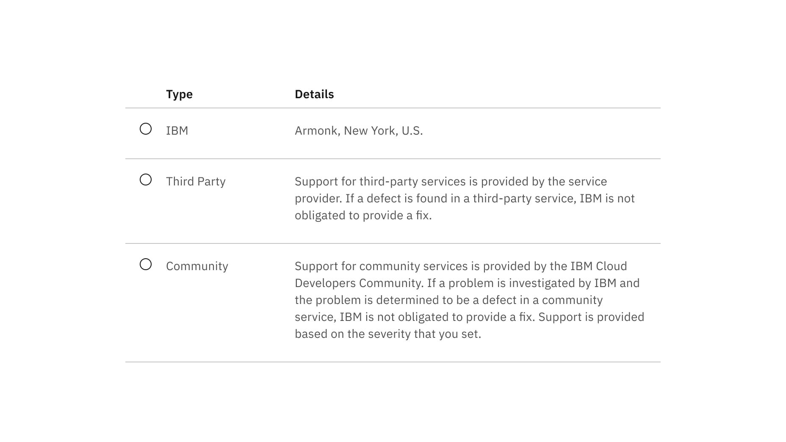
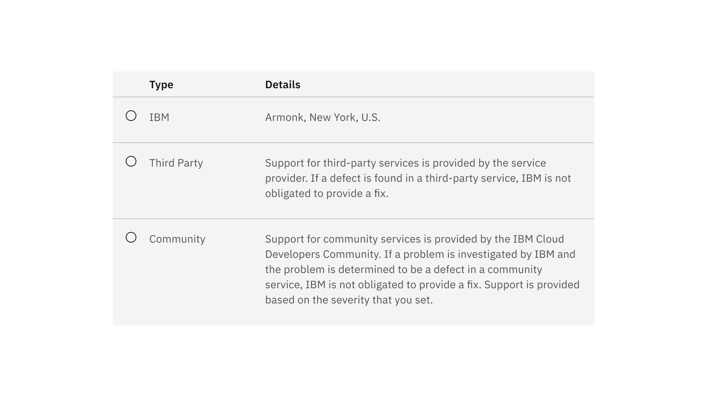

## Color

| Class                                  | Property      | Color token       |
| -------------------------------------- | ------------- | ----------------- |
| `.bx--structured-list-th`              | text color    | `$text-primary`   |
| `.bx--structured-list-td`              | text color    | `$text-secondary` |
| `.bx--structured-list-row--header-row` | border-bottom | `$border-subtle`  |
| `.bx--structured-list-row`             | border-bottom | `$border-subtle`  |

### Interactive states

| Class                                | Property         | Color token            |
| ------------------------------------ | ---------------- | ---------------------- |
| `.bx--structured-list-row--selected` | background-color | `$background-selected` |
| `.bx--structured-list-svg:checked`   | fill             | `$icon-primary`        |
| `.bx--structured-list-row:hover`     | background-color | `$background-hover`    |
| `.bx--structured-list-row:focus`     | border           | `$focus`               |

## Typography

Structured list headers should be set in title case, while all other text is set
in sentence case. All typography is left aligned.

| Property                  | Font-size (px/rem) | Font-weight     | Type token      |
| ------------------------- | ------------------ | --------------- | --------------- |
| `.bx--structured-list-th` | 14 / 0.875         | Semi-Bold / 600 | `$heading-01`   |
| `.bx--structured-list`    | 14 / 0.875         | Regular / 400   | `$body-long-01` |

## Structure

| Property                   | Property                    | px / rem    | Spacing token |
| -------------------------- | --------------------------- | ----------- | ------------- |
| `.bx--structured-list`     | min-width                   | 500 / 31.25 | –             |
| `.bx--structured-list`     | min-width                   | 500 / 36    | –             |
| `.bx--structured-list-th`  | padding-top                 | 16 / 1      | `$spacing-05` |
| `.bx--structured-list-th`  | padding-bottom              | 8 / 0.5     | `$spacing-03` |
| `.bx--structured-list-th`  | padding-left, padding-right | 16 / 1      | `$spacing-05` |
| `.bx--structured-list-td`  | padding-top                 | 16 / 1      | `$spacing-05` |
| `.bx--structured-list-td`  | padding-bottom              | 24 / 1.5    | `$spacing-06` |
| `.bx--structured-list-td`  | padding-left, padding-right | 16 / 1      | `$spacing-05` |
| `.bx--structured-list-svg` | height, width               | 16 / 1      | –             |

<Caption>Spacing and measurements for structured list | px / rem</Caption>

<Caption>
  Spacing and measurements for structured list with selection | px / rem
</Caption>
