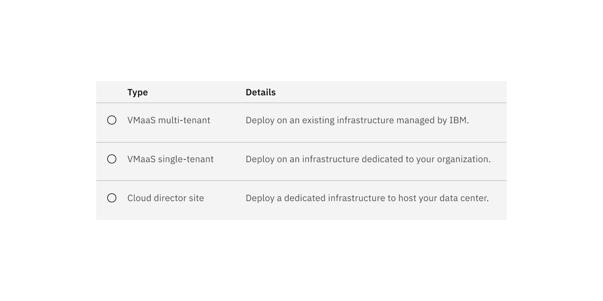
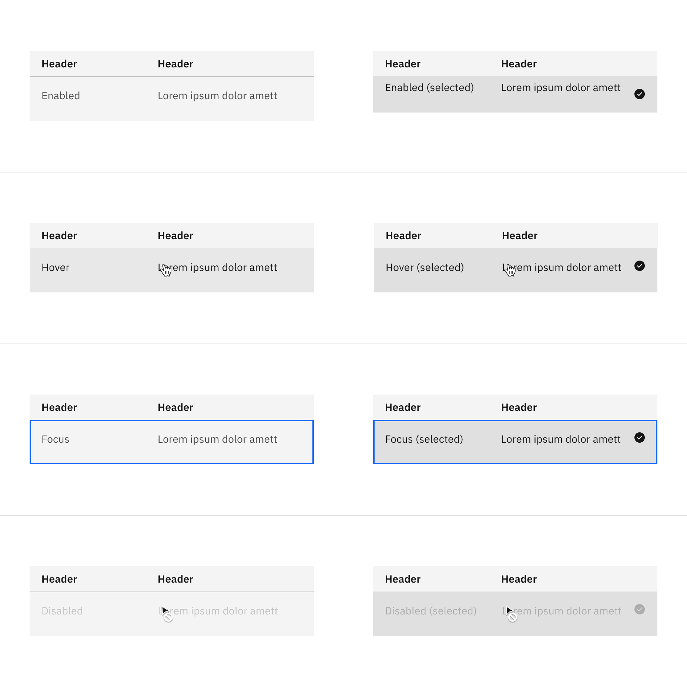

<PageDescription>

The following page documents visual specifications such as color, typography,
structure, and size.

</PageDescription>

<AnchorLinks>

<AnchorLink>Color</AnchorLink>
<AnchorLink>Typography</AnchorLink>
<AnchorLink>Structure</AnchorLink>
<AnchorLink>Size</AnchorLink>
<AnchorLink>Feedback</AnchorLink>

</AnchorLinks>

## Color

Structured lists have a transparent background layer. Optionally, you can apply
a background color to a structured list. Structured lists with a background
color are only available in the hang alignment.

### Default color

| Element      | Property         | Color token         |
| ------------ | ---------------- | ------------------- |
| Header       | background-color | transparent         |
| Header: text | text color       | `$text-primary`     |
| Row          | background-color | transparent         |
| Row: text    | text color       | `$text-secondary`   |
| Divider      | border-bottom    | `$border-subtle` \* |

<Caption fullWidth>
  \* Denotes a contextual color token that will change values based on the layer
  it is placed on.
</Caption>

<Row>
<Column colLg={12}>

<Caption>Default structured list color</Caption>

</Column>
</Row>

### Selectable color

Selectable structured list has an available
[feature flag](/components/overview/feature-flags/).

| Element      | Property         | Color token         |
| ------------ | ---------------- | ------------------- |
| Header       | background-color | transparent         |
| Header: text | text color       | `$text-primary`     |
| Row          | background-color | transparent         |
| Row: text    | text color       | `$text-secondary`   |
| Divider      | border-bottom    | `$border-subtle` \* |
| Icon         | svg              | `$icon-primary`     |

<Caption fullWidth>
  \* Denotes a contextual color token that will change values based on the layer
  it is placed on.
</Caption>

<Row>
<Column colLg={12}>
<Tabs>

<Tab label="Flag enabled">

</Tab>

<Tab label="Flag disabled">

</Tab>

</Tabs>

</Column>
</Row>

<Title>Selectable interactive state color</Title>{' '}

| State               | Element   | Property         | Color token                |
| ------------------- | --------- | ---------------- | -------------------------- |
| Enabled (selected)  | Row       | background-color | `$layer-selected` \*       |
|                     | Row: text | text color       | `$text-primary`            |
| Hover               | Row       | background-color | `$layer-hover` \*          |
|                     | Row: text | text color       | `$text-primary`            |
| Hover (selected)    | Row       | background-color | `$layer-selected-hover` \* |
|                     | Row: text | text color       | `$text-primary`            |
| Focus               | Row       | border           | `$focus`                   |
| Focus (selected)    | Row       | background-color | `$layer-selected` \*       |
|                     | Row: text | text color       | `$text-primary`            |
|                     | Border    | border           | `$focus`                   |
| Disabled            |
|                     | Row: text | text color       | `$text-disabled`           |
|                     | Icon      | svg              | `$icon-disabled`           |
| Disabled (selected) | Row       | background-color | `$layer-selected` \*       |
|                     | Row: text | text color       | `$text-disabled`           |
|                     | Icon      | svg              | `$icon-disabled`           |

<Caption fullWidth>
  \* Denotes a contextual color token that will change values based on the layer
  it is placed on.
</Caption>

<Row>
<Column colLg={12}>
<Tabs>

<Tab label="Flag enabled">

</Tab>

<Tab label="Flag disabled">

</Tab>

</Tabs>

</Column>
</Row>

### With background color

| Element | Property         | Color token |
| ------- | ---------------- | ----------- |
| Header  | background-color | `$layer` \* |
| Row     | background-color | `$layer` \* |

<Caption fullWidth>
  \* Denotes a contextual color token that will change values based on the layer
  it is placed on.
</Caption>

<Row>
<Column colLg={12}>
<Tabs>

<Tab label="Flag enabled">

</Tab>

<Tab label="Flag disabled">

</Tab>

</Tabs>

</Column>
</Row>

<Title>With background interactive state color</Title>

<Row>
<Column colLg={12}>
<Tabs>

<Tab label="Flag enabled">

</Tab>

<Tab label="Flag disabled">

</Tab>

</Tabs>

</Column>
</Row>

## Typography

Structured list header and row text should use sentence-case capitalization. All
typography is left aligned.

| Element     | Font-size (px/rem) | Font-weight    | Type token            |
| ----------- | ------------------ | -------------- | --------------------- |
| Header text | 14 / 0.875         | SemiBold / 600 | `$heading-compact-01` |
| Row text    | 14 / 0.875         | Regular / 400  | `$body-01`            |

## Structure

### Default structure

| Element      | Property             | px / rem    | Spacing token |
| ------------ | -------------------- | ----------- | ------------- |
| Container    | min-width            | 500 / 31.25 | –             |
| Header: text | padding-top          | 16 / 1      | `$spacing-05` |
|              | padding-bottom       | 8 / 0.5     | `$spacing-03` |
|              | padding-right        | 16 / 1      | `$spacing-05` |
|              | padding-left (hang)  | 16 / 1      | `$spacing-05` |
|              | padding-left (flush) | 0px         | –             |
| Row: text    | padding-top          | 16 / 1      | `$spacing-05` |
|              | padding-bottom       | 24 / 1.5    | `$spacing-06` |
|              | padding-right        | 16 / 1      | `$spacing-05` |
|              | padding-left (hang)  | 16 / 1      | `$spacing-05` |
|              | padding-left (flush) | 0px         | –             |

<Caption>
  Spacing and measurements for default structured list with hang and flush
  alignment | px / rem.
</Caption>

### Selectable structure

| Element      | Property                    | px / rem    | Spacing token |
| ------------ | --------------------------- | ----------- | ------------- |
| Container    | min-width                   | 500 / 31.25 | –             |
| Header: text | padding-top                 | 16 / 1      | `$spacing-05` |
|              | padding-bottom              | 8 / 0.5     | `$spacing-03` |
|              | padding-right               | 16 / 1      | `$spacing-05` |
|              | padding-left, padding-right | 16 / 1      | `$spacing-05` |
| Row: text    | padding-top                 | 16 / 1      | `$spacing-05` |
|              | padding-bottom              | 24 / 1.5    | `$spacing-06` |
|              | padding-left, padding-right | 16 / 1      | `$spacing-05` |
| Icon         | height, width               | 16px        | –             |
|              | padding-left, padding-right | 16 / 1      | `$spacing-05` |

<Caption fullwidth>
  Structure and spacing measurements for selectable structured list with a
  feature flag | px / rem.
</Caption>

## Size

There are two structured list height sizes: **default** and **condensed**.

| Element | Size      | Height (px/rem) |
| ------- | --------- | --------------- |
| Row     | Default   | 60 / 3.75       |
|         | Condensed | 36 / 2.25       |

<Caption> Structured list sizes | px / rem </Caption>

## Feedback

Help us improve this component by providing feedback, asking questions, and
leaving any other comments on
[GitHub](https://github.com/carbon-design-system/carbon-website/issues/new?assignees=&labels=feedback&template=feedback.md).
