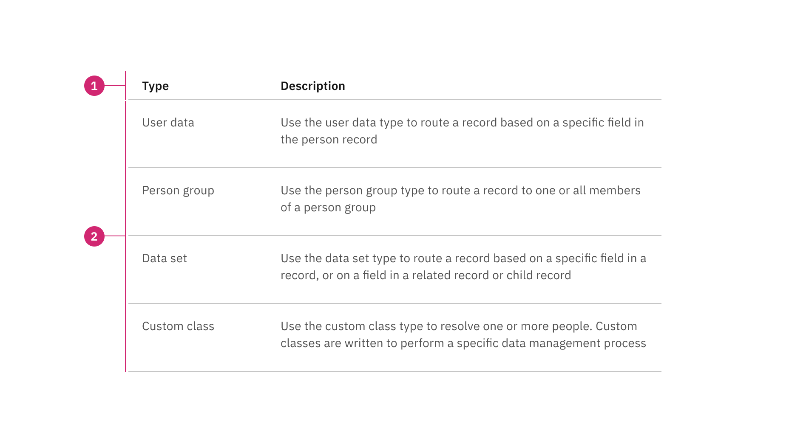
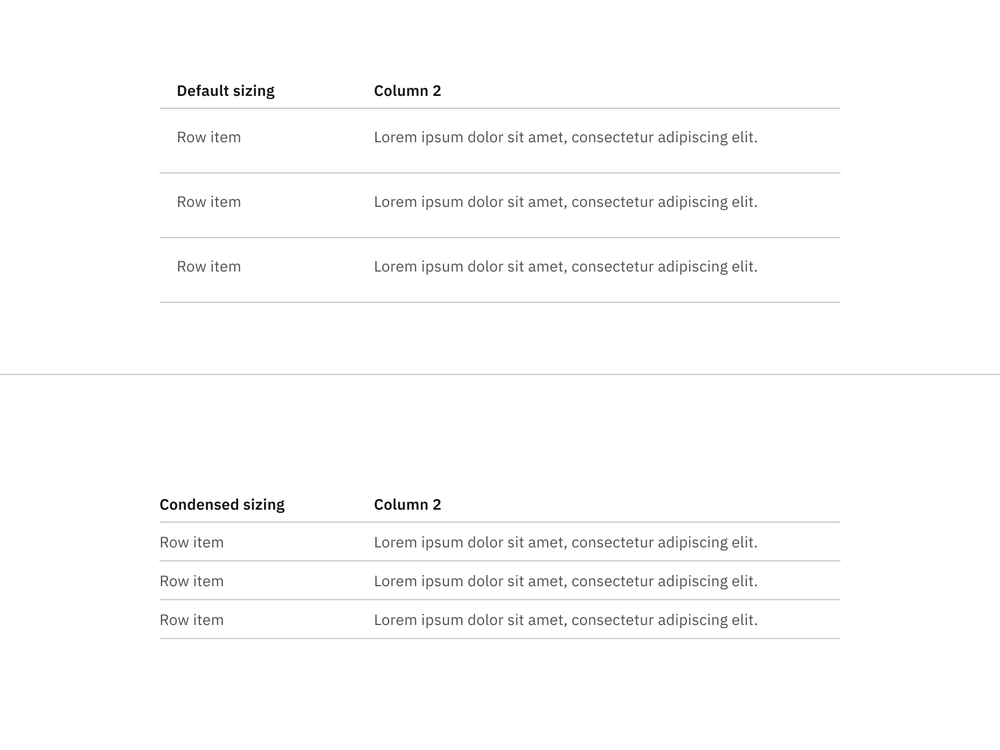
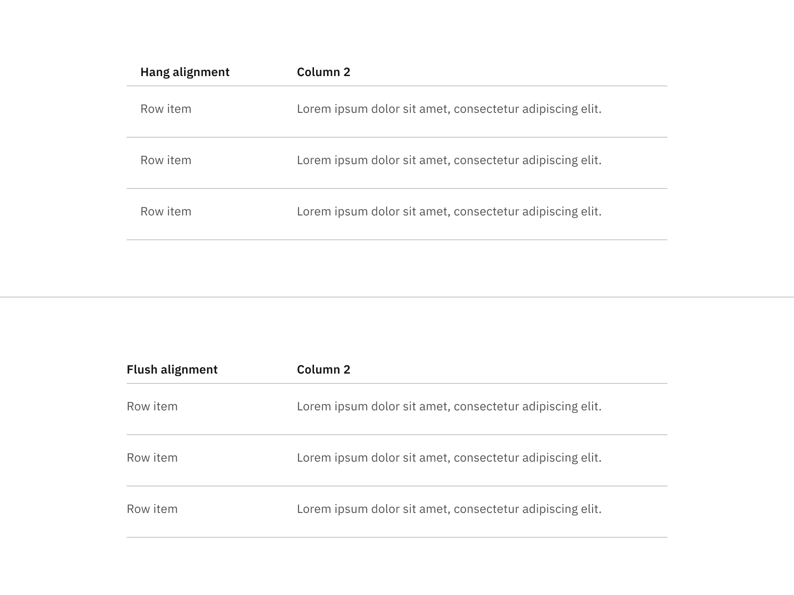
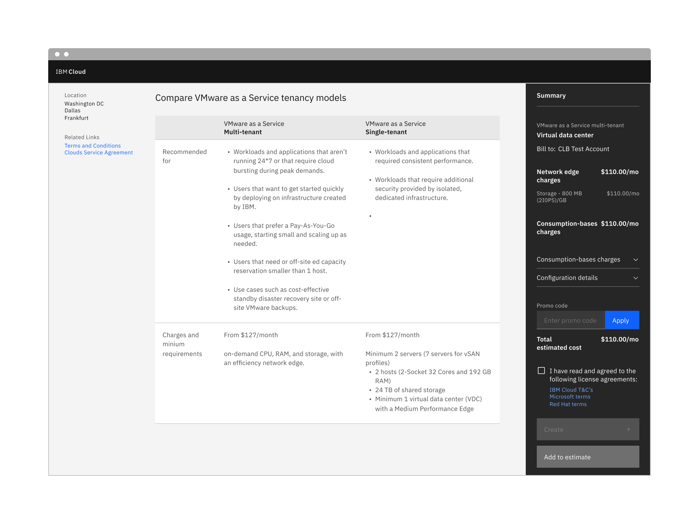
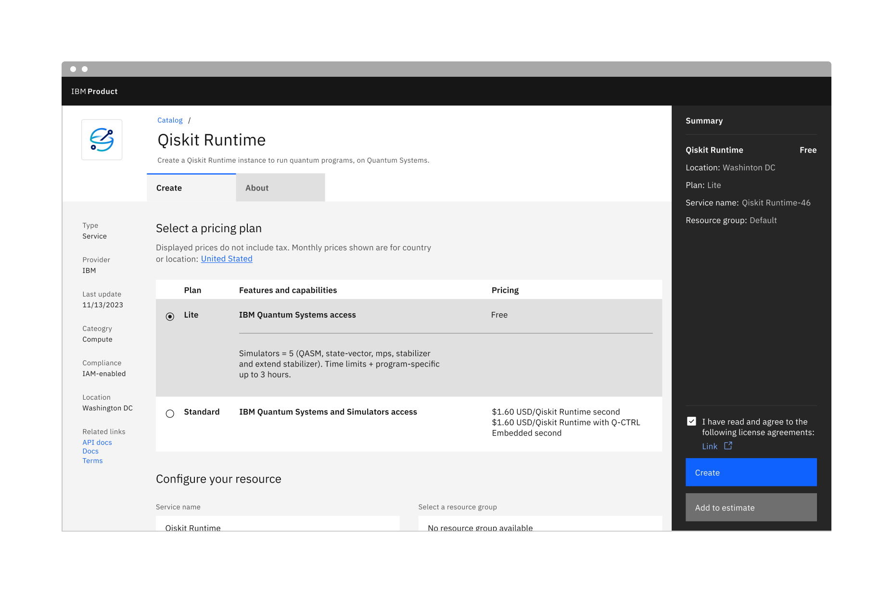
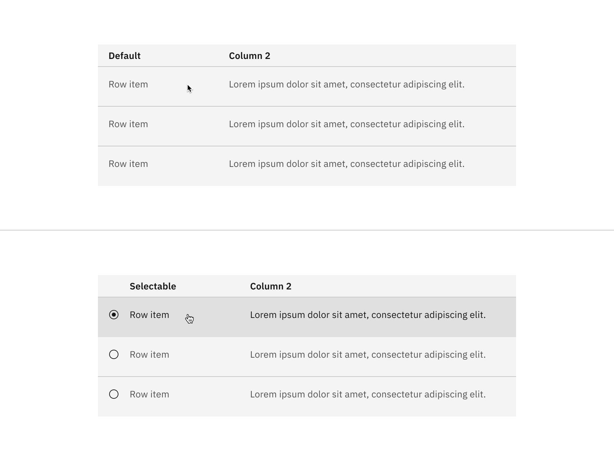

import A11yStatus from 'components/A11yStatus';

<PageDescription>

Structured lists group content that is similar or related, such as terms and
definitions.

</PageDescription>

<InlineNotification>

[Experimental structured lists](https://react.carbondesignsystem.com/?path=/story/experimental-feature-flags-structuredlist--selection) are
now available. This addition enhances accessibility and only applies to the
visual appearance, not the function of structured lists. Though we are not
deprecating the current structured lists, we encourage all design teams to use
the new experimental structured lists in their products moving forward.

</InlineNotification>

<AnchorLinks>

<AnchorLink>Live demo</AnchorLink>
<AnchorLink>Overview</AnchorLink>
<AnchorLink>Formatting</AnchorLink>
<AnchorLink>Content</AnchorLink>
<AnchorLink>Default</AnchorLink>
<AnchorLink>Selectable</AnchorLink>
<AnchorLink>Modifiers</AnchorLink>
<AnchorLink>Related</AnchorLink>
<AnchorLink>Feedback</AnchorLink>

</AnchorLinks>

## Live demo

<StorybookDemo
  themeSelector
  tall
  url="https://react.carbondesignsystem.com"
  variants={[
    {
      label: 'Default',
      variant: 'components-structuredlist--default',
    },
    {
      label: 'Simple',
      variant: 'components-structuredlist--simple',
    },
    {
      label: 'Selection',
      variant: 'components-structuredlist--selection',
    },
  ]}
/>

<A11yStatus layout="cards" components="Structured list" />

## Overview

Structured list displays a simple list with a considerable amount of items of
read-only values. It helps organize and present grouped information into logical
and scannable patterns. The content within a list can be stacked to create
hierarchy within the data.

### When to use

- To browse information or select certain information within the group in the
  simplest form
- To view description and detailed information, present features, or compare
  pricing plans

### When not to use

Nesting items is not recommended, as structured lists are used to present simple
data. If you have more than 25 items or additional content that needs to be
shown, consider using a
[data table](https://www.carbondesignsystem.com/components/data-table/usage/),
which supports nesting items and presents a larger set of content.

### Variants

<InlineNotification>

The
[experimental structured lists](https://react.carbondesignsystem.com/?path=/story/experimental-feature-flags-structuredlist--selection)
with icons positioned on the left apply only to selectable structured lists, not
to default structured lists.

</InlineNotification>

| Variant                   | Purpose                                                                       |
| ------------------------- | ----------------------------------------------------------------------------- |
| [Default](#default)       | Allows the user to quickly browse and view information within a group of data |
| [Selectable](#selectable) | Allows the user to mark or select a desired option within a group of data     |

## Formatting

### Anatomy

Structured list is composed of two sections—column header and data row.

<Row>
<Column colLg={12}>

</Column>
</Row>

1. **Column header**: Shows titles for the row header description.
2. **Data row**: Shows different types of data. Rows can be selectable and
   modified to show alternating zebra stripe background colors

### Sizing

The structured list is available in two different sizes in height: default and
condensed. The structure list's width varies based on content and layout.

<Row>
<Column colLg={12}>

<Caption> Default and condensed sizes for structured lists </Caption>

</Column>
</Row>

### Alignment

The structured list is available in two alignment styles: hang and flush
alignment. We do not offer the flush alignment with selectable functionality.

<Row>
<Column colLg={12}>

<Caption> Hang and flush alignment for structured lists </Caption>

</Column>
</Row>

## Content

- A maximum of three paragraphs of text is recommended per row.
- A structured list’s title and row information should use sentence-case
  capitalization.

#### Column header titles

- Column header titles should be short and clear, sticking to one or two words
  that describe the data in that column.
- In cases where a column header title is too long, wrap the text to two lines
  and then truncate the rest of the text. The full text should be shown in a
  tooltip on hover.
- Column header titles should use sentence-case capitalization.

### States

The default structured list variant is read-only and does not have any
interactive states other than enabled. The selectable structured list variant
has the following states: **enabled**, **hover**, **focus**, **selected**,
**disabled**, and **skeleton**. For detailed visual information about the
various states for this component, refer to the
[style](/components/structured-list/style) tab.

| State      | When to use                                                                                                                                                      |
| ---------- | ---------------------------------------------------------------------------------------------------------------------------------------------------------------- |
| _Enabled_  | When an action in the list is live but a user is not directly interacting with it. This is commonly referred to as the default or normal state of the component. |
| _Hover_    | When a user’s mouse cursor is hovering over the structured list row.                                                                                             |
| _Focus_    | When a user tabs or clicks on a row, it becomes focused, indicating the user has successfully navigated to the component (except default structured list).       |
| _Selected_ | When a user presses space or clicks on a structured list row to select it.                                                                                       |
| _Disabled_ | When the user is not allowed to interact with a selectable structured list due to either permissions, dependencies, or pre-requisites.                           |
| _Skeleton_ | Use on an initial page load to indicate that the structured list has not yet fully loaded.                                                                       |

## Interactions

#### Selectable structured list

- Only one item can be selected from the list.
- By default, no option should be selected.
- If you need to select multiple items, use a
  [data table.](/components/data-table/usage)
- When the user selects an item from the list, the selected row will appear with
  the `radio-button--checked` icon.

## Default

Default structured lists are used to display information to the user, such as
pricing plans. These structured lists can have internal calls-to-action (CTAs),
such as a [button](/components/button/usage) or
a [link](/components/link/usage).

<Row>
<Column colLg={12}>

<Caption> Default structured list </Caption>

</Column>
</Row>

## Selectable

Selectable structured lists work well for presenting options to a user in a
structured manner, such as a set of pricing plans. Selectable tiles may contain
internal CTAs (like links to docs) if the internal CTA is given its own click
target. Selectable structured lists have a single-select state working like
a [radio button](/components/radio-button/usage).

<Row>
<Column colLg={12}>

<Caption> Selectable structured list </Caption>

</Column>
</Row>

## Modifiers

### Background

A background has been added to the structured list, and it is optional. The
background is only available for the hang alignment structured list, in default
and selectable variants. It is not available for the flush alignment structured
list.

<Row>
<Column colLg={12}>

<Caption> Default and selectable structured list with background </Caption>

</Column>
</Row>

## Related

These following components are additional ways to organize a group of data.

- [Accordion](https://www.carbondesignsystem.com/components/accordion/usage/)
- [Data table](https://www.carbondesignsystem.com/components/data-table/usage/)
- [List](https://www.carbondesignsystem.com/components/list/usage/)

## Feedback

Help us improve this component by providing feedback, asking questions, and
leaving any other comments on
[GitHub](https://github.com/carbon-design-system/carbon-website/issues/new?assignees=&labels=feedback&template=feedback.md).
