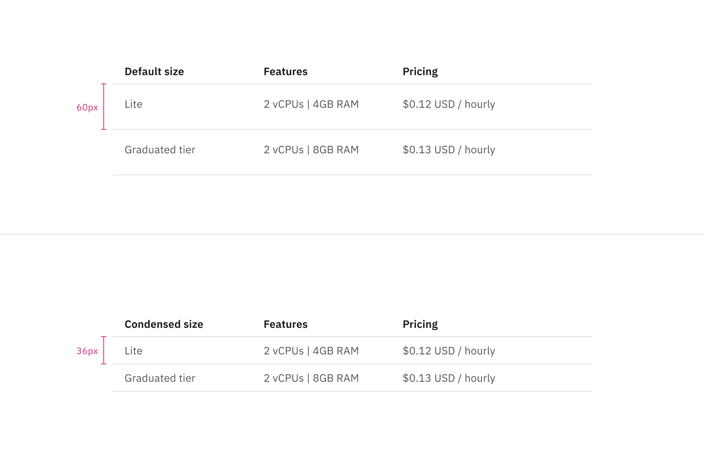
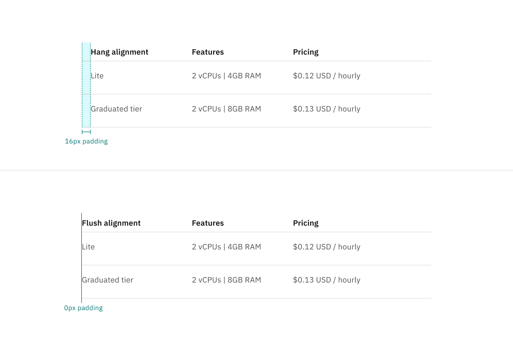
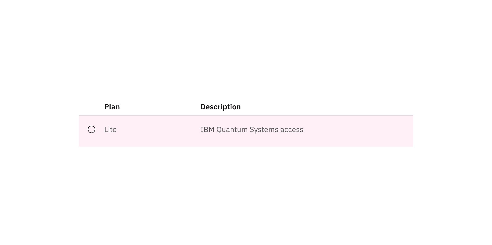
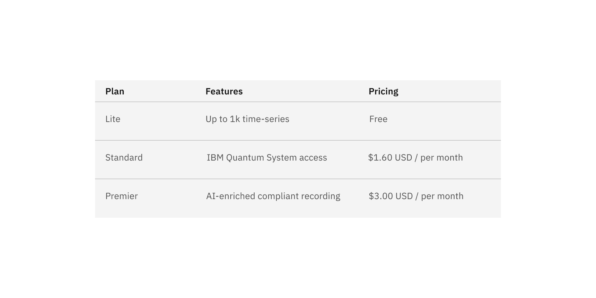

import A11yStatus from 'components/A11yStatus';
import { Tag } from '@carbon/react';

<PageDescription>

<Tag type="blue">Feature flag</Tag>

Structured lists group content that is similar or related, such as terms and
definitions.

</PageDescription>

<AnchorLinks>

<AnchorLink>Live demo</AnchorLink>
<AnchorLink>Overview</AnchorLink>
<AnchorLink>Formatting</AnchorLink>
<AnchorLink>Content</AnchorLink>
<AnchorLink>Default</AnchorLink>
<AnchorLink>Selectable</AnchorLink>
<AnchorLink>Modifiers</AnchorLink>
<AnchorLink>Related</AnchorLink>
<AnchorLink>Feedback</AnchorLink>

</AnchorLinks>

## Live demo

<StorybookDemo
  themeSelector
  tall
  url="https://react.carbondesignsystem.com"
  variants={[
    {
      label: 'Default',
      variant: 'components-structuredlist--default',
    },
    {
      label: 'Selection',
      variant: 'components-structuredlist--selection',
    },
    {
      label: 'Selectable with improved accessibility (unstable)',
      variant: 'components-structuredlist-feature-flag--selection',
    },
  ]}
/>

<A11yStatus layout="cards" components="Structured list" />

## Overview

Structured list displays a simple list with a considerable amount of items in
multiple rows. It helps organize and present grouped information into logical
and scannable patterns. The content within a structured list can be stacked to
create hierarchy within the data. Structured lists can have read-only or
selectable rows.

### When to use

- To browse information or select certain information within the group in the
  simplest form
- To view description and detailed information, present features, or compare
  pricing plans

### When not to use

- Nesting items is not recommended, as structured lists are used to present
  simple data. If you have complex content that needs to be shown, consider
  using a
  [data table](https://www.carbondesignsystem.com/components/data-table/usage/),
  which supports nesting items and presents a larger set of content.
- If needing to use a list of items in a small or confined space rather than on
  a full page, consider using a
  [contained list](https://carbondesignsystem.com/components/contained-list/usage/)
  instead.

### Variants

| Variant                   | Purpose                                                                                                        |
| ------------------------- | -------------------------------------------------------------------------------------------------------------- |
| [Default](#default)       | Allows the user to quickly browse and view information within a group of data.                                 |
| [Selectable](#selectable) | Allows the user to select a desired option within a group of data. This variant has an available feature flag. |

### Feature flags

A [feature flag](/components/overview/feature-flags/) has been added to the
selectable variant of structured list to improve accessibility and changes its
visual appearance, not its functionality. For code-specific feature flag
information, refer to the [Code](/components/structured-list/code/) tab. The
current selectable structured list is not being deprecated, but teams are
encouraged to use the feature flag structured list for their products moving
forward. Once the next major release (v12) is released in the future, this
feature flag will become the default version of the component.

The following are the feature flag changes made to structured list.

- Icons have been changed from checkmark icons to radio button icons and appear
  in the enabled state instead of only on hover before making a selection.
- Positioning of icons appear on the left of the component instead of on the
  right.

<Row>
<Column colLg={12}>
<Tabs>

<Tab label="Flag enabled">

</Tab>

<Tab label="Flag disabled">

</Tab>

</Tabs>

</Column>
</Row>

## Formatting

### Sizing

The structured list is available in two different height sizes: **default** and
**condensed**. The structure list's width varies based on content and layout.

<Row>
<Column colLg={12}>

<Caption>Default and condensed height sizes for structured list</Caption>

</Column>
</Row>

### Alignment

The structured list is available in two alignment styles: **hang** and
**flush**. The flush alignment is not offered with selectable functionality.

<Row>
<Column colLg={12}>

<Caption>Hang and flush alignment for structured list</Caption>

</Column>
</Row>

## Content

#### Row text

- A maximum of three paragraphs of text is recommended per row.
- Row text should use sentence-case capitalization.

#### Column header titles

- Column header titles should be short and clear, sticking to one or two words
  that describe the data in that column.
- In cases where a column header title is too long, wrap the text to two lines
  and truncate the remaining text. The full text should be shown on hover.
- Column header titles should use sentence-case capitalization.

### Further guidance

For further content guidance, see
Carbon’s [content guidelines](https://carbondesignsystem.com/guidelines/content/overview/).

## Default

Default structured lists are used to display simple information to the user.
These lists usually consist of read-only information and rows are not
selectable.

<Row>
<Column colLg={12}>

<Caption>Example of default structured list in a UI</Caption>

</Column>
</Row>

### Anatomy

<Row>
<Column colLg={12}>

<Caption>Anatomy of default structured list</Caption>

</Column>
</Row>

1. **Column header**: Displays title text in each column header
2. **Data row**: Contains different types of data in each row. Rows can be
   modified to have an optional background color

### States

The default structured list has an **enabled** and **skeleton** state and no
interactive states because it is not operable by a mouse or keyboard. For more
information on default structured list states, see the
[Style](https://carbondesignsystem.com/components/structured-list/style/) tab.

## Selectable

Selectable structured lists work well for presenting options to a user in an
ordered manner to make a selection, such as a set of pricing plans.

Selectable structured list has an available
[feature flag](/components/overview/feature-flags/).

<Row>
<Column colLg={12}>
<Tabs>

<Tab label="Flag enabled">

</Tab>

<Tab label="Flag disabled">

</Tab>

</Tabs>

</Column>
</Row>

### Anatomy

<Row>
<Column colLg={12}>

<Caption>Anatomy of selectable structured list with a feature flag</Caption>

</Column>
</Row>

1. **Column header**: Displays title text in each column header
2. **Data row**: Contains different types of data in each row. Rows can be
   modified to have a background color
3. **Icon**: An icon to indicate that the row is selectable

### States

The selectable structured list have **enabled**, **hover**, **focus**,
**selected**, **disabled**, and **skeleton** states. For more information on
selectable structured list states, see the
[Style](https://carbondesignsystem.com/components/structured-list/style/) tab.

### Interactions

#### Mouse

- The selectable structured list can be operated by a mouse by clicking on an
  individual row to select or deselect it.
- Rows are unselected by default, and only one row can be selected at a time.
- Product teams can build in logic to provide preselection of a row based on the
  use case. If multiple row selection is needed, use a
  [data table](https://carbondesignsystem.com/components/data-table/usage/)
  instead.

#### Keyboard

- `Tab` moves focus forward to the next following row.
- `Space` selects a row.
- `Up` and `Down` arrow keys move focus to previous and next rows.

### Clickable areas

The selectable structured list rows are clickable. You can click anywhere on the
row to select it.

<Row>
<Column colLg={12}>

<Caption>
  Clickable areas of selectable structured list with a feature flag
</Caption>

</Column>
</Row>

## Modifiers

### Background

Structured lists can have a background color option. The background color option
is only available for the hang alignment.

<Row>
<Column colLg={12}>

<Caption>
  Example of the color background modifier applied to structured list
</Caption>

</Column>
</Row>

## Related

- [Accordion](https://www.carbondesignsystem.com/components/accordion/usage/)
- [Contained list](https://carbondesignsystem.com/components/contained-list/usage/)
- [Data table](https://www.carbondesignsystem.com/components/data-table/usage/)
- [List](https://www.carbondesignsystem.com/components/list/usage/)

## Feedback

Help us improve this component by providing feedback, asking questions, and
leaving any other comments on
[GitHub](https://github.com/carbon-design-system/carbon-website/issues/new?assignees=&labels=feedback&template=feedback.md).
