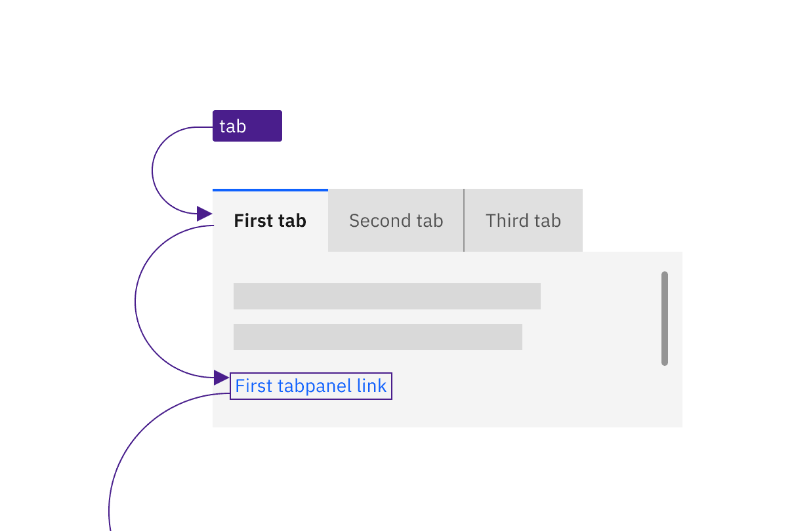
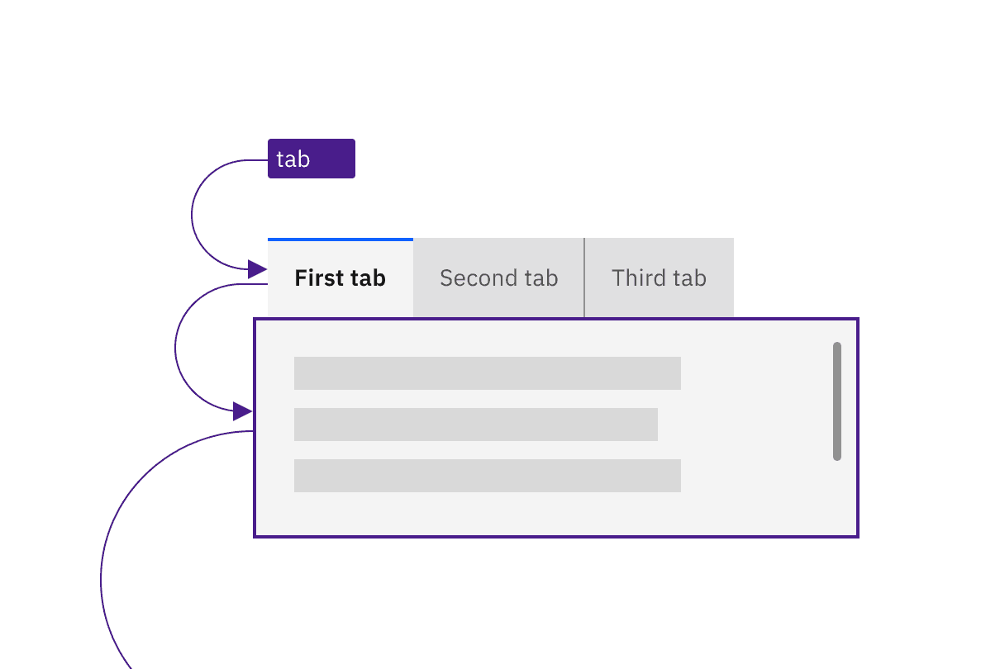
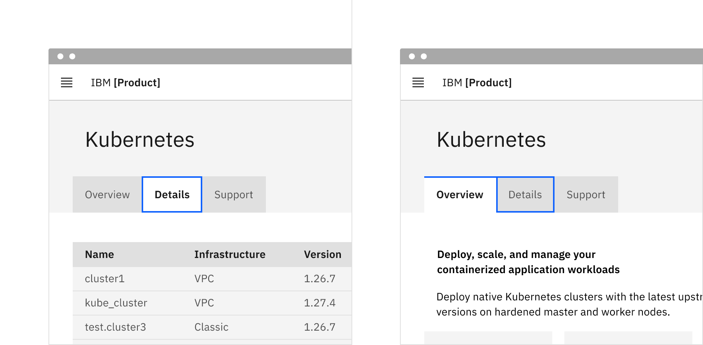
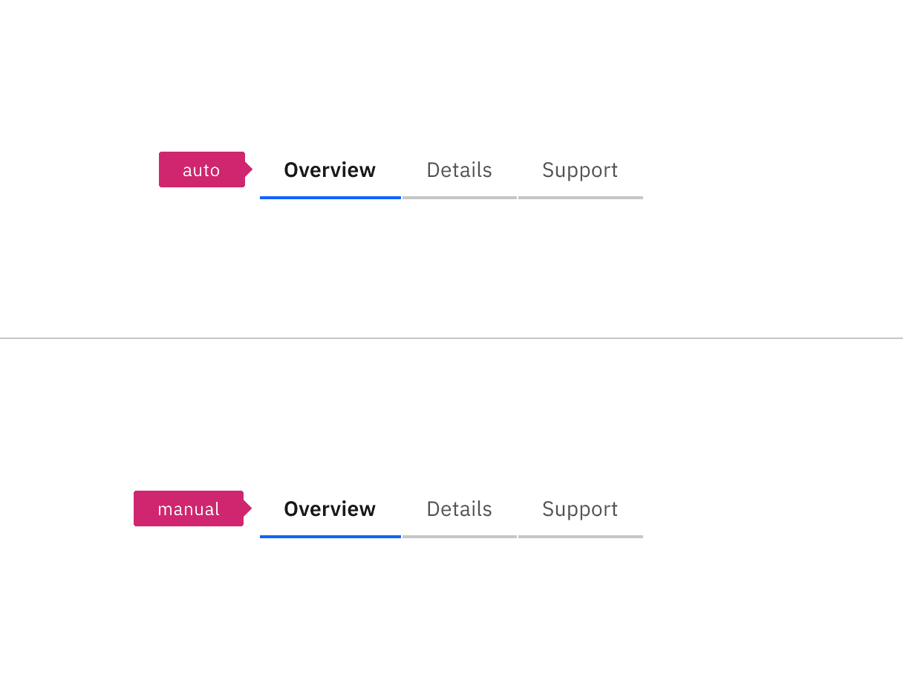

import {
  StructuredListWrapper,
  StructuredListHead,
  StructuredListBody,
  StructuredListRow,
  StructuredListInput,
  StructuredListCell,
  OrderedList,
  ListItem,
} from '@carbon/react';

<PageDescription>

Design annotations are needed for specific instances shown below, but for the
standard tabs component, also called a tablist, Carbon already incorporates
accessibility.

</PageDescription>

<AnchorLinks>
  <AnchorLink>What Carbon provides</AnchorLink>
  <AnchorLink>Design recommendations</AnchorLink>
  <AnchorLink>Development considerations</AnchorLink>
</AnchorLinks>

## What Carbon provides

Carbon bakes keyboard operation into its components, improving the experience of
blind users and others who operate via the keyboard. Carbon incorporates many
other accessibility considerations, some of which are described below.

### Keyboard interactions

Tabs take at least two tabstops, one for the tablist and one for the tabpanel.
When tabbing away from the tablist, focus will either go to the first operable
element in the tabpanel or, where there are no operable elements, the entire
tabpanel will take focus to support scrolling of its content.

<DoDontRow>
<DoDont
type="do"
colMd={6} colLg={6}
caption="The tablist takes a single tabstop then focus moves to the first item in the tabpanel.">

</DoDont>
<DoDont
colMd={6} colLg={6}
type="do"
caption="Where a tabpanel has no interactive items, the focus moves from the tablist to the entire tabpanel.">

</DoDont>
</DoDontRow>

Arrow keys are used to navigate between individual tab items in the tablist.
When the end of the tablist is reached, the focus wraps to the opposite end of
the list. For scrollable tablists, where the number of tabs exceeds the
horizontal space, the keyboard navigation does not change. The user presses the
`Left` or `Right` arrow key, which moves the focus to the next tab item and,
where necessary, scrolls the tablist to keep the selected item visible. For
mouse users, clickable arrows appear at the end of the tablist to provide the
same scrolling, but these are not needed for keyboard users and they are not in
the focus order.

<Row>

<Column colLg={8}>

<Caption>
  Arrow keys move between tabs in the tablist (wrapping from last back to first)
  and scroll automatically to keep the focused tab visible.
</Caption>

</Column>
</Row>

Automatic and manual tablists differ in how the tab items are activated. The
following illustration shows what will happen for each variant when a right
arrow key is pressed with the Overview tab selected and focused.

For automatic tablists, focus and selection are synchronized. When the user
arrows to a tab, it is selected, and the tabpanel under the tab is updated in
real time.

Manual tablists allow the user to arrow between the tab items without updating
the tabpanel underneath. When the user right arrows, the Overview tab remains
selected while focus moves to the Details tab. In order to select the Details
tab (and update the tabpanel under the tab), the user would press `Enter` or
`Space`.

<Row>
<Column colLg={12}>

<Caption>
  After pressing the `Right Arrow` key, the second tab is selected in an
  automatic tablist. For the manual tablist, Details has focus but Overview is
  still selected. Pressing the Space or Enter key will select Details.
</Caption>

</Column>
</Row>

## Design recommendations

### Indicate which variant to implement

The automatic and manual tablists are visually indistinguishable in a wireframe,
so designers should annotate which variant the team has decided to implement.
Since the choice primarily concerns technical considerations about potential
latency when updating the tabpanel’s information, architects or developers
should be involved in the discussion.

<Row>
<Column colLg={8}>

<Caption>
  Annotate whether the tabs should be implemented as automatic or manual.
</Caption>

</Column>
</Row>

## Development considerations

Keep these considerations in mind if you are modifying Carbon or creating a
custom component.

- Tabs are implemented as a `tablist`, with each tab item implemented as a
  `<button>` with a role of `tab`.
- The selected tab has attributes `aria-selected="true"` and `tabindex="0"`. All
  other tabs have these attribute values set to `"false"` and `"-1"`.
- Each tab is associated with its tabpanel through `aria-controls`.
- See the
  [ARIA authoring practices guidance for tabs](https://w3c.github.io/aria-practices/#tabpanel)
  for more considerations.
- For accessibility considerations for manual tabs, see
  [Deciding when to make selection automatically follow focus](https://www.w3.org/WAI/ARIA/apg/practices/keyboard-interface/#kbd_selection_follows_focus).
