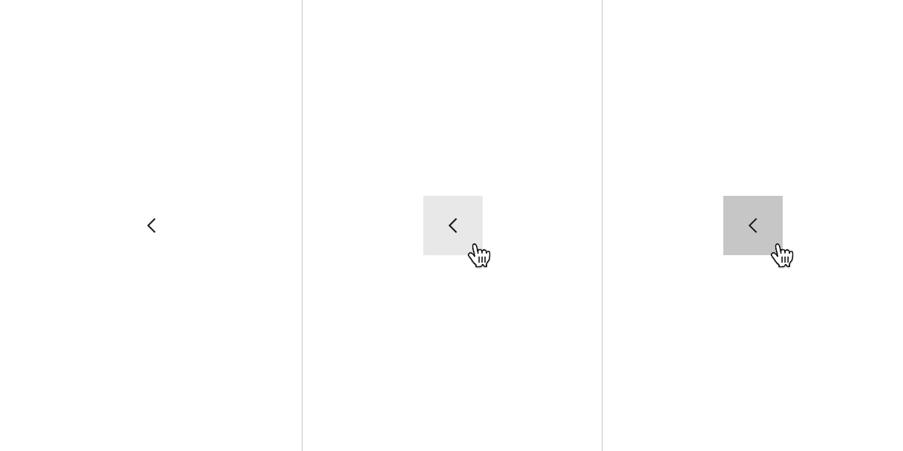

<AnchorLinks>

<AnchorLink>Color</AnchorLink>
<AnchorLink>Typography</AnchorLink>
<AnchorLink>Structure</AnchorLink>

</AnchorLinks>

## Color

### Line tabs

| State    | Element               | Property         | Color token                                    |
| -------- | --------------------- | ---------------- | ---------------------------------------------- |
| Enabled  | Background            | background-color | transparent                                    |
|          | Label                 | text-color       | `$text-secondary`                              |
|          | Icon                  | svg              | `$icon-secondary`                              |
|          | Background            | border-bottom    | `$border-subtle`                               |
|          | Scrollable icon       | svg              | `$icon-primary`                                |
|          | Scrollable fade       | background-color | 8px, linear-gradient white to 100% transparent |
|          | Scrollable background | background-color | `$background`                                  |
| Selected | Label                 | text-color       | `$text-primary`                                |
|          | Icon                  | svg              | `$icon-primary`                                |
|          | Background            | border-bottom    | `$interactive`                                 |

<Caption>Example of selected and enabled line tabs.</Caption>

 

#### Interactive states

 

| State          | Element               | Property         | Color token         |
| -------------- | --------------------- | ---------------- | ------------------- |
| Hover          | Background            | border-bottom    | `$interactive`      |
|                | Label                 | text-color       | `$text-primary`     |
|                | Icon                  | svg              | `$icon-primary`     |
|                | Scrollable background | background-color | `$background-hover` |
| Active         | Scrollable background | background-color | `$layer-accent`     |
| Focus          | Scrollable background | border           | `$focus`            |
| Focus-enabled  | Label                 | text-color       | `$text-secondary`   |
|                | Background            | border           | `$interactive`      |
|                | Icon                  | svg              | `$icon-secondary`   |
| Focus-selected | Label                 | text-color       | `$text-primary`     |
|                | Background            | border           | `$interactive`      |
|                | Icon                  | svg              | `$icon-primary`     |
| Disabled       | Label                 | text-color       | `$text-disabled`    |
|                | Icon                  | svg              | `$icon-disabled`    |
|                | Background            | background-color | `$icon-disabled`    |

<Caption>
  Examples of hover, focus-enabled, focus-selected, and disabled states for line
  tabs.
</Caption>

<Caption>
  Examples of enabled, hover, active, and disabled states for scrollable line
  tabs.
</Caption>

### Contained tabs

| State    | Element         | Property         | Color token           |
| -------- | --------------- | ---------------- | --------------------- |
| Enabled  | Background      | background-color | `$layer-accent`       |
|          | Label           | text-color       | `$text-secondary`     |
|          | Icon            | svg              | `$icon-secondary`     |
|          | Background      | border-right     | `$border-strong`      |
|          | Scrollable icon | svg              | `$icon-secondary`     |
|          | Label           | text-color       | `$text-primary`       |
| Selected | Background      | background-color | `$layer`              |
|          | Icon            | svg              | `$icon-primary`       |
|          | Background      | border-top       | `$border-interactive` |

<Caption>Examples of selected and enabled contained tabs.</Caption>

 

#### Interactive states

 

| State          | Element               | Property         | Color token            |
| -------------- | --------------------- | ---------------- | ---------------------- |
| Hover          | Background            | background-color | `$layer-accent-hover`  |
|                | Label                 | text-color       | `$text-primary`        |
|                | Icon                  | svg              | `$icon-primary`        |
|                | Scrollable background | background-color | `$layer-accent-hover`  |
| Active         | Scrollable background | background-color | `$layer-accent-active` |
| Focus          | Scrollable background | border           | `$focus`               |
| Focus-enabled  | Label                 | text-color       | `$text-secondary`      |
|                | Background            | background-color | `$layer-accent`        |
|                | Icon                  | svg              | `$icon-secondary`      |
| Focus-selected | Label                 | text-color       | `$text-primary`        |
|                | Background            | background-color | `$layer`               |
|                | Icon                  | svg              | `$icon-primary`        |
| Disabled       | Label                 | text-color       | `$text-disabled`       |
|                | Icon                  | svg              | `$icon-disabled`       |
|                | Background            | background-color | `$icon-disabled`       |
|                | Border                | border-right     | `$border-disabled`     |

<Caption>
  Hover, focus-enabled, focus-selected, and disabled states for contained tabs.
</Caption>

<Caption>
  Examples of enabled, hover, active, and focus states for contained scrollable
  tabs.
</Caption>

## Typography

Tab label should be set in sentence case, and should not exceed three words.

| Class                          | Font-size (px/rem) | Font-weight    | Type token      |
| ------------------------------ | ------------------ | -------------- | --------------- |
| `.bx--tabs__nav-link:selected` | 14 / 0.875         | SemiBold / 600 | `$heading-01`   |
| `.bx--tabs__nav-link`          | 14 / 0.875         | Regular / 400  | `$body-long-01` |

## Structure

### Line tabs

| Element         | Property                    | px / rem   | Spacing token |
| --------------- | --------------------------- | ---------- | ------------- |
| Tab             | height                      | 40 / 2.5   | –             |
|                 | border-bottom               | 2px        | –             |
|                 | width                       | auto-width | —             |
|                 | margin-left                 | 1px        | —             |
| Label           | padding-left, padding-right | 16 / 1     | `$spacing-05` |
|                 | padding-top, padding-bottom | 8 / 0.5    | `$spacing-03` |
| Icon            | padding-right               | 16 / 1     | `$spacing-05` |
|                 | padding-left                | 8 / 0.5    | `$spacing-03` |
|                 | svg                         | 16 x 16    | —             |
| Scrollable icon | svg                         | 16 x 16    | —             |

<Caption>Structure and spacing measurements for line tabs | px / rem</Caption>

 

#### Icon-only modifier

 

| Element  | Property      | px / rem | Spacing token |
| -------- | ------------- | -------- | ------------- |
| Tab (md) | height, width | 40 / 2.5 | –             |
|          | svg           | 16 x 16  | –             |
| Tab (lg) | height, width | 48 / 3   | —             |
|          | svg           | 20 x 20  | —             |

<Caption>
  Structure and spacing measurements for icon-only line tabs | px / rem
</Caption>

### Contained tabs

| Element               | Property                    | px / rem         | Spacing token |
| --------------------- | --------------------------- | ---------------- | ------------- |
| Tab                   | height                      | 40 / 2.5         | –             |
|                       | border-top                  | 2px              | –             |
|                       | width                       | auto-width, grid | –             |
| Label                 | padding-left, padding-right | 16 / 1           | `$spacing-05` |
| Icon                  | padding-right               | 16 / 1           | `$spacing-05` |
|                       | padding-left                | 16 / 1           | `$spacing-05` |
|                       | svg                         | 16 x 16          | —             |
| Tab                   | border-right                | 1px              | —             |
| Scrollable icon       | svg                         | 16 x 16          | —             |
| Scrollable background | border-right, border-left   | 1px              | —             |

<Caption>
  Structure and spacing measurements for contained tabs | px / rem
</Caption>

 

#### Icon-only modifier

 

| Element  | Property      | px / rem | Spacing token |
| -------- | ------------- | -------- | ------------- |
| Tab (lg) | height, width | 48 / 3   | —             |
|          | svg           | 20 x 20  | —             |

<Caption>
  Structure and spacing measurements for icon-only contained tabs | px / rem
</Caption>
