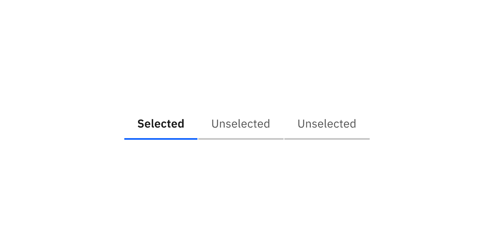
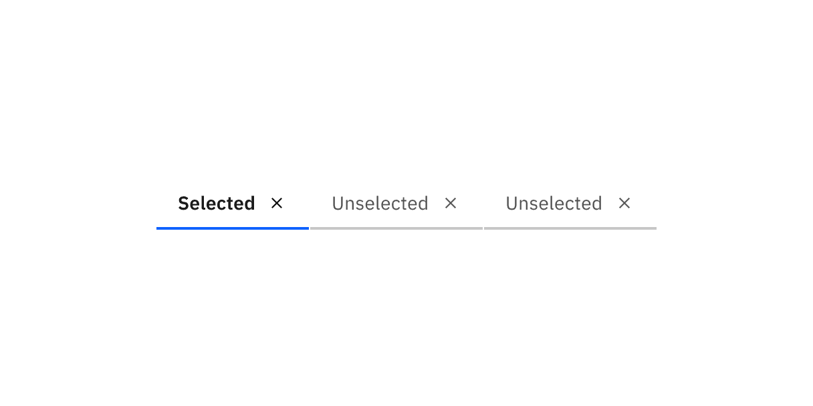
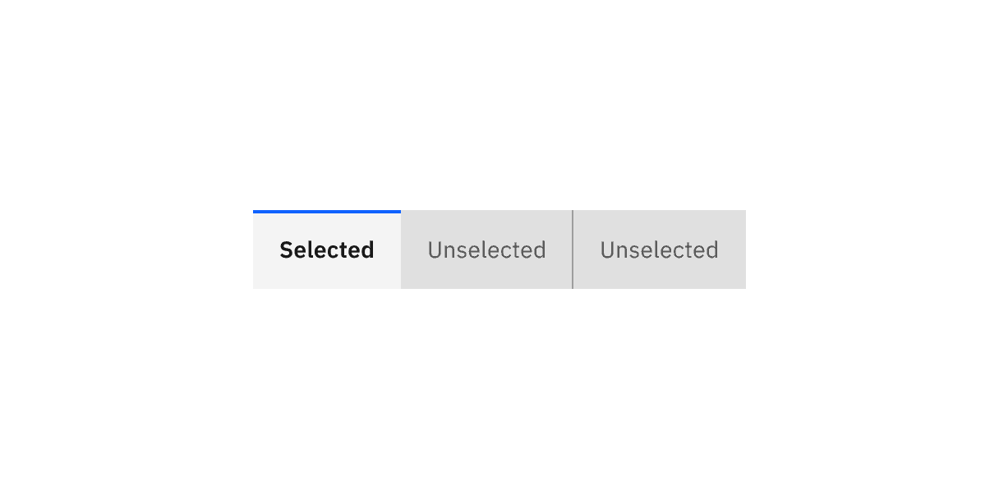
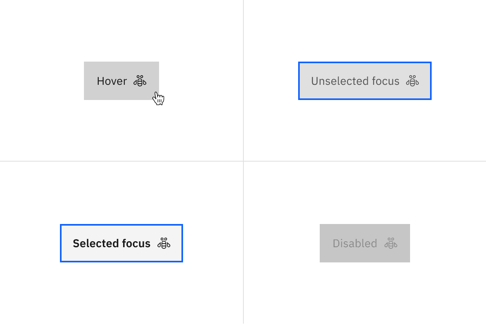

## Color

### Line tabs

| Type       | Element | Property         | Color token           |
| ---------- | ------- | ---------------- | --------------------- |
| Unselected | Tab     | background-color | transparent           |
|            |         | border-bottom    | `$border-subtle` \*   |
|            | Label   | text-color       | `$text-secondary`     |
|            | Icon    | svg              | `$icon-secondary`     |
| Selected   | Label   | text-color       | `$text-primary`       |
|            | Icon    | svg              | `$icon-primary`       |
|            | Tab     | border-bottom    | `$border-interactive` |

<Caption>Example of selected and unselected line tabs.</Caption>

 

#### Interactive states

 

| State    | Element         | Property         | Color token        |
| -------- | --------------- | ---------------- | ------------------ |
| Hover    | Label           | text-color       | `$text-primary`    |
|          | Icon            | svg              | `$icon-primary`    |
|          | Tab             | border-bottom    | `$border-strong`   |
| Focus    | Tab: unselected | border           | `$focus`           |
|          | Tab: selected   | border           | `$focus`           |
| Disabled | Label           | text-color       | `$text-disabled`   |
|          | Icon            | svg              | `$icon-disabled`   |
|          | Tab             | background-color | transparent        |
|          |                 | border-bottom    | `$border-disabled` |

<Caption>
  Examples of hover, focus-unselected, focus-selected, and disabled states for
  line tabs.
</Caption>

 

#### Scrollable states

 

| State   | Element | Property         | Color token                            |
| ------- | ------- | ---------------- | -------------------------------------- |
| Enabled | Icon    | svg              | `$icon-primary`                        |
|         | Button  | linear-gradient  | `$background` to 100% transparent, 8px |
|         |         | background-color | `$background`                          |
| Hover   | Button  | background-color | `$background-hover`                    |
| Active  | Button  | background-color | `$background-active`                   |
| Focus   | Button  | border           | `$focus`                               |

<Caption>
  Examples of enabled, hover, active, and disabled states for scrollable line
  tabs.
</Caption>

### Contained tabs

| Type       | Element | Property         | Color token           |
| ---------- | ------- | ---------------- | --------------------- |
| Unselected | Tab     | background-color | `$layer-accent` \*    |
|            |         | border-right     | `$border-strong` \*   |
|            | Label   | text-color       | `$text-secondary`     |
|            | Icon    | svg              | `$icon-secondary`     |
| Selected   | Tab     | background-color | `$layer` \*           |
|            |         | border-top       | `$border-interactive` |
|            | Label   | text-color       | `$text-primary`       |
|            | Icon    | svg              | `$icon-primary`       |

<Caption>
  * Denotes a contextual color token that will change values based on the layer
  it is placed on.
</Caption>

<Caption>Examples of selected and unselected contained tabs.</Caption>

 

#### Interactive states

 

| State    | Element | Property         | Color token              |
| -------- | ------- | ---------------- | ------------------------ |
| Hover    | Tab     | background-color | `$layer-accent-hover` \* |
|          | Label   | text-color       | `$text-primary`          |
|          | Icon    | svg              | `$icon-primary`          |
| Focus    | Tab     | border           | `$focus`                 |
| Disabled | Label   | text-color       | `$text-disabled`         |
|          | Icon    | svg              | `$icon-disabled`         |
|          | Tab     | background-color | `$button-disabled`       |
|          |         | border-right     | `$border-disabled`       |

<Caption>
  * Denotes a contextual color token that will change values based on the layer
  it is placed on.
</Caption>

<Caption>
  Hover, focus-enabled, focus-selected, and disabled states for contained tabs.
</Caption>

 

#### Scrollable states

 

| State   | Element | Property         | Color token               |
| ------- | ------- | ---------------- | ------------------------- |
| Enabled | Icon    | svg              | `$icon-secondary`         |
|         | Button  | background-color | `$layer-accent` \*        |
| Hover   | Button  | background-color | `$layer-accent-hover` \*  |
|         | Icon    | svg              | `$icon-primary`           |
| Active  | Button  | background-color | `$layer-accent-active` \* |
| Focus   | Button  | border           | `$focus`                  |

<Caption>
  Examples of enabled, hover, active, and focus states for contained scrollable
  tabs.
</Caption>

## Typography

Tab labels should be set in sentence case, and should not exceed three words.

| Element           | Font-size (px/rem) | Font-weight    | Type token            |
| ----------------- | ------------------ | -------------- | --------------------- |
| Label: unselected | 14 / 0.875         | Regular / 400  | `$body-compact-01`    |
| Label: selected   | 14 / 0.875         | SemiBold / 600 | `$heading-compact-01` |

## Structure

### Line tabs

| Element         | Property                    | px / rem   | Spacing token |
| --------------- | --------------------------- | ---------- | ------------- |
| Tab             | height                      | 40 / 2.5   | –             |
|                 | border-bottom               | 2px        | –             |
|                 | width                       | auto-width | –             |
|                 | margin-left                 | 1px        | –             |
| Label           | padding-left, padding-right | 16 / 1     | `$spacing-05` |
|                 | padding-top, padding-bottom | 8 / 0.5    | `$spacing-03` |
| Icon            | padding-right               | 16 / 1     | `$spacing-05` |
|                 | padding-left                | 8 / 0.5    | `$spacing-03` |
|                 | svg                         | 16 x 16    | –             |
| Scrollable icon | svg                         | 16 x 16    | –             |

<Caption>Structure and spacing measurements for line tabs | px / rem</Caption>

 

#### Icon-only modifier

 

| Element  | Property      | px / rem | Spacing token |
| -------- | ------------- | -------- | ------------- |
| Tab (md) | height, width | 40 / 2.5 | –             |
|          | svg           | 16 x 16  | –             |
| Tab (lg) | height, width | 48 / 3   | –             |
|          | svg           | 20 x 20  | –             |

<Caption>
  Structure and spacing measurements for icon-only line tabs | px / rem
</Caption>

### Contained tabs

| Element           | Property                    | px / rem         | Spacing token |
| ----------------- | --------------------------- | ---------------- | ------------- |
| Tab               | height                      | 40 / 2.5         | –             |
|                   | border-top                  | 2px              | –             |
|                   | width                       | auto-width, grid | –             |
| Label             | padding-left, padding-right | 16 / 1           | `$spacing-05` |
| Icon              | padding-right               | 16 / 1           | `$spacing-05` |
|                   | padding-left                | 16 / 1           | `$spacing-05` |
|                   | svg                         | 16 x 16          | –             |
| Tab               | border-right                | 1px              | –             |
| Scrollable icon   | svg                         | 16 x 16          | –             |
| Scrollable button | border-right, border-left   | 1px              | –             |

<Caption>
  Structure and spacing measurements for contained tabs | px / rem
</Caption>

 

#### Icon-only modifier

 

| Element  | Property      | px / rem | Spacing token |
| -------- | ------------- | -------- | ------------- |
| Tab (lg) | height, width | 48 / 3   | –             |
|          | svg           | 20 x 20  | –             |

<Caption>
  Structure and spacing measurements for icon-only contained tabs | px / rem
</Caption>
