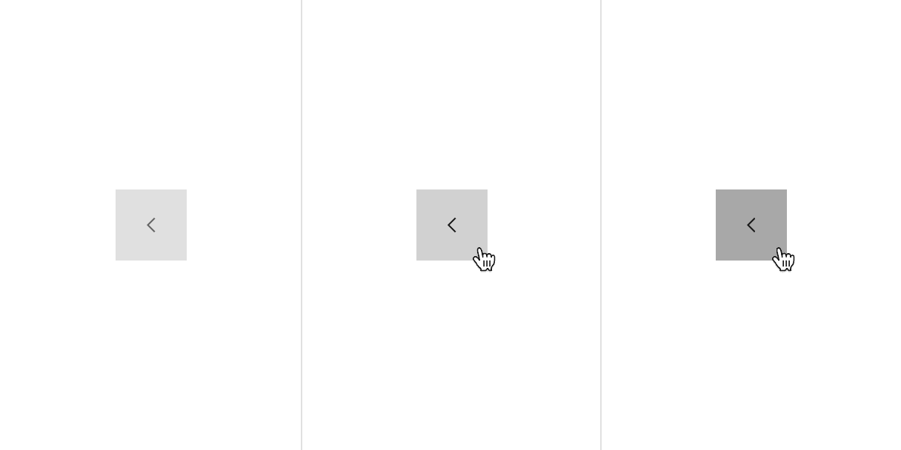

## Color

### Line tabs

| State    | Element               | Property         | Color token                                    |
| -------- | --------------------- | ---------------- | ---------------------------------------------- |
| Enabled  | Background            | background-color | transparent                                    |
|          | Label                 | text-color       | `$text-secondary`                              |
|          | Icon                  | svg              | `$icon-secondary`                              |
|          | Background            | border-bottom    | `$border-subtle`                               |
|          | Scrollable icon       | svg              | `$icon-primary`                                |
|          | Scrollable fade       | background-color | 8px, linear-gradient white to 100% transparent |
|          | Scrollable background | background-color | `$background`                                  |
| Selected | Label                 | text-color       | `$text-primary`                                |
|          | Icon                  | svg              | `$icon-primary`                                |
|          | Background            | border-bottom    | `$interactive`                                 |

<Row>
<Column colLg={8}>

</Column>
</Row>

<Caption>Example of selected and enabled line tabs.</Caption>

#### Interactive states

| State          | Element               | Property         | Color token         |
| -------------- | --------------------- | ---------------- | ------------------- |
| Hover          | Background            | border-bottom    | `$interactive`      |
|                | Label                 | text-color       | `$text-primary`     |
|                | Icon                  | svg              | `$icon-primary`     |
|                | Scrollable background | background-color | `$background-hover` |
| Active         | Scrollable background | background-color | `$layer-accent`     |
| Focus          | Scrollable background | border           | `$focus`            |
| Focus-enabled  | Label                 | text-color       | `$text-secondary`   |
|                | Background            | border           | `$interactive`      |
|                | Icon                  | svg              | `$icon-secondary`   |
| Focus-selected | Label                 | text-color       | `$text-primary`     |
|                | Background            | border           | `$interactive`      |
|                | Icon                  | svg              | `$icon-primary`     |
| Disabled       | Label                 | text-color       | `$text-disabled`    |
|                | Icon                  | svg              | `$icon-disabled`    |
|                | Background            | background-color | `$icon-disabled`    |

<Row>
<Column colLg={8}>

</Column>
</Row>

<Caption>
  Examples of hover, focus-enabled, focus-selected, and disabled states.
</Caption>

<Row>
<Column colLg={8}>

</Column>
</Row>

<Caption>
  Examples of enabled, hover, active, and focus states for scrollable tabs.
</Caption>

### Contained tabs

| State    | Element         | Property         | Color token           |
| -------- | --------------- | ---------------- | --------------------- |
| Enabled  | Background      | background-color | `$layer-accent`       |
|          | Label           | text-color       | `$text-secondary`     |
|          | Icon            | svg              | `$icon-secondary`     |
|          | Background      | border-right     | `$border-strong`      |
|          | Scrollable icon | svg              | `$icon-secondary`     |
|          | Label           | text-color       | `$text-primary`       |
| Selected | Background      | background-color | `$layer`              |
|          | Icon            | svg              | `$icon-primary`       |
|          | Background      | border-top       | `$border-interactive` |

<Row>
<Column colLg={8}>

</Column>
</Row>

<Caption>Examples of selected and enabled contained tabs.</Caption>{' '}

#### Interactive states  

| State          | Element               | Property         | Color token            |
| -------------- | --------------------- | ---------------- | ---------------------- |
| Hover          | Background            | background-color | `$layer-accent-hover`  |
|                | Label                 | text-color       | `$text-primary`        |
|                | Icon                  | svg              | `$icon-primary`        |
|                | Scrollable background | background-color | `$layer-accent-hover`  |
| Active         | Scrollable background | background-color | `$layer-accent-active` |
| Focus          | Scrollable background | border           | `$focus`               |
| Focus-enabled  | Label                 | text-color       | `$text-secondary`      |
|                | Background            | background-color | `$layer-accent`        |
|                | Icon                  | svg              | `$icon-secondary`      |
| Focus-selected | Label                 | text-color       | `$text-primary`        |
|                | Background            | background-color | `$layer`               |
|                | Icon                  | svg              | `$icon-primary`        |
| Disabled       | Label                 | text-color       | `$text-disabled`       |
|                | Icon                  | svg              | `$icon-disabled`       |
|                | Background            | background-color | `$icon-disabled`       |
|                | Border                | border-right     | `$border-disabled`     |

<Row>
<Column colLg={8}>

</Column>
</Row>

<Caption>
  Examples of hover, focus-enabled, focus-selected, and disabled states for
  contained tabs.
</Caption>

<Row>
<Column colLg={8}>

</Column>
</Row>

<Caption>
  Examples of enabled, hover, active, and focus states for contained scrollable
  tabs.
</Caption>

## Typography

Tab label should be set in sentence case, and should not exceed three words.

| Class                          | Font-size (px/rem) | Font-weight    | Type token      |
| ------------------------------ | ------------------ | -------------- | --------------- |
| `.bx--tabs__nav-link:selected` | 14 / 0.875         | SemiBold / 600 | `$heading-01`   |
| `.bx--tabs__nav-link`          | 14 / 0.875         | Regular / 400  | `$body-long-01` |

## Structure

### Line tabs

| Element         | Property                    | px / rem | Spacing token |
| --------------- | --------------------------- | -------- | ------------- |
| Tab             | border-bottom               | 2px      | –             |
| Label           | padding-left, padding-right | 16 / 1   | `$spacing-05` |
|                 | padding-top, padding-bottom | 8 / 0.5  | `$spacing-03` |
| Icon            | padding-right               | 16 / 1   | `$spacing-05` |
|                 | padding-left                | 8 / 0.5  | `$spacing-03` |
|                 | svg                         | 16 x 16  | —             |
| Tab             | margin-left                 | 1px      | —             |
| Icon-only       | svg                         | 16 x 16  | -             |
|                 | svg                         | 20 x 20  | —             |
| Scrollable icon | svg                         | 16 x 16  | -             |

<Row>
<Column colLg={8}>

</Column>
</Row>

<Caption>Structure and spacing measurements for line tabs | px / rem</Caption>

### Contained tabs

| Element               | Property                    | px / rem | Spacing token |
| --------------------- | --------------------------- | -------- | ------------- |
| Tab                   | border-top                  | 2px      | –             |
| Label                 | padding-left, padding-right | 16 / 1   | `$spacing-05` |
| Icon                  | padding-right               | 16 / 1   | `$spacing-05` |
|                       | padding-left                | 16 / 1   | `$spacing-05` |
|                       | svg                         | 16 x 16  | —             |
| Tab                   | border-right                | 1px      | —             |
| Icon-only             | svg                         | 20 x 20  | -             |
| Scrollable icon       | svg                         | 16 x 16  | —             |
| Scrollable background | border-right, border-left   | 1px      | -             |

<Row>
<Column colLg={8}>

</Column>
</Row>

<Caption>
  Structure and spacing measurements for contained tabs | px / rem
</Caption>

## Sizes

| Element                 | Property | Height (px / rem) |
| ----------------------- | -------- | ----------------- |
| Line tab                | Medium   | 40 / 2.5          |
| Icon-only line tab      | Medium   | 40 / 2.5          |
|                         | Large    | 48 / 3            |
| Contained tab           | Large    | 48 / 3            |
| Icon-only contained tab | Large    | 48 / 3            |

<Row>
<Column colLg={8}>

</Column>
</Row>

<Caption>Tab sizes | px / rem</Caption>
