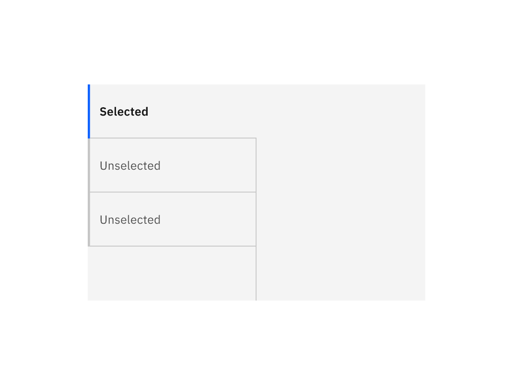
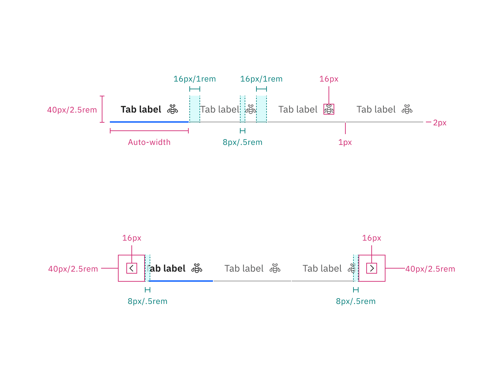
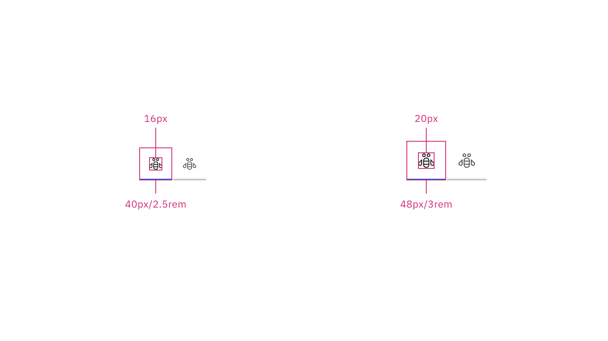
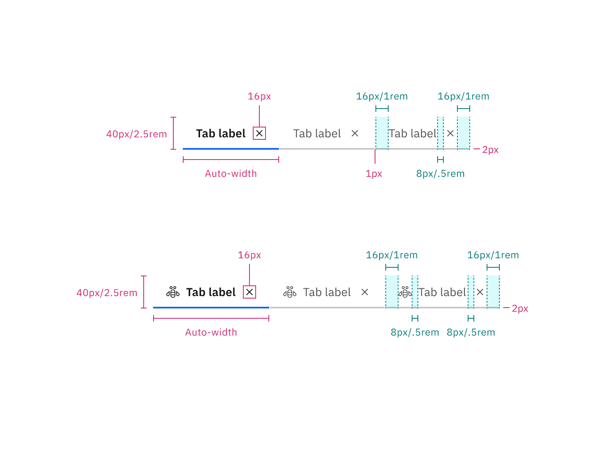
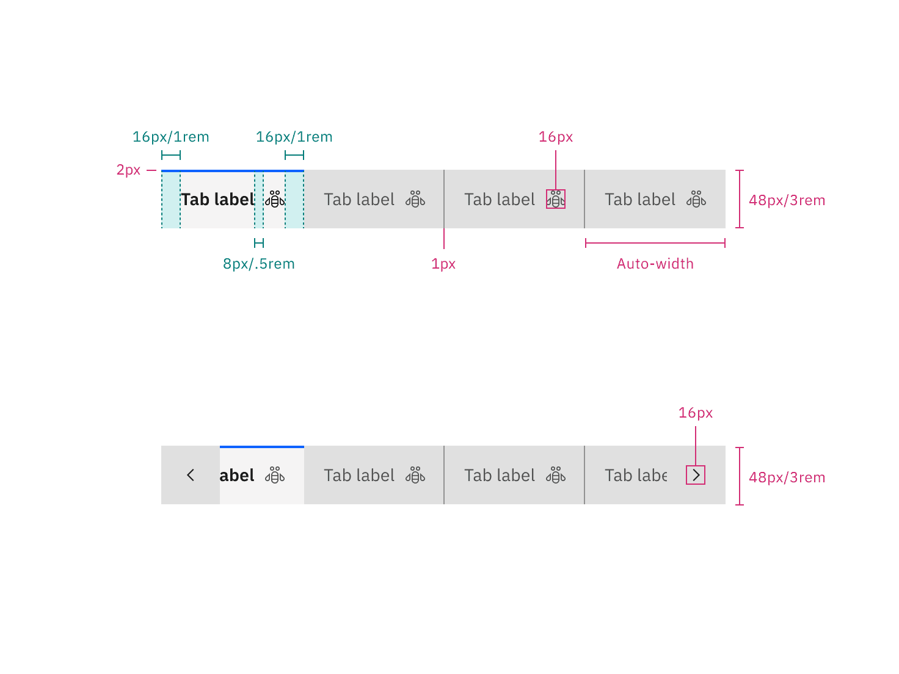
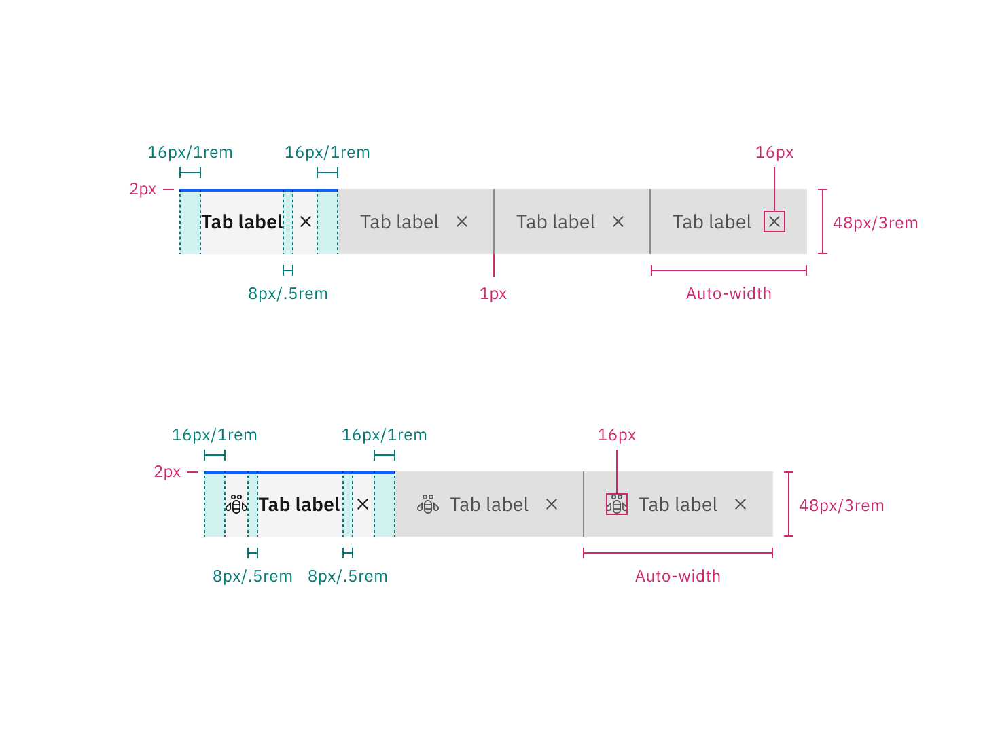
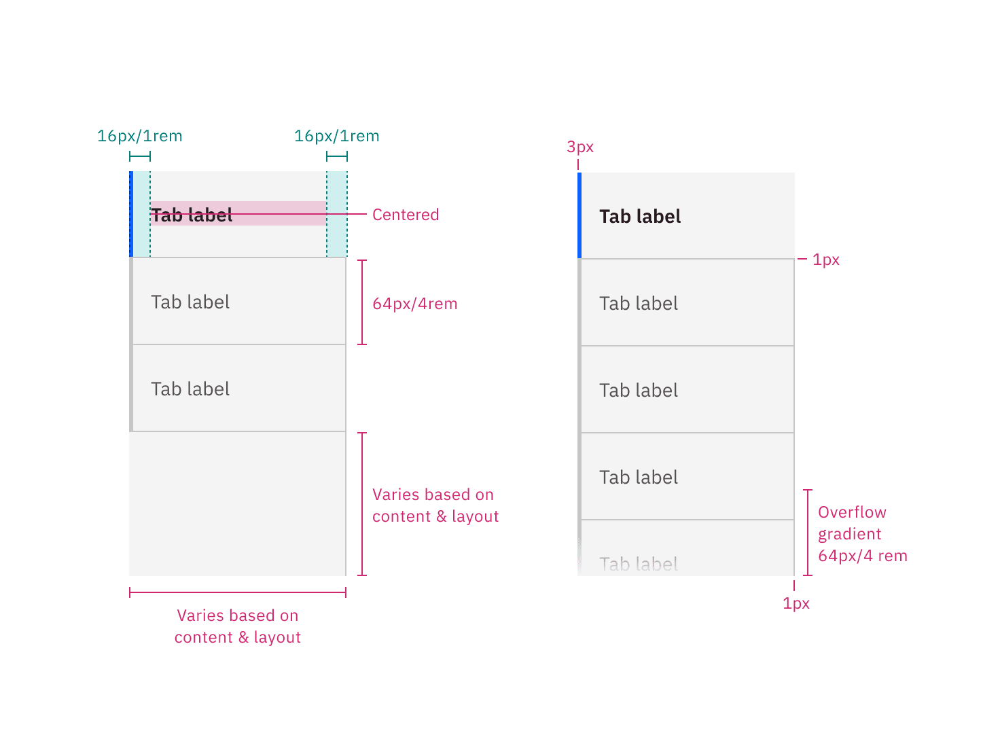

<PageDescription>

The following page documents visual specifications such as color, typography,
structure, and size.

</PageDescription>

<AnchorLinks>

<AnchorLink>Color</AnchorLink> <AnchorLink>Typography</AnchorLink>
<AnchorLink>Structure</AnchorLink> <AnchorLink>Feedback</AnchorLink>

</AnchorLinks>

## Color

### Line tab color

| Type       | Element | Property         | Color token           |
| ---------- | ------- | ---------------- | --------------------- |
| Unselected | Tab     | background-color | transparent           |
|            |         | border-bottom    | `$border-subtle` \*   |
|            | Label   | text-color       | `$text-secondary`     |
|            | Icon    | svg              | `$icon-secondary`     |
| Selected   | Label   | text-color       | `$text-primary`       |
|            | Icon    | svg              | `$icon-primary`       |
|            | Tab     | border-bottom    | `$border-interactive` |

<Caption fullWidth>
  \* Denotes a contextual color token that will change values based on the layer
  it is placed on.
</Caption>

<Row>
<Column colLg={8}>

</Column>
</Row>

<Caption>Example of selected and unselected line tabs.</Caption>

 

#### Line tab interactive state color

 

| State    | Element         | Property         | Color token        |
| -------- | --------------- | ---------------- | ------------------ |
| Hover    | Label           | text-color       | `$text-primary`    |
|          | Icon            | svg              | `$icon-primary`    |
|          | Tab             | border-bottom    | `$border-strong`   |
| Focus    | Tab: unselected | border           | `$focus`           |
|          | Tab: selected   | border           | `$focus`           |
| Disabled | Label           | text-color       | `$text-disabled`   |
|          | Icon            | svg              | `$icon-disabled`   |
|          | Tab             | background-color | transparent        |
|          |                 | border-bottom    | `$border-disabled` |

<Row>
<Column colLg={8}>

</Column>
</Row>

<Caption>
  Examples of hover, unselected focus, selected focus, and disabled states for
  line tabs.
</Caption>

 

#### Line tab scrollable states

 

| State   | Element | Property         | Color token                            |
| ------- | ------- | ---------------- | -------------------------------------- |
| Enabled | Icon    | svg              | `$icon-primary`                        |
|         | Button  | linear-gradient  | `$background` to 100% transparent, 8px |
|         |         | background-color | `$background`                          |
| Hover   | Button  | background-color | `$background-hover`                    |
| Active  | Button  | background-color | `$background-active`                   |

<Row>
<Column colLg={8}>

</Column>
</Row>

<Caption>
  Examples of enabled, hover, and active states for scrollable line tabs.
</Caption>

### Dismissible line tab color

| Type       | Element | Property         | Color token           |
| ---------- | ------- | ---------------- | --------------------- |
| Unselected | Tab     | background-color | transparent           |
|            |         | border-bottom    | `$border-subtle` \*   |
|            | Label   | text-color       | `$text-secondary`     |
|            | Icon    | svg              | `$icon-secondary`     |
| Selected   | Label   | text-color       | `$text-primary`       |
|            | Icon    | svg              | `$icon-primary`       |
|            | Tab     | border-bottom    | `$border-interactive` |

<Caption fullWidth>
  \* Denotes a contextual color token that will change values based on the layer
  it is placed on.
</Caption>

<Row>
<Column colLg={8}>

</Column>
</Row>

<Caption>Example of selected and unselected dismissible line tabs.</Caption>

 

#### Dismissible line tab interactive state

 

| State    | Element         | Property         | Color token         |
| -------- | --------------- | ---------------- | ------------------- |
| Hover    | Label           | text-color       | `$text-primary`     |
|          | Icon            | svg              | `$icon-primary`     |
|          |                 | background-color | `$background-hover` |
|          | Tab             | border-bottom    | `$border-strong` \* |
| Focus    | Tab: unselected | border           | `$focus`            |
|          | Tab: selected   | border           | `$focus`            |
| Disabled | Label           | text-color       | `$text-disabled`    |
|          | Icon            | svg              | `$icon-disabled`    |
|          | Tab             | background-color | transparent         |
|          |                 | border-bottom    | `$border-disabled`  |

<Caption fullWidth>
  \* Denotes a contextual color token that will change values based on the layer
  it is placed on.
</Caption>

<Row>
<Column colLg={8}>

</Column>
</Row>

<Caption>
  Examples of unselected close hover, unselected hover, unselected focus, and
  disabled states for dismissible line tabs.
</Caption>

<Row>
<Column colLg={8}>

</Column>
</Row>

<Caption>
  Examples of selected close hover and selected focus states for dismissible
  line tabs.
</Caption>

### Contained tab color

| Type       | Element         | Property         | Color token           |
| ---------- | --------------- | ---------------- | --------------------- |
| Unselected | Tab             | background-color | `$layer-accent` \*    |
|            |                 | border-right     | `$border-strong` \*   |
|            | Label           | text-color       | `$text-secondary`     |
|            | Secondary label | text-color       | `$text-secondary`     |
|            | Icon            | svg              | `$icon-secondary`     |
| Selected   | Tab             | background-color | `$layer` \*           |
|            |                 | border-top       | `$border-interactive` |
|            | Label           | text-color       | `$text-primary`       |
|            | Secondary label | text-color       | `$text-primary`       |
|            | Icon            | svg              | `$icon-primary`       |

<Caption fullWidth>
  \* Denotes a contextual color token that will change values based on the layer
  it is placed on.
</Caption>

<Row>
<Column colLg={8}>

</Column>
</Row>

<Caption>Examples of selected and unselected contained tabs.</Caption>

 

#### Contained tab interactive state color

 

| State    | Element         | Property         | Color token               |
| -------- | --------------- | ---------------- | ------------------------- |
| Hover    | Tab             | background-color | `$layer-accent-hover` \*  |
|          | Label           | text-color       | `$text-primary`           |
|          | Secondary label | text-color       | `$text-primary`           |
|          | Icon            | svg              | `$icon-primary`           |
| Focus    | Tab             | border           | `$focus`                  |
| Disabled | Label           | text-color       | `$text-on-color-disabled` |
|          | Secondary label | text-color       | `$text-on-color-disabled` |
|          | Icon            | svg              | `$icon-on-color-disabled` |
|          | Tab             | background-color | `$button-disabled`        |

<Caption fullWidth>
  \* Denotes a contextual color token that will change values based on the layer
  it is placed on.
</Caption>

<Row>
<Column colLg={8}>

</Column>
</Row>

<Caption>
  Examples of hover, unselected focus, selected focus, and disabled states for
  contained tabs.
</Caption>

 

#### Contained tab scrollable states

 

| State   | Element | Property         | Color token               |
| ------- | ------- | ---------------- | ------------------------- |
| Enabled | Icon    | svg              | `$icon-secondary`         |
|         | Button  | background-color | `$layer-accent` \*        |
| Hover   | Button  | background-color | `$layer-accent-hover` \*  |
|         | Icon    | svg              | `$icon-primary`           |
| Active  | Button  | background-color | `$layer-accent-active` \* |

<Caption fullWidth>
  \* Denotes a contextual color token that will change values based on the layer
  it is placed on.
</Caption>

<Row>
<Column colLg={8}>

</Column>
</Row>

<Caption>
  Examples of enabled, hover, and active states for contained scrollable tabs.
</Caption>

### Dismissible contained tab color

| Type       | Element          | Property         | Color token           |
| ---------- | ---------------- | ---------------- | --------------------- |
| Unselected | Tab              | background-color | `$layer-accent` \*    |
|            |                  | border-right     | `$border-strong` \*   |
|            | Label            | text-color       | `$text-secondary`     |
|            | Icon             | svg              | `$icon-secondary`     |
|            | Dismissible icon | svg              | `$icon-secondary`     |
| Selected   | Tab              | background-color | `$layer` \*           |
|            |                  | border-top       | `$border-interactive` |
|            | Label            | text-color       | `$text-primary`       |
|            | Icon             | svg              | `$icon-primary`       |
|            | Dismissible icon | svg              | `$icon-primary`       |

<Caption fullWidth>
  \* Denotes a contextual color token that will change values based on the layer
  it is placed on.
</Caption>

<Row>
<Column colLg={8}>

</Column>
</Row>

<Caption>
  Examples of selected and unselected dismissible contained tabs.
</Caption>

 

#### Dismissible contained tab interactive state color

 

| State    | Element                      | Property         | Color token               |
| -------- | ---------------------------- | ---------------- | ------------------------- |
| Hover    | Tab                          | background-color | `$layer-accent-hover` \*  |
|          | Label                        | text-color       | `$text-primary`           |
|          | Icon                         | svg              | `$icon-primary`           |
|          | Dismissible icon             | svg              | `$icon-primary`           |
|          | Dismissible icon: selected   | background-color | `$layer-hover` \*         |
|          | Dismissible icon: unselected | background-color | `$layer-accent-hover` \*  |
| Focus    | Tab                          | border           | `$focus`                  |
| Disabled | Label                        | text-color       | `$text-on-color-disabled` |
|          | Icon                         | svg              | `$icon-on-color-disabled` |
|          | Tab                          | background-color | `$button-disabled`        |

<Caption fullWidth>
  \* Denotes a contextual color token that will change values based on the layer
  it is placed on.
</Caption>

<Row>
<Column colLg={8}>

</Column>
</Row>

<Caption>
  Examples of unselected close hover, unselected hover, unselected focus, and
  disabled states for dismissible contained tabs.
</Caption>

<Row>
<Column colLg={8}>

</Column>
</Row>

<Caption>
  Examples of selected close hover and selected focus states for dismissible
  contained tabs.
</Caption>

### Vertical tab color

| Type       | Element             | Property                                 | Color token              |
| ---------- | ------------------- | ---------------------------------------- | ------------------------ |
| Unselected | Tab                 | background-color                         | `$layer` \*              |
|            |                     | border-bottom, border-right, border-left | `$border-subtle` \*      |
|            | Label               | text-color                               | `$text-secondary`        |
|            | Extended background | background-color                         | `$layer` \*              |
|            |                     | border-right                             | `$border-subtle` \*      |
| Selected   | Tab                 | background-color                         | `$layer` \*              |
|            |                     | border-bottom                            | `$border-subtle` \*      |
|            |                     | border-left                              | `$border-interactive` \* |
|            | Label               | text-color                               | `$text-primary`          |
| tab panel  | background          | background-color                         | `$layer` \*              |

<Caption fullWidth>
  \* Denotes a contextual color token that will change values based on the layer
  it is placed on.
</Caption>

<Row>
<Column colLg={8}>

</Column>
</Row>

<Caption>Examples of selected and unselected vertical tabs.</Caption>

#### Vertical tab interactive state color

 

| State    | Element           | Property         | Color token               |
| -------- | ----------------- | ---------------- | ------------------------- |
| Hover    | Label             | text-color       | `$text-primary`           |
|          | Tab               | background-color | `$layer-hover` \*         |
| Focus    | Tab: unselected   | border           | `$focus`                  |
|          | Label: unselected | text-color       | `$text-secondary`         |
|          | Tab: selected     | border           | `$focus`                  |
|          | Label: selected   | text-color       | `$text-primary`           |
| Disabled | Label             | text-color       | `$text-on-color-disabled` |

<Row>
<Column colLg={8}>

</Column>
</Row>

<Caption>
  Examples of hover, unselected focus, selected focus, and disabled states for
  vertical tabs.
</Caption>

 

## Typography

Tab labels should be set in sentence case, and should not exceed three words.

| Element           | Font-size (px/rem) | Font-weight    | Type token            |
| ----------------- | ------------------ | -------------- | --------------------- |
| Label: unselected | 14 / 0.875         | Regular / 400  | `$body-compact-01`    |
| Label: selected   | 14 / 0.875         | SemiBold / 600 | `$heading-compact-01` |
| Secondary label   | 12 / 0.75          | Regular / 400  | `$label-01`           |

## Structure

### Line tab structure

| Element         | Property                    | px / rem   | Spacing token |
| --------------- | --------------------------- | ---------- | ------------- |
| Tab             | height                      | 40 / 2.5   | –             |
|                 | border-bottom               | 2px        | –             |
|                 | width                       | auto-width | –             |
|                 | margin-left                 | 1px        | –             |
| Label           | padding-left, padding-right | 16 / 1     | `$spacing-05` |
|                 | padding-top, padding-bottom | 8 / 0.5    | `$spacing-03` |
| Icon            | padding-right               | 16 / 1     | `$spacing-05` |
|                 | padding-left                | 8 / 0.5    | `$spacing-03` |
|                 | svg                         | 16 x 16    | –             |
| Scrollable icon | svg                         | 16 x 16    | –             |

<Caption>Structure and spacing measurements for line tabs | px / rem</Caption>

 

#### Line tab icon-only modifier

 

| Element  | Property      | px / rem | Spacing token |
| -------- | ------------- | -------- | ------------- |
| Tab (md) | height, width | 40 / 2.5 | –             |
|          | svg           | 16 x 16  | –             |
| Tab (lg) | height, width | 48 / 3   | –             |
|          | svg           | 20 x 20  | –             |

<Caption fullwidth>
  Structure and spacing measurements for icon-only line tabs | px / rem
</Caption>

### Dismissible line tab structure

| Element          | Property                    | px / rem   | Spacing token |
| ---------------- | --------------------------- | ---------- | ------------- |
| Tab              | height                      | 40 / 2.5   | –             |
|                  | border-bottom               | 2px        | –             |
|                  | width                       | auto-width | –             |
|                  | margin-left                 | 1px        | –             |
| Label            | padding-left, padding-right | 16 / 1     | `$spacing-05` |
|                  | padding-top, padding-bottom | 8 / 0.5    | `$spacing-03` |
| Dismissible icon | padding-right               | 16 / 1     | `$spacing-05` |
|                  | padding-left                | 8 / 0.5    | `$spacing-03` |
|                  | svg                         | 16 x 16    | –             |
| Icon             | padding-right               | 8 / 0.5    | `$spacing-03` |
|                  | padding-left                | 16 / 1     | `$spacing-05` |
|                  | svg                         | 16 x 16    | –             |

<Caption fullwidth>
  Structure and spacing measurements for line tabs without icons (top) and with
  icons (bottom) | px / rem
</Caption>

### Contained tab structure

| Element           | Property                    | px / rem         | Spacing token |
| ----------------- | --------------------------- | ---------------- | ------------- |
| Tab               | height                      | 40 / 2.5         | –             |
|                   | border-top                  | 2px              | –             |
|                   | width                       | auto-width, grid | –             |
| Label             | padding-left, padding-right | 16 / 1           | `$spacing-05` |
| Icon              | padding-right               | 16 / 1           | `$spacing-05` |
|                   | padding-left                | 16 / 1           | `$spacing-05` |
|                   | svg                         | 16 x 16          | –             |
| Tab               | border-right                | 1px              | –             |
| Scrollable icon   | svg                         | 16 x 16          | –             |
| Scrollable button | border-right, border-left   | 1px              | –             |

<Caption fullwidth>
  Structure and spacing measurements for contained tabs | px / rem
</Caption>

 

#### Contained tab icon-only modifier

 

| Element  | Property      | px / rem | Spacing token |
| -------- | ------------- | -------- | ------------- |
| Tab (lg) | height, width | 48 / 3   | –             |
|          | svg           | 20 x 20  | –             |

<Caption fullwidth>
  Structure and spacing measurements for icon-only contained tabs | px / rem
</Caption>

### Dismissible contained tab structure

| Element          | Property                    | px / rem         | Spacing token |
| ---------------- | --------------------------- | ---------------- | ------------- |
| Tab              | height                      | 40 / 2.5         | –             |
|                  | border-top                  | 2px              | –             |
|                  | width                       | auto-width, grid | –             |
| Label            | padding-left, padding-right | 16 / 1           | `$spacing-05` |
| Dismissible icon | padding-right               | 16 / 1           | `$spacing-05` |
|                  | padding-left                | 8 / .5           | `$spacing-03` |
|                  | svg                         | 16 x 16          | –             |
| Icon             | padding-right               | 8 / .5           | `$spacing-03` |
|                  | padding-left                | 16 / 1           | `$spacing-05` |
|                  | svg                         | 16 x 16          | –             |
| Tab              | border-right                | 1px              | –             |

<Caption fullwidth>
  Structure and spacing measurements for dismissible contained tabs without
  icons (top) and with icons (bottom)| px / rem
</Caption>

### Vertical tab structure

| Element             | Property                    | px / rem | Spacing token |
| ------------------- | --------------------------- | -------- | ------------- |
| Tab                 | height                      | 64 / 4   | –             |
|                     | border-left                 | 3 px     | –             |
| Tab: unselected     | border-bottom, border-right | 1 px     | –             |
| Tab: selected       | border-bottom               | 1 px     | –             |
| Label               | padding-left, padding-right | 16 / 1   | `$spacing-05` |
| Extended background | border-right                | 1 px     | –             |

<Caption fullwidth>
  Structure and spacing measurements for vertical tabs without overflow (left)
  and with overflow (right) | px / rem
</Caption>

## Feedback

Help us improve this component by providing feedback, asking questions, and
leaving any other comments on
[GitHub](https://github.com/carbon-design-system/carbon-website/issues/new?assignees=&labels=feedback&template=feedback.md).
