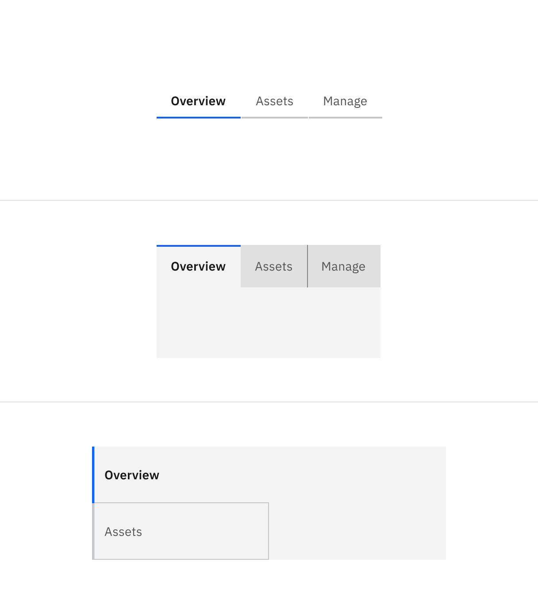
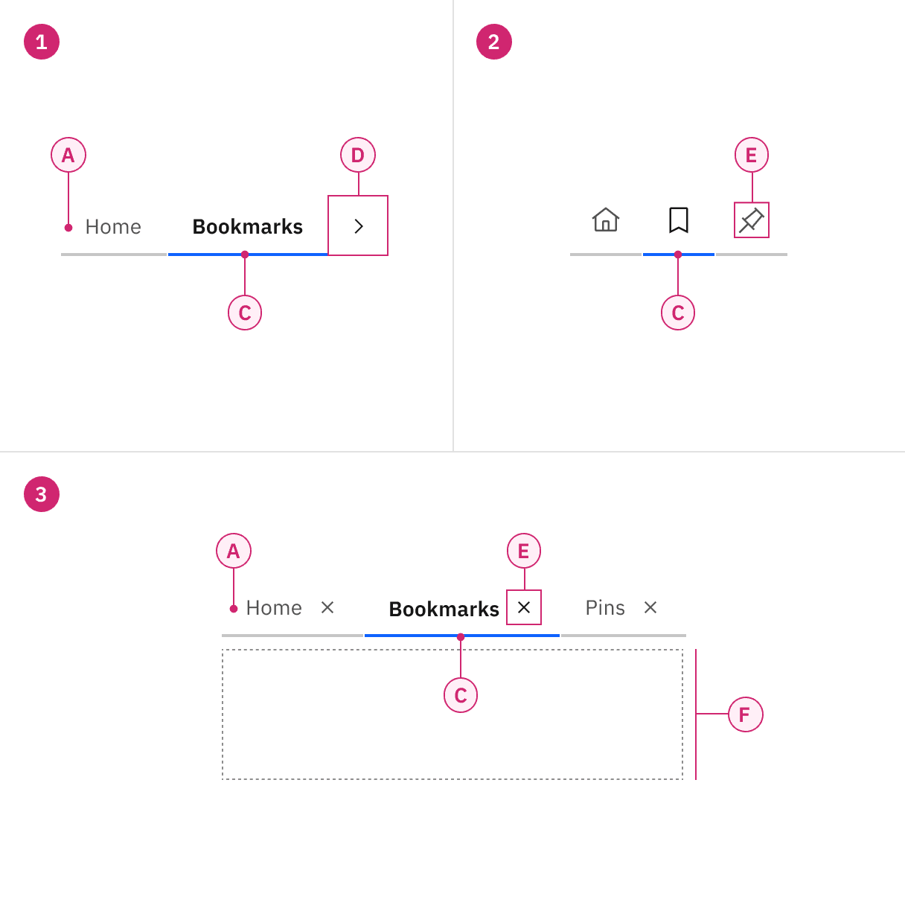
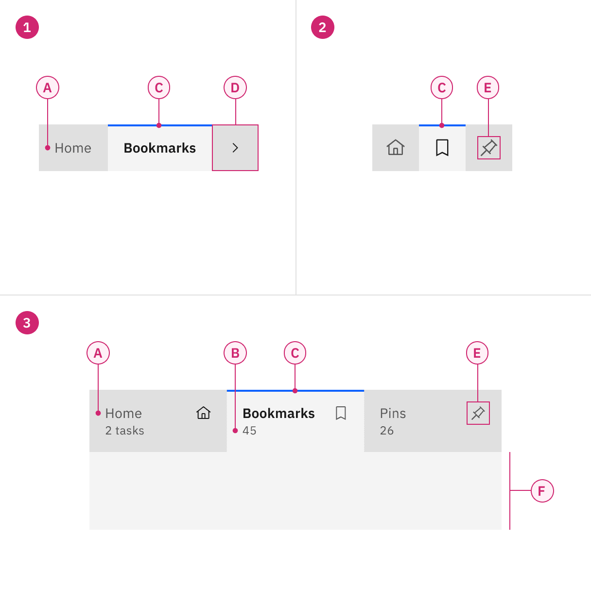
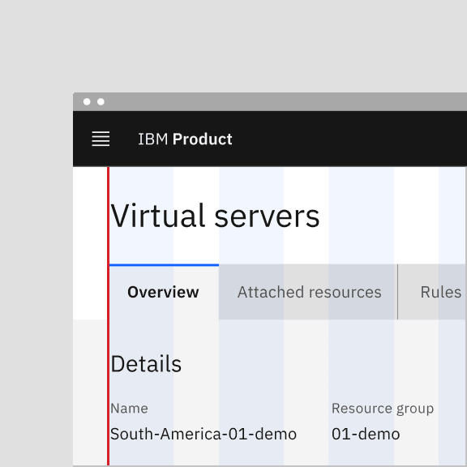
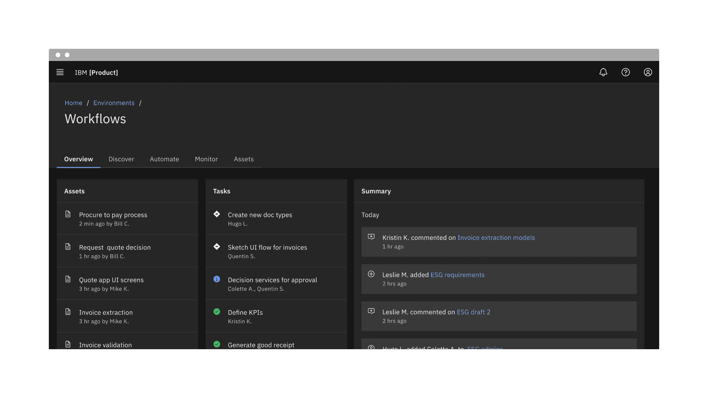
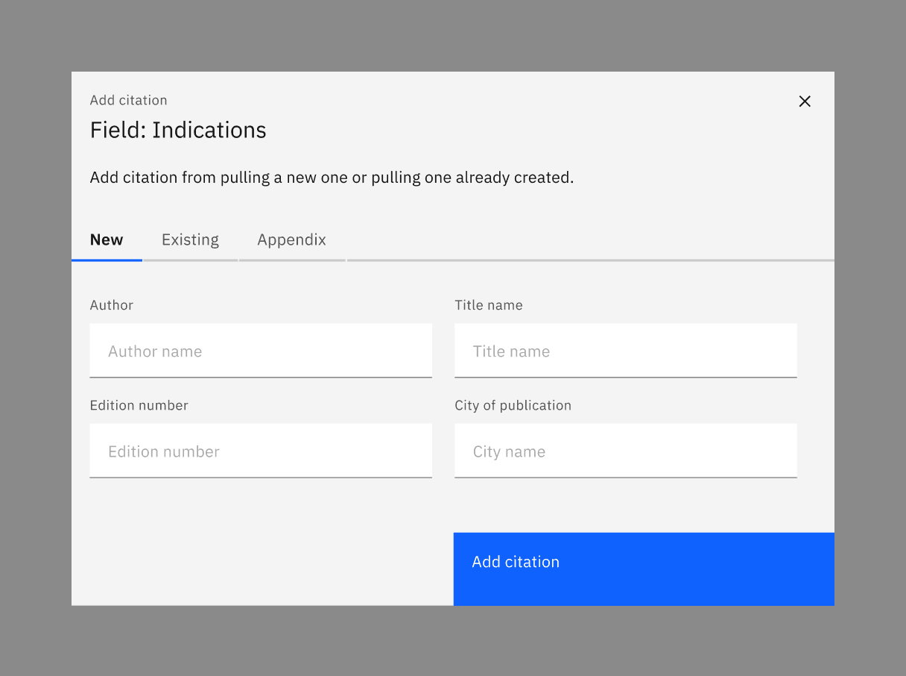

import { Tabs, TabList, Tab, TabPanels, TabPanel } from '@carbon/react';

<PageDescription>

Tabs are used to organize related content. They allow the user to navigate
between groups of information that appear within the same context.

</PageDescription>

<InlineNotification>

**v11 update:** The tab component variant names have changed. Default tabs has
become _Line tabs_ and Container tabs has become _Contained tabs_. The updated
tabs component has new modifiers that allow for icons and secondary labels. For
v10 implementation guidance, go to
[v10 Tabs](https://v10.carbondesignsystem.com/components/tabs/usage/).

</InlineNotification>

<AnchorLinks>

<AnchorLink>Overview</AnchorLink>
<AnchorLink>Live demo</AnchorLink>
<AnchorLink>Formatting</AnchorLink>
<AnchorLink>Content</AnchorLink>
<AnchorLink>Behaviors</AnchorLink>
<AnchorLink>Modifiers</AnchorLink>
<AnchorLink>Related</AnchorLink>
<AnchorLink>References</AnchorLink>
<AnchorLink>Feedback</AnchorLink>

</AnchorLinks>

## Overview

Tabs are used to group different but related content, allowing users to navigate
views without leaving the page. They always contain at least two items and one
tab is active at a time. Tabs can be used on full page layouts or in components
such as modals, cards, or side panels.

<Row>
<Column colLg={12}>

</Column>
</Row>

### When to use

- Use tabs to group related information into different categories, helping to
  reduce cognitive load.
- Tabs can be used to organize content such as forms, settings, and dashboards
  so a user does not have to navigate away from their workflow to complete their
  task.

<Row>
<Column colLg={8}>

</Column>
</Row>

### When not to use

- Tabs should never be used for primary navigation. If tabs become too complex,
  consider using a standard navigation pattern.
- Tabs should not be used to indicate progress. Use the progress indicator
  instead.
- Tabs should not be used if the user is comparing information in two groups, as
  this would result in the user having to click back and forth to complete a
  task.

### Variants

| Variant     | Purpose                                                                                                                                                                                   |
| ----------- | ----------------------------------------------------------------------------------------------------------------------------------------------------------------------------------------- |
| _Line_      | A standalone tab that can also be nested within components. It is commonly used within components or for content using the entire page for layout, not connected to any other components. |
| _Contained_ | An emphasized tab that is always attached to a background container. It is commonly used for defined content areas, like sub-pages or attached to cards.                                  |

<Row>
<Column colLg={8}>

</Column>
</Row>

<Caption>Examples of line tabs (top) and contained tabs (bottom)</Caption>

## Live demo

<ComponentDemo
  components={[
    {
      id: 'tabs',
      label: 'Tabs',
    },
  ]}
  scope={{
    Tabs,
    TabList,
    Tab,
    TabPanels,
    TabPanel,
  }}
>
  <ComponentVariant
    id="tabs"
    knobs={{
      TabList: ['activation', 'contained'],
      Tab: ['disabled'],
    }}
    links={{
      React:
        'https://react.carbondesignsystem.com/?path=/story/components-tabs--default',
      Angular:
        'https://angular.carbondesignsystem.com/?path=/story/components-tabs--basic',
      Vue: 'http://vue.carbondesignsystem.com/?path=/story/components-cvtabs--default',
      'Web Components':
        'https://web-components.carbondesignsystem.com/?path=/story/components-tabs--default',
    }}
  >
    {`

  <Tabs>
    <TabList aria-label="List of tabs" contained>
      <Tab>Tab Label 1</Tab>
      <Tab>Tab Label 2</Tab>
      <Tab disabled>Tab Label 3</Tab>
      <Tab title="Tab Label 4 with a very long long title">
          Tab Label 4 with a very long long title
      </Tab>
      <Tab>Tab Label 5</Tab>
    </TabList>
    <TabPanels>
      <TabPanel>Tab Panel 1</TabPanel>
      <TabPanel>
        Tab Panel 2 <Button>Example button</Button>
      </TabPanel>
      <TabPanel>Tab Panel 3</TabPanel>
      <TabPanel>Tab Panel 4</TabPanel>
      <TabPanel>Tab Panel 5</TabPanel>
    </TabPanels>
  </Tabs>

  `}
  </ComponentVariant>
</ComponentDemo>

## Formatting

The tab component consists of two distinct zones: selected and unselected. There
are always at least two tabs and one is selected by default. Icons are optional.

### Anatomy of line tabs

<Row>
<Column colLg={8}>

</Column>
</Row>

<Row>
<Column colSm={2} colMd={4} colLg={4}>

#### 1. Line tabs

A. Label   B. Indicator  

#### 3. Line tabs with icon

A. Label   B. Indicator   C. Icon

</Column>
<Column colSm={2} colMd={4} colLg={4}>

#### 2. Icon-only line tabs

B. Indicator   C. Icon

</Column>
</Row>

### Anatomy of contained tabs

<Row>
<Column colLg={8}>

</Column>
</Row>

<Row>
<Column colSm={2} colMd={4} colLg={4}>

#### 1. Contained tabs

A. Label   B. Indicator   D. Container

#### 3. Contained tabs with icon and secondary label

A. Label   B. Indicator   C. Icon (optional)   D. Container 
E. Secondary label (optional)

</Column>
<Column colSm={2} colMd={4} colLg={4}>

#### 2. Contained tab with icons only

B. Indicator   C. Icon   D. Container

</Column>
</Row>

### Alignment

Much like
[buttons](https://www.carbondesignsystem.com/components/button/usage/#alignment),
alignment of tabs depends on where they appear and whether or not they're
contained within another component. As a general rule, the first label for both
line tabs and contained tabs align with the grid and the text below. If tabs are
within another component, such as a card, follow the grid that you are using
inside the component and align the label with text in the component.

<DoDontRow>
  <DoDont type="do" caption="Do align tab labels with the grid">

  </DoDont>
  <DoDont type="dont" caption="Do not align tab container with the grid">

  </DoDont>
</DoDontRow>

#### Auto-width

With both line tabs and contained tabs, auto-width is the default behavior. Each
tab will be a different size depending on the label's character count but will
have consistent padding on each side of the label. The first label, selected by
default, should align to the grid. Where the tabs end will vary and may not end
on the grid. If needed, you may also use a line to help balance tabs with other
components on the page.

<Row>
<Column colLg={12}>

</Column>
</Row>

<Caption>Example of auto-width line tabs using a rule</Caption>

#### Aligning to grid columns

Instead of using the default auto-width behavior, contained tabs also have the
option to align to the grid. As a group, the tabs span a set of columns with
each tab being equal in size. The first tab’s label should align to the first
column you are using with the last tab in the group always ending at a column’s
edge. The tabs in between will flow accordingly and may or may not align to the
grid but will always be the same size.

Use the
[2x grid](https://www.carbondesignsystem.com/guidelines/2x-grid/overview#2x-grid-fundamentals)
to drive visual rhythm by spacing content in multiples of two columns and
aligning the beginning and ending of the tab elements with content below the
tabs when possible.

<InlineNotification>

**Note:** Grid aligned tabs are not currently implemented in the components.
Updates for grid alignment are incoming.

</InlineNotification>

<Row>
<Column colLg={12}>

</Column>
</Row>

<Caption>Example of contained tabs using the grid</Caption>

#### Alignment within a component

When using line tabs within a component (like a modal) the first label should
always align to the other content in the space. Do not use contained tabs. The
edges of the line tab may also bleed to the edges of the space if needed
depending on the container's margins. To add hierarchical clarity and balance
the tabs with the other content, a line may be added from the end of the last
tab to the edge of the content area.

<Row>
<Column colLg={8}>

</Column>
</Row>

<Caption>Aligning tabs within a component</Caption>

## Content

### Main elements

#### Labels

- Use short tab labels that are clear and specific. Labels should be one to two
  words, as these are easier to scan.
- Text labels should clearly communicate the view users will see and the content
  contained in the view.

#### Secondary labels

- Contained tabs can have secondary labels to add clarity or assist the user in
  choosing the right selection.

### Further guidance

For further content guidance, see Carbon's
[content guidelines](/guidelines/content/overview).

## Behaviors

### States

Tabs allow for three states: **selected, unselected,** and **disabled**. The
default view is that one tab is preselected and is usually the first tab. Only
one tab can be selected at a time. When a user chooses a new item, the previous
tab is automatically deselected. If a user navigates away from a tab, a user
should return to the last tab selected.

For detailed visual information about the various states for this component, see
the [Style tab](https://carbondesignsystem.com/components/tabs/style).

<Row>
<Column colLg={8}>

</Column>
</Row>

<Caption>
  Example of selected, unselected, and disabled states in line tabs (top) and
  contained tabs (bottom)
</Caption>

### Scrollable

When your page requires more tabs that can fit or needs to adapt to a new
browser size, tabs should become scrollable. Left and right arrows appear to
help navigate the user through tabs that might be off-page.

<Row>
<Column colLg={8}>

</Column>
</Row>

<Caption>
  Example of scrolling in line tabs (top) and contained tabs (bottom)
</Caption>

### Interactions

#### Mouse

Users can trigger a state change by clicking anywhere in the container area.

#### Keyboard

One tab should be selected by default. Users can navigate between tabs by
pressing right or left arrow keys. For additional keyboard interactions, see the
[Accessibility tab](https://carbondesignsystem.com/components/tabs/accessibility).

#### Screenreader

VoiceOver: Users can navigate between tabs by pressing `right` or `left` arrow
keys.

JAWS: Users can navigate between tabs by pressing `right` or `left` arrow keys.

NVDA: Users can navigate between tabs by pressing `right` or `left` arrow keys.

For additional information, see the
[Accessibility tab](https://carbondesignsystem.com/components/tabs/accessibility).

## Modifiers

### Tabs with icons

You may use icons in either line or contained tabs. Icons are always pinned to
the right of the tab and do not appear above, below, or to the left of the
label.

<Row>
<Column colLg={8}>

</Column>
</Row>

### Icon-only tabs

You may use icon-only tabs with both line and contained tabs. Icons must be
easily recognized and globally accepted. These work best in small, defined
spaces and in components. Always use a tooltip for an icon description on hover
to add clarity.

<Row>
<Column colLg={8}>

</Column>
</Row>

### Secondary labels

Contained tabs that align with the grid allow for a secondary label. Do not use
secondary labels with line tabs or auto-width contained tabs.

<Row>
<Column colLg={8}>

</Column>
</Row>

## Related

#### Content switcher versus tabs

[Content switchers](https://www.carbondesignsystem.com/components/content-switcher/usage/)
allow users to compare and toggle between alternate views of similar or related
content. Content that is grouped into tabs is part of the same bigger context
but the content does not overlap.

#### Navigation versus tabs

Tabs should not be used for common navigation patterns. If your tab arrangements
are becoming too complex with different levels of content, consider using
[left](https://www.carbondesignsystem.com/components/UI-shell-left-panel/usage/)
or
[right](https://www.carbondesignsystem.com/components/UI-shell-right-panel/usage/)
UI panels, possibly in conjunction with breadcrumbs, to help the user through
the content.

#### Progress indicator versus tabs

[Progress indicator](https://www.carbondesignsystem.com/components/progress-indicator/usage/)
content moves in a logical progression, showing next steps to guide the user
through the completion of a task. Tabs organize content into groups that the
user can navigate through; they do not support progressive tasks.

## References

Jakob Nielson,
[Tabs, Used Right](https://www.nngroup.com/articles/tabs-used-right/) (Nielsen
Norman Group, 2016)

## Feedback

Help us improve this component by providing feedback, asking questions, and
leaving any other comments on
[GitHub](https://github.com/carbon-design-system/carbon-website/issues/new?assignees=&labels=feedback&template=feedback.md).
