import A11yStatus from 'components/A11yStatus';
import { Tabs, TabList, Tab, TabPanels, TabPanel } from '@carbon/react';

<PageDescription>

Tabs are used to organize related content. They allow the user to navigate
between groups of information that appear within the same context.

</PageDescription>

<AnchorLinks>

<AnchorLink>Live demo</AnchorLink>
<AnchorLink>Overview</AnchorLink>
<AnchorLink>Formatting</AnchorLink>
<AnchorLink>Content</AnchorLink>
<AnchorLink>Universal behaviors</AnchorLink>
<AnchorLink>Line tabs</AnchorLink>
<AnchorLink>Contained tabs</AnchorLink>
<AnchorLink>Vertical tabs</AnchorLink>
<AnchorLink>Modifiers</AnchorLink>
<AnchorLink>Related</AnchorLink>
<AnchorLink>References</AnchorLink>
<AnchorLink>Feedback</AnchorLink>

</AnchorLinks>

## Live demo

<StorybookDemo
  themeSelector
  url="https://react.carbondesignsystem.com"
  variants={[
    {
      label: 'Default',
      variant: 'components-tabs--default',
    },
    {
      label: 'Contained',
      variant: 'components-tabs--contained',
    },
    {
      label: 'Contained with secondary labels and icons',
      variant: 'components-tabs--contained-with-secondary-labels-and-icons',
    },
    {
      label: 'Contained full width',
      variant: 'components-tabs--contained-full-width',
    },
    {
      label: 'Icon 20 only',
      variant: 'components-tabs--icon-20-only',
    },
    {
      label: 'Icon only',
      variant: 'components-tabs--icon-only',
    },
    {
      label: 'Manual',
      variant: 'components-tabs--manual',
    },
    {
      label: 'Dismissable with icons',
      variant: 'components-tabs--dismissable-with-icons',
    },
    {
      label: 'Vertical',
      variant: 'components-tabs--vertical',
    },
  ]}
/>

<A11yStatus layout="cards" components="Tabs" />

## Overview

Tabs are used to group different but related content, allowing users to navigate
views without leaving the page. Tabs can be used on full page layouts or in
components such as modals, cards, or side panels.

<Row>
<Column colLg={12}>

</Column>
</Row>

### When to use

To help reduce cognitive load, use tabs to group related information into
different categories. Tabs can be used to organize content such as forms,
settings, and dashboards so a user does not have to navigate away from their
workflow to complete their task.

<Row>
<Column colLg={8}>

</Column>
</Row>

### When not to use

#### Filtering the same content

When toggling between different formats of the same content or filtering the
same content, use [content switcher](/components/content-switcher/usage)
instead. Content switcher is often used alongside tabs, but it typically serves
at a lower hierarchy to organize related content within the tab’s contents.

#### Indicating progress

When the user needs to work through a step by step linear process, use a
[progress indicator](/components/progress-indicator/usage). Tabs help organize
information hierarchically but remain flexible in how content can be designed
and consumed.

#### Comparing information

Tabs should not be used if the user needs to compare information in different
groups, as this would result in the user having to click back and forth to
complete a task.

### Variants

| Variant                      | Purpose                                                                                                                                                                                   |
| ---------------------------- | ----------------------------------------------------------------------------------------------------------------------------------------------------------------------------------------- |
| [Line](#line-tabs)           | A standalone tab that can also be nested within components. It is commonly used within components or for content using the entire page for layout, not connected to any other components. |
| [Contained](#contained-tabs) | An emphasized tab that is commonly used for defined content areas.                                                                                                                        |
| [Vertical](#Vertical-tabs)   | A tablist with a vertical orientation to browse through content.                                                                                                                          |

<Row>
<Column colLg={8}>

</Column>
</Row>

<Caption>
  Examples of line tabs (top), contained tabs (middle), and vertical tabs
  (bottom)
</Caption>

## Formatting

The tab component consists of two distinct zones: selected and unselected. One
tab is always selected by default. There are always at least two tabs in
non-dismissible tab groups and at least one in dismissible tab groups. Icons are
optional.

### Anatomy of line tabs

<Row>
<Column colLg={8}>

</Column>
</Row>

<Row>
<Column colSm={2} colMd={4} colLg={4}>

#### 1. Line tabs

A. Label   C. Indicator   D. Scroll button

#### 3. Line tabs with icon

A. Label   C. Indicator   E. Icon   F. Tab panel

</Column>
<Column colSm={2} colMd={4} colLg={4}>

#### 2. Icon-only line tabs

C. Indicator   E. Icon

</Column>
</Row>

### Anatomy of contained tabs

<Row>
<Column colLg={8}>

</Column>
</Row>

<Row>
<Column colSm={2} colMd={4} colLg={4}>

#### 1. Contained tabs

A. Label   C. Indicator   D. Scroll button

#### 3. Contained tabs with icon and secondary label

A. Label   B. Secondary label (optional)   C. Indicator   E. Icon
(optional)   F. Tab panel

</Column>
<Column colSm={2} colMd={4} colLg={4}>

#### 2. Icon-only contained tabs

C. Indicator   E. Icon

</Column>
</Row>

### Anatomy of vertical tabs

<Row>
<Column colLg={8}>

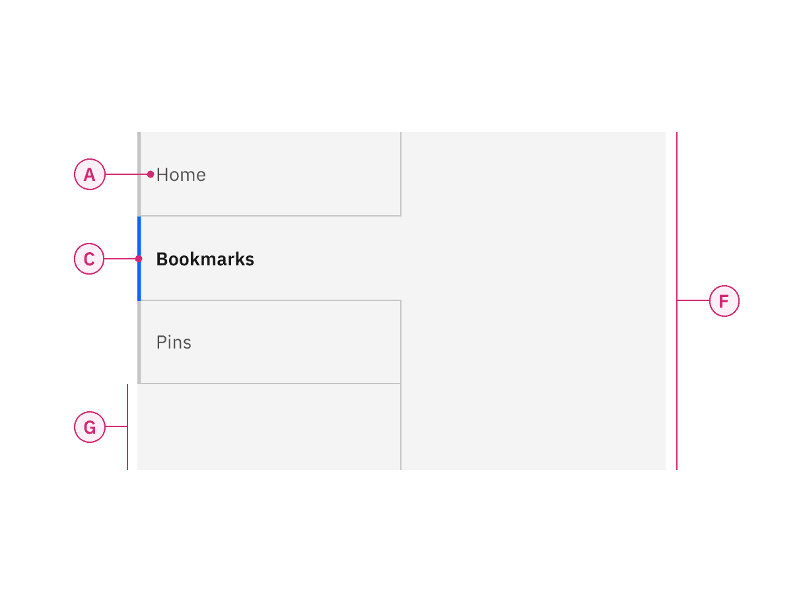

</Column>
</Row>

#### Vertical tabs

A. Label   C. Indicator   F. Tab panel   G. Tablist extended
background

### Alignment

Tabs can have two kinds of width alignment: **auto-width** or **grid aware**
width. Contained tabs can use either of these alignments, but line tabs must
always use the auto-width alignment.

#### Auto-width alignment

Auto-width alignment is the default behavior for both line tabs and contained
tabs. Each tab will be a different size depending on the label's character count
but will have consistent padding on each side of the label. The first label,
selected by default, should align to the grid. Where the tabs end will vary and
may not end on the grid.

<Row>
<Column colLg={12}>

</Column>
</Row>

<Caption>Example of line tabs using auto-width alignment</Caption>

#### Grid aware width alignment

Instead of using the default auto-width alignment behavior, contained tabs can
have grid aware alignment. The tabs span a set of columns as a group, with each
tab equal in width. The first tab’s label should align with the first column you
are using, with the last tab in the group always ending at a column’s edge. The
tabs in between will flow accordingly and may or may not align with the grid,
but they will always be the same width size.

Use the
[2x grid](https://carbondesignsystem.com/elements/2x-grid/overview/#2x-grid-fundamentals)
to drive visual rhythm by spacing content in multiples of two columns and
aligning the beginning and ending of the tab elements with content below the
tabs when possible. Depending on breakpoints, vertical tabs align to grid
columns spanning 4 or 2 columns of the 16-column grid and connect to a tab panel
that can be 8 or 12 columns wide. See
[vertical tabs](https://carbondesignsystem.com/components/tabs/usage/#vertical-tabs)
for more information on breakpoints and responsiveness.

Use grid aware contained tabs when:

- When there are four tabs or less
- When the tablist can fit on the 2x grid easily without crowding labels
- Labels are short and concise
- When other elements on the page can align to the tablist

<Row>
<Column colLg={12}>

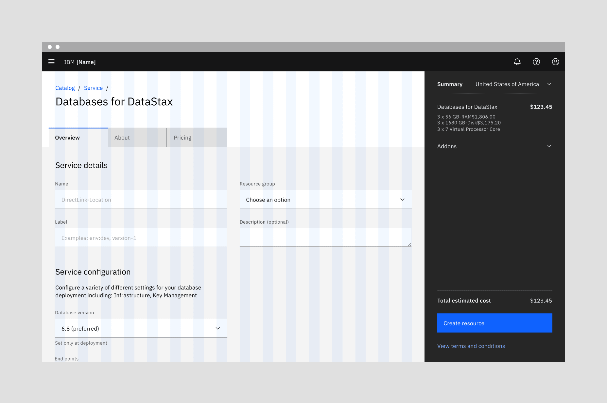

</Column>
</Row>

<Caption>Example of contained tabs using grid aware alignment</Caption>

#### Alignment with tab labels

Much like
[buttons](https://www.carbondesignsystem.com/components/button/usage/#alignment),
alignment of tabs depends on where they appear and whether or not they're
contained within another component. As a general rule, the first label for both
line tabs and contained tabs align with the grid and the text below. If tabs are
within another component, such as a card, follow the grid that you are using
inside the component and align the label with text in the component. Vertical
tab labels also align with the grid, so all labels in a tablist will align on
the same grid column.

<DoDontRow>
  <DoDont type="do" caption="Do align tab labels with the grid">

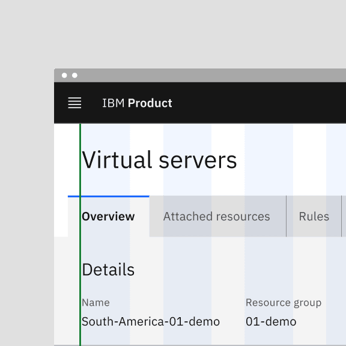

  </DoDont>
  <DoDont type="dont" caption="Do not align tab container with the grid">

  </DoDont>
</DoDontRow>

#### Alignment within a component

When using line tabs within a component (like a modal), the first label should
always align to the other content in the space. Do not use contained tabs. The
edges of the line tab may also bleed to the edges of the space if needed
depending on the container's margins. A trailing rule may be added from the end
of the last tab to the edge of the content area to add hierarchical clarity and
balance the tabs with the other content.

<Row>
<Column colLg={8}>

</Column>
</Row>

<Caption>Aligning tabs within a component</Caption>

## Content

### Main elements

#### Labels

- Use short tab labels that are clear and specific. Labels should be one to two
  words, as these are easier to scan. Vertical tabs allow for more characters
  within a tab, but stay as concise as possible to avoid truncation and allow
  space for labels in various languages.
- Text labels should clearly communicate the view users will see and the content
  contained in the view.

#### Secondary labels

- Contained tabs can have secondary labels to add clarity or assist the user in
  choosing the right selection.

### Overflow content

Line and tab labels do not need truncation since these types of tabs allow for
horizontal scrolling. The tabs themselves can grow and shrink accordingly.
However, when a label is too long within a vertical tab, the label overflows to
two lines and then truncates with an ellipsis. By mouse, the full title is
disclosed in a browser tooltip on hover. By keyboard, the full title is
disclosed on focus in a tooltip.

<Row>
<Column colLg={8}>

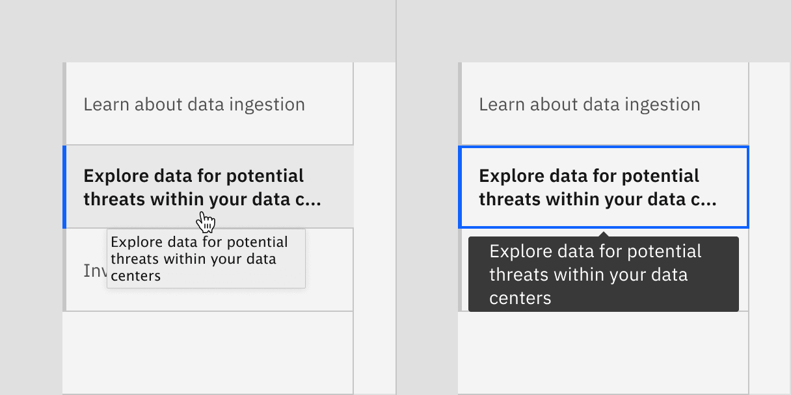

</Column>
</Row>

<Caption>
  On hover, full title is disclosed in a browser tooltip (left) and on focus,
  full title is disclosed in Carbon tooltip (right)
</Caption>

### Further guidance

For further content guidance, see Carbon's
[content guidelines](/guidelines/content/overview).

## Universal behaviors

### States

Tabs have two main states—**selected** and **unselected**. Other interactive
states are **hover, focus,** and **disabled**. The default view is one tab is
preselected and is usually the first tab. Only one tab can be selected at a
time. When a user chooses a new item, the previous tab is automatically
deselected. If a user navigates away from a tab, it remains the selected tab
until altered by the user.

For detailed visual information about the various states for this component, see
the [Style tab](https://carbondesignsystem.com/components/tabs/style).

| State      | When to use                                                                                                                                                                                                                                              |
| ---------- | -------------------------------------------------------------------------------------------------------------------------------------------------------------------------------------------------------------------------------------------------------- |
| Selected   | When a user clicks or uses the arrows keys to activate the tab.                                                                                                                                                                                          |
| Unselected | When the user navigates to another tab and the tab is inactive.                                                                                                                                                                                          |
| Hover      | When a user is hovering over the tab with the mouse cursor to interact with it.                                                                                                                                                                          |
| Focus      | When a user clicks on the tab or navigates using the keyboard with left and right arrows, it becomes focused, indicating the user has successfully navigated to the component.                                                                           |
| Disabled   | When a user is not allowed to interact with the tab due to either permissions, dependencies, or pre-requisites. The disabled state completely removes the interactive function from a component. The styling is not subject to WCAG contrast compliance. |

### Scrollable

When your page requires more tabs that can fit or needs to adapt to a new
browser size, line and contained tabs should become scrollable. Left and right
arrows appear to help navigate the user through tabs that might be off-page.

<Row>
<Column colLg={8}>

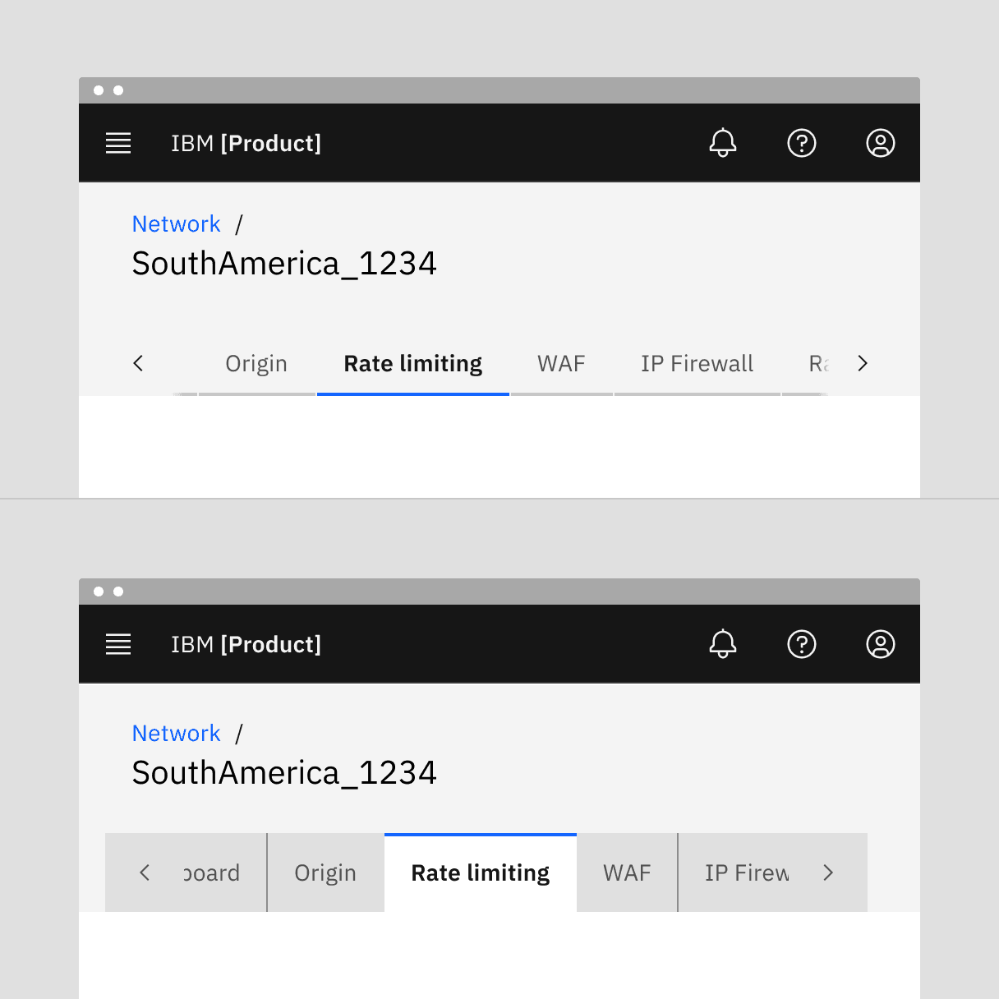

</Column>
</Row>

<Caption>
  Example of scrolling in line tabs (top) and contained tabs (bottom)
</Caption>

### Interactions

#### Mouse

Users can trigger a state change by clicking anywhere in the container area.

#### Keyboard

One tab should be selected by default. Users can navigate between tabs by
pressing right or left arrow keys. For additional keyboard interactions, see the
[Accessibility tab](https://carbondesignsystem.com/components/tabs/accessibility).

#### Automatic and manual

Automatic and manual tablists differ in how the tab items are activated.

For automatic tablists, focus and selection are synchronized. When the user
arrows to a tab, it becomes selected, and the tab panel under the tab updates
automatically. Use automatic tabs when tab panel content can load quickly,
allowing for users to scan quickly through information to make a decision
without latency.

Manual tablists allow the user to arrow between the tab items without updating
the tab panel underneath. When the user navigates using arrows, the selected tab
remains selected while focus moves to the next tab. In order to select the
focused tab (and update the tabpanel under the tab), the user would press
`Enter` or `Space`. Use manual tabs when information in the tab panel will take
a longer time to load. This will allow a keyboard user or screen reader to
navigate through the tablist without having to wait for content to load. Learn
more about automatic verses manual tablists in the
[Keyboard interactions](https://carbondesignsystem.com/components/tabs/accessibility#keyboard-interactions)
section of the accessibility tab.

For additional information, see the
[Accessibility tab](https://carbondesignsystem.com/components/tabs/accessibility).

### Responsive behavior

In responsive situations, horizontal tabs should not wrap to multiple lines or
stack on top of each other; instead, they should scroll horizontally. Vertical
tabs do not scroll horizontally because of their vertical persistent structure
and always stack.

#### Breakpoints

When using tabs that have grid aware width alignment, they should follow these
responsive rules:

- Max, XLG, and LG breakpoints: Use eight grid aware tabs or less.
- MD and SM breakpoints: Grid aware tabs will automatically change to auto-width
  alignment to reduce extra space on smaller screens.

## Line tabs

A line tab is standalone tab that can also be nested within components. Although
it is commonly used within components, such as a modal or header, line tabs can
also be used for large content areas using the entire page for layout, not
connected to any other components. Line tabs are highly flexible and can be
placed on background or layer tokens, making it easy to use in many different
scenarios. To help define the tab panel, which is the content area below the
selected tab, a line can be used that extends from the tablist to the end of the
panel. This is currently not part of the Carbon line tabs component and must be
added by teams if desired.

<Row>
<Column colLg={12}>

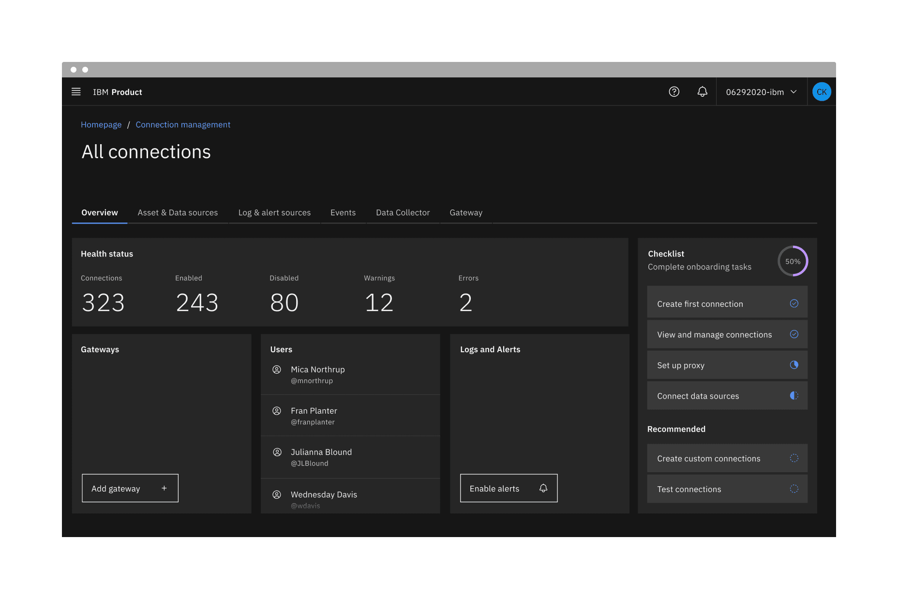

</Column>
</Row>

## Contained tabs

Contained tabs are an emphasized tab commonly used for defined content areas
like sub-pages. Contained tabs are always attached to a tab panel (background
container) that uses the same layer token as the selected tab. Since the
contained tabs are on layers, the tab content tends to stand out against the
background and maintain a high visual hierarchy while line tabs tend to blend
into content more easily. Because of the layering model, be mindful of the
layers used within the tabs so the content does not get too visually
complicated, especially within smaller areas.

<Row>
<Column colLg={12}>

</Column>
</Row>

## Vertical tabs

Vertical tabs are left and vertically-aligned tabs that allow a user to scan
through information from top to bottom. This vertical orientation is good for
quickly browsing and accessing information, such as a
[get started](https://pages.github.ibm.com/cdai-design/pal/patterns/onboarding/orientation/usage#get-started)
pattern. Do not use vertical tabs in place of
[navigation](https://carbondesignsystem.com/components/UI-shell-left-panel/usage/).

The tab panel should stay the same height as tabs switch so content outside the
tabs stays in a consistent place. The vertical tablist and panel height should
be determined by the tab that has the most content. To avoid excessive scrolling
within the tab panel, do not overload it with too much content. If more space is
needed than the tab panel allows, consider using line or contained tabs that
allow for full page layouts. Both the tablist and the tab panels are always on
the same layer. At extra large and large breakpoints, vertical tablist spans 4
columns of the 16-column grid. At the medium breakpoint, the vertical tablist
spans 2 columns. At the small breakpoint, the vertical tablist uses scrolling
contained tabs.

<Row>
<Column colLg={12}>

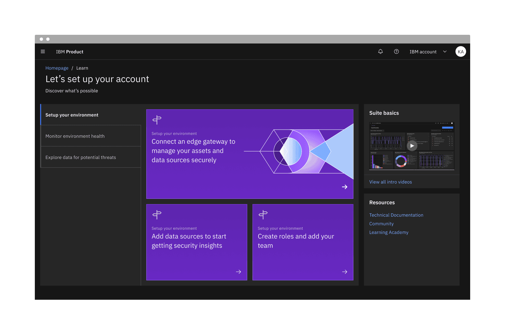

</Column>
</Row>

<Caption>Example of Vertical tabs in a get started pattern</Caption>

## Modifiers

### Tabs with icons

You may use icons in either line or contained tabs. Icons are always pinned to
the right of the tab and do not appear above, below, or to the left of the
label.

<Row>
<Column colLg={8}>

</Column>
</Row>

<Caption>Example of contained tabs with icons.</Caption>

### Icon-only tabs

You may use icon-only tabs with both line and contained tabs. Icons must be
easily recognized and globally accepted. These work best in small, defined
spaces and in components. Always use a tooltip for an icon description on hover
and focus to add clarity.

<Row>
<Column colLg={8}>

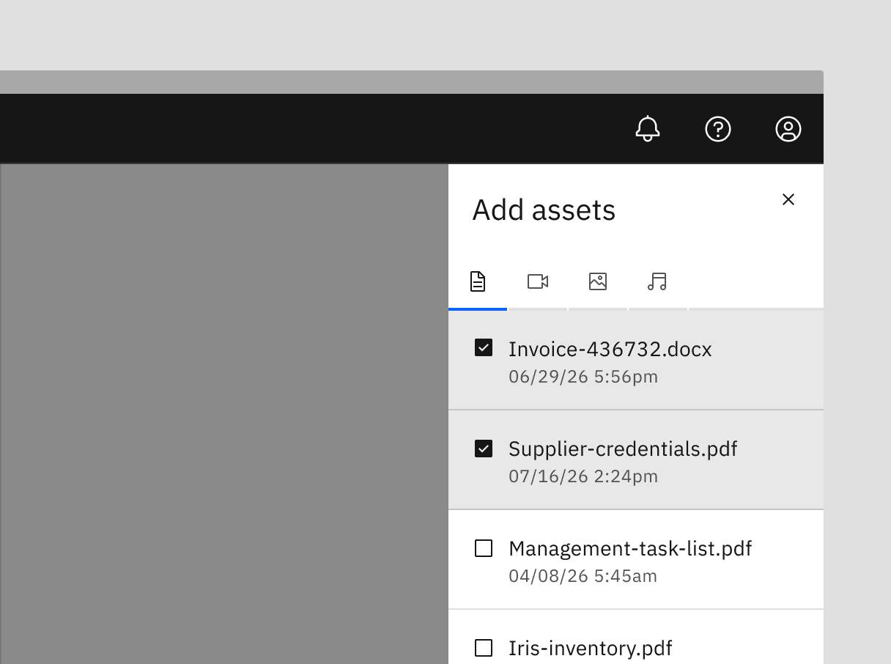

</Column>
</Row>

<Caption>Example of icon-only tabs within a side panel.</Caption>

### Secondary labels

Contained tabs that align with the grid allow for a secondary label. Do not use
secondary labels with line tabs, auto-width contained tabs, or vertical tabs.

<Row>
<Column colLg={8}>

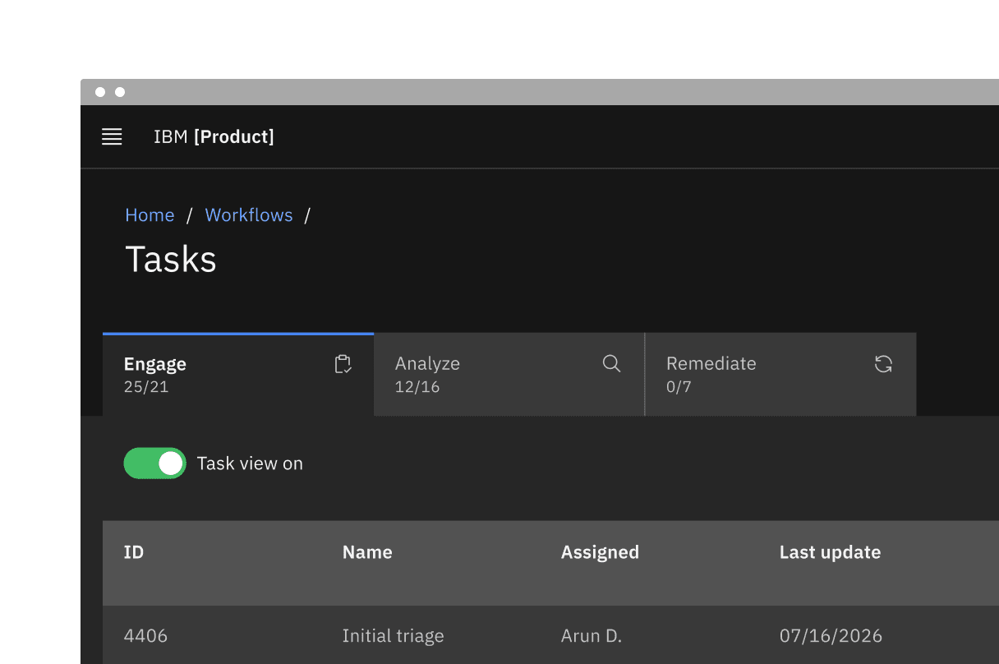

</Column>
</Row>

<Caption>Example of contained tabs with a secondary label and icon.</Caption>

### Dismissible tabs

Dismissible tabs allow users to close tabs providing a focused and relevant
experience. Users can add or remove contained or line tabs as needed,
accommodating future content additions or modifications without drastically
changing the overall layout or structure.

<Row>
<Column colLg={8}>

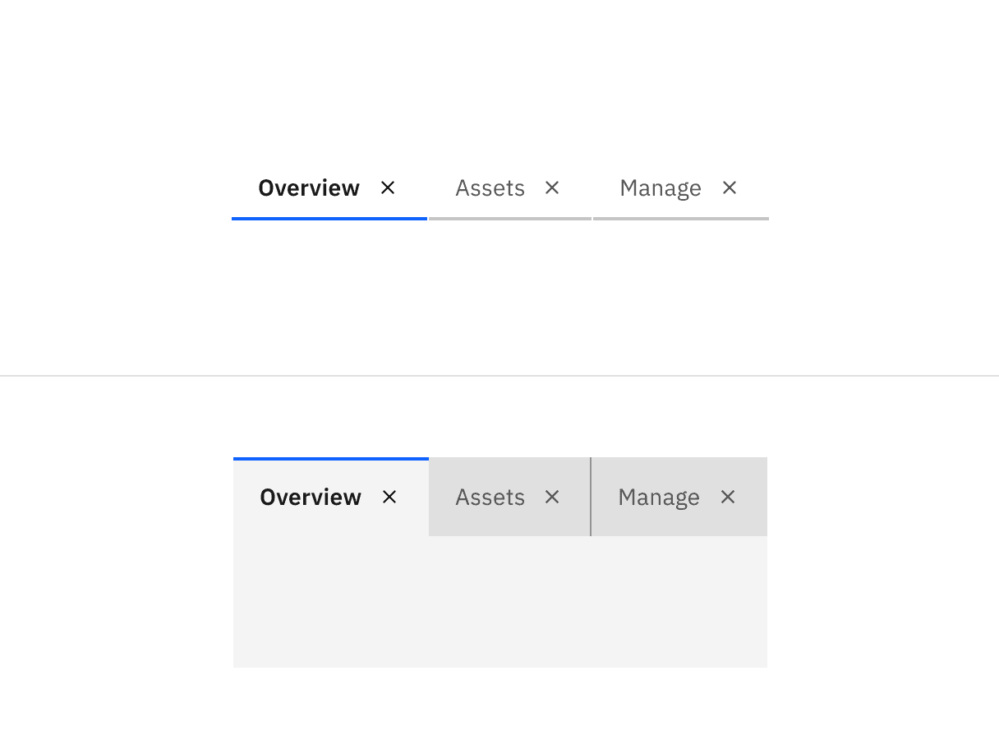

</Column>
</Row>

<Caption>
  Example of dismissible line tabs (top) and dismissible contained tabs (bottom)
</Caption>

#### When to use

- Use dismissible tabs to offer flexibility and scalability in complex
  interfaces that require users to create multiple sections or modules.
- Use dismissible tabs for content created or curated by the user.
- Use to focus a specific data set or search results.

#### When not to use

- Do not use when tabs contain frequently used or critical information.
- Do not use as navigation.

#### Dismissible tabs with icons

Carbon provides an option to include icons within the dismissible tabs. Only use
icons within dismissible tabs if all tabs will include icons. Do not mix
dismissible tabs without icons with dismissible tabs with icons.

#### Dismissing a tab

When dismissing a tab, an inline warning or modal may be used when information
contained in a tab will no longer be accessible or difficult to retrieve. Since
warnings, especially modals, are highly disruptive, only use when the dismissal
causes errors, unintentional deletions, or unsaved changes.

#### Triggering a new tab

There are various ways to trigger a new tab. The trigger button can visually
change its shape and size depending on the use case. Keep the trigger close
enough to the new tab to associate the add action with the new tab item. The
order of tabs can be ascending or descending depending on use case but do keep
them in a sequential, logical order.

If all tabs are dismissible, make sure a user understands how to trigger new
tabs once the tabs are gone. Provide visual cues, such as a container or
placeholder tab, so the user clearly understands that the trigger button is
creating a new tab in a place they expect.

<Row>
<Column colLg={8}>

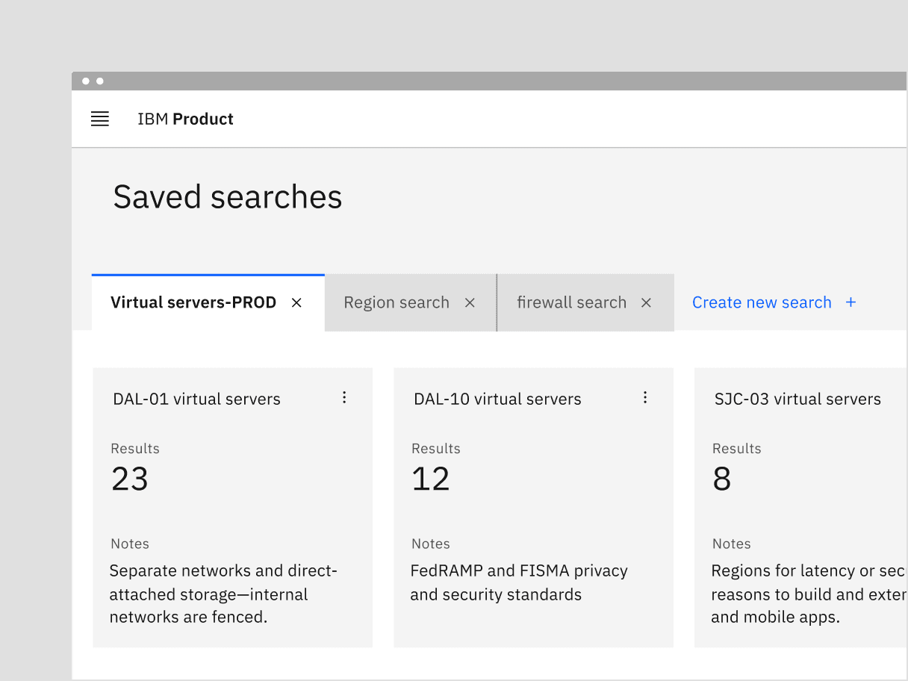

</Column>
</Row>

<Caption>
  Example of dismissible tabs within a UI utilizing a button to add a tab
</Caption>

## Related

#### Content switcher versus tabs

[Content switchers](https://www.carbondesignsystem.com/components/content-switcher/usage/)
allow users to compare and toggle between alternate views of similar or related
content. Content that is grouped into tabs is part of the same bigger context
but the content does not overlap.

#### Progress indicator versus tabs

[Progress indicator](https://www.carbondesignsystem.com/components/progress-indicator/usage/)
content moves in a logical progression, showing next steps to guide the user
through the completion of a task. Tabs organize content into groups that the
user can navigate through; they do not support progressive tasks.

## References

Jakob Nielson,
[Tabs, Used Right](https://www.nngroup.com/articles/tabs-used-right/) (Nielsen
Norman Group, 2016)

## Feedback

Help us improve this component by providing feedback, asking questions, and
leaving any other comments on
[GitHub](https://github.com/carbon-design-system/carbon-website/issues/new?assignees=&labels=feedback&template=feedback.md).
