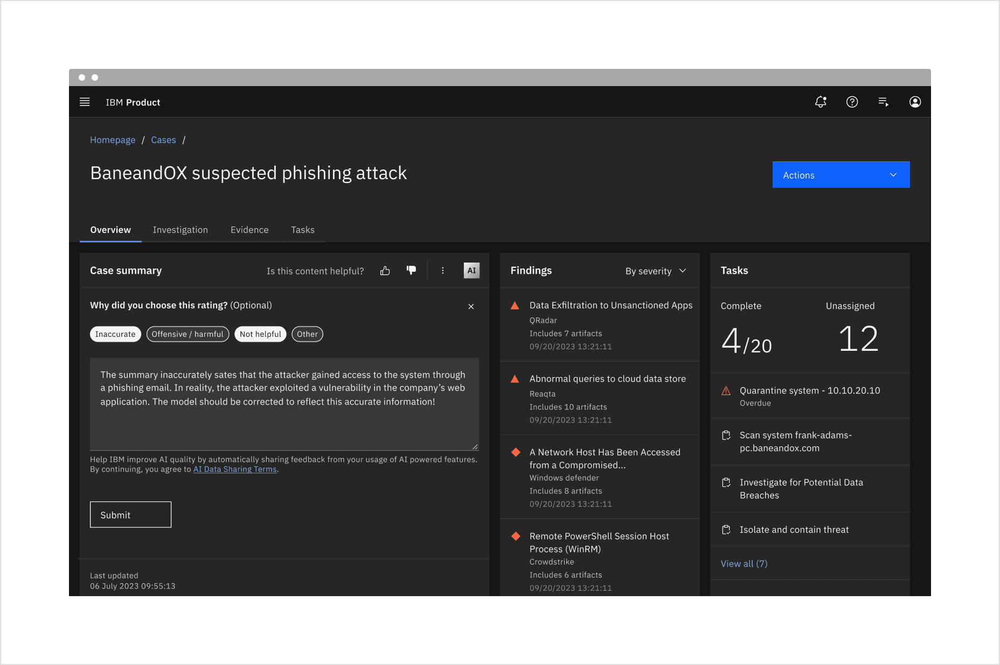

<PageDescription>

Use tabs to allow users to navigate easily between views within the same
context.

</PageDescription>

<AnchorLinks>

<AnchorLink>Overview</AnchorLink>
<AnchorLink>Live demo</AnchorLink>
<AnchorLink>Formatting</AnchorLink>
<AnchorLink>Variants</AnchorLink>
<AnchorLink>Feedback</AnchorLink>

</AnchorLinks>

## Overview

Tabs are used to quickly navigate between views within the same context.

<Row>
<Column colLg={8}>

</Column>
</Row>

## Live demo

<ComponentDemo
  components={[
    {
      id: 'tabs',
      label: 'Tabs',
    },
  ]}>
  <ComponentVariant
    id="tabs"
    knobs={{ Tabs: ['type'], Tab: ['disabled', 'selected'] }}
    links={{
      React: 'https://react.carbondesignsystem.com/?path=/story/tabs--default',
      Angular:
        'https://angular.carbondesignsystem.com/?path=/story/components-tabs--basic',
      Vue:
        'http://vue.carbondesignsystem.com/?path=/story/components-cvtabs--default',
      Vanilla: 'https://the-carbon-components.netlify.com/?nav=tabs',
    }}>{`

  <Tabs>
    <Tab
      href="#"
      id="tab-1"
      label="Tab label 1"
    >
      

        Content for first tab goes here.
      

    </Tab>
    <Tab
      href="#"
      id="tab-2"
      label="Tab label 2"
    >
      

        Content for second tab goes here.
      

    </Tab>
    <Tab
      href="#"
      id="tab-3"
      label='Tab label 3'
    >
      

        Content for third tab goes here.
      

    </Tab>
  </Tabs>

  `}</ComponentVariant>
</ComponentDemo>

## Formatting

#### Tab label

Each tab label describes the content contained within it. Labels are concise and
use no more than two words. Keep in mind that at mobile widths and during
translation, the character length of a label will impact the experience. Do not
use icons in tab labels.

#### Number of tabs

In most scenarios, you should use no more than six tabs. This maintains an
uncluttered UI and reduces cognitive load for users. If more than six tabs are
needed, consider other navigation patterns, such as a
[side-nav](/components/UI-shell-left-panel/usage).

#### Order

Tab order should be consistent across an experience. Tabs with related content
should be grouped adjacent to each other.

## Variants

There are two variations of tabs, default and container. They are hierarchically
the same and should never be nested within each other.

| Variant     | Purpose                                                                                                                                       |
| ----------- | --------------------------------------------------------------------------------------------------------------------------------------------- |
| _Default_   | A standalone tab that can also be nested within components. It is commonly used with smaller content areas.                                   |
| _Container_ | An emphasized tab that is always paired with an attached background container. It is commonly used for larger content areas, like sub-pages.  |

<Row>
<Column colLg={8}>

</Column>
</Row>

<Caption>Left: container tab. Right: default tab .</Caption>

## Feedback

Help us improve this component by providing feedback, asking questions, and
leaving any other comments on
[GitHub](https://github.com/carbon-design-system/carbon-website/issues/new?assignees=&labels=feedback&template=feedback.md).
