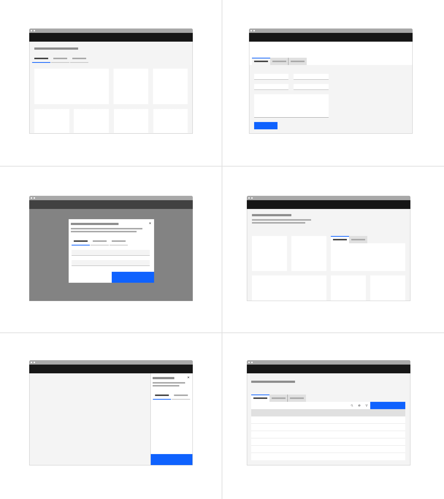

<PageDescription>

Tabs are used to organize related content. They allow the user to navigate
between groups of information that appear within the same context.

</PageDescription>

<AnchorLinks>

<AnchorLink>Overview</AnchorLink>
<AnchorLink>Live demo</AnchorLink>
<AnchorLink>Formatting</AnchorLink>
<AnchorLink>Content</AnchorLink>
<AnchorLink>Behaviors</AnchorLink>
<AnchorLink>Related</AnchorLink>
<AnchorLink>References</AnchorLink>
<AnchorLink>Feedback</AnchorLink>

</AnchorLinks>

## Overview

Tabs are used to group different but related content, allowing users to navigate
views without leaving the page. They always contain at least two items and one
tab is active at a time. Tabs can be used on full page layouts or in components
such as modals, cards, or side panels.

<Row>
<Column colLg={12}>

</Column>
</Row>

### When to use

- Use tabs to group related information into different categories, helping to
  reduce cognitive load.
- Tabs can be used to organize content such as forms, settings, and dashboards
  so a user does not have to navigate away from their workflow to complete their
  task.

      <Row>

  <Column colLg={8}>

</Column>
</Row>

## When not to use

- Tabs should never be used for primary navigation. If tabs become too complex,
  consider using a standard navigation pattern.
- Tabs should not be used to indicate progress. Use the progress indicator
  instead.
- Tabs should not be used if the user is comparing information in two groups, as
  this would result in the user having to click back and forth to complete a
  task.

## Live demo

<ComponentDemo
  components={[
    {
      id: 'tabs',
      label: 'Tabs',
    },
  ]}>
  <ComponentVariant
    id="tabs"
    knobs={{ Tabs: ['type'], Tab: ['disabled', 'selected'] }}
    links={{
      React:
        'https://react.carbondesignsystem.com/?path=/story/components-tabs--default',
      Angular:
        'https://angular.carbondesignsystem.com/?path=/story/components-tabs--basic',
      Vue:
        'http://vue.carbondesignsystem.com/?path=/story/components-cvtabs--default',
      Vanilla: 'https://the-carbon-components.netlify.com/?nav=tabs',
    }}>{`

  <Tabs scrollIntoView={false}>
    <Tab
      href="#"
      id="tab-1"
      label="Tab label 1"
    >
      

        Content for first tab goes here.
      

    </Tab>
    <Tab
      href="#"
      id="tab-2"
      label="Tab label 2"
    >
      

        Content for second tab goes here.
      

    </Tab>
    <Tab
      href="#"
      id="tab-3"
      label='Tab label 3'
    >
      

        Content for third tab goes here.
      

    </Tab>
  </Tabs>

  `}</ComponentVariant>
</ComponentDemo>

## Formatting

#### Tab label

Each tab label describes the content contained within it. Labels are concise and
use no more than two words. Keep in mind that at mobile widths and during
translation, the character length of a label will impact the experience. Do not
use icons in tab labels.

#### Number of tabs

In most scenarios, you should use no more than six tabs. This maintains an
uncluttered UI and reduces cognitive load for users. If more than six tabs are
needed, consider other navigation patterns, such as a
[side-nav](/components/UI-shell-left-panel/usage).

#### Order

Tab order should be consistent across an experience. Tabs with related content
should be grouped adjacent to each other.

## Variants

There are two variations of tabs, default and container. They are hierarchically
the same and should never be nested within each other.

| Variant     | Purpose                                                                                                                                       |
| ----------- | --------------------------------------------------------------------------------------------------------------------------------------------- |
| _Default_   | A standalone tab that can also be nested within components. It is commonly used with smaller content areas.                                   |
| _Container_ | An emphasized tab that is always paired with an attached background container. It is commonly used for larger content areas, like sub-pages.  |

<Row>
<Column colLg={8}>

</Column>
</Row>

<Caption>Left: container tab. Right: default tab .</Caption>

## Feedback

Help us improve this component by providing feedback, asking questions, and
leaving any other comments on
[GitHub](https://github.com/carbon-design-system/carbon-website/issues/new?assignees=&labels=feedback&template=feedback.md).
