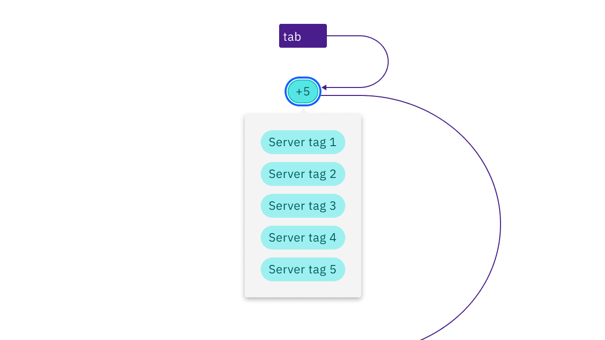

import A11yStatus from 'components/A11yStatus';

import {
  StructuredListWrapper,
  StructuredListHead,
  StructuredListBody,
  StructuredListRow,
  StructuredListInput,
  StructuredListCell,
  OrderedList,
  ListItem,
} from '@carbon/react';

<PageDescription>

No accessibility annotations are needed for tags, but keep these considerations
in mind if you are modifying Carbon or creating a custom component.

</PageDescription>

<AnchorLinks>
  <AnchorLink>What Carbon provides</AnchorLink>
  <AnchorLink>Development considerations</AnchorLink>
</AnchorLinks>

<A11yStatus layout="table" components="Tag" />

## What Carbon provides

Carbon bakes keyboard operation into its components, improving the experience of
blind users and others who operate via the keyboard. Carbon incorporates many
other accessibility considerations, some of which are described below.

### Keyboard interaction

Read-only tags are not in the tab order, are not interactive, and do not receive
focus.

Dismissible tags are in the tab order and receive focus around the close icon.
Pressing `Enter` or `Space` will dismiss the tag. Tabbing away from the tag will
move focus to the next element in the tab order.

<Row>
<Column colLg={8}>

</Column>
</Row>

Focus is shown around each selectable tag. Pressing `Enter` or `Space` toggles
the selection on and off.

<Row>
<Column colLg={8}>

</Column>
</Row>

Focus is shown around each operational tag. Pressing `Enter` or `Space` will
disclose additional related tags.

<Row>
<Column colLg={8}>

</Column>
</Row>

## Developer considerations

Keep this in mind if you’re modifying Carbon or creating a custom component.

- Do not add an `onClick` functionality to the dismissible tag, and only reserve
  interactions for the close icon in the tag.
- Do not nest buttons within the operational tag. Consider using the
  `as` prop to change an element tag to avoid nesting buttons.
