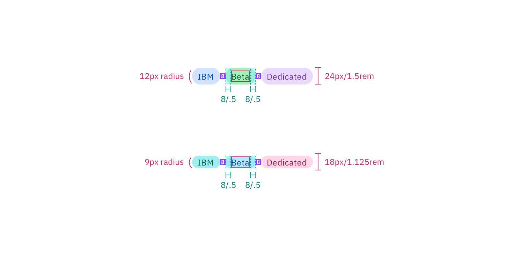

## Color

Tag uses component level tokens and values from the IBM Design Language
[color palette](https://www.ibm.com/design/language/elements/color). In the
light themes tags use color step 20 for the background and step 70 for the text.
In the dark themes, tags use color step 70 for the background and step 20 for
the text. For the list of token values, see
[Carbon repo](https://github.com/carbon-design-system/carbon/blob/next/packages/components/src/components/tag/_tokens.scss).

| Tag color     | Color token                 |
| ------------- | --------------------------- |
| Default       | `$tag-background-gray`      |
|               | `$tag-color-gray`           |
|               | `$tag-hover-gray`           |
| Red           | `$tag-background-red`       |
|               | `$tag-color-red`            |
|               | `$tag-hover-red`            |
| Magenta       | `$tag-background-magenta`   |
|               | `$tag-color-magenta`        |
|               | `$tag-hover-magenta`        |
| Purple        | `$tag-background-purple`    |
|               | `$tag-color-purple`         |
|               | `$tag-hover-purple`         |
| Blue          | `$tag-background-blue`      |
|               | `$tag-color-blue`           |
|               | `$tag-hover-blue`           |
| Cyan          | `$tag-background-cyan`      |
|               | `$tag-color-cyan`           |
|               | `$tag-hover-cyan`           |
| Teal          | `$tag-background-teal`      |
|               | `$tag-color-teal`           |
|               | `$tag-hover-teal`           |
| Green         | `$tag-background-green`     |
|               | `$tag-color-green`          |
|               | `$tag-hover-green`          |
| Gray          | `$tag-background-gray`      |
|               | `$tag-color-gray`           |
|               | `$tag-hover-gray`           |
| Cool gray     | `$tag-background-cool-gray` |
|               | `$tag-color-cool-gray`      |
|               | `$tag-hover-cool-gray`      |
| Warm gray     | `$tag-background-warm-gray` |
|               | `$tag-color-warm-gray`      |
|               | `$tag-hover-warm-gray`      |
| High contrast | `$background-inverse`       |
|               | `$text-inverse`             |

## Typography

Tag labels should be set in sentence case, and should only have one word.
However, if more than one is necessary, then connect the words using a hyphen
with no spaces.

| Element | Font-size (px/rem) | Font-weight   | Type token  |
| ------- | ------------------ | ------------- | ----------- |
| Label   | 12 / 0.75          | Regular / 400 | `$label-01` |

## Structure

All tags have the same height. However, the width of tags varies based on the
amount of content. All four corners of a tag are rounded with a 24px radius.

| Element   | Property                    | px / rem   | Spacing token |
| --------- | --------------------------- | ---------- | ------------- |
| Big tag   | height                      | 24 / 1.5   | –             |
|           | radius                      | 12px       | –             |
|           | margin                      | 8 / 0.5    | `$spacing-03` |
|           | padding-left, padding-right | 8 / 0.5    | `$spacing-03` |
| Small tag | height                      | 18 / 1.125 | –             |
|           | radius                      | 9px        | –             |
|           | margin                      | 8 / 0.5    | `$spacing-03` |
|           | padding-left, padding-right | 8 / 0.5    | `$spacing-03` |

<Caption>Structure and spacing measurements for a tag | px / rem</Caption>

## Sizes

| Size  | Height px / rem |
| ----- | --------------- |
| Small | 18px / 1.125    |
| Big   | 24 / 1.5        |

<Caption>Tag sizes | px / rem</Caption>
