<PageDescription>

The following page documents visual specifications such as color, typography,
structure, and size.

</PageDescription>

<AnchorLinks>

<AnchorLink>Color</AnchorLink>
<AnchorLink>Typography</AnchorLink>
<AnchorLink>Structure</AnchorLink>
<AnchorLink>Size</AnchorLink>
<AnchorLink>AI presence</AnchorLink>

</AnchorLinks>

## Color

Read-only, dismissible, and operational variants of tag use
[component tokens](https://carbondesignsystem.com/elements/color/tokens) with
values from the IBM Design Language
[color palette](https://www.ibm.com/design/language/color). Light themes use
step 70 for text and icons, step 40 for borders, and step 20 for backgrounds.
Dark themes use step 20 for text and icons, step 50 for borders, and step 70 for
backgrounds. The only exception where
[core tokens](https://carbondesignsystem.com/elements/color/overview/#core-tokens)
are used are in high contrast and outline styles.

The selectable tag variant only uses core tokens and does not use component
tokens.

| Variant         | Color         | Element    | Property         | Color token                                                                            |
| --------------- | ------------- | ---------- | ---------------- | -------------------------------------------------------------------------------------- |
| Read-only tag   | All colors    | Text       | text-color       | See all component [color tokens](https://carbondesignsystem.com/elements/color/tokens) |
|                 |               | Icon       | icon-color       | See all component [color tokens](https://carbondesignsystem.com/elements/color/tokens) |
|                 |               | Background | background-color | See all component [color tokens](https://carbondesignsystem.com/elements/color/tokens) |
|                 | High contrast | Text       | text-color       | `$text-inverse`                                                                        |
|                 |               | Icon       | icon-color       | `$icon-color`                                                                          |
|                 |               | Border     | border           | `$border-inverse`                                                                      |
|                 |               | Background | background-color | `$background-inverse`                                                                  |
|                 | Outline       | Text       | text-color       | `$text-primary`                                                                        |
|                 |               | Icon       | icon-color       | `$icon-primary`                                                                        |
|                 |               | Border     | border           | `$border-inverse`                                                                      |
|                 |               | Background | background-color | `$background`                                                                          |
| Dismissible tag | All colors    | Text       | text-color       | See all component [color tokens](https://carbondesignsystem.com/elements/color/tokens) |
|                 |               | Icon       | icon-color       | See all component [color tokens](https://carbondesignsystem.com/elements/color/tokens) |
|                 |               | Background | background-color | See all component [color tokens](https://carbondesignsystem.com/elements/color/tokens) |
|                 | High contrast | Text       | text-color       | `$text-inverse`                                                                        |
|                 |               | Icon       | icon-color       | `$icon-color`                                                                          |
|                 |               | Border     | border           | `$border-inverse`                                                                      |
|                 |               | Background | background-color | `$background-inverse`                                                                  |
|                 | Outline       | Text       | text-color       | `$text-primary`                                                                        |
|                 |               | Icon       | icon-color       | `$icon-primary`                                                                        |
|                 |               | Border     | border           | `$border-inverse`                                                                      |
|                 |               | Background | background-color | `$background`                                                                          |
| Operational tag | All colors    | Text       | text-color       | See all component [color tokens](https://carbondesignsystem.com/elements/color/tokens) |
|                 |               | Icon       | icon-color       | See all component [color tokens](https://carbondesignsystem.com/elements/color/tokens) |
|                 |               | Border     | border           | See all component [color tokens](https://carbondesignsystem.com/elements/color/tokens) |
|                 |               | Background | background-color | See all component [color tokens](https://carbondesignsystem.com/elements/color/tokens) |
| Selectable tag  |               | Text       | text-color       | `$text-primary`                                                                        |
|                 |               | Icon       | icon-color       | `$icon-primary`                                                                        |
|                 |               | Border     | border           | `$border-inverse`                                                                      |
|                 |               | Background | background-color | `$layer` \*                                                                            |

<Caption fullWidth>
  \* Denotes a contextual color token that will change values based on the layer
  it is placed on.
</Caption>

<Row>
<Column colLg={8}>

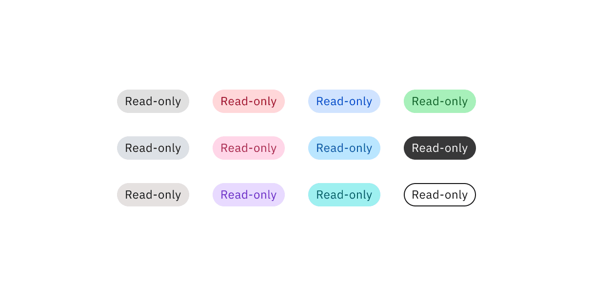

</Column>
</Row>

<Caption>Read-only tag colors</Caption>

<Row>
<Column colLg={8}>

</Column>
</Row>

<Caption>Dismissible tag colors</Caption>

<Row>
<Column colLg={8}>

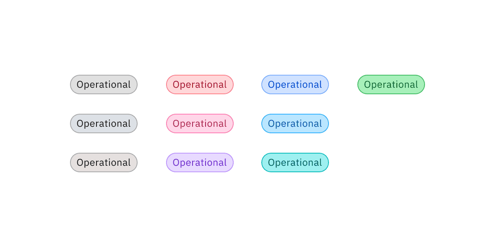

</Column>
</Row>

<Caption>Operational tag colors</Caption>

<Row>
<Column colLg={8}>

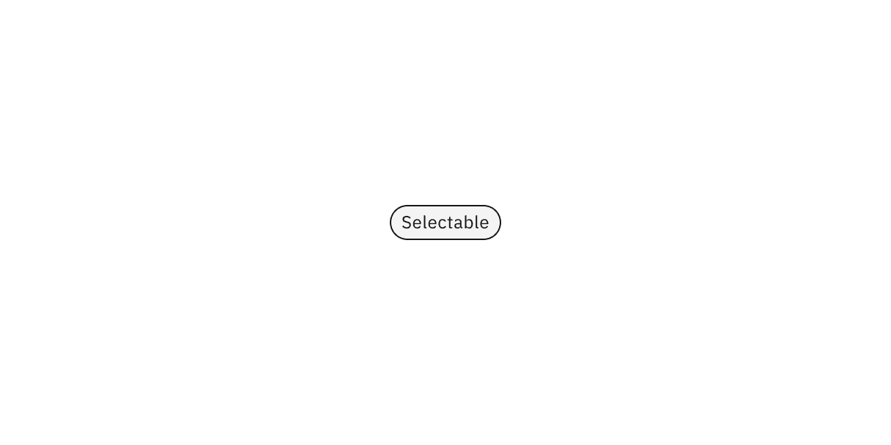

</Column>
</Row>

<Caption>Selectable tag color</Caption>

### Interactive state color

Read-only tag variants do not have interactive state colors because they do not
have interactive functionality.

Dismissible and operational tag variants use component tokens for hover states.
They use core tokens for focus and disabled states.

The selectable tag variant only uses core tokens and does not use component
tokens.

| Variant         | Color         | State    | Element    | Property         | Color token                                                                            |
| --------------- | ------------- | -------- | ---------- | ---------------- | -------------------------------------------------------------------------------------- |
| Dismissible tag | All colors    | Hover    | Background | background-color | See all component [color tokens](https://carbondesignsystem.com/elements/color/tokens) |
|                 |               | Focus    | Border     | border           | `$focus`                                                                               |
|                 |               | Disabled | Text       | text-color       | `$text-disabled`                                                                       |
|                 |               |          | Background | background-color | `$layer` \*                                                                            |
|                 | High contrast | Hover    | Background | background-color | `$background-hover`                                                                    |
|                 |               | Focus    | Border     | border           | `$focus`                                                                               |
|                 |               | Disabled | Text       | text-color       | `$text-disabled`                                                                       |
|                 |               |          | Background | background-color | `$layer` \*                                                                            |
|                 | Outline       | Hover    | Background | background-color | `$background-hover`                                                                    |
|                 |               | Focus    | Border     | border           | `$focus`                                                                               |
|                 |               | Disabled | Text       | text-color       | `$text-disabled`                                                                       |
|                 |               |          | Border     | border           | `$border-disabled`                                                                     |
|                 |               |          | Background | background-color | `$background-disabled`                                                                 |
| Operational tag | All colors    | Hover    | Background | background-color | See all component [color tokens](https://carbondesignsystem.com/elements/color/tokens) |
|                 |               | Focus    | Border     | border           | `$focus`                                                                               |
|                 |               | Disabled | Text       | text-color       | `$text-disabled`                                                                       |
|                 |               |          | Border     | border           | `$border-disabled`                                                                     |
|                 |               |          | Background | background-color | `$layer` \*                                                                            |
| Selectable tag  |               | Hover    | Background | background-color | `$layer-hover` \*                                                                      |
|                 |               | Focus    | Border     | border           | `$focus`                                                                               |
|                 |               | Selected | Text       | text-color       | `$text-inverse`                                                                        |
|                 |               |          | Background | background-color | `$background-inverse`                                                                  |
|                 |               | Disabled | Text       | text-color       | `$text-disabled`                                                                       |
|                 |               |          | Border     | border           | `$border-disabled`                                                                     |
|                 |               |          | Background | background-color | `$layer` \*                                                                            |

<Caption fullWidth>
  \* Denotes a contextual color token that will change values based on the layer
  it is placed on.
</Caption>

<Row>
<Column colLg={8}>

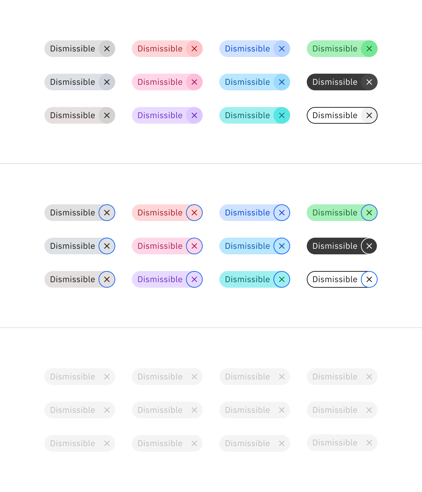

</Column>
</Row>

<Caption>Dismissible tag interactive colors</Caption>

<Row>
<Column colLg={8}>

</Column>
</Row>

<Caption>Operational tag interactive colors</Caption>

<Row>
<Column colLg={8}>

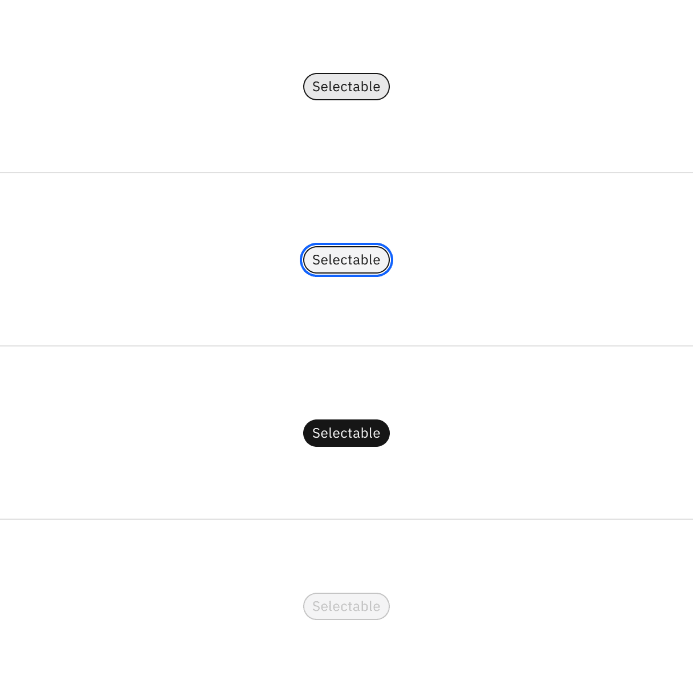

</Column>
</Row>

<Caption>Selectable tag interactive colors</Caption>

## Typography

Tag titles should be concise and describe the tag in a few words or be under 20
characters when possible. Only include long title content in tags when
necessary, for instance, for user-defined names or system-generated strings of
text.

| Element | Font size (px/rem) | Font weight   | Type token  |
| ------- | ------------------ | ------------- | ----------- |
| Title   | 12 / 0.75          | Regular / 400 | `$label-01` |

## Structure

There are three fixed heights of tags—large (32px), medium (24px), and small
(18px). However, the width of tags can vary based on the length of the title.

| Element            | Property                    | px / rem   | Spacing token |
| ------------------ | --------------------------- | ---------- | ------------- |
| Tag container (lg) | height                      | 32 / 2     | –             |
|                    | radius                      | 16px       | –             |
|                    | margin                      | 8 / 0.5    | `$spacing-03` |
|                    | padding-left, padding-right | 12 / 0.75  | `$spacing-04` |
| Tag icon (lg)      | padding-left (decorative)   | 8 / 0.5    | `$spacing-03` |
|                    | padding-right (decorative)  | 4 / 0.25   | `$spacing-02` |
|                    | padding-left (dismissible)  | 12 / 0.75  | `$spacing-04` |
|                    | padding-right (dismissible) | 8 / 0.5    | `$spacing-03` |
|                    | icon                        | 16px       | –             |
| Tag container (md) | height                      | 24 / 1.5   | –             |
|                    | radius                      | 16px       | –             |
|                    | margin                      | 8 / 0.5    | `$spacing-03` |
|                    | padding-left, padding-right | 8 / 0.5    | `$spacing-03` |
| Tag icon (md)      | padding-left (decorative)   | 4 / 0.25   | `$spacing-02` |
|                    | padding-right (decorative)  | 4 / 0.25   | `$spacing-02` |
|                    | padding-left (dismissible)  | 8 / 0.5    | `$spacing-03` |
|                    | padding-right (dismissible) | 4 / 0.25   | `$spacing-02` |
|                    | icon                        | 16px       | –             |
| Tag container (sm) | height                      | 18 / 1.125 | –             |
|                    | radius                      | 16px       | –             |
|                    | margin                      | 8 / 0.5    | `$spacing-03` |
|                    | padding-left, padding-right | 8 / 0.5    | `$spacing-03` |
| Tag icon (sm)      | padding-left (dismissible)  | 8 / 0.5    | `$spacing-03` |
|                    | padding-right (dismissible) | 1 / 0.0625 | –             |
|                    | icon                        | 16px       | –             |

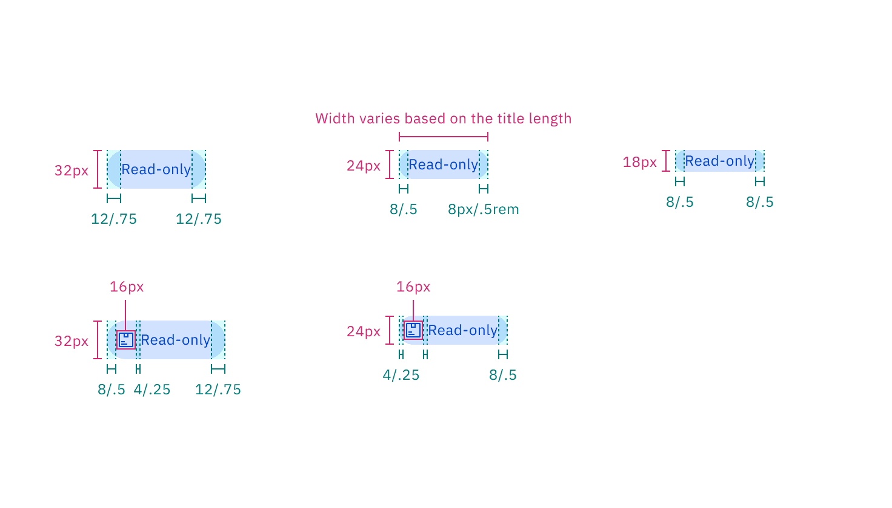

<Caption>
  Structure and spacing measurements of read-only tag | px / rem.
</Caption>

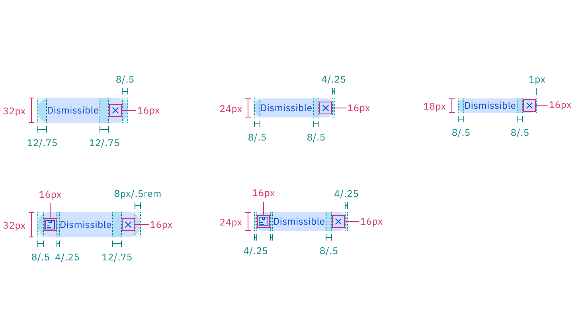

<Caption>
  Structure and spacing measurements of dismissible tag | px / rem.
</Caption>

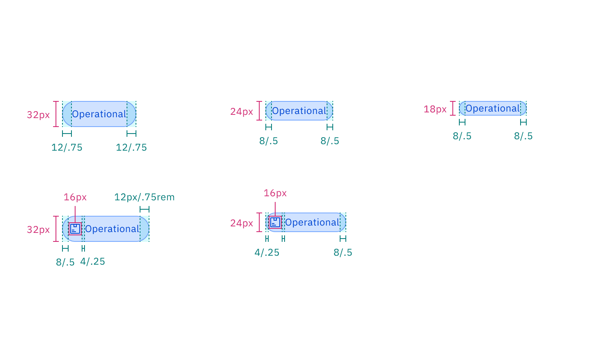

<Caption>
  Structure and spacing measurements of operational tag | px / rem.
</Caption>

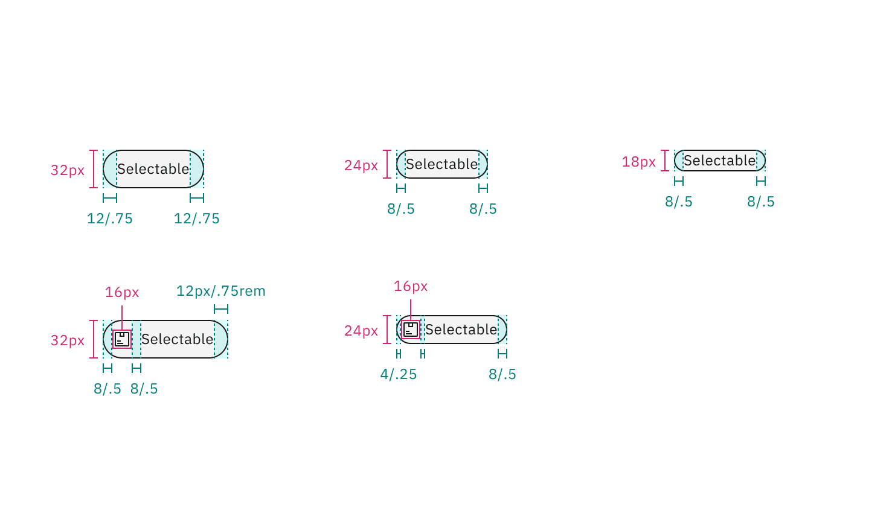

<Caption>
  Structure and spacing measurements of selectable tag | px / rem.
</Caption>

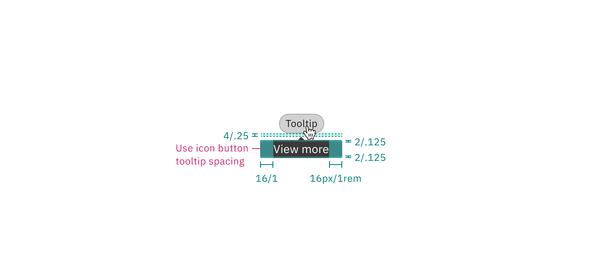

<Caption>
  Structure and spacing measurements of operational tag tooltip | px / rem.
</Caption>

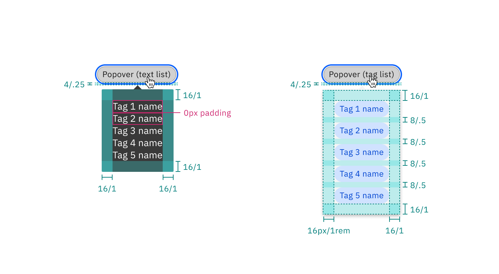

<Caption>
  Structure and spacing measurements of operational tag popover styles | px /
  rem.
</Caption>

## Size

There are three tag sizes — small, medium, and large.

| Element   | Size        | Height (px/rem) |
| --------- | ----------- | --------------- |
| Container | Small (sm)  | 18 / 1.125      |
|           | Medium (md) | 24 / 1.5        |
|           | Large (lg)  | 32 / 2          |

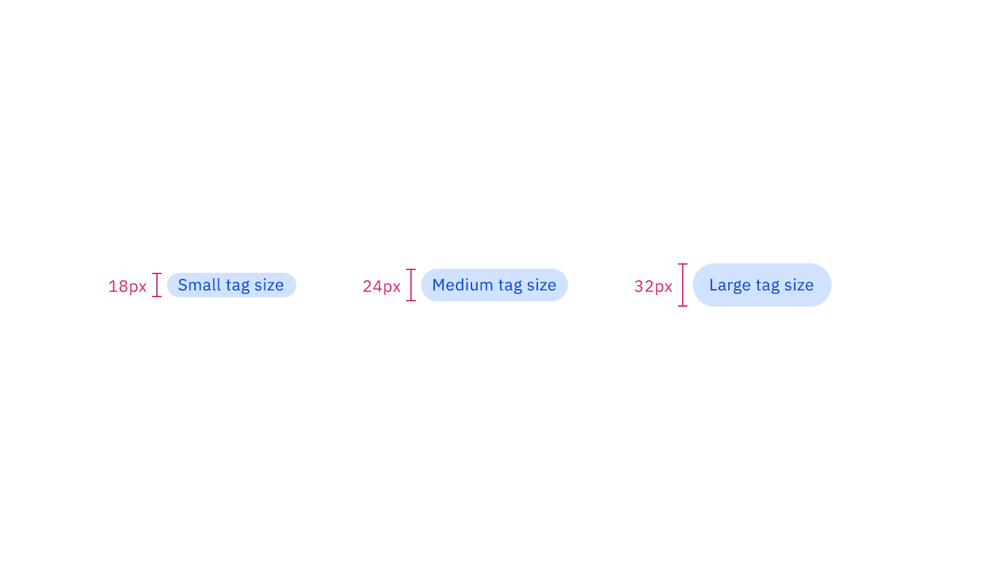

<Caption>Small, medium, and large sizes of tag</Caption>

## AI presence

The only style modification an AI variant of the tag has is the addition of the
AI label. All other tokens in the component including the same as the non-AI
variants. The color of the AI label should match the color of the tag text.

For more information on the AI style elements, see the
[Carbon for AI](/guidelines/carbon-for-ai/) guidelines.

| Element           | Property      | Value         | Spacing token |
| ----------------- | ------------- | ------------- | ------------- |
| AI label (inline) | size          | small         | –             |
|                   | padding-right | 4px / 0.25rem | `$spacing-02` |

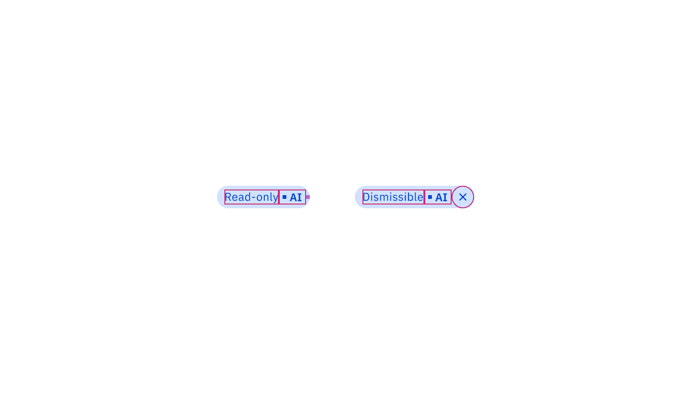

<Caption>Structure and spacing measurements of AI tags | px / rem.</Caption>
