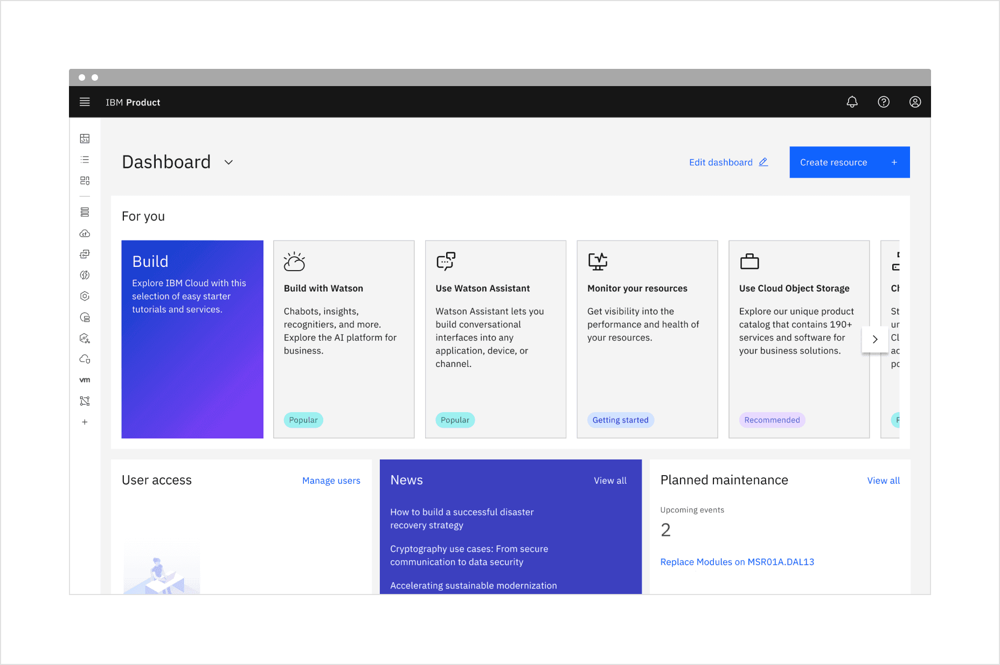
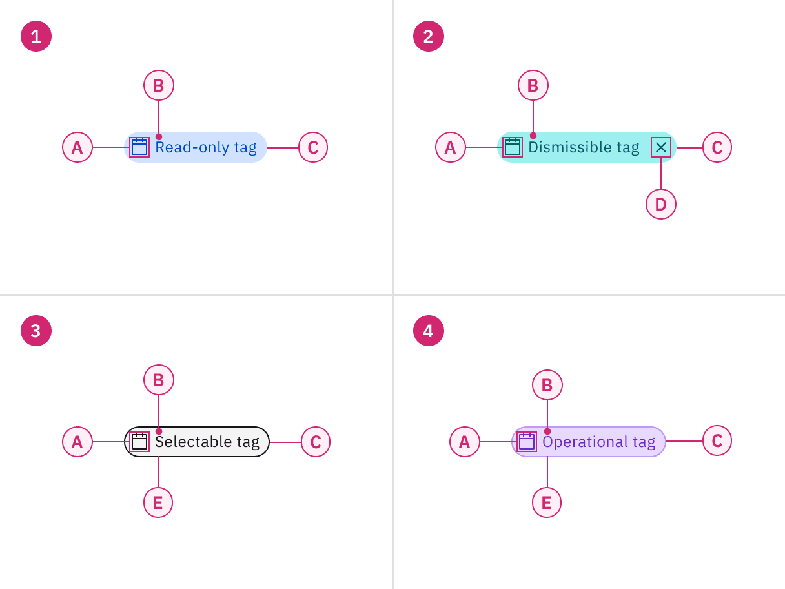
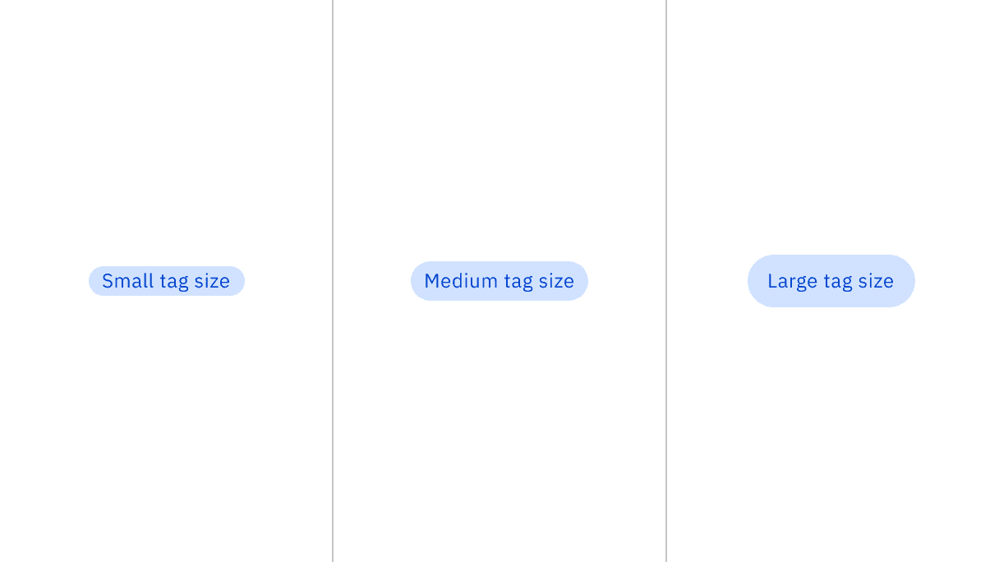
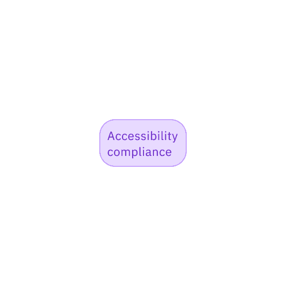
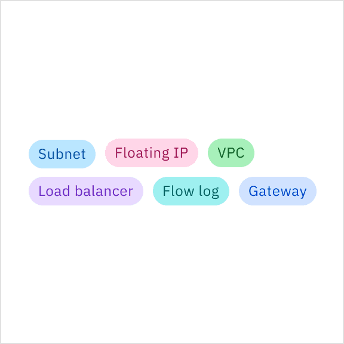
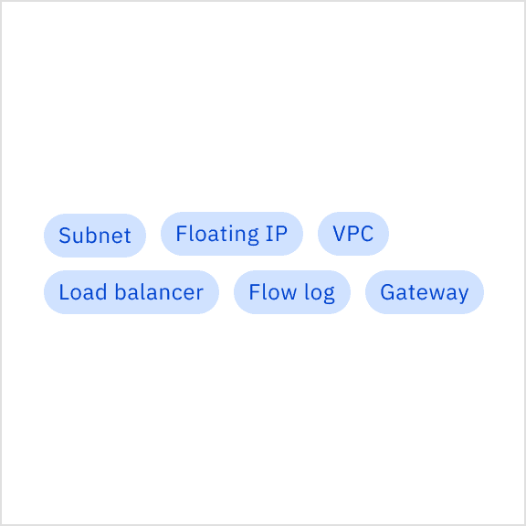
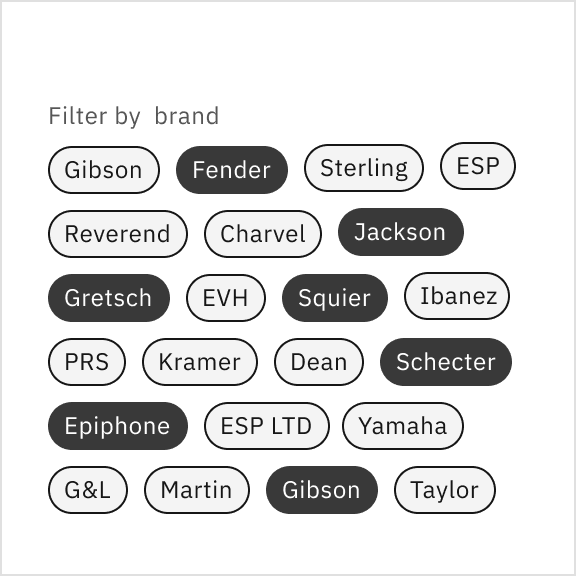
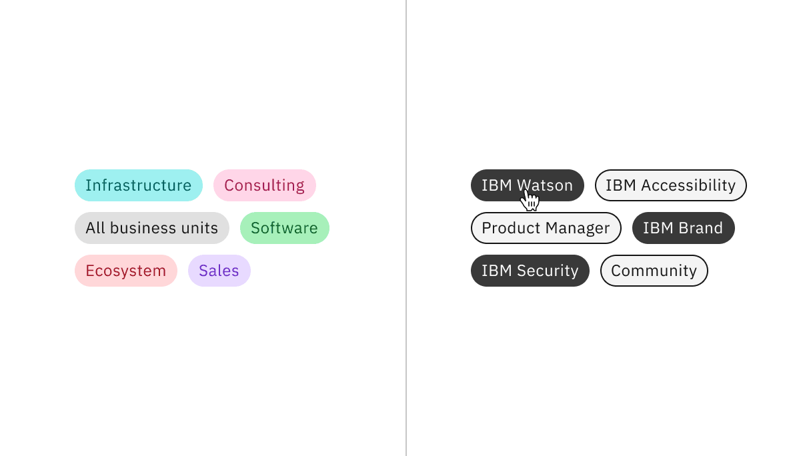
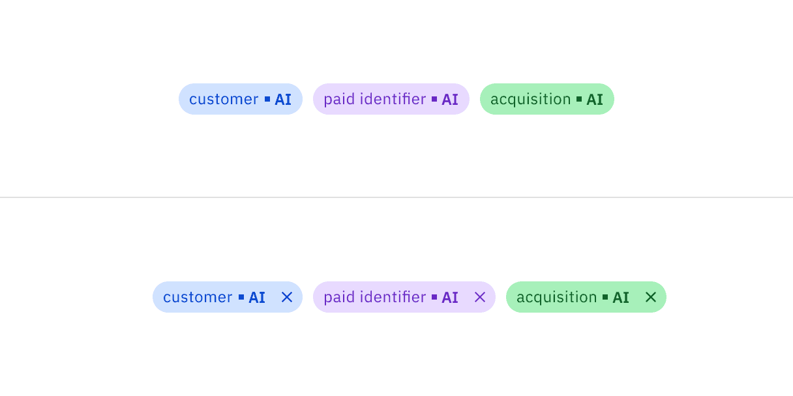

import A11yStatus from 'components/A11yStatus';

<PageDescription>

Use tags to label, categorize, or organize items using keywords that describe
them.

</PageDescription>

<InlineNotification>

[Tag with AI label](https://react.carbondesignsystem.com/?path=/story/components-tag--with-ai-label)
is now stable. This addition changes the visual appearance of the component and
introduces an AI explainability feature when AI is present in the component.

</InlineNotification>

<AnchorLinks>

<AnchorLink>Live demo</AnchorLink>
<AnchorLink>Overview</AnchorLink>
<AnchorLink>Formatting</AnchorLink>
<AnchorLink>Content</AnchorLink>
<AnchorLink>Behaviors</AnchorLink>
<AnchorLink>Read-only tag</AnchorLink>
<AnchorLink>Dismissible tag</AnchorLink>
<AnchorLink>Selectable tag</AnchorLink>
<AnchorLink>Operational tag</AnchorLink>
<AnchorLink>Modifiers</AnchorLink>
<AnchorLink>AI presence</AnchorLink>
<AnchorLink>References</AnchorLink>
<AnchorLink>Feedback</AnchorLink>

</AnchorLinks>

## Live demo

<StorybookDemo
  themeSelector
  url="https://react.carbondesignsystem.com"
  variants={[
    {
      label: 'Read-only',
      variant: 'components-tag--read-only',
    },
    {
      label: 'Dismissible',
      variant: 'components-tag--dismissible',
    },
    {
      label: 'Selectable',
      variant: 'components-tag--selectable',
    },
    {
      label: 'Operational',
      variant: 'components-tag--operational',
    },
    {
      label: 'with AI Label',
      variant: 'components-tag--with-ai-label',
    },
  ]}
/>

<A11yStatus layout="cards" components="Tag" />

## Overview

Tags are components that are often used to label different items, create
categorization, filter data, select or deselect options, and include
functionality to disclose several related tags in another view. To support these
different use cases, tags come in four variants—read-only, dismissible,
selectable, and operational.

<Row>
<Column colLg={12}>

</Column>
</Row>

<Caption>Tags being used in context of a product UI.</Caption>

### When to use

Use tags when content is mapped to multiple categories, and the user needs a way
to differentiate between them.

### When to use

- Use for categorizing, labeling, or read-only situations
- Use as a method of filtering data on a page, within a component, or in
  conjunction with search capabilities
- Use in a chat flow to make decisions and advance the chat
- Use for creating user-generated custom labeling and use when needing to remove
  created labels
- Use to view an overflow of multiple tags, like in a popover, modal, or detail
  view

### When not to use

- Do not use tags as links that direct you to an entirely different page or
  launch you from a current experience to a separate tab
- Avoid using tags with multiple functions to prevent confusion and reduce
  accidental clicks

### Variants

| Variant                             | Purpose                                                                                                                                                                                             |
| ----------------------------------- | --------------------------------------------------------------------------------------------------------------------------------------------------------------------------------------------------- |
| [Read-only tag](#read-only-tag)     | Tags that have no interactive functionality and are commonly used for categorizing and labeling.                                                                                                    |
| [Dismissible tag](#dismissible-tag) | Tags that can be dismissed, closed, or removed. These tags are typically used for filtering and creating user-generated content.                                                                    |
| [Selectable tag](#selectable-tag)   | Tags that can be selected or deselected and are frequently used as selections that filter data in the context of a page. They also can be used in chat flows to make decisions to advance the chat. |
| [Operational tag](#operational-tag) | When interacted with, these tags can disclose additional or overflow tags, like in a popover, modal, or breadcrumb detail view.                                                                     |

## Formatting

### Anatomy

Read-only, dismissible, selectable, and operational tags are all comprised of a
container, a text title, and the option to add a decorative icon. Dismissible
tags include an additional close icon to filter or dismiss a tag. Selectable and
Operational tags include a container border to indicate at a glance that these
variants have increased interactivity and function differently.

<Row>
<Column colLg={8}>

</Column>
</Row>

<Caption>
  Anatomy of read-only, dismissible, selectable, and operational tags.
</Caption>

<Row>
<Column colSm={2} colMd={4} colLg={4}>

#### 1. Read-only tag

A. Decorative icon (optional)   B. Title   C. Container  

#### 3. Selectable tag

A. Decorative icon (optional)   B. Title   C. Container   E.
Border  

</Column>
<Column colSm={2} colMd={4} colLg={4}>

#### 2. Dismissible tag

A. Decorative icon (optional)   B. Title   C. Container   D.
Close icon  

#### 4. Operational tag

A. Decorative icon (optional)   B. Title   C. Container   E.
Border  

</Column>
</Row>

### Sizing

There are three different tag sizes — small, medium, and large. Use small tags
in condensed or inline spaces. The medium tag size is the default size and is
most commonly used. Use large tags when they are used as a primary task of the
page or focal point, when you have more screen real estate at your disposal, or
if the tag lives near other components that are also 32px in height.

<Row>
<Column colLg={8}>

</Column>
</Row>

<Caption>Tags shown in small, medium, and large sizes.</Caption>

### Placement

Vertically align the tag’s container to the other components or text near it. Do
not hang tag containers into grid gutters to vertically align the tag’s titles
with other text on the page. When tags are placed in groups, it is recommended
to have 8px of space between them on the top, bottom, left, and right.

<Row>
<Column colLg={8}>

</Column>
</Row>

<Caption>
  Vertical alignment of a group of tags with other components and text.
</Caption>

## Content

### Main elements

#### Title

- Tag titles should be concise and informative.
- Tag titles should describe the tag in a few words or be under 20 characters
  when possible.
- Only include long title content in tags when necessary, for instance, when
  there are user-defined names of categories, system-generated strings of text,
  etc.

### Overflow content

When the tag's title is too long to fit within the available space of the tag
container, the title can be truncated with an ellipsis. By mouse, the full title
is disclosed in a browser tooltip on hover. By keyboard, the full title is
disclosed on focus in a tooltip. Truncation should be set at the title's start,
middle, or end, depending on what is best for the given use case.

<Row>
<Column colLg={8}>

</Column>
</Row>

<Caption>
  Truncated tag title disclosed in a tooltip on hover by mouse and on focus by
  keyboard.
</Caption>

Avoid having long tag titles wrap to multiple lines within the tag container.
This can construe the shape of the tag and integrity of a traditional tag shape,
which should be compact in form. It can also create misalignment with other tags
if they are placed within a group.

<DoDontRow>
  <DoDont type="do" caption="Do use a browser tooltip to show the full length of overflow tag title text.">

  </DoDont>
  <DoDont type="dont" caption="Do not wrap overflow tag title text to multiple lines.">

  </DoDont>
</DoDontRow>

### Further guidance

For further content guidance, see Carbon’s
[content guidelines](https://carbondesignsystem.com/guidelines/content/overview/).

## Behaviors

### States

The four tag variants have different states:

- **Read-only tags:** enabled, disabled, and skeleton
- **Dismissible tags** and **operational tags:** enabled, hover, focus, on
  click, disabled, and skeleton
- **Selectable tags:** enabled, hover, focus, selected, disabled, and skeleton

For more information on tag states, see the
[style tab](https://carbondesignsystem.com/components/tag/style).

| State      | When to use                                                                                                                                                                                                                                              |
| ---------- | -------------------------------------------------------------------------------------------------------------------------------------------------------------------------------------------------------------------------------------------------------- |
| _Enabled_  | When a tag is live but a user is not directly interacting with it. This is commonly referred to as the default or normal state of the component.                                                                                                         |
| _Hover_    | When a user is hovering over the tag with the mouse cursor to interact with it (except read-only tags).                                                                                                                                                  |
| _Focus_    | When a user presses tab or clicks on the tag, it becomes focused, indicating the user has successfully navigated to the component (except read-only tags).                                                                                               |
| _On click_ | When a user presses enters, space, or clicks on the tag to either dismiss it or disclose a list of additional tags.                                                                                                                                      |
| _Selected_ | When a user presses enter, space, or clicks on the tag to select it or deselect it.                                                                                                                                                                      |
| _Disabled_ | When a user is not allowed to interact with the tag due to either permissions, dependencies, or pre-requisites. The disabled state completely removes the interactive function from a component. The styling is not subject to WCAG contrast compliance. |

### Interactions

#### Mouse

Read-only tags: Do not get mouse functionality besides a mouse cursor on hover
and do not have interactive functionality.

Dismissible tags: Receive a mouse cursor when hovering over the title area of
the tag. When hovering over the close icon, the icon gets a background color
change and a mouse pointer. Once the close icon area is clicked, the tag will be
dismissed, closed, or removed.

Selectable tags: Receive a full background color change and mouse pointer on
hover. Clicking anywhere on the tag will put it in a selected state. Once in the
selected state, clicking anywhere on the tag again will deselect it.

Operational tags: Receive a background color change and mouse pointer on hover.
Clicking anywhere on the tag will disclose a way of viewing more related tags in
either a popover, modal, or breadcrumb view.

#### Keyboard

Read-only tags: Can not be operated by a keyboard and have no interactive
functionality.

Dismissible tags: Receive focus on the close icon area by pressing the `Tab`
key. Pressing the `Enter` or `Space` keys will dismiss, close, or remove the
tag.

Selectable tags: The container receives focus by pressing the `Tab` key.
Pressing the `Enter` or `Space` keys will select or deselect the tag. If
navigating in a group of tags, use the `Tab` key to move focus to different tags
in the group.

Operational tags: The container receives focus by pressing the `Tab` key.
Pressing the `Enter` or `Space` keys will disclose additional related tags, in a
popover, modal, or breadcrumb view.

### Clickable areas

Read-only tags are not clickable and can not be interacted with. Dismissible
tags have a clickable area around the close icon to dismiss or close the tag.
Selectable and operational tags containers are clickable to either select the
tag or view more tags.

<Row>
<Column colLg={8}>

</Column>
</Row>

<Caption>
  Read-only, dismissible, selectable, and operational tags with their clickable
  areas.
</Caption>

## Read-only tag

Read-only tags are used to categorize, are used for labeling, and do not have
interactive functionality. Read-only tags come in several color choices and can
use optional decorative icons to delineate between multiple categories.

<Row>
<Column colLg={12}>

</Column>
</Row>

<Caption>Read-only tags in the context of a product UI.</Caption>

If your design intends to use tags as labels or for categorization, use
modifiers like colors or icons to help indicate this differentiation.

<DoDontRow>
  <DoDont type="do" caption="Do use colors to help distinguish between different tag labels or categories for easier scanning.">

  </DoDont>
  <DoDont type="dont" caption="Do not use the same color for every tag if they are supposed to be used as labels or categories.">

  </DoDont>
</DoDontRow>

## Dismissible tag

Dismissible tags allow users to dismiss, close, or remove a tag. Dismissible
tags are commonly used with the search component to search or filter keywords on
a page or within sections of a page.

Dismissible tags can also be used as user-generated labels that are applied to
instances and can be removed later if needed. Do not use a dismissible tag if
the intention for it is to remain persistent at all times since they can be
closed or dismissed by the user.

<Row>
<Column colLg={12}>

</Column>
</Row>

<Caption>Dismissible tags in the context of a product UI.</Caption>

## Selectable tag

Selectable tags give users the ability to select or deselect them. They can be
used in a form containing only tags as the selection method, in a chat to make
decisions and forward the chat, and can be used as selections to filter content
on a page or within a component.

In some cases, selectable tags can be an alternative to traditional form
components when the entire form consistently uses tags as its form selection
style. Selectable tags can be used for multi-selection or single-selection use
cases. These tags should always remain in high contrast to ensure a noticeable
difference between selected and unselected tags.

<Row>
<Column colLg={12}>

</Column>
</Row>

<Caption>Selectable tags in the context of a product UI.</Caption>

When selectable tags are in groups, we recommend using horizontal alignment for
easier scanning when there are only a few tags. Keep groups of tags horizontally
on one line when there are six tags or less. Horizontal alignment is not
recommended when there are many tags to select from in a group. Tags should wrap
to form another line if there are too many to arrange horizontally on one line.
If the number of tags exceeds five lines of wrapping, consider using a different
component for your use case, like a
[multi-select dropdown](https://carbondesignsystem.com/components/dropdown/usage/#multiselect).

<DoDontRow>
  <DoDont type="do" caption="Do wrap tags in a group to a few multiple lines.">

  </DoDont>
  <DoDont type="dont" caption="Do not wrap tags in a group of more than five lines.">

  </DoDont>
</DoDontRow>

## Operational tag

Operational tags enable the user to see a more comprehensive view of all tags
disclosed in a popover, or breadcrumb detail view. Do not use tags as links that
direct you to an entirely different page or launch you from a current experience
to a separate tab.

<Row>
<Column colLg={12}>

</Column>
</Row>

<Caption>Operational tags in the context of a product UI.</Caption>

## Modifiers

### Decorative icons

Decorative icons lead before the tag title. Decorative icons are optional and
are often used to support the tag title visually. We recommend not using
decorative icons in the small tag size where there is compact spacing, which
could create possible visual tension between some icon shapes and tags with
borders.

<Row>
<Column colLg={8}>

</Column>
</Row>

<Caption>Tags with decorative icons.</Caption>

### Tag colors

Read-only, dismissible, and operational tags come in a variety of different
colors, with values from the IBM Design Language
[color palette](https://www.ibm.com/design/language/color) using
[component tokens](https://carbondesignsystem.com/elements/color/tokens). It is
recommended to use multiple colors to denote different categories or labels.
Selectable tags are unavailable in these colors; instead, they use
[core tokens](https://carbondesignsystem.com/elements/color/overview#core-tokens).

<Row>
<Column colLg={8}>

</Column>
</Row>

<Caption>
  Read-only using component color tokens and selectable tags using core color
  tokens.
</Caption>

## AI presence

Tag has a modification that embeds the AI label when AI is present in the
component. The AI variants function the same as the normal versions except with
the addition of the inline AI label which is both a visual indicator and the
trigger for the explainability popover. Read-only and dismissible tags are the
only tag variants that allow for the interactive AI label.

For more information on designing for AI, see the
[Carbon for AI](/guidelines/carbon-for-ai/) guidelines.

<Row>
<Column colLg={8}>

</Column>
</Row>

<Caption>Read-only AI tag (top), dismissible tag (bottom)</Caption>

## Feedback

Help us improve this component by providing feedback, asking questions, and
leaving any other comments on
[GitHub](https://github.com/carbon-design-system/carbon-website/issues/new?assignees=&labels=feedback&template=feedback.md).
