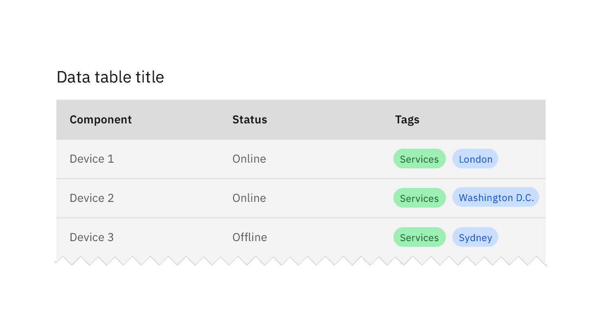

## General guidelines

_Tags_ are used for items that need to be labeled, categorized, or organized using keywords that describe them.

Multiple or single tags can be used to categorize items.

Use tags when content is mapped to multiple categories, and the user needs a way to differentiate between them.

<Row>
<Column colLg={8}>

</Column>
</Row>

Tags can also be used as a method of filtering data, to show only items within that particular category.

<Row>
<Column colLg={8}>

</Column>
</Row>
