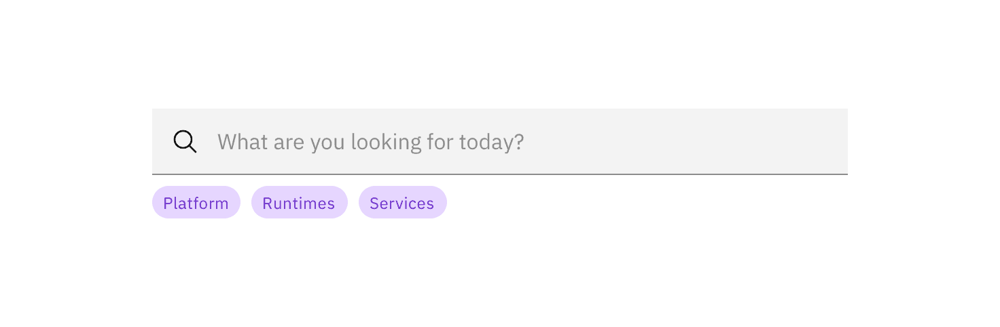

<PageDescription>

Use tags to label, categorize, or organize items using keywords that describe
them.

</PageDescription>

<AnchorLinks>

<AnchorLink>Overview</AnchorLink>
<AnchorLink>Live demo</AnchorLink>
<AnchorLink>Feedback</AnchorLink>

</AnchorLinks>

## Overview

Multiple or single tags can be used to categorize items.

Use short labels for easy scanning. Use two words only if necessary to describe
the status and differentiate it from other tags.

### When to use

Use tags when content is mapped to multiple categories, and the user needs a way
to differentiate between them.

<Row>
<Column colLg={8}>

</Column>
</Row>

Tags can also be used as a method of filtering data, to show only items within
that particular category.

<Row>
<Column colLg={8}>

</Column>
</Row>

## Live demo

<ComponentDemo
  components={[
    {
      id: 'tag',
      label: 'Tag',
    },
  ]}>
  <ComponentVariant
    id="tag"
    knobs={{ Tag: ['filter', 'disabled'] }}
    links={{
      React: 'https://react.carbondesignsystem.com/?path=/story/tag--default',
      Angular:
        'https://angular.carbondesignsystem.com/?path=/story/components-tag--basic',
      Vue:
        'http://vue.carbondesignsystem.com/?path=/story/components-cvtag--filter',
      Vanilla: 'https://the-carbon-components.netlify.com/?nav=tag',
    }}>{`
  <>
<Tag type="red" title="Clear Filter"> Red </Tag>
<Tag type="magenta" title="Clear Filter"> Magenta </Tag>
<Tag type="purple" title="Clear Filter"> Purple </Tag>
<Tag type="blue" title="Clear Filter"> Blue </Tag>
<Tag type="cyan" title="Clear Filter"> Cyan </Tag>
<Tag type="teal" title="Clear Filter"> Teal </Tag>
<Tag type="green" title="Clear Filter"> Green </Tag>
<Tag type="gray" title="Clear Filter"> Gray </Tag>
<Tag type="cool-gray" title="Clear Filter"> Cool gray </Tag>
<Tag type="warm-gray" title="Clear Filter"> Warm gray </Tag>
</>
  `}</ComponentVariant>
</ComponentDemo>

## Feedback

Help us improve this component by providing feedback, asking questions, and
leaving any other comments on
[GitHub](https://github.com/carbon-design-system/carbon-website/issues/new?assignees=&labels=feedback&template=feedback.md).
