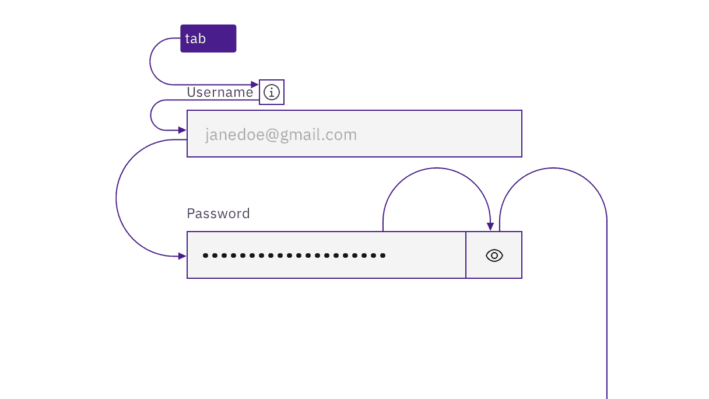
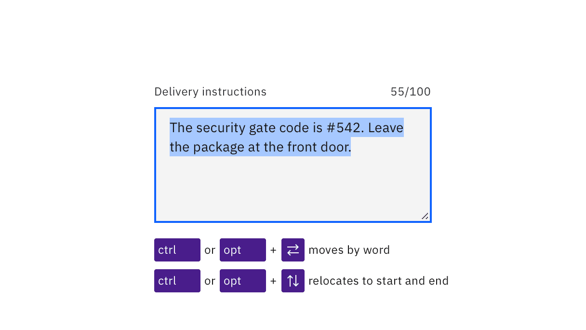

import A11yStatus from 'components/A11yStatus';

import {
  StructuredListWrapper,
  StructuredListHead,
  StructuredListBody,
  StructuredListRow,
  StructuredListInput,
  StructuredListCell,
  OrderedList,
  ListItem,
} from '@carbon/react';

<PageDescription>

No accessibility annotations are needed for text inputs, but keep these
considerations in mind if you are modifying Carbon or creating a custom
component.

</PageDescription>

<AnchorLinks>

<AnchorLink>What Carbon provides</AnchorLink>
<AnchorLink>Development considerations</AnchorLink>

</AnchorLinks>

<A11yStatus
  layout="table"
  components={[
    'Text input',
    'Text area',
    'Fluid text input',
    'Fluid text area',
  ]}
/>

## What Carbon provides

Carbon bakes keyboard operation into its components, improving the experience of
blind users and others who operate via the keyboard. Carbon incorporates many
other accessibility considerations, some of which are described below.

### Keyboard navigation

Carbon’s text inputs and text areas replicate the default HTML component
operation. Each input field is a tab stop, as are any preceding information
icons (which open with `Enter`/`Space` and close with `Esc`). For password
inputs, Carbon provides a keyboard-operable ability to toggle the password
value’s visibility using `Enter` or `Space`.

<Row>
<Column colLg={8}>

<Caption>Each input is a tab stop, as are any information icons.</Caption>

</Column>
</Row>

### Keyboard interaction

On focus, users can type directly into the input field. Any existing text in the
input is highlighted on focus and will be replaced when the user begins typing.
(Existing text in a text area is not highlighted on focus; instead the cursor is
placed at the start or the user’s prior point of interaction.) Users can
interact inside text inputs and text areas using standard arrow keys and
modifiers (`Ctrl` for Windows, `Option` for Mac).

<Row>
<Column colLg={8}>

<Caption>
  Users can move around in text inputs and text areas using arrows keys and
  modifiers.
</Caption>

</Column>
</Row>

### Labeling and helper text

Carbon programmatically surfaces both the input's label and any helper text to
assistive technologies such as screen readers. Any error messages for text
inputs are also accessibly revealed.

<Row>
<Column colLg={8}>

<Caption>Labels and helper text are accessibly provided.</Caption>

</Column>
</Row>

## Development considerations

Keep these considerations in mind if you are modifying Carbon or creating a
custom component.

- Labels are properly associated with inputs using the `for` attribute.
- Helper text is surfaced to assistive technology through `aria-describedby`.
