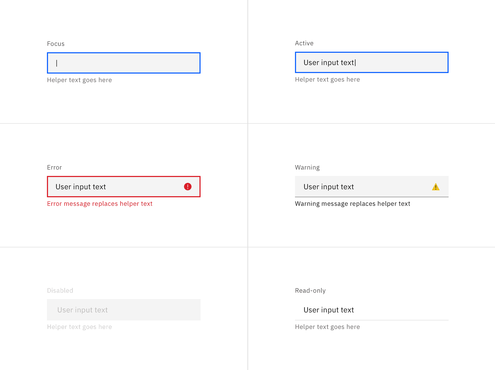
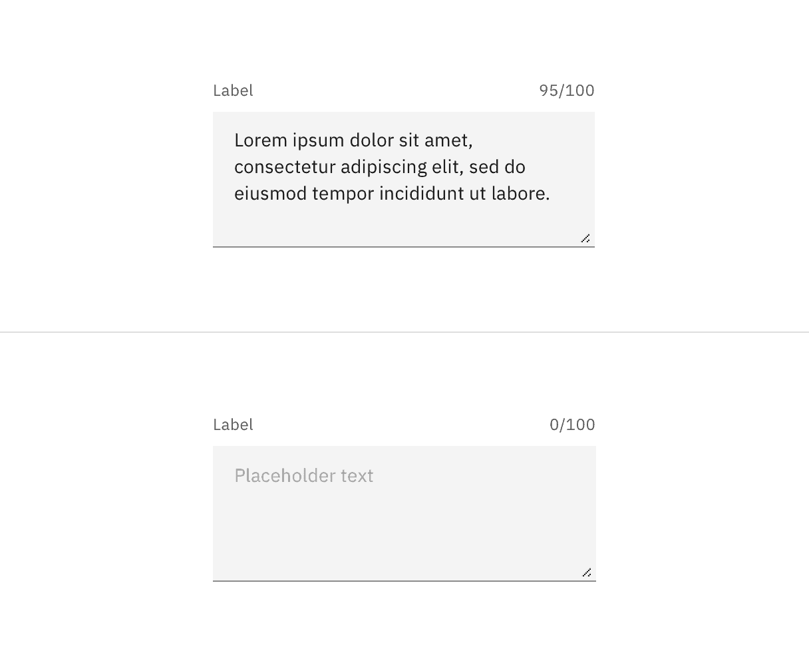
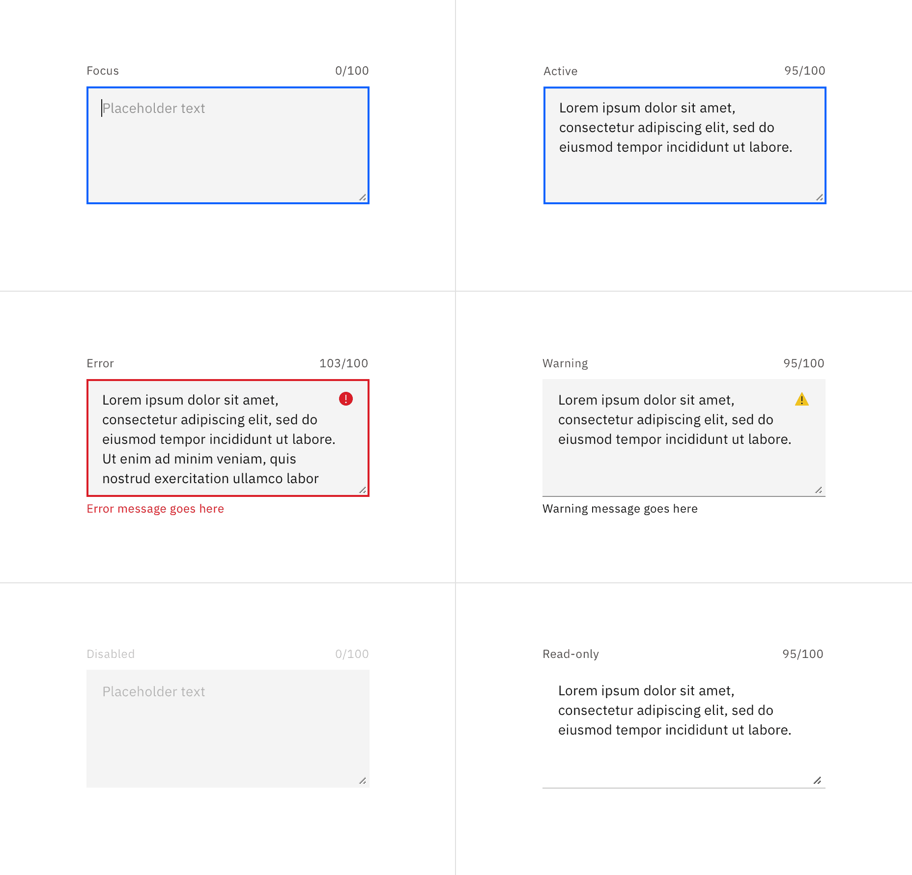
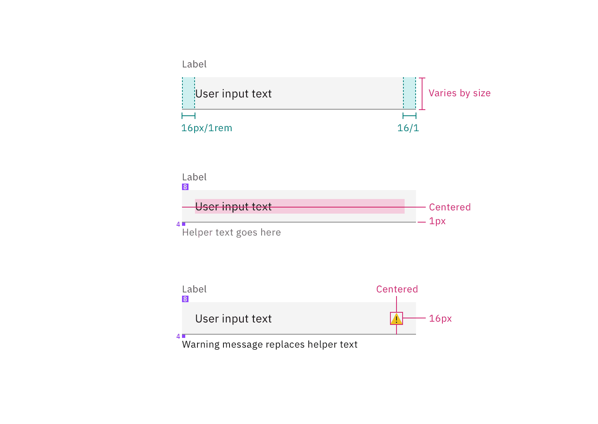
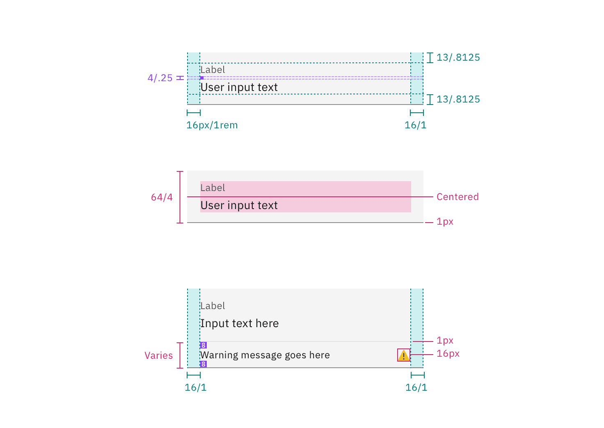
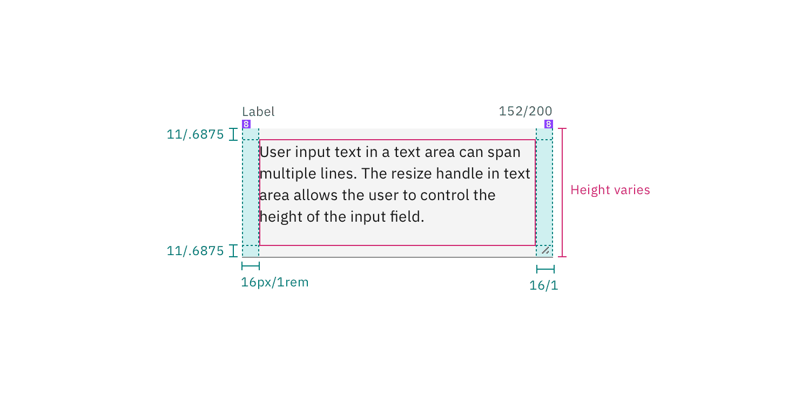
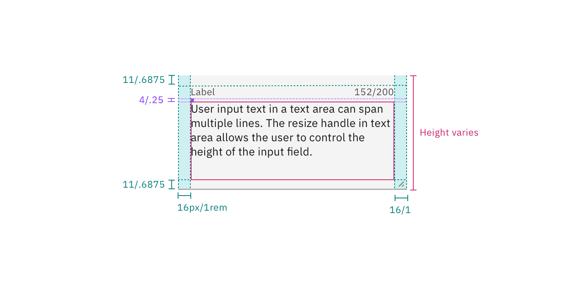
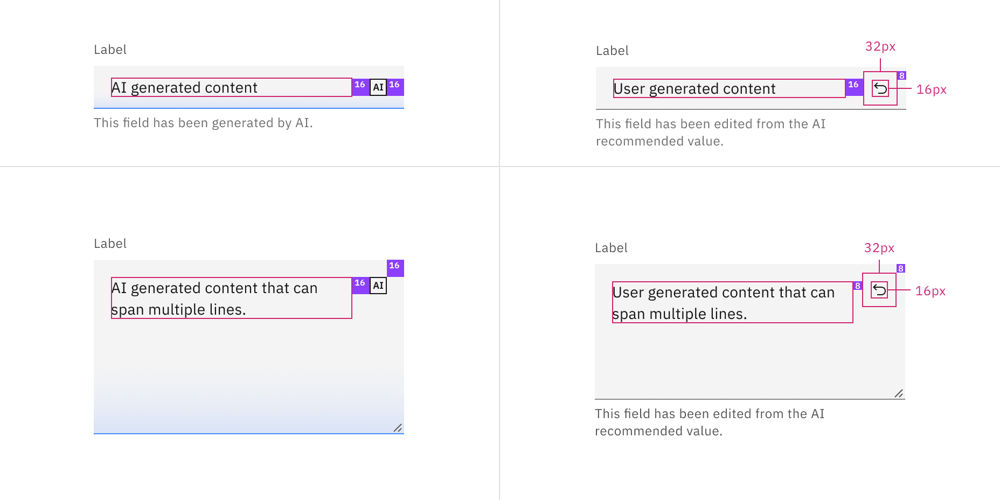
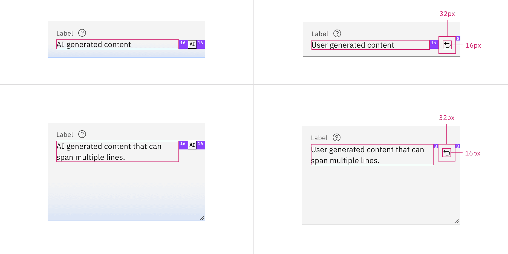

<PageDescription>

The following page documents visual specifications such as color, typography,
structure, size, and AI presence.

</PageDescription>

<AnchorLinks>

<AnchorLink>Color</AnchorLink>
<AnchorLink>Typography</AnchorLink>
<AnchorLink>Structure</AnchorLink>
<AnchorLink>Size</AnchorLink>
<AnchorLink>AI presence</AnchorLink>
<AnchorLink>Feedback</AnchorLink>

</AnchorLinks>

## Color

### Text input color

| Element          | Property         | Color token         |
| ---------------- | ---------------- | ------------------- |
| Label            | text-color       | `$text-secondary`   |
| Field text       | text-color       | `$text-primary`     |
| Placeholder text | text-color       | `$text-placeholder` |
| Helper text      | text-color       | `$text-helper`      |
| Field            | background-color | `$field` \*         |
|                  | border-bottom    | `$border-strong` \* |

<Caption fullWidth>
  \* Denotes a contextual color token that will change values based on the layer
  it is placed on.
</Caption>

<Row>
<Column colLg={8}>

<Tabs>

<Tab label="Default">

</Tab>

<Tab label="Fluid">

</Tab>

</Tabs>

</Column>
</Row>

 

#### Interactive state color

 

| State     | Element              | Property      | Color token         |
| --------- | -------------------- | ------------- | ------------------- |
| Focus     | Field                | border        | `$focus`            |
| Invalid   | Field                | border        | `$support-error`    |
|           | Error message        | text-color    | `$text-error`       |
|           | Error icon           | svg           | `$support-error`    |
| Warning   | Warning message      | text-color    | `$text-primary`     |
|           | Warning icon         | svg           | `$support-warning`  |
| Disabled  | Field                | background    | `$field` \*         |
|           | Field (default)      | border-bottom | transparent         |
|           | Field (fluid)        | border-bottom | `$border-subtle` \* |
|           | Field text           | text-color    | `$text-disabled`    |
| Read-only | Field (default)      | background    | transparent         |
|           | Field (fluid)        | background    | `$field` \*         |
|           | Field text (default) | text-color    | `$text-primary`     |
|           | Field text (fluid)   | text-color    | `$text-secondary`   |
|           | Field                | border-bottom | `$border-subtle` \* |

<Caption fullWidth>
  \* Denotes a contextual color token that will change values based on the layer
  it is placed on.
</Caption>

<Row>
<Column colLg={12}>

<Tabs>

<Tab label="Default">

</Tab>

<Tab label="Fluid">

</Tab>

</Tabs>

</Column>
</Row>

### Password input color

| Element          | Property         | Color token         |
| ---------------- | ---------------- | ------------------- |
| Label            | text-color       | `$text-secondary`   |
| Field text       | text-color       | `$text-primary`     |
| Placeholder text | text-color       | `$text-placeholder` |
| Helper text      | text-color       | `$text-helper`      |
| Field            | background-color | `$field` \*         |
|                  | border-bottom    | `$border-strong` \* |
| View icon        | svg              | `$icon-primary`     |

<Caption fullWidth>
  \* Denotes a contextual color token that will change values based on the layer
  it is placed on.
</Caption>

<Row>
<Column colLg={8}>

<Tabs>

<Tab label="Default">

</Tab>

<Tab label="Fluid">

</Tab>

</Tabs>

</Column>
</Row>

 

#### Interactive state color

 

| State     | Element              | Property      | Color token         |
| --------- | -------------------- | ------------- | ------------------- |
| Hover     | View icon            | svg           | `$icon-primary`     |
| Focus     | Field                | border        | `$focus`            |
| Invalid   | Field                | border        | `$support-error`    |
|           | Error message        | text-color    | `$text-error`       |
|           | Error icon           | svg           | `$support-error`    |
| Warning   | Warning message      | text-color    | `$text-primary`     |
|           | Warning icon         | svg           | `$support-warning`  |
| Disabled  | Field                | background    | `$field` \*         |
|           | Field (default)      | border-bottom | transparent         |
|           | Field (fluid)        | border-bottom | `$border-subtle` \* |
|           | Field text           | text-color    | `$text-disabled`    |
| Read-only | Field (default)      | background    | transparent         |
|           | Field (fluid)        | background    | `$field` \*         |
|           | Field text (default) | text-color    | `$text-primary`     |
|           | Field text (fluid)   | text-color    | `$text-secondary`   |
|           | Field                | border-bottom | `$border-subtle` \* |
|           | View icon            | svg           | `$icon-primary`     |

<Caption fullWidth>
  \* Denotes a contextual color token that will change values based on the layer
  it is placed on.
</Caption>

<Row>
<Column colLg={12}>

<Tabs>

<Tab label="Default">

</Tab>

<Tab label="Fluid">

</Tab>

</Tabs>

</Column>
</Row>

### Text area color

| Element          | Property         | Color token         |
| ---------------- | ---------------- | ------------------- |
| Label            | text-color       | `$text-secondary`   |
| Field text       | text-color       | `$text-primary`     |
| Placeholder text | text-color       | `$text-placeholder` |
| Helper text      | text-color       | `$text-helper`      |
| Field            | background-color | `$field` \*         |
|                  | border-bottom    | `$border-strong` \* |

<Caption fullWidth>
  \* Denotes a contextual color token that will change values based on the layer
  it is placed on.
</Caption>

<Row>
<Column colLg={8}>

<Tabs>

<Tab label="Default">

</Tab>

<Tab label="Fluid">

</Tab>

</Tabs>

</Column>
</Row>

 

#### Interactive state color

 

| State     | Element              | Property      | Color token         |
| --------- | -------------------- | ------------- | ------------------- |
| Focus     | Field                | border        | `$focus`            |
| Invalid   | Field                | border        | `$support-error`    |
|           | Error message        | text-color    | `$text-error`       |
|           | Error icon           | svg           | `$support-error`    |
| Warning   | Warning message      | text-color    | `$text-primary`     |
|           | Warning icon         | svg           | `$support-warning`  |
| Disabled  | Field                | background    | `$field` \*         |
|           | Field (default)      | border-bottom | transparent         |
|           | Field (fluid)        | border-bottom | `$border-subtle` \* |
|           | Field text           | text-color    | `$text-disabled`    |
| Read-only | Field (default)      | background    | transparent         |
|           | Field (fluid)        | background    | `$field` \*         |
|           | Field text (default) | text-color    | `$text-primary`     |
|           | Field text (fluid)   | text-color    | `$text-secondary`   |
|           | Field                | border-bottom | `$border-subtle` \* |

<Caption fullWidth>
  \* Denotes a contextual color token that will change values based on the layer
  it is placed on.
</Caption>

<Row>
<Column colLg={12}>

<Tabs>

<Tab label="Default">

</Tab>

<Tab label="Fluid">

</Tab>

</Tabs>

</Column>
</Row>

## Typography

Text input labels and field text should be set in sentence case, with only the
first word in a phrase and any proper nouns capitalized. Text input labels
should be three words or less.

| Element                     | Font-size (px/rem) | Font-weight   | Type token         |
| --------------------------- | ------------------ | ------------- | ------------------ |
| Label                       | 12 / 0.75          | Regular / 400 | `$label-01`        |
| Field text                  | 14 / 0.875         | Regular / 400 | `$body-compact-01` |
| Helper text                 | 12 / 0.75          | Regular / 400 | `$helper-text-01`  |
| Invalid and warning message | 12 / 0.75          | Regular / 400 | `$label-01`        |

## Structure

### Default text input structure

| Element     | Property                    | px / rem | Spacing token |
| ----------- | --------------------------- | -------- | ------------- |
| Label       | margin-bottom               | 8 / 0.5  | `$spacing-03` |
| Helper text | margin-top                  | 4 / 0.25 | `$spacing-02` |
| Field text  | padding-left, padding-right | 16 / 1   | `$spacing-05` |
| Field       | border-bottom               | 1px      | –             |
| Focus       | border                      | 2px      | –             |
| Invalid     | border                      | 2px      | –             |

 

<Caption fullwidth>
  Structure and spacing measurements for default text input | px / rem
</Caption>

### Fluid text input structure

| Element  | Property                    | px / rem    | Spacing token |
| -------- | --------------------------- | ----------- | ------------- |
| Label    | padding-bottom              | 4 / 0.25    | `$spacing-02` |
| Field    | height                      | 64 / 4      | `$spacing-10` |
|          | padding-left, padding-right | 16 / 1      | `$spacing-05` |
|          | padding-top, padding-bottom | 13 / 0.8125 | –             |
|          | border-bottom               | 1px         | –             |
| Focus    | border                      | 2px         | –             |
| Invalid  | border                      | 2px         | –             |

 

<Caption fullwidth>
  Structure and spacing measurements for fluid text input | px / rem
</Caption>

### Default password input structure

| Element     | Property                    | px / rem | Spacing token |
| ----------- | --------------------------- | -------- | ------------- |
| Label       | margin-bottom               | 8 / 0.5  | `$spacing-03` |
| Helper text | margin-top                  | 4 / 0.25 | `$spacing-02` |
| Field text  | padding-left, padding-right | 16 / 1   | `$spacing-05` |
| Field       | border-bottom               | 1px      | –             |
| Focus       | border                      | 2px      | –             |
| Invalid     | border                      | 2px      | –             |
| View icon   | padding-left, padding-right | 16 / 1   | `$spacing-05` |
| State icon  | padding-left                | 16 / 1   | `$spacing-05` |
|             | padding-right               | 8 / 0.5  | `$spacing-03` |

 

<Caption fullWidth>
  Structure and spacing measurements for default password input | px / rem
</Caption>

### Fluid password input structure

| Element     | Property                    | px / rem | Spacing token |
| ----------- | --------------------------- | -------- | ------------- |
| Label       | margin-bottom               | 8 / 0.5  | `$spacing-03` |
| Helper text | margin-top                  | 4 / 0.25 | `$spacing-02` |
| Field text  | padding-left, padding-right | 16 / 1   | `$spacing-05` |
| Field       | border-bottom               | 1px      | –             |
| Focus       | border                      | 2px      | –             |
| Invalid     | border                      | 2px      | –             |
| View icon   | padding-left, padding-right | 16 / 1   | `$spacing-05` |
| State icon  | padding-left, padding-right | 16 / 1   | `$spacing-05` |

 

<Caption fullWidth>
  Structure and spacing measurements for fluid password input | px / rem
</Caption>

### Default text area structure

| Element     | Property                    | px / rem    | Spacing token |
| ----------- | --------------------------- | ----------- | ------------- |
| Label       | margin-bottom               | 8 / 0.5     | `$spacing-03` |
| Field       | height                      | varies      | –             |
|             | padding-left, padding-right | 16 / 1      | `$spacing-05` |
|             | padding-top, padding-bottom | 11 / 0.6875 | –             |
|             | border-bottom               | 1px         | –             |
| Focus       | border                      | 2px         | –             |
| Helper text | margin-top                  | 4 / 0.25    | `$spacing-02` |

<Caption fullwidth>
  Structure and spacing measurements for default text area | px / rem
</Caption>

### Fluid text area structure

| Element | Property                    | px / rem    | Spacing token |
| ------- | --------------------------- | ----------- | ------------- |
| Label   | margin-bottom               | 4 / 0.25    | `$spacing-02` |
| Field   | height                      | varies      | –             |
|         | padding-left, padding-right | 16 / 1      | `$spacing-05` |
|         | padding-top, padding-bottom | 11 / 0.6875 | –             |
|         | border-bottom               | 1px         | –             |
| Focus   | border                      | 2px         | –             |

<Caption fullwidth>
  Structure and spacing measurements for fluid text area | px / rem
</Caption>

## Size

These sizes apply only to the default style of text and password input.

| Element | Size        | Height (px / rem) |
| ------- | ----------- | ----------------- |
| Input   | Small (sm)  | 32 / 2            |
|         | Medium (md) | 40 / 2.5          |
|         | Large (lg)  | 48 / 3            |

<Caption>Text input default style sizes | px / rem</Caption>

<Caption>Password input default style sizes | px / rem</Caption>

## AI presence

The following are the unique styles applied to the component when the AI label
is present. Unless specified, all other tokens in the component remain the same
as the non-AI variant. For more information on the AI style elements, see the
[Carbon for AI](/guidelines/carbon-for-ai/) guidelines.

| Element         | Property         | Token / Size        |
| --------------- | ---------------- | ------------------- |
| Linear gradient | start            | `$ai-aura-start-sm` |
|                 | stop             | `$ai-aura-stop`     |
| Field           | border-bottom    | `$ai-border-strong` |
|                 | background color | `$field`\*          |
| AI label        | size             | mini                |

<Caption fullWidth>
  \* Denotes a contextual color token that will change values based on the layer
  it is placed on.
</Caption>

<Row>
<Column colLg={8}>

<Tabs>

<Tab label="Default">

</Tab>

<Tab label="Fluid">

</Tab>

</Tabs>

</Column>
</Row>

## Feedback

Help us improve this component by providing feedback, asking questions, and
leaving any other comments on
[GitHub](https://github.com/carbon-design-system/carbon-website/issues/new?assignees=&labels=feedback&template=feedback.md).
