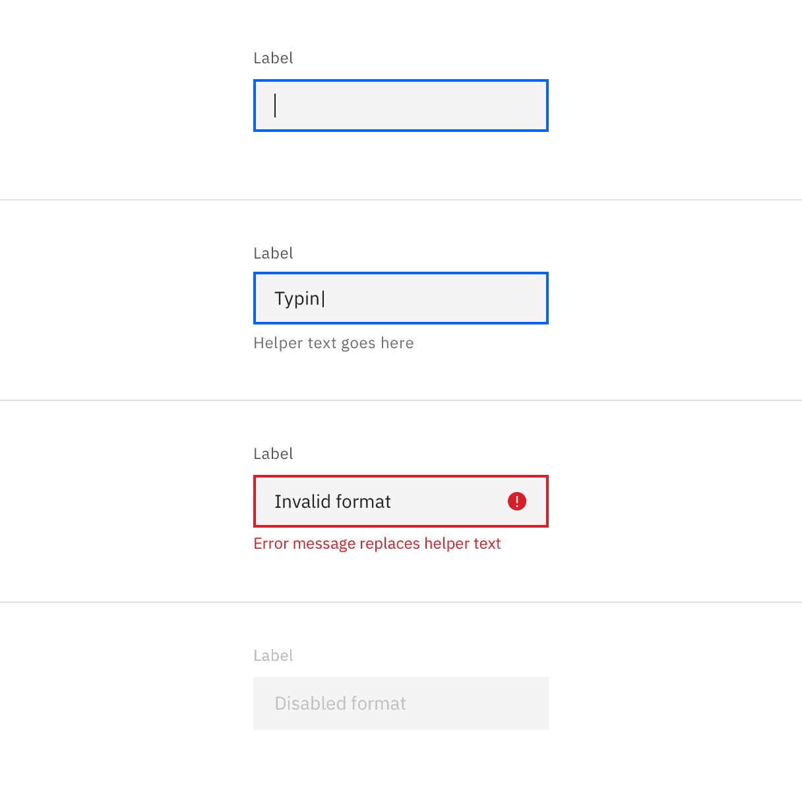
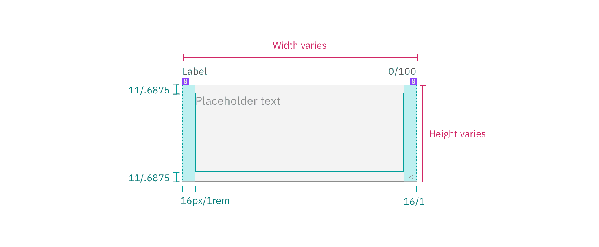

## Color

| Element          | Property         | Color token         |
| ---------------- | ---------------- | ------------------- |
| Label            | text color       | `$text-secondary`   |
| Field text       | text color       | `$text-primary`     |
| Placeholder text | text color       | `$text-placeholder` |
| Helper text      | text color       | `$text-helper`      |
| Field            | background-color | `$field`            |
|                  | border-bottom    | `$border-strong`    |

<Row>
<Column colLg={8}>

</Column>
</Row>

### Interactive states

| State    | Element       | Property   | Color token       |
| -------- | ------------- | ---------- | ----------------- |
| Focus    | Field         | outline    | `$focus`          |
| Invalid  | Field         | outline    | `$support-error`  |
|          | Error message | text color | `$text-error`     |
|          | Warning icon  | svg        | `$support-error`  |
| Disabled | Field         | background | `$field-disabled` |
|          | Field text    | text color | `$disabled-02`    |

<Row>
<Column colLg={8}>

</Column>
</Row>

## Typography

Text input labels and placeholder text should be set in sentence case, with only
the first word in a phrase and any proper nouns capitalized. Text input labels
should be three words or less.

| Element       | Font-size (px/rem) | Font-weight   | Type token      |
| ------------- | ------------------ | ------------- | --------------- |
| Label         | 12 / 0.75          | Regular / 400 | `$label-01`     |
| Field text    | 14 / 0.875         | Regular / 400 | `$body-long-01` |
| Helper text   | 12 / 0.75          | Regular / 400 | `$label-01`     |
| Error message | 12 / 0.75          | Regular / 400 | `$label-01`     |

## Structure

### Text input

| Element      | Property                    | px / rem | Spacing token |
| ------------ | --------------------------- | -------- | ------------- |
| Label        | margin-bottom               | 8 / 0.5  | `$spacing-03` |
| Helper text  | margin-top                  | 4 / 0.25 | `$spacing-02` |
| Field text   | padding-left, padding-right | 16 / 1   | `$spacing-05` |
| Field        | border-bottom               | 1px      | –             |
| Field: focus | border                      | 2px      | –             |

 

<Caption>Structure and spacing measurements for text input | px / rem</Caption>

### Text area

| Element      | Property                    | px / rem    | Spacing token |
| ------------ | --------------------------- | ----------- | ------------- |
| Label        | margin-bottom               | 8 / 0.5     | `$spacing-03` |
| Field        | height                      | varies      | –             |
|              | padding-left, padding-right | 16 / 1      | `$spacing-05` |
|              | padding-top, padding-bottom | 11 / 0.6875 | –             |
|              | border-bottom               | 1px         | –             |
| Field: focus | border                      | 2px         | –             |
| Helper text  | margin-top                  | 4 / 0.25    | `$spacing-02` |

<Caption>Structure and spacing measurements for text area | px / rem</Caption>

## Sizes 

| Size        | Height (px / rem)  |
| ----------- | ------------------ | 
| Small (sm)  | 32 / 2             |
| Medium (md) | 40 / 2.5           |
| Large (lg)  | 48 / 3             |
