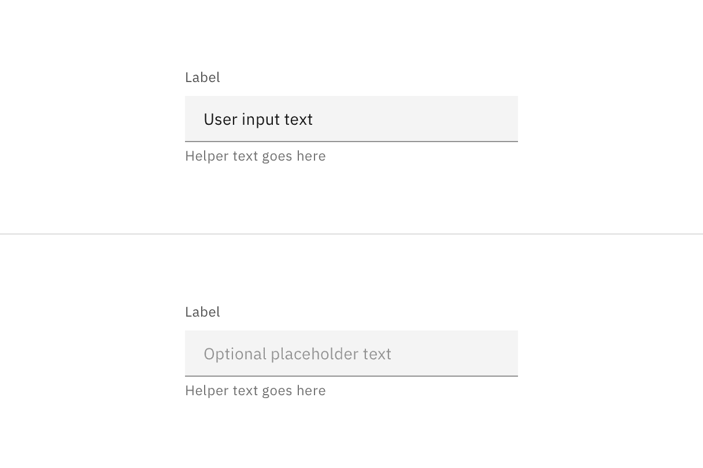
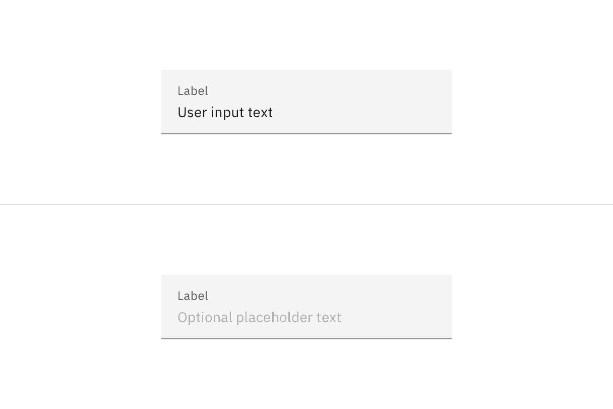
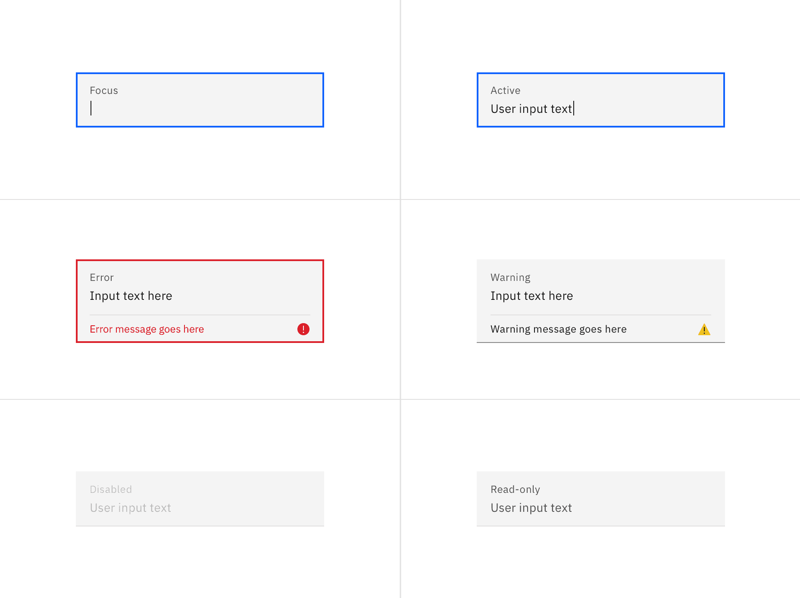
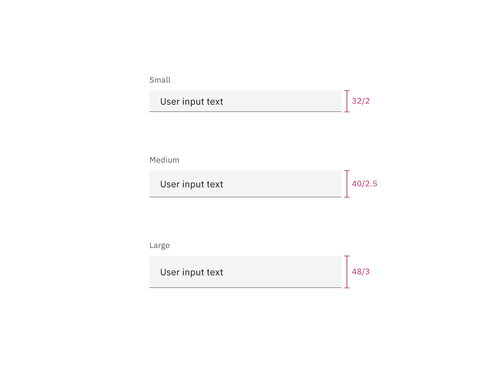

## Color

| Element          | Property         | Color token         |
| ---------------- | ---------------- | ------------------- |
| Label            | text color       | `$text-secondary`   |
| Field text       | text color       | `$text-primary`     |
| Placeholder text | text color       | `$text-placeholder` |
| Helper text      | text color       | `$text-helper`      |
| Field            | background-color | `$field` \*         |
|                  | border-bottom    | `$border-strong` \* |

<Caption>
  * Denotes a contextual color token that will change values based on the layer
  it is placed on.
</Caption>

<Row>
<Column colLg={8}>

<Tabs>

<Tab label="Default">

</Tab>

<Tab label="Fluid">

</Tab>

</Tabs>

</Column>
</Row>

### Interactive states

| State    | Element         | Property      | Color token        |
| -------- | --------------- | ------------- | ------------------ |
| Focus    | Field           | border        | `$focus`           |
| Invalid  | Field           | border        | `$support-error`   |
|          | Error message   | text color    | `$text-error`      |
|          | Error icon      | svg           | `$support-error`   |
| Warning  | Warning message | text color    | `$text-primary`    |
|          | Warning icon    | svg           | `$support-warning` |
| Disabled | Field           | background    | `$field` \*        |
|          | Field           | border-bottom | transparent        |
|          | Field text      | text color    | `$text-disabled`   |

<Row>
<Column colLg={12}>

<Tabs>

<Tab label="Default">

</Tab>

<Tab label="Fluid">

</Tab>

</Tabs>

</Column>
</Row>

## Typography

Text input labels and field text should be set in sentence case, with only the
first word in a phrase and any proper nouns capitalized. Text input labels
should be three words or less.

| Element       | Font-size (px/rem) | Font-weight   | Type token         |
| ------------- | ------------------ | ------------- | ------------------ |
| Label         | 12 / 0.75          | Regular / 400 | `$label-01`        |
| Field text    | 14 / 0.875         | Regular / 400 | `$body-compact-01` |
| Helper text   | 12 / 0.75          | Regular / 400 | `$helper-text-01`  |
| Error message | 12 / 0.75          | Regular / 400 | `$label-01`        |

## Structure

### Text input – Default

| Element     | Property                    | px / rem | Spacing token |
| ----------- | --------------------------- | -------- | ------------- |
| Label       | margin-bottom               | 8 / 0.5  | `$spacing-03` |
| Helper text | margin-top                  | 4 / 0.25 | `$spacing-02` |
| Input text  | padding-left, padding-right | 16 / 1   | `$spacing-05` |
| Field       | border-bottom               | 1px      | –             |
| Focus       | border                      | 2px      | –             |
| Error       | border                      | 2px      | –             |

 

<Caption>
  Structure and spacing measurements for default text input | px / rem
</Caption>

### Text input – Fluid

| Element | Property                    | px / rem    | Spacing token |
| ------- | --------------------------- | ----------- | ------------- |
| Label   | padding-bottom              | 4 / 0.25    | `$spacing-02` |
| Field   | height                      | 64 / 4      | `$spacing-10` |
|         | padding-left, padding-right | 16 / 1      | `$spacing-05` |
|         | padding-top, padding-bottom | 13 / 0.8125 | –             |
|         | border-bottom               | 1px         | –             |
| Focus   | border                      | 2px         | –             |
| Error   | border                      | 2px         | –             |

 

<Caption>
  Structure and spacing measurements for fluid text input | px / rem
</Caption>

### Text area – Default

| Element      | Property                    | px / rem    | Spacing token |
| ------------ | --------------------------- | ----------- | ------------- |
| Label        | margin-bottom               | 8 / 0.5     | `$spacing-03` |
| Field        | height                      | varies      | –             |
|              | padding-left, padding-right | 16 / 1      | `$spacing-05` |
|              | padding-top, padding-bottom | 11 / 0.6875 | –             |
|              | border-bottom               | 1px         | –             |
| Field: focus | border                      | 2px         | –             |
| Helper text  | margin-top                  | 4 / 0.25    | `$spacing-02` |

<Caption>
  Structure and spacing measurements for default text area | px / rem
</Caption>

### Text area – Fluid

| Element      | Property                    | px / rem    | Spacing token |
| ------------ | --------------------------- | ----------- | ------------- |
| Label        | margin-bottom               | 4 / 0.25    | `$spacing-02` |
| Field        | height                      | varies      | –             |
|              | padding-left, padding-right | 16 / 1      | `$spacing-05` |
|              | padding-top, padding-bottom | 11 / 0.6875 | –             |
|              | border-bottom               | 1px         | –             |
| Field: focus | border                      | 2px         | –             |

<Caption>
  Structure and spacing measurements for fluid text area | px / rem
</Caption>

## Sizes

These sizes apply only to the default style of text input.

| Element | Size        | Height (px / rem) |
| ------- | ----------- | ----------------- |
| Input   | Small (sm)  | 32 / 2            |
|         | Medium (md) | 40 / 2.5          |
|         | Large (lg)  | 48 / 3            |

<Caption>Text input sizes | px / rem</Caption>
