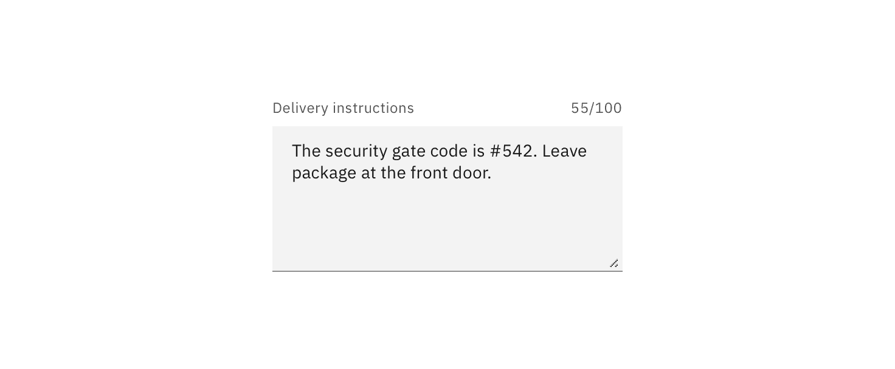
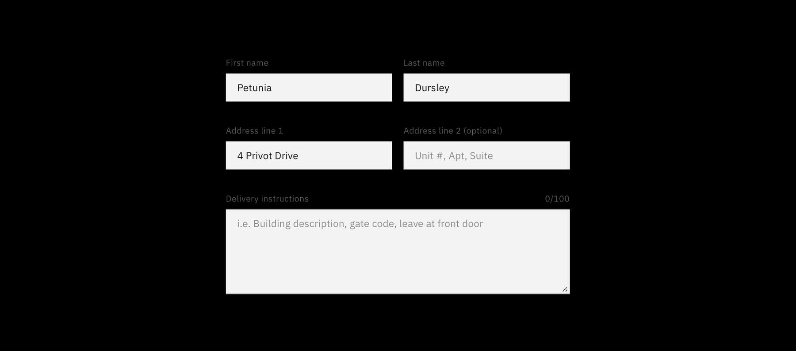

<PageDescription>

Text inputs enable the user to interact with and input content and data. This
component can be used for long and short form entries.

</PageDescription>

<AnchorLinks>

<AnchorLink>Overview</AnchorLink>
<AnchorLink>Live demo</AnchorLink>
<AnchorLink>Formatting</AnchorLink>
<AnchorLink>Content</AnchorLink>
<AnchorLink>Feedback</AnchorLink>

</AnchorLinks>

## Overview

There are instances, sometimes in the same form, where you need users to enter
both short and long form content. Allow the size of the text input box to
reflect the length of the content you expect the user to enter.

| Variant    | Purpose                                                                           |
| ---------- | --------------------------------------------------------------------------------- |
| Text input | When the expected user input is a single line of text, as opposed to a paragraph. |
| Text area  | When the expected user input is more than one sentence.                           |

## Live demo

<ComponentDemo
  components={[
    {
      id: 'text-input',
      label: 'Text input',
    },
    {
      id: 'password-input',
      label: 'Password input',
    },
    {
      id: 'text-area',
      label: 'Text area',
    },
  ]}>
  <ComponentVariant
    id="text-input"
    knobs={{
      TextInput: ['disabled', 'invalid', 'light'],
    }}
    links={{
      React:
        'https://react.carbondesignsystem.com/?path=/story/textinput--default',
      Angular:
        'https://angular.carbondesignsystem.com/?path=/story/components-input--label',
      Vue:
        'http://vue.carbondesignsystem.com/?path=/story/components-cvtextinput--default',
      Vanilla: 'https://the-carbon-components.netlify.com/?nav=text-input',
    }}>{`
    

      <TextInput
        helperText="Optional helper text"
        id="test2"
        invalidText="A valid value is required"
        labelText="Text input label"
        placeholder="Placeholder text"
      />
    

  `}</ComponentVariant>
  <ComponentVariant
    id="password-input"
    links={{
      React:
        'https://react.carbondesignsystem.com/?path=/story/textinput--toggle-password-visibility',
      Angular:
        'https://angular.carbondesignsystem.com/?path=/story/components-input--label',
      Vue:
        'http://vue.carbondesignsystem.com/?path=/story/components-cvtextinput--default',
      Vanilla: 'https://the-carbon-components.netlify.com/?nav=text-input',
    }}>{`
    

    <TextInput.PasswordInput
      helperText="Optional helper text"
      hidePasswordLabel="Hide password"
      id="test2"
      invalidText="A valid value is required"
      labelText="Text input label"
      placeholder="Placeholder text"
      showPasswordLabel="Show password"
    />
    

  `}</ComponentVariant>
  <ComponentVariant
    id="text-area"
    knobs={{
      TextArea: ['disabled', 'invalid', 'light'],
    }}
    links={{
      React:
        'https://react.carbondesignsystem.com/?path=/story/textarea--default',
      Angular:
        'https://angular.carbondesignsystem.com/?path=/story/components-input--textarea',
      Vue:
        'http://vue.carbondesignsystem.com/?path=/story/components-cvtextarea--default',
      Vanilla: 'https://the-carbon-components.netlify.com/?nav=text-input',
    }}>{`
    

    <TextArea
      cols={50}
      helperText="Optional helper text"
      id="test2"
      invalidText="A valid value is required"
      labelText="Text area label"
      placeholder="Placeholder text"
      rows={4}
    />
    

  `}</ComponentVariant>
</ComponentDemo>

## Formatting

### Default values

Where possible, add programmatic assistance. Detect and pre-fill inputs to
reduce errors and save time. When the software can't determine the value that
belongs in an input, use type-ahead to make suggestions. Use sentence-case for
default values, detected values, and auto-completion text.

### Validation and errors

Real time validation helps to streamline the process and keep data clean when
the user is filling out forms. For full guidelines, refer to the
[forms](/components/form/usage) usage page.

<Row>
<Column colLg={8}>

</Column>
</Row>

### Character count

Text fields and text areas may have a character limit and counter. Use the
character limit and counter to let users know how long their entry can be before
they begin typing.

While useful for data collection, character count is not an intuitive way to
communicate content length to users. Character count allows a user to understand
an input error if they surpass the character limit.

<Row>
<Column colLg={8}>

</Column>
</Row>

## Content

### Labels

Effective form labeling helps users understand what information to enter into a
text input. Using placeholder text in lieu of a label is sometimes employed as a
space-saving method. However, this is not recommended because it hides context
and presents accessibility issues.

<Row>
<Column colLg={8}>

</Column>
</Row>

#### Accessibility best practices for labels

- Labels must be visible when an input gets focus.
- Labels must be announced to the screen reader on focus.
- Ensure the helper text that appears under an input is read when an assistive
  technology user stops at an input using ARIA.

### Placeholder text

Placeholder text provides hints or examples of what to enter. Placeholder text
disappears after the user begins entering data into the input and should not
contain crucial information. Use sentence-style capitalization, and in most
cases, write the text as a direct statement without punctuation.

<Row>
<Column colLg={8}>

</Column>
</Row>

### Helper text

Helper text is pertinent information that assists the user in completing a
field. Helper text is always available when the input is focused and appears
underneath the label. Use sentence-style capitalization, and in most cases,
write the text as full sentences with punctuation.

<Row>
<Column colLg={8}>

</Column>
</Row>

## Feedback

Help us improve this component by providing feedback, asking questions, and
leaving any other comments on
[GitHub](https://github.com/carbon-design-system/carbon-website/issues/new?assignees=&labels=feedback&template=feedback.md).
