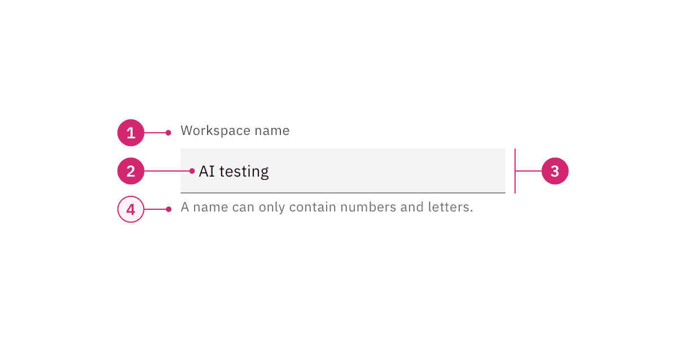
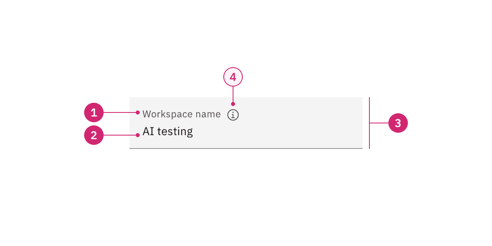
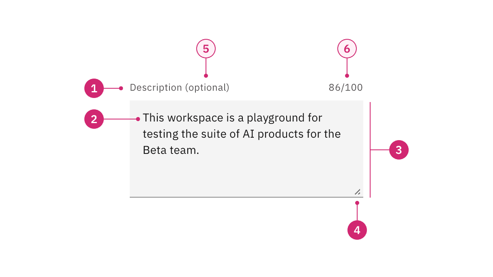
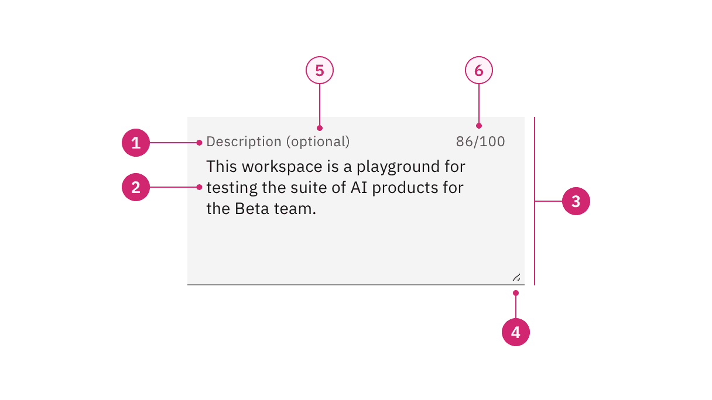
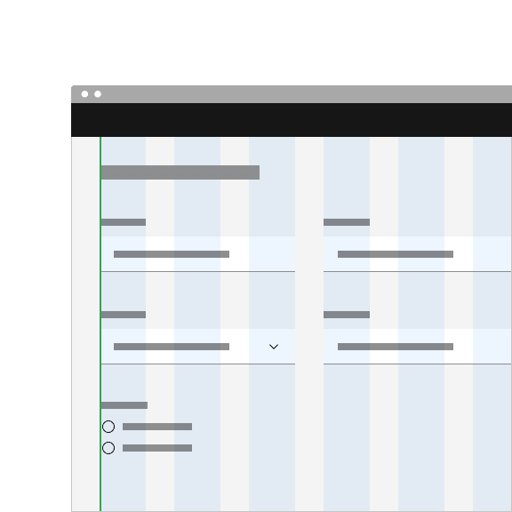
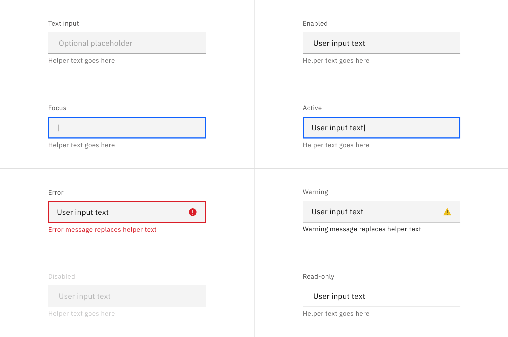
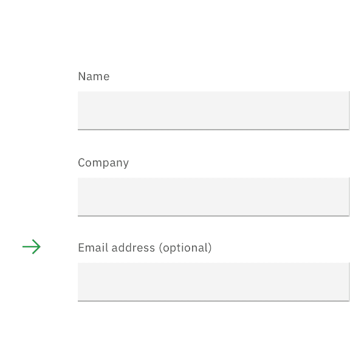
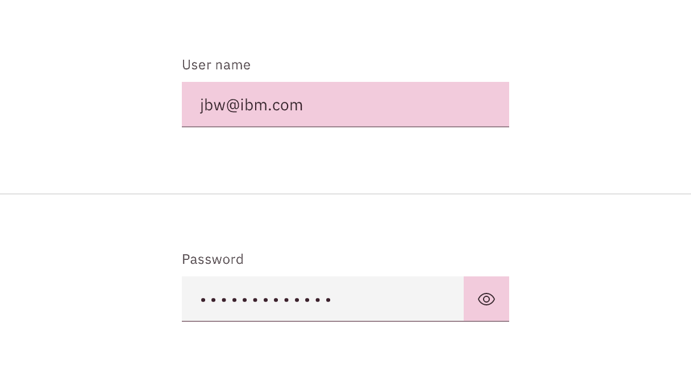
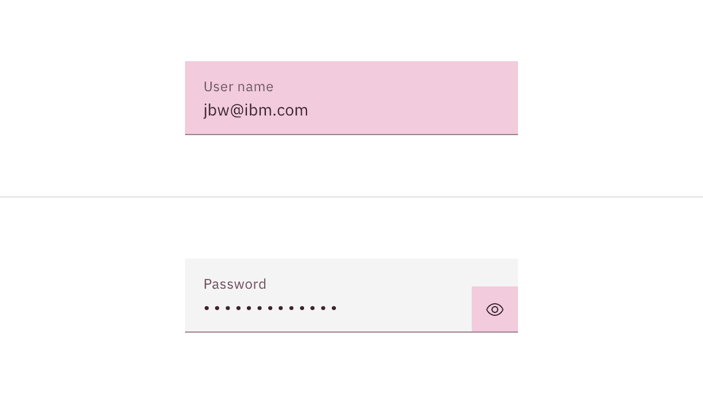
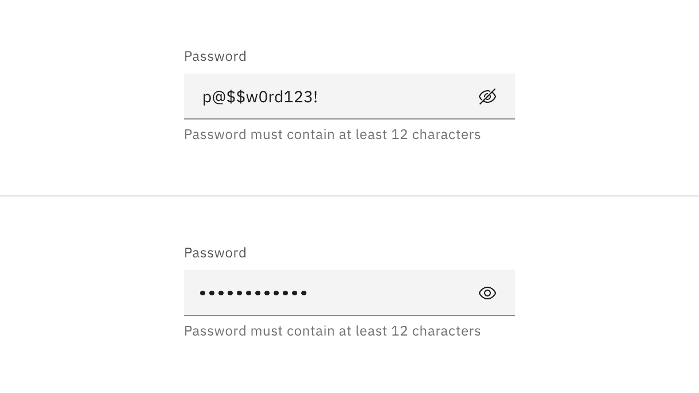

<PageDescription>

Text inputs enable users to enter free-form text data. You can use them for long
and short-form entries.

</PageDescription>

<AnchorLinks>

<AnchorLink>Overview</AnchorLink>
<AnchorLink>Live demo</AnchorLink>
<AnchorLink>Text input</AnchorLink>
<AnchorLink>Text area</AnchorLink>
<AnchorLink>Formatting</AnchorLink>
<AnchorLink>Content</AnchorLink>
<AnchorLink>Universal behaviors</AnchorLink>
<AnchorLink>Modifiers</AnchorLink>
<AnchorLink>Related</AnchorLink>
<AnchorLink>Feedback</AnchorLink>

</AnchorLinks>

## Overview

Text inputs enable users to enter free-form text data. The type of text field
used should reflect the length of the content you expect the user to enter. The
default text input is for short, one-line content, whereas text area is for
longer, multi-line entries.

<Row>
<Column colLg={8}>

</Column>
</Row>

#### When to use

- A user needs to input unique information that cannot be predicted with a
  preset of options.
- A user needs to input memorable data that can be entered more quickly in a
  free-hand format versus a more complex control.

#### When not to use

- If a user can only enter an option from a predefined list then avoid using a
  free-form text input as it is likely to result in an error. Consider using a
  selection control such as a dropdown, select, or radio button group instead.

### Variants

| Variant                                                | Purpose                                                                               |
| ------------------------------------------------------ | ------------------------------------------------------------------------------------- |
| [Text input](/components/text-input/usage/#text-input) | When the expected user input is a single line of text.                                |
| [Text area](/components/text-input/usage/#text-area)   | When the expected user input is more than a few words that could span multiple lines. |

## Live demo

<ComponentDemo
  components={[
    {
      id: 'text-input',
      label: 'Text input',
    },
    {
      id: 'password-input',
      label: 'Password input',
    },
    {
      id: 'text-area',
      label: 'Text area',
    },
  ]}
>
  <ComponentVariant
    id="text-input"
    knobs={{
      TextInput: ['disabled', 'invalid', 'light'],
    }}
    links={{
      React:
        'https://react.carbondesignsystem.com/?path=/story/components-textinput--default',
      Angular:
        'https://angular.carbondesignsystem.com/?path=/story/components-input--label',
      Vue: 'http://vue.carbondesignsystem.com/?path=/story/components-cvtextinput--default',
      'Web Components':
        'https://web-components.carbondesignsystem.com/?path=/story/components-input--default',
    }}
  >{`
    

      <TextInput
        helperText="Optional helper text"
        id="test2"
        invalidText="A valid value is required"
        labelText="Text input label"
        placeholder="Optional placeholder text"
      />
    

  `}</ComponentVariant>
  <ComponentVariant
    id="password-input"
    links={{
      React:
        'https://react.carbondesignsystem.com/?path=/story/components-textinput--toggle-password-visibility',
      Angular:
        'https://angular.carbondesignsystem.com/?path=/story/components-input--label',
      Vue: 'http://vue.carbondesignsystem.com/?path=/story/components-cvtextinput--default',
      'Web Components':
        'https://web-components.carbondesignsystem.com/?path=/story/components-input--default',
    }}
  >{`
    

    <TextInput.PasswordInput
      helperText="Optional helper text"
      hidePasswordLabel="Hide password"
      id="test2"
      invalidText="A valid value is required"
      labelText="Text input label"
      placeholder="Optional placeholder text"
      showPasswordLabel="Show password"
    />
    

  `}</ComponentVariant>
  <ComponentVariant
    id="text-area"
    knobs={{
      TextArea: ['disabled', 'invalid', 'light'],
    }}
    links={{
      React:
        'https://react.carbondesignsystem.com/?path=/story/components-textarea--default',
      Angular:
        'https://angular.carbondesignsystem.com/?path=/story/components-input--textarea',
      Vue: 'http://vue.carbondesignsystem.com/?path=/story/components-cvtextarea--default',
      'Web Components':
        'https://web-components.carbondesignsystem.com/?path=/story/components-textarea--default',
    }}
  >{`
    

    <TextArea
      cols={50}
      helperText="Optional helper text"
      id="test2"
      invalidText="A valid value is required"
      labelText="Text area label"
      placeholder="Optional placeholder text"
      rows={4}
    />
    

  `}</ComponentVariant>
</ComponentDemo>

## Text input

Use a text input when the expected user input is a single line of text. Text
inputs have a fixed height and are used to enter simple free-form data entries
with any combination of letters, numbers, or symbols. There are two styles of
text input, default and fluid, which share the same functionality but look
visually different. The context of how or where the component is used will
dictate which style to use.

| Style   | Purpose                                                                                                                                                                                                                                               |
| ------- | ----------------------------------------------------------------------------------------------------------------------------------------------------------------------------------------------------------------------------------------------------- |
| Default | Default is the most commonly used text input style with the label and helper text outside the field. Use when white space is needed between input components or in productive moments where space is at a premium, and smaller components are needed. |
| Fluid   | Fluid is an alternate styling for text input used in more expressive moments. Use in fluid forms, contained spaces, or attached to complex components, like a toolbar. Fluid components always sit flush with components around them.                 |

### Anatomy

<Row>
<Column colLg={8}>

<Tabs>

<Tab label="Default">

</Tab>

<Tab label="Fluid">

</Tab>

</Tabs>

</Column>
</Row>

1. **Label**: Text that informs the user about the content they need to enter in
   the field. It is required unless you get an approved accessibility exemption.
2. **Value**: The content the user has entered into the field.
3. **Field**: The container in which a user enters data. Must meet 3:1 non-text
   contrast requirements.
4. **Helper text** (optional): Assistive text that can provide additional aid or
   context to the user. Often used to explain the correct data format. It is
   positioned below the field in the default style and surfaced through a
   tooltip in the fluid style.

### Sizing

#### Default input heights

There are three text input height sizes: small, medium, and large. Supporting
three sizes gives you more flexibility in structuring layouts. Be sure to use a
consistent field height when pairing form components on the same page.

| Size        | Height (px/rem) | Use case                                                                                                                                            |
| ----------- | --------------- | --------------------------------------------------------------------------------------------------------------------------------------------------- |
| Small (sm)  | 32 / 2          | Use when space is constricted or when placing a text input in a form that is long and complex.                                                      |
| Medium (md) | 40 / 2.5        | This is the default size and the most commonly used size. When in doubt, use the medium size.                                                       |
| Large (lg)  | 48 / 3          | Use when there is a lot of space to work with. The large size is typically used in simple forms or when a text input is placed by itself on a page. |

<Row>
<Column colLg={8}>

</Column>
</Row>

#### Fluid input heights

There is only one fluid input height and it is visually larger than the default
heights. The input is a set height expect for when a warning or error message
has been added to the bottom.

<Row>
<Column colLg={8}>

</Column>
</Row>

## Text area

Use a text area when the expected user input is more than a few words and could
span multiple lines. It is commonly used for features like user commentary or
descriptions. It supports all the same states and functionality as text input
except for the password functionality. Text area has several unique
functionalities not included in the text input, like the resize handle and
character counter.

| Style   | Purpose                                                                                                                                                                                                                                              |
| ------- | ---------------------------------------------------------------------------------------------------------------------------------------------------------------------------------------------------------------------------------------------------- |
| Default | Default is the most commonly used text area style with the label and helper text outside the field. Use when white space is needed between input components or in productive moments where space is at a premium, and smaller components are needed. |
| Fluid   | Fluid is an alternate styling for text area used in more expressive moments. Use in fluid forms, contained spaces, or attached to complex components, like a toolbar. Fluid components always sit flush with components around them.                 |

### Anatomy

<Row>
<Column colLg={8}>

<Tabs>

<Tab label="Default">

</Tab>

<Tab label="Fluid">

</Tab>

</Tabs>

</Column>
</Row>

1. **Label**: Text that informs the user about the content they need to enter in
   the field. It is required unless you get an approved accessibility exemption.
2. **Value**: The content the user has entered into the field.
3. **Field**: The container in which a user enters data. Must meet 3:1 non-text
   contrast requirements.
4. **Resize hanle**: Allows a user to manipulate the field height by making it
   longer or shorter.
5. **Optional versus required indicator** (optional): This label indicates if
   the field is optional or required for the user to complete.
6. **Character counter** (optional): Indicate the number of characters being
   entered and the total number of characters allowed.

### Sizing

Text area has a variable height that can be lengthened or shortened by the user
using the resize handle in the bottom right of the field. By default, text area
has a minimum height of 40px/2.5rem but no maximum height.

#### Resize handle

Included by default in both default and fluid text area is the resize handle. It
allows a user to manipulate the field height by making it longer or shorter. The
resize handle has no effect on the width of the text area container, it only
effects the height. If the user makes the field size shorter than the content
inside the field then a vertical scroll will become available.

<Row>
<Column colLg={8}>

</Column>
</Row>

## Formatting

### Alignment

Input labels should vertically align to the grid and with other type elements on
the page. The alignment of the input container will differ based on the style of
text input you are using. Default inputs are always flush to the columns and
fluid inputs will hang into the gutters.

<DoDontRow>
  <DoDont caption="Align default input containers to the grid so the input label alignes with other type of the page.">

  </DoDont>
  <DoDont caption="Hang fluid input containers into the gutters so the input label alignes with other type of the page.">

  </DoDont>
</DoDontRow>

#### Placement

The field widths of both text input and text area should reflect the intended
length of the content while still aligning to the grid columns or mini unit
grid. Unlike the height, the width of the text area cannot be controlled by the
user. There are no minimum or maximum widths but you should avoid excessively
wide fields that are disproportionate to the intended data being collected.

<DoDontRow>
  <DoDont type="do" caption="Do make text input widths proportional to the content and align to grid columns.">

  </DoDont>
  <DoDont type="dont" caption="Do not make text inputs excessively wide just to fill in space. ">

  </DoDont>
</DoDontRow>

### Alignment

Labels and field containers should vertically align to the grid and with other
form components on a page.

<DoDontRow>
  <DoDont type="do" caption="Do align field containers to the grid.">

  </DoDont>
  <DoDont type="dont" caption="Do not align field text to the grid and hang the field in the gutter.">

  </DoDont>
</DoDontRow>

## Content

### Main elements

#### Labels

Effective labeling helps users understand what information to enter into a text
input. Text fields should always have a label. There are rare instances were the
context of an input negates the need for a visible label but we advise you
consult an accessibility expert before proceeding with a label-less design.

- Use sentence-style capitalization for all labels, except for product names and
  proper nouns.
- Keep the label short and concise.
- Do not use colons after label names.

#### Helper text

Optional helper text is pertinent information that assists the user in correctly
completing a field. It is often used to explain the correct data format.

- Use sentence-style capitalization, and in most cases, write the text as full
  sentences with punctuation.
- When used, helper text appears persistently underneath the field, except when
  an error or warning message replaces it.

#### Placeholder text

Optional placeholder text provides hints or examples of what to enter.
Placeholder text disappears after the user begins entering data into the input.
As such, it should not be used as a replacement for a persistent label nor
should it contain crucial information.

- Use sentence-style capitalization, and in most cases, write the text as a
  direct statement without punctuation.
- Placeholder text is not required and by default not shown in text input
  fields.
- Placeholder text can be harmful to user interactions and should only be added
  when necessary.

### Overflow content

#### Overflow in a text input

If a user's content is unexpectedly too long for the single line of a text input
then the value content can horizontally scroll inside the field container when
moving the cursor from one end of the value to the other.

#### Overflow in a text area

If a user's content exceeds the vertical space of the variable text area then a
user can either expand the field container using the resize handle or they can
vertically scroll the content inside the set field container.

### Further guidance

For further content guidance, see Carbon's
[content guidelines](/guidelines/content/overview).

## Universal behaviors

The behaviors listed in this section are universal across all variants. For
behaviors that are unique to each variant, see each of the component variant
sections below.

### States

| State       | When to use                                                                                                                                                                                                                                                                                   |
| ----------- | --------------------------------------------------------------------------------------------------------------------------------------------------------------------------------------------------------------------------------------------------------------------------------------------- |
| _Enabled_   | When a text input is live but a user is not directly interacting with it. This is commonly referred to as the default or normal state of the component. An enabled text input field can contain no content, placeholder text, or user generate content.                                       |
| _Active_    | When a user is actively typing content into the field.                                                                                                                                                                                                                                        |
| _Focus_     | When a user `tabs` to or clicks on the text input, it becomes focused, indicating the user has successfully navigated to the component.                                                                                                                                                       |
| _Error_     | When the user input is invalid or a required text input has not been filled in. It can also be triggered due to a system error. This state requires a user response before data can be submitted or saved.                                                                                    |
| _Warning_   | When you need to call the user's attention to an exception condition. The condition might not be an error but can cause problems if not resolved.                                                                                                                                             |
| _Disabled_  | When the user cannot interact with a component and all interactive functions have been removed. Unlike read-only states, disabled states are not focusable, are not read by screen readers, and do not need to pass visual contrast, making them inaccessible if they need to be interpreted. |
| _Skeleton_  | Use on an initial page load to indicate that the text input has not yet fully loaded.                                                                                                                                                                                                         |
| _Read-only_ | When the user can review but not modify the component. This state removes all interactive functions like the disabled state but can still be focusable, accessible by screen readers, and passes visual contrast for readability.                                                             |

<Row>
<Column colLg={12}>

<Tabs>

<Tab label="Default">

</Tab>

<Tab label="Fluid">

</Tab>

</Tabs>

</Column>
</Row>

### Validation

Real-time validation helps streamline the process and keep data clean when the
user fills out forms. Otherwise, validate the text input data when the user
submits the associated form. For complete guidance on error and validation, see
the [form pattern](https://carbondesignsystem.com/patterns/forms-pattern/).

#### Invalid

An error state is triggered if the data is invalid or a required field is left
empty. Error states have three visual indicators to signify invalid content: a
red border, an error icon indicator, and an error message.

<Row>
<Column colLg={8}>

</Column>
</Row>

### Required versus optional

Text inputs can be labeled as either optional or required depending on the
depending on the circumstance. For more guidance on requirement labeling, see
the [form pattern](/patterns/forms-pattern/#optional-vs.-mandatory).

<DoDontRow>
<DoDont
type="do"
colMd={4} colLg={4}
caption="If the majority of the fields are required, mark only the optional field labels with (optional).">

</DoDont>
<DoDont
type="do"
colMd={4} colLg={4}
caption="If the majority of the fields are optional, mark only the required field labels with (required).">

</DoDont>
</DoDontRow>

### Interactions

#### Mouse

Users can activate a text input by clicking on the field container. A separate
click is required to activate any additional actions associated with the text
input such as a password visibility toggle.

<Row>
<Column colLg={8}>

<Tabs>

<Tab label="Default">

</Tab>

<Tab label="Fluid">

</Tab>

</Tabs>

</Column>
</Row>

#### Keyboard

For additional keyboard interactions, see the
[accessibility tab](/components/text-input/accessibility).

| Key                                   | Interaction                                                                            |
| ------------------------------------- | -------------------------------------------------------------------------------------- |
| _Tab_                                 | Brings focus to the text input.                                                        |
| _Enter_ or _Space_                    | Opens any associated actions added to the input, such as a password visibility toggle. |
| _Esc_                                 | Closes any associated actions added to the input.                                      |
| _ctrl_ or _opt_ + _left/right arrows_ | Moves you word by word inside the field.                                               |
| _ctrl_ or _opt_ + _up/down arrows_    | Relocates you to the start or end of the input content.                                |

## Modifiers

### Password input

Password input is a sub-variant of text input. It is used to collect private
data and will hide the characters as a user enters them. A user can choose to
toggle on the character visibility by clicking the view icon on the far right of
the input field. When using a password input be sure to provide detailed helper
text listing any requirements related to the data format, such as types of
characters allowed or date structure.

<Row>
<Column colLg={8}>

</Column>
</Row>

### Character counter

A character counter can be added to text area to indicate both the number of
characters being entered and the total number of characters allowed. Once the
max number of characters is reached the text area should prevent the user from
entering any additional character and provide messaging to the user that a limit
has been met.

<Row>
<Column colLg={8}>

</Column>
</Row>

## Related

- [Form pattern](/patterns/forms-pattern/)

## Feedback

Help us improve this component by providing feedback, asking questions, and
leaving any other comments on
[GitHub](https://github.com/carbon-design-system/carbon-website/issues/new?assignees=&labels=feedback&template=feedback.md).
