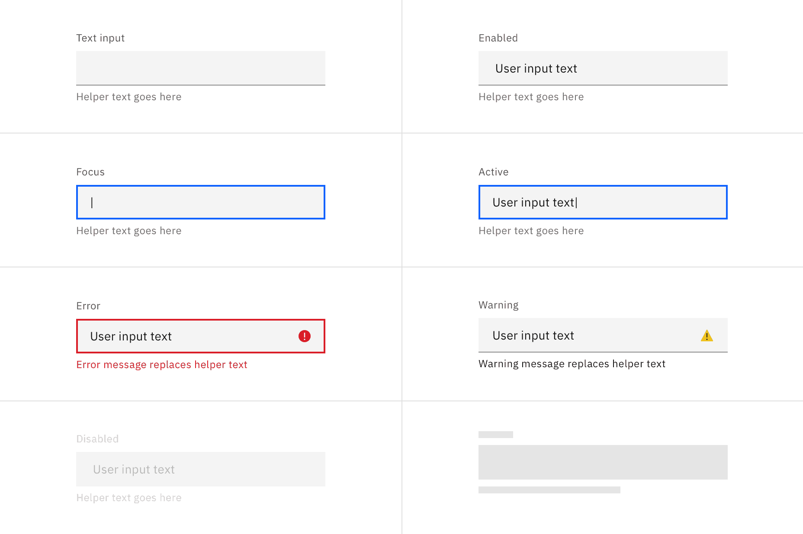

<PageDescription>

Text inputs enable the user to interact with and input content and data. This
component can be used for long and short form entries.

</PageDescription>

<AnchorLinks>

<AnchorLink>Overview</AnchorLink>
<AnchorLink>Live demo</AnchorLink>
<AnchorLink>Formatting</AnchorLink>
<AnchorLink>Content</AnchorLink>
<AnchorLink>Feedback</AnchorLink>

</AnchorLinks>

## Overview

Text inputs enable users to enter free-form text data. There are instances where
you need users to enter both short and long free-form content. The type of text
field used reflects the length of the content you expect the user to enter. Text
input is for expected short, one-line content, whereas text area is for longer,
multi-line entries.

| Variant    | Purpose                                                                               |
| ---------- | ------------------------------------------------------------------------------------- |
| Text input | When the expected user input is a single line of text.                                |
| Text area  | When the expected user input is more than a few words that could span multiple lines. |

### When to use

- A user needs to input unique information that cannot be predicted with a
  preset of options.
- A user needs to input memorable data that can be entered more quickly in a
  free-hand format versus a more complex control.

### When not to use

- If there is a predefined or limited set of valid options a use can enter that
  consider using a different selection control such as a dropdown, select, or
  radio button group.

## Live demo

<ComponentDemo
  components={[
    {
      id: 'text-input',
      label: 'Text input',
    },
    {
      id: 'password-input',
      label: 'Password input',
    },
    {
      id: 'text-area',
      label: 'Text area',
    },
  ]}
>
  <ComponentVariant
    id="text-input"
    knobs={{
      TextInput: ['disabled', 'invalid', 'light'],
    }}
    links={{
      React:
        'https://react.carbondesignsystem.com/?path=/story/components-textinput--default',
      Angular:
        'https://angular.carbondesignsystem.com/?path=/story/components-input--label',
      Vue: 'http://vue.carbondesignsystem.com/?path=/story/components-cvtextinput--default',
      'Web Components':
        'https://web-components.carbondesignsystem.com/?path=/story/components-input--default',
    }}
  >{`
    

      <TextInput
        helperText="Optional helper text"
        id="test2"
        invalidText="A valid value is required"
        labelText="Text input label"
        placeholder="Placeholder text"
      />
    

  `}</ComponentVariant>
  <ComponentVariant
    id="password-input"
    links={{
      React:
        'https://react.carbondesignsystem.com/?path=/story/components-textinput--toggle-password-visibility',
      Angular:
        'https://angular.carbondesignsystem.com/?path=/story/components-input--label',
      Vue: 'http://vue.carbondesignsystem.com/?path=/story/components-cvtextinput--default',
      'Web Components':
        'https://web-components.carbondesignsystem.com/?path=/story/components-input--default',
    }}
  >{`
    

    <TextInput.PasswordInput
      helperText="Optional helper text"
      hidePasswordLabel="Hide password"
      id="test2"
      invalidText="A valid value is required"
      labelText="Text input label"
      placeholder="Placeholder text"
      showPasswordLabel="Show password"
    />
    

  `}</ComponentVariant>
  <ComponentVariant
    id="text-area"
    knobs={{
      TextArea: ['disabled', 'invalid', 'light'],
    }}
    links={{
      React:
        'https://react.carbondesignsystem.com/?path=/story/components-textarea--default',
      Angular:
        'https://angular.carbondesignsystem.com/?path=/story/components-input--textarea',
      Vue: 'http://vue.carbondesignsystem.com/?path=/story/components-cvtextarea--default',
      'Web Components':
        'https://web-components.carbondesignsystem.com/?path=/story/components-textarea--default',
    }}
  >{`
    

    <TextArea
      cols={50}
      helperText="Optional helper text"
      id="test2"
      invalidText="A valid value is required"
      labelText="Text area label"
      placeholder="Placeholder text"
      rows={4}
    />
    

  `}</ComponentVariant>
</ComponentDemo>

## Formatting

### Anatomy

<Row>
<Column colLg={8}>

</Column>
</Row>

1. **Label**: Text that informs the user about the content they need to enter in
   the field. It is required unless you get an approved accessibility exemption.
2. **Value**: The content the user has entered into the field.
3. **Helper text** (optional): Assistive text that can provide additional aid or
   context to the user. Often used to explain the correct data format.
4. **Field**: The container in which a user enters data. Must meet 3:1 non-text
   contrast requirements.
5. **Input requirement** (optional): This label indicates if the field is
   optional or required for the user to complete.
6. **Character counter** (text area only): Indicate the number of characters
   being entered and the total number of characters allowed.
7. **Resize handle** (text area only): Allows a user the manipulate the field
   height by making it longer or shorter.

### Sizing

#### Text input heights

There are three text input height sizes: small, medium, and large. Supporting
three sizes gives you more flexibility in structuring layouts. Be sure to use a
consistent field height when pairing form components on the same page.

| Size        | Height (px/rem) | Use-case                                                                                                                                            |
| ----------- | --------------- | --------------------------------------------------------------------------------------------------------------------------------------------------- |
| Small (sm)  | 32 / 2          | Use when space is constricted or when placing a text input in a form that is long and complex.                                                      |
| Medium (md) | 40 / 2.5        | This is the default size and the most commonly used size. When in doubt, use the medium size.                                                       |
| Large (lg)  | 48/3            | Use when there is a lot of space to work with. The large size is typically used in simple forms or when a text input is placed by itself on a page. |

<Row>
<Column colLg={8}>

</Column>
</Row>

#### Text area height

Text area has a variable height that can be lengthened or shorten by the user
using the `resize` handle in the bottom right of the field. By default, text
area has a minimum height of 40px/2.5 rem and no maximum height.

<Row>
<Column colLg={8}>

</Column>
</Row>

#### Widths

The field widths of both text input and text area should reflect the intended
length of the content while still aligning to the grid columns or mini unit
grid. Unlike the height, the width of the text area cannot be controlled by the
user. There are no minimum or maximum widths but you should avoid excessively
wide fields that are disproportionate to the intended data being collected.

<DoDontRow>
  <DoDont caption="Do make text input widths proportional to the content and align to grid columns.">

  </DoDont>
  <DoDont type="dont" caption="Do not make text inputs excessively wide just to feel in space. ">

  </DoDont>
</DoDontRow>

### Alignment

Labels and field containers should vertically align to the grid and with other
form components on a page.

<DoDontRow>
  <DoDont caption="Do align field containers to the grid.">

  </DoDont>
  <DoDont type="dont" caption="Do not align field text to the grid and hang the field in the gutter.">

  </DoDont>
</DoDontRow>

## Content

### Main elements

#### Labels

Effective labeling helps users understand what information to enter into a text
input. Text fields should always have a label. There are rare instances were the
context of an input negates the need for a visible label but we advise you
consult an accessibility expert before proceeding with a label-less design.

- Use sentence-style capitalization for all labels, except for product names and
  proper nouns.
- Keep the label short and concise.
- Labels should clearly state the requirement status.
- Do not use colons after label names.

#### Helper text

Optional helper text is pertinent information that assists the user in correctly
completing a field. It is often used to explain the correct data format.

- Use sentence-style capitalization, and in most cases, write the text as full
  sentences with punctuation.
- Helper text is an optional feature and can be used in place of a tooltip.
- When used, helper text is always available when the input is focused and
  appears underneath the field. The exception is when an error message for an
  invalid state temporarily replaces the helper text.

#### Placeholder text

Optional placeholder text provides hints or examples of what to enter.
Placeholder text disappears after the user begins entering data into the input
and should not contain crucial information.

- Use sentence-style capitalization, and in most cases, write the text as a
  direct statement without punctuation.
- Placeholder text is not required and by default not shown in text input
  fields.
- Placeholder text can be harmful to user interactions and should only be added
  when necessary.

#### Accessibility best practices

- Labels must be announced to the screen reader on focus.
- Ensure the helper text that appears under an input is read when an assistive
  technology user stops at an input using ARIA.

### Overflow content

#### Overflow in a text input

If a user input is unexpectedly too long for the single line of a text input
then the value content can horizontally scroll inside the field container when
moving the cursor from one end of the value to the other.

#### Overflow in a text area

If a user's context exceeds the vertical space of the variable text area then a
user can either expand the field container using the sizer control or they can
vertically scroll the content inside the set field container.

### Further guidance

For further content guidance, see Carbon's
[content guidelines](/guidelines/content/overview).

## Universal behaviors

The behaviors listed in this section are universal across all variants. For
behaviors that are unique to each variant, see each of the component variant
sections below.

### States

<Row>
<Column colLg={12}>

</Column>
</Row>

| State   | When to use |
| ------- | ----------- |
| Enabled |

| Active

## Feedback

Help us improve this component by providing feedback, asking questions, and
leaving any other comments on
[GitHub](https://github.com/carbon-design-system/carbon-website/issues/new?assignees=&labels=feedback&template=feedback.md).
