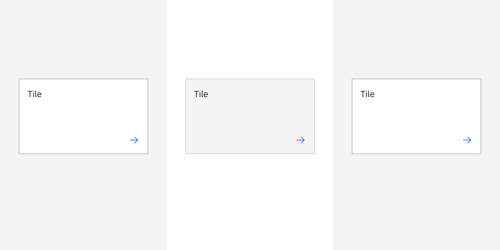

## Color

| Class                        | Property         | Color token |
| ---------------------------- | ---------------- | ----------- |
| `.bx--tile`                  | background-color | `$ui-01`    |
| `.bx--tile:focus`            | border           | `$focus`    |
| `.bx--tile:hover`            | background-color | `$hover-ui` |
| `.bx--tile--is-selected`     | border           | `$ui-05`    |
| `.bx--tile__chevron`         | svg              | `$icon-01`  |
| `.bx--tile__checkmark`       | svg              | `$icon-01`  |
| `.bx--tile__checkmark:hover` | svg              | `$icon-02`  |

## Structure

| Class       | Property          | px / rem | Spacing token |
| ----------- | ----------------- | -------- | ------------- |
| `.bx--tile` | min-height        | 64 / 4   | –             |
| `.bx--tile` | min-width         | 128 / 8  | –             |
| `.bx--tile` | padding (minimum) | 16 / 1   | `$spacing-05` |

<Caption>Structure and spacing measurements for tile | px / rem</Caption>

### Proportions for grid

| Percentage | XL 1600-1200 | L 1200-992 | M 992-768 | S 768-576 | XS 576-0 |
| ---------- | ------------ | ---------- | --------- | --------- | -------- |
| 100%       | ✅           | ✅         | ✅        | ✅        | ✅       |
| 1/2        | ✅           | ✅         | ✅        | ✅        | ✅       |
| 2/3        | ✅           | ✅         | ✅        | ✅        |          |
| 1/3        | ✅           | ✅         | ✅        | ✅        |          |
| 1/4        | ✅           | ✅         | ✅        | ✅        |          |
| 1/6        | ✅           | ✅         |           |           |          |
