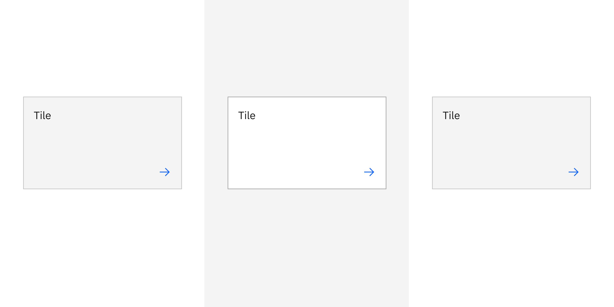

## Color

| Element        | Property         | Color token       |
| -------------- | ---------------- | ----------------- |
| Tile           | background-color | `$layer` \*       |
| Tile: focus    | border           | `$focus`          |
| Tile: hover    | background-color | `$layer-hover` \* |
| Tile: selected | border           | `$border-inverse` |
| Chevron icon   | svg              | `$icon-primary`   |
| Checkmark icon | svg              | `$icon-primary`   |

<Caption>
  * Denotes a contextual color token that will change values based on the layer
  it is placed on.
</Caption>

## Structure

| Element | Property          | px / rem | Spacing token |
| ------- | ----------------- | -------- | ------------- |
| Tile    | min-height        | 64 / 4   | –             |
|         | min-width         | 128 / 8  | –             |
|         | padding (minimum) | 16 / 1   | `$spacing-05` |

<Caption>Structure and spacing measurements for tile | px / rem</Caption>

### Proportions for grid

| Percentage | XL 1600-1200 | L 1200-992 | M 992-768 | S 768-576 | XS 576-0 |
| ---------- | ------------ | ---------- | --------- | --------- | -------- |
| 100%       | ✅           | ✅         | ✅        | ✅        | ✅       |
| 1/2        | ✅           | ✅         | ✅        | ✅        | ✅       |
| 2/3        | ✅           | ✅         | ✅        | ✅        |          |
| 1/3        | ✅           | ✅         | ✅        | ✅        |          |
| 1/4        | ✅           | ✅         | ✅        | ✅        |          |
| 1/6        | ✅           | ✅         |           |           |          |
