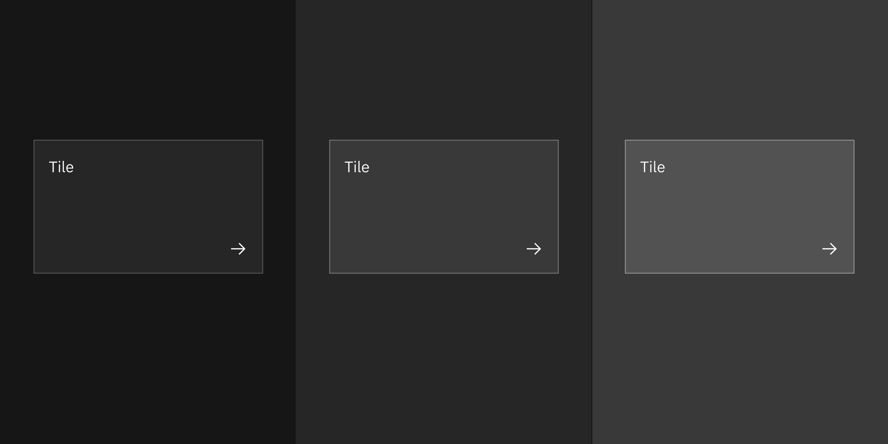

import { Checkmark } from '@carbon/icons-react';
import { white } from '@carbon/themes';

## Color

<InlineNotification>

Except for base tiles, experimental tiles's borders are applicable for
clickable, selectable, and expandable tiles.

</InlineNotification>

| Element                  | Property         | Color token                                                                 |
| ------------------------ | ---------------- | --------------------------------------------------------------------------- |
| Tile                     | background-color | `$layer` \*                                                                 |
| Tile border (White)      | border           | `gray 30` (on background), `gray 40` (on layer-01), `gray 30` (on layer-02) |
| Tile border (Gray 10)    | border           | `gray 40` (on background), `gray 30` (on layer-01), `gray 40` (on layer-02) |
| Tile border (Gray 90)    | border           | `gray 60` (on background), `gray 50` (on layer-01), `gray 40` (on layer-02) |
| Tile border (Gray 100)   | border           | `gray 70` (on background), `gray 60` (on layer-01), `gray 50` (on layer-02) |
| Tile: focus              | border           | `$focus`                                                                    |
| Tile: hover              | background-color | `$layer-hover` \*                                                           |
| Tile: selected           | border           | `$border-inverse`                                                           |
| Arrow icon (light theme) | svg              | `$interactive`                                                              |
| Arrow icon (dark theme)  | svg              | `$icon-primary`                                                             |
| Chevron icon             | svg              | `$icon-primary`                                                             |
| Checkbox icon            | svg              | `$icon-primary`                                                             |
| Checkmark icon           | svg              | `$icon-primary`                                                             |

<Caption>
  * Denotes a contextual color token that will change values based on the layer
  it is placed on.
</Caption>

<Row>
<Column colLg={12}>

<Tabs>

<Tab label="White">

</Tab>

<Tab label="Gray 10">

</Tab>

<Tab label="Gray 90">

</Tab>

<Tab label="Gray 100">

</Tab>

</Tabs>

</Column>
</Row>

### States

<Row>
<Column colLg={8}>

</Column>
</Row>
<Caption>States of the base tile</Caption>

<Row>
<Column colLg={8}>

</Column>
</Row>
<Caption>States of the clickable tile</Caption>

<Row>
<Column colLg={12}>

</Column>
</Row>
<Caption>States of the single-select tile</Caption>

<Row>
<Column colLg={12}>

</Column>
</Row>

<Row>
<Column colLg={12}>
<Caption>States of the multi-select tile</Caption>

</Column>
</Row>
<Caption>States of the expandable tile</Caption>

<Row>
<Column colLg={12}>

</Column>
</Row>
<Caption>States of the expandable tile with interactive elements</Caption>

## Structure

| Element | Property          | px / rem | Spacing token |
| ------- | ----------------- | -------- | ------------- |
| Tile    | min-height        | 64 / 4   | –             |
|         | min-width         | 128 / 8  | –             |
|         | padding (minimum) | 16 / 1   | `$spacing-05` |

<Row>
<Column colLg={12}>

</Column>
</Row>

<Row>
<Column colLg={12}>

</Column>
</Row>

<Caption>Structure and spacing measurements for tile | px / rem</Caption>

### Proportions for grid

| Percentage | XL 1600-1200                            | L 1200-992                              | M 992-768                               | S 768-576                               | XS 576-0                                |
| ---------- | --------------------------------------- | --------------------------------------- | --------------------------------------- | --------------------------------------- | --------------------------------------- |
| 100%       | <Checkmark color={white.iconPrimary} /> | <Checkmark color={white.iconPrimary} /> | <Checkmark color={white.iconPrimary} /> | <Checkmark color={white.iconPrimary} /> | <Checkmark color={white.iconPrimary} /> |
| 1/2        | <Checkmark color={white.iconPrimary} /> | <Checkmark color={white.iconPrimary} /> | <Checkmark color={white.iconPrimary} /> | <Checkmark color={white.iconPrimary} /> | <Checkmark color={white.iconPrimary} /> |
| 2/3        | <Checkmark color={white.iconPrimary} /> | <Checkmark color={white.iconPrimary} /> | <Checkmark color={white.iconPrimary} /> | <Checkmark color={white.iconPrimary} /> |                                         |
| 1/3        | <Checkmark color={white.iconPrimary} /> | <Checkmark color={white.iconPrimary} /> | <Checkmark color={white.iconPrimary} /> | <Checkmark color={white.iconPrimary} /> |                                         |
| 1/4        | <Checkmark color={white.iconPrimary} /> | <Checkmark color={white.iconPrimary} /> | <Checkmark color={white.iconPrimary} /> | <Checkmark color={white.iconPrimary} /> |                                         |
| 1/6        | <Checkmark color={white.iconPrimary} /> | <Checkmark color={white.iconPrimary} /> |                                         |                                         |                                         |
