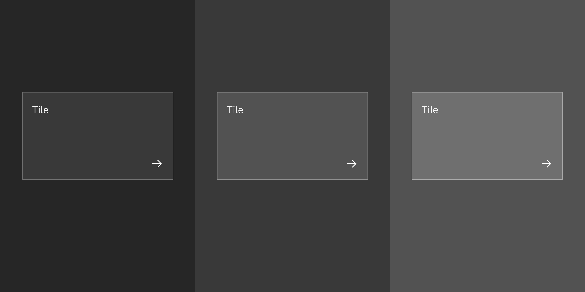
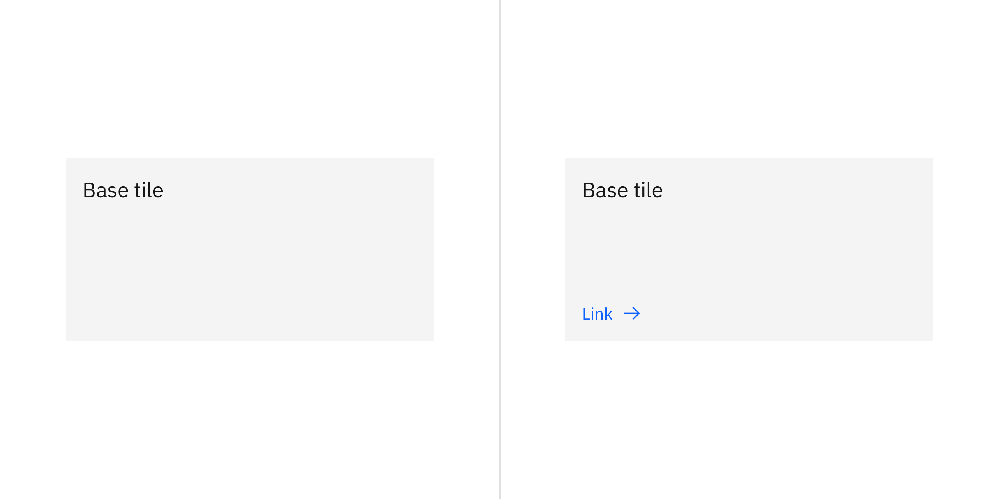
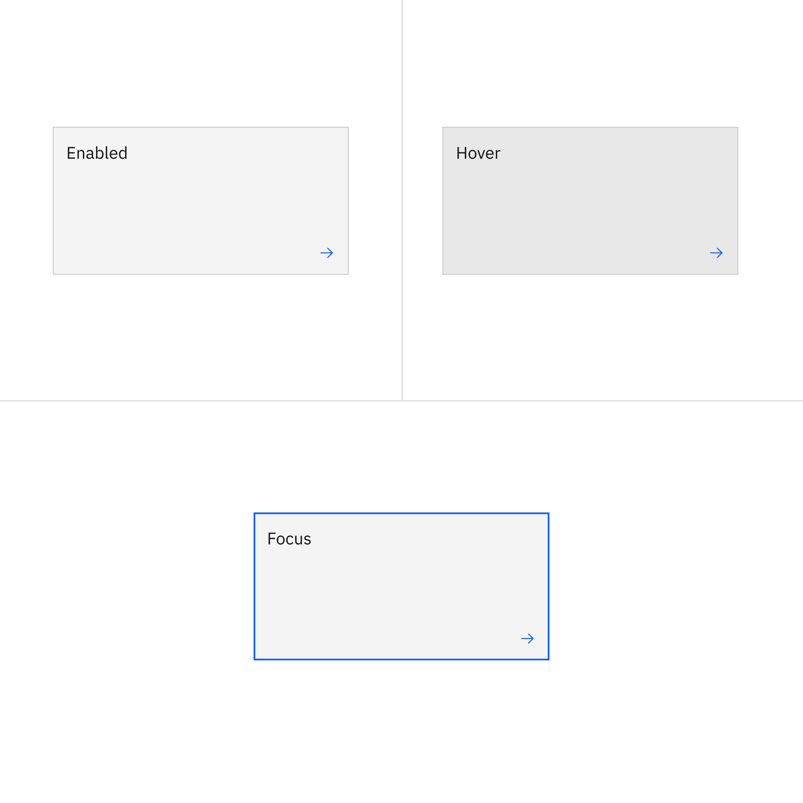
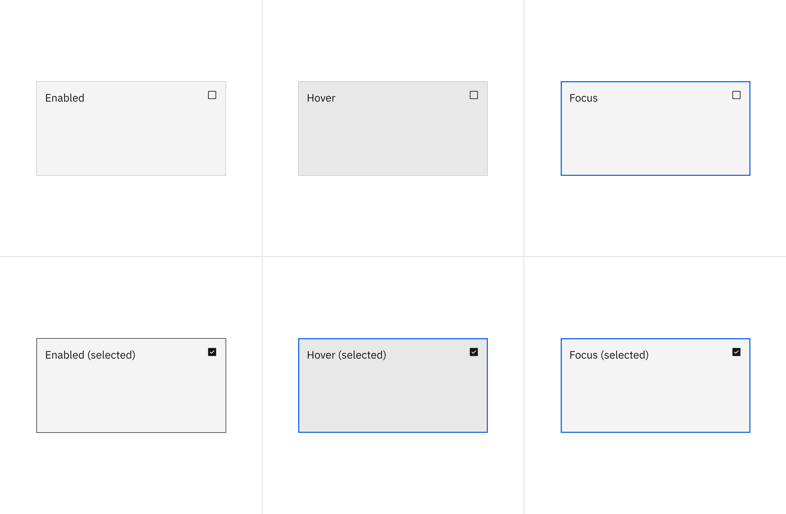
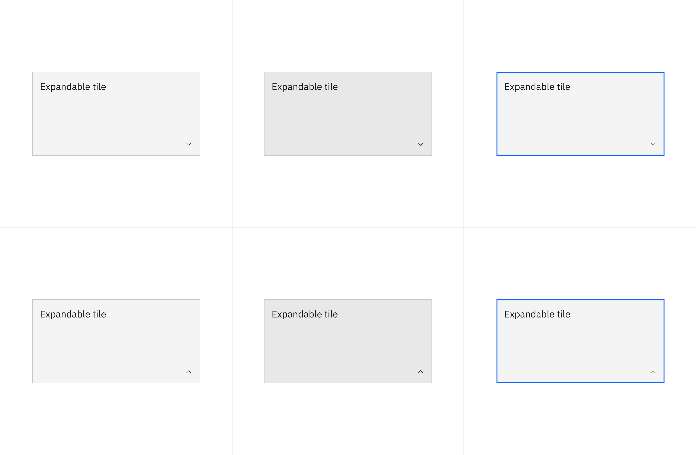
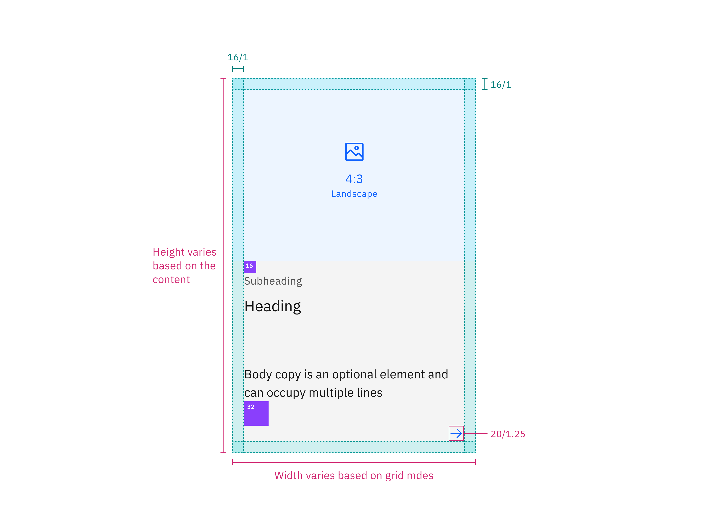
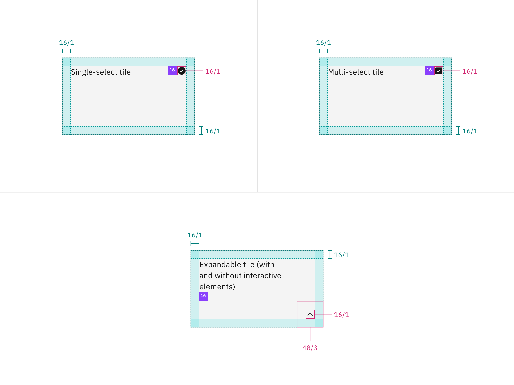

import { Checkmark } from '@carbon/icons-react';
import { white } from '@carbon/themes';

## Color

<InlineNotification>

The tile border applies to clickable, selectable and expandable tiles — not to
base tiles.

</InlineNotification>

| Element          | Property         | Color token         |
| ---------------- | ---------------- | ------------------- |
| Tile: background | background-color | `$layer` \*         |
| Tile border      | border           | `$border-tile` \*   |
| Arrow icon       | svg              | `$icon-interactive` |
| Checkbox icon    | svg              | `$icon-primary`     |
| Checkmark icon   | svg              | `$icon-primary`     |
| Chevron icon     | svg              | `$icon-primary`     |

<Row>
<Column colLg={8}>

</Column>
</Row>

### Interactive states

| Element       | Property         | Color token       |
| ------------- | ---------------- | ----------------- |
| Tile: hover   | background-color | `$layer-hover` \* |
| Tile: focus   | border           | `$focus`          |
| Tile:selected | border           | `$border-inverse` |

#### Base tile

Base tile doesn't have a border. It's not interactive, but can have interactive
elements.

<Row>
<Column colLg={8}>

</Column>
</Row>
<Caption>States of the base tile</Caption>

#### Clickable tile

Clickable tile has states: enabled, hover, and focus.

<Row>
<Column colLg={8}>

</Column>
</Row>
<Caption>States of the clickable tile</Caption>

#### Selectable tiles

Selectable tiles have four states: enabled, hover, focus, and selected.

<Tabs>

<Tab label="Single-select">

</Tab>

<Tab label="Multi-select">

</Tab>

</Tabs>

#### Expandable tiles

Expandable tiles have three states: enabled, hover, and focus.

<Tabs>

<Tab label="Default">

</Tab>

<Tab label="Interactive">

</Tab>

</Tabs>

## Structure

| Element | Property          | px / rem | Spacing token |
| ------- | ----------------- | -------- | ------------- |
| Tile    | min-height        | 64 / 4   | –             |
|         | min-width         | 128 / 8  | –             |
|         | padding (minimum) | 16 / 1   | `$spacing-05` |

<Row>
<Column colLg={12}>

</Column>
</Row>

<Row>
<Column colLg={12}>

</Column>
</Row>

<Caption>Structure and spacing measurements for tile | px / rem</Caption>

### Proportions for grid

| Percentage | XL 1600-1200                            | L 1200-992                              | M 992-768                               | S 768-576                               | XS 576-0                                |
| ---------- | --------------------------------------- | --------------------------------------- | --------------------------------------- | --------------------------------------- | --------------------------------------- |
| 100%       | <Checkmark color={white.iconPrimary} /> | <Checkmark color={white.iconPrimary} /> | <Checkmark color={white.iconPrimary} /> | <Checkmark color={white.iconPrimary} /> | <Checkmark color={white.iconPrimary} /> |
| 1/2        | <Checkmark color={white.iconPrimary} /> | <Checkmark color={white.iconPrimary} /> | <Checkmark color={white.iconPrimary} /> | <Checkmark color={white.iconPrimary} /> | <Checkmark color={white.iconPrimary} /> |
| 2/3        | <Checkmark color={white.iconPrimary} /> | <Checkmark color={white.iconPrimary} /> | <Checkmark color={white.iconPrimary} /> | <Checkmark color={white.iconPrimary} /> |                                         |
| 1/3        | <Checkmark color={white.iconPrimary} /> | <Checkmark color={white.iconPrimary} /> | <Checkmark color={white.iconPrimary} /> | <Checkmark color={white.iconPrimary} /> |                                         |
| 1/4        | <Checkmark color={white.iconPrimary} /> | <Checkmark color={white.iconPrimary} /> | <Checkmark color={white.iconPrimary} /> | <Checkmark color={white.iconPrimary} /> |                                         |
| 1/6        | <Checkmark color={white.iconPrimary} /> | <Checkmark color={white.iconPrimary} /> |                                         |                                         |                                         |
