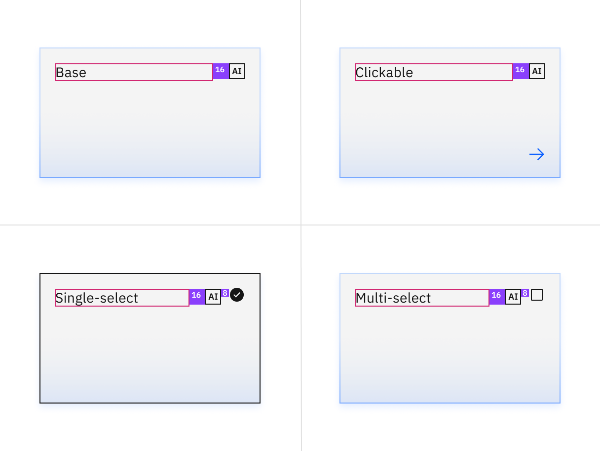

import { Checkmark } from '@carbon/icons-react';
import { white } from '@carbon/themes';

<PageDescription>

The following page documents visual specifications such as color, typography,
and structure.

</PageDescription>

<AnchorLinks>

<AnchorLink>Color</AnchorLink>
<AnchorLink>Typography</AnchorLink>
<AnchorLink>Structure</AnchorLink>
<AnchorLink>AI presence</AnchorLink>
<AnchorLink>Feedback</AnchorLink>

</AnchorLinks>

<PageDescription>

The following page documents visual specifications such as color, typography,
and structure.

</PageDescription>

<AnchorLinks>

<AnchorLink>Color</AnchorLink>
<AnchorLink>Typography</AnchorLink>
<AnchorLink>Structure</AnchorLink>
<AnchorLink>AI presence</AnchorLink>
<AnchorLink>Feedback</AnchorLink>

</AnchorLinks>

## Color

<InlineNotification>

The tile border applies to clickable, selectable and expandable tiles — not to
base tiles.

</InlineNotification>

| Element         | Property         | Color token         |
| --------------- | ---------------- | ------------------- |
| Tile:background | background-color | `$layer` \*         |
| Tile border     | border           | `$border-tile` \*   |
| Icon            | svg              | `$icon-interactive` |
| Checkbox icon   | svg              | `$icon-primary`     |
| Checkmark icon  | svg              | `$icon-primary`     |
| Chevron icon    | svg              | `$icon-primary`     |

<Caption>
  * Denotes a contextual color token that will change values based on the layer
  it is placed on.
</Caption>

<Row>
<Column colLg={8}>

</Column>
</Row>

<Caption>
  The example shows layering tokens applied across layers in the Gray 100 theme.
</Caption>

### Interactive states

| Element                      | Property         | Color token        |
| ---------------------------- | ---------------- | ------------------ |
| Tile:hover                   | background-color | `$layer-hover` \*  |
| Tile:focus                   | border           | `$focus`           |
| Tile:selected                | border           | `$border-inverse`  |
| Tile:disabled                | border           | `$border-disabled` |
| Icon:disabled (or pictogram) | svg              | `$icon-disabled`   |
| Text:disabled                | text color       | `$text-disabled`   |

<Caption>
  * Denotes a contextual color token that will change values based on the layer
  it is placed on.
</Caption>

#### Base tile

Base tile doesn't have a border. It's not interactive, but can have interactive
elements. Base tile only has the enabled state.

<Row>
<Column colLg={8}>

</Column>
</Row>

#### Clickable tile

Clickable tile has four states: enabled, hover, focus, and disabled.

<Row>
<Column colLg={8}>

</Column>
</Row>

#### Selectable tiles

Selectable tiles have five states: enabled, hover, focus, selected, and
disabled.

<Row>
<Column colLg={8}>

<Tabs>

<Tab label="Single-select">

</Tab>

<Tab label="Multi-select">

</Tab>

</Tabs>

</Column>
</Row>

#### Expandable tiles

Expandable tiles have three states: enabled, hover, and focus.

<Row>
<Column colLg={8}>
<Tabs>

<Tab label="Default">

</Tab>

<Tab label="Interactive">

</Tab>

</Tabs>

</Column>
</Row>

## Typography

The default token for the title is `$body-compact-01`, although it can be
altered as needed by the product teams.

| Element     | Font-size (px/rem) | Font-weight   | Type token         |
| ----------- | ------------------ | ------------- | ------------------ |
| Tile        | 14 / 0.875         | Regular / 400 | `$body-compact-01` |
| Description | 14 / 0.875         | Regular / 400 | `$body-compact-01` |

## Structure

| Element | Property          | px / rem | Spacing token |
| ------- | ----------------- | -------- | ------------- |
| Tile    | min-height        | 64 / 4   | –             |
|         | min-width         | 128 / 8  | –             |
|         | padding (minimum) | 16 / 1   | `$spacing-05` |

<Row>
<Column colLg={12}>

</Column>
</Row>

<Row>
<Column colLg={12}>

</Column>
</Row>

<Caption>Structure and spacing measurements for tile | px / rem</Caption>

### Proportions for grid

| Percentage | XL 1600-1200                            | L 1200-992                              | M 992-768                               | S 768-576                               | XS 576-0                                |
| ---------- | --------------------------------------- | --------------------------------------- | --------------------------------------- | --------------------------------------- | --------------------------------------- |
| 100%       | <Checkmark color={white.iconPrimary} /> | <Checkmark color={white.iconPrimary} /> | <Checkmark color={white.iconPrimary} /> | <Checkmark color={white.iconPrimary} /> | <Checkmark color={white.iconPrimary} /> |
| 1/2        | <Checkmark color={white.iconPrimary} /> | <Checkmark color={white.iconPrimary} /> | <Checkmark color={white.iconPrimary} /> | <Checkmark color={white.iconPrimary} /> | <Checkmark color={white.iconPrimary} /> |
| 2/3        | <Checkmark color={white.iconPrimary} /> | <Checkmark color={white.iconPrimary} /> | <Checkmark color={white.iconPrimary} /> | <Checkmark color={white.iconPrimary} /> |                                         |
| 1/3        | <Checkmark color={white.iconPrimary} /> | <Checkmark color={white.iconPrimary} /> | <Checkmark color={white.iconPrimary} /> | <Checkmark color={white.iconPrimary} /> |                                         |
| 1/4        | <Checkmark color={white.iconPrimary} /> | <Checkmark color={white.iconPrimary} /> | <Checkmark color={white.iconPrimary} /> | <Checkmark color={white.iconPrimary} /> |                                         |
| 1/6        | <Checkmark color={white.iconPrimary} /> | <Checkmark color={white.iconPrimary} /> |                                         |                                         |                                         |

## AI presence

The following are the unique styles applied to the components when the AI slug
is present. Unless specified, all other tokens in the components remain the same
as the non-AI variants.

More information about designing for AI guidelines is coming soon.

| Element                    | Property         | Token / Size       |
| -------------------------- | ---------------- | ------------------ |
| Tile:background            | background-color | `$layer` \*        |
|                            | box-shadow       | `$ai-drop-shadow`  |
|                            | inner-shadow     | `$ai-inner-shadow` |
| Linear-gradient:background | start            | `$ai-aura-start`   |
|                            | top              | `$ai-aura-stop`    |
| Linear-gradient:border     | start            | `$ai-border-start` |
|                            | stop             | `$ai-border-stop`  |
| AI slug                    | size             | mini               |

<Caption>
  * Denotes a contextual color token that will change values based on the layer
  it is placed on.
</Caption>

<Row>
<Column colLg={8}>

</Column>
</Row>

<Caption>Structure and spacing measurements for tile wit AI presence</Caption>

## Feedback

Help us improve this component by providing feedback, asking questions, and
leaving any other comments on
[GitHub](https://github.com/carbon-design-system/carbon-website/issues/new?assignees=&labels=feedback&template=feedback.md).
