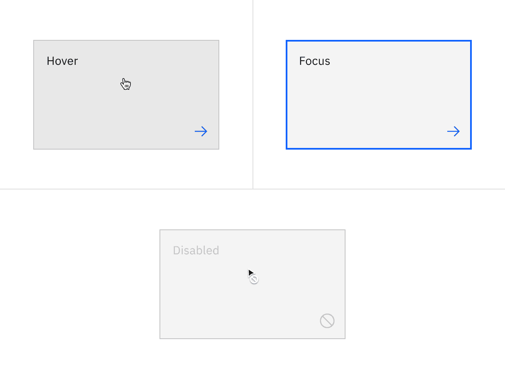
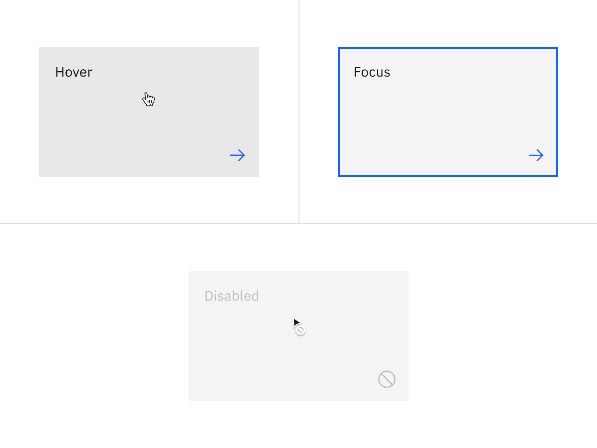
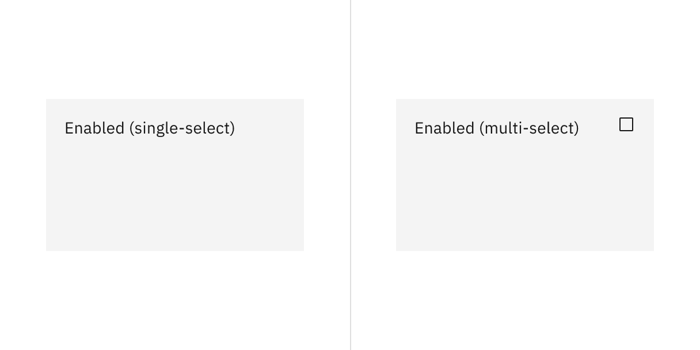
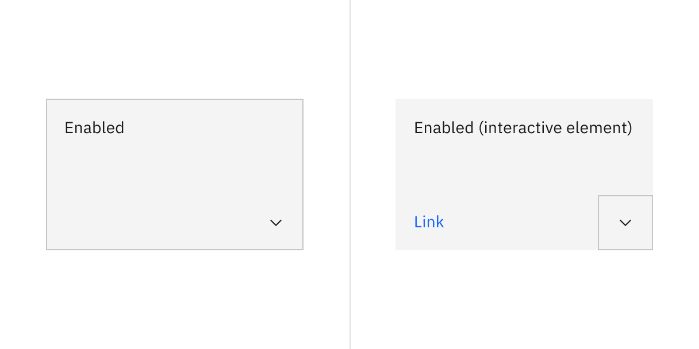
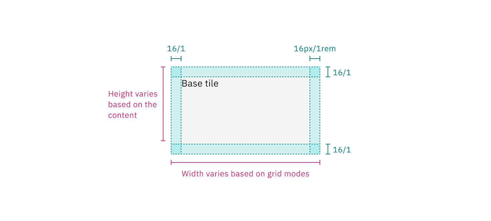
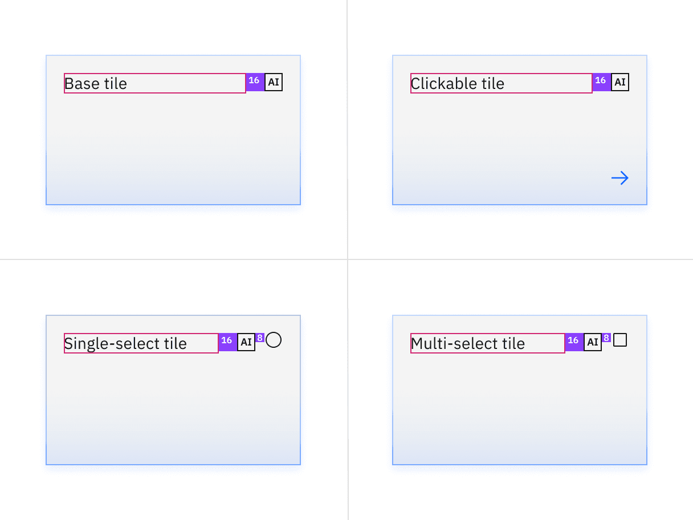

import { Checkmark } from '@carbon/icons-react';
import { white } from '@carbon/themes';

<PageDescription>

The following page documents visual specifications such as color, typography,
structure, and AI presence.

</PageDescription>

<AnchorLinks>

<AnchorLink>Color</AnchorLink>
<AnchorLink>Typography</AnchorLink>
<AnchorLink>Structure</AnchorLink>
<AnchorLink>AI presence</AnchorLink>
<AnchorLink>Feedback</AnchorLink>

</AnchorLinks>

## Color

### Base tile color

| Element   | Property         | Color token     |
| --------- | ---------------- | --------------- |
| Container | background-color | `$layer` \*     |
| Text      | text color       | `$text-primary` |

<Row>
<Column colLg={8}>

<Caption>Base tile color</Caption>

</Column>
</Row>

### Clickable tile color

Clickable tiles have an available
[feature flag](/components/overview/feature-flags/).

| Element               | Property         | Color token         |
| --------------------- | ---------------- | ------------------- |
| Container             | background-color | `$layer` \*         |
| Text                  | text color       | `$text-primary`     |
| Border (feature flag) | border           | `$border-tile` \*   |
| Icon                  | svg              | `$icon-interactive` |

<Caption fullWidth>
  \* Denotes a contextual color token that will change values based on the layer
  it is placed on.
</Caption>

<Row>
<Column colLg={8}>
<Tabs>

<Tab label="Flag enabled">

</Tab>

<Tab label="Flag disabled">

</Tab>

</Tabs>

</Column>
</Row>

<Title>Clickable tile interactive state color</Title>

| State    | Element   | Property         | Color token        |
| -------- | --------- | ---------------- | ------------------ |
| Hover    | Container | background-color | `$layer-hover` \*  |
| Focus    | Container | border           | `$focus`           |
| Disabled | Container | border           | `$border-disabled` |
|          | Text      | text color       | `$text-disabled`   |
|          | Icon      | svg              | `$icon-disabled`   |

<Caption fullWidth>
  \* Denotes a contextual color token that will change values based on the layer
  it is placed on.
</Caption>

<Row>
<Column colLg={8}>
<Tabs>

<Tab label="Flag enabled">

</Tab>

<Tab label="Flag disabled">

</Tab>

</Tabs>

</Column>
</Row>

### Selectable tile color

Selectable tiles have available
[feature flags](/components/overview/feature-flags/).

| Element   | Property         | Color token       |
| --------- | ---------------- | ----------------- |
| Container | background-color | `$layer` \*       |
| Text      | text color       | `$text-primary`   |
| Border    | border           | `$border-tile` \* |
| Icon      | svg              | `$icon-primary`   |

<Caption fullWidth>
  \* Denotes a contextual color token that will change values based on the layer
  it is placed on.
</Caption>

<Row>
<Column colLg={8}>
<Tabs>

<Tab label="Flag enabled">

</Tab>

<Tab label="Flag disabled">

</Tab>

</Tabs>

</Column>
</Row>

<Title>Selectable tile interactive state color</Title>

| State          | Element   | Property         | Color token        |
| -------------- | --------- | ---------------- | ------------------ |
| Hover          | Container | background-color | `$layer-hover` \*  |
| Hover selected | Container | background-color | `$layer-hover` \*  |
|                |           | border           | `$border-inverse`  |
| Selected       | Container | border           | `$border-inverse`  |
| Focus          | Container | border           | `$focus`           |
| Disabled       | Container | border           | `$border-disabled` |
|                | Text      | text color       | `$text-disabled`   |
|                | Icon      | svg              | `$icon-disabled`   |

<Caption fullWidth>
  \* Denotes a contextual color token that will change values based on the layer
  it is placed on.
</Caption>

<Row>
<Column colLg={8}>
<Tabs>

<Tab label="Flag enabled">

</Tab>

<Tab label="Flag disabled">

</Tab>

</Tabs>

</Column>
</Row>

### Expandable tile color

Expandable tiles have an available
[feature flag](/components/overview/feature-flags/).

| Element   | Property         | Color token       |
| --------- | ---------------- | ----------------- |
| Container | background-color | `$layer` \*       |
|           | text color       | `$text-primary`   |
|           | border           | `$border-tile` \* |
| Icon      | svg              | `$icon-primary`   |

<Row>
<Column colLg={8}>
<Tabs>

<Tab label="Flag enabled">

</Tab>

<Tab label="Flag disabled">

</Tab>

</Tabs>

</Column>
</Row>

<Title>Expandable tile interactive state color</Title>

| State    | Element   | Property         | Color token        |
| -------- | --------- | ---------------- | ------------------ |
| Hover    | Container | background-color | `$layer-hover` \*  |
| Focus    | Container | border           | `$focus`           |
| Disabled | Container | border           | `$border-disabled` |
|          | Text      | text color       | `$text-disabled`   |
|          | Icon      | svg              | `$icon-disabled`   |

<Caption fullWidth>
  \* Denotes a contextual color token that will change values based on the layer
  it is placed on.
</Caption>

<Row>
<Column colLg={8}>
<Tabs>

<Tab label="Flag enabled">

</Tab>

<Tab label="Flag disabled">

</Tab>

</Tabs>

</Column>
</Row>

<Row>
<Column colLg={8}>
<Tabs>

<Tab label="Flag enabled">

</Tab>

<Tab label="Flag disabled">

</Tab>

</Tabs>

</Column>
</Row>

## Typography

The default token for tile titles is `$body-compact-01`, although it can be
customized as needed by product teams.

| Element | Font-size (px/rem) | Font-weight   | Type token         |
| ------- | ------------------ | ------------- | ------------------ |
| Title   | 14 / 0.875         | Regular / 400 | `$body-compact-01` |

## Structure

### Base tile structure

| Element   | Property                    | px / rem | Spacing token |
| --------- | --------------------------- | -------- | ------------- |
| Container | min-height                  | 64 / 4   | –             |
|           | min-width                   | 128 / 8  | –             |
| Content   | padding-top, padding-bottom | 16 / 1   | `$spacing-05` |
|           | padding-left, padding-right | 16 / 1   | `$spacing-05` |

<Caption>Structure and spacing measurements for base tile | px / rem</Caption>

### Clickable tile structure

| Element   | Property                    | px / rem  | Spacing token |
| --------- | --------------------------- | --------- | ------------- |
| Container | min-height                  | 64 / 4    | –             |
|           | min-width                   | 128 / 8   | –             |
| Content   | padding-top, padding-bottom | 16 / 1    | `$spacing-05` |
|           | padding-left, padding-right | 16 / 1    | `$spacing-05` |
| Icon      | padding-top, padding-bottom | 12 / 0.75 | `$spacing-04` |
|           | padding-left, padding-right | 12 / 0.75 | `$spacing-04` |
|           | size                        | 20px      | –             |

<Caption fullwidth>
  Structure and spacing measurements for clickable tile with the feature flag
  enabled | px / rem
</Caption>

### Selectable tile structure

| Element   | Property                    | px / rem | Spacing token |
| --------- | --------------------------- | -------- | ------------- |
| Container | min-height                  | 64 / 4   | –             |
|           | min-width                   | 128 / 8  | –             |
| Content   | padding-top, padding-bottom | 16 / 1   | `$spacing-05` |
|           | padding-left, padding-right | 16 / 1   | `$spacing-05` |
| Icon      | padding-top, padding-bottom | 16 / 1   | `$spacing-05` |
|           | padding-left, padding-right | 16 / 1   | `$spacing-05` |
|           | size                        | 16px     | –             |

<Caption fullwidth>
  Structure and spacing measurements for selectable tile with the feature flags
  enabled | px / rem
</Caption>

### Expandable tile structure

| Element   | Property                    | px / rem | Spacing token |
| --------- | --------------------------- | -------- | ------------- |
| Container | min-height                  | 64 / 4   | –             |
|           | min-width                   | 128 / 8  | –             |
| Content   | padding-top, padding-bottom | 16 / 1   | `$spacing-05` |
|           | padding-left, padding-right | 16 / 1   | `$spacing-05` |
| Icon      | padding-top, padding-bottom | 16 / 1   | `$spacing-05` |
|           | padding-left, padding-right | 16 / 1   | `$spacing-05` |
|           | size                        | 16px     | –             |
| Link      | padding-bottom              | 16 / 1   | `$spacing-05` |
|           | padding-left, padding-right | 16 / 1   | `$spacing-05` |

<Caption fullwidth>
  Structure and spacing measurements for expandable tile with the feature flag
  enabled | px / rem
</Caption>

### Proportions for grid

| Percentage | XL 1600-1200                            | L 1200-992                              | M 992-768                               | S 768-576                               | XS 576-0                                |
| ---------- | --------------------------------------- | --------------------------------------- | --------------------------------------- | --------------------------------------- | --------------------------------------- |
| 100%       | <Checkmark color={white.iconPrimary} /> | <Checkmark color={white.iconPrimary} /> | <Checkmark color={white.iconPrimary} /> | <Checkmark color={white.iconPrimary} /> | <Checkmark color={white.iconPrimary} /> |
| 1/2        | <Checkmark color={white.iconPrimary} /> | <Checkmark color={white.iconPrimary} /> | <Checkmark color={white.iconPrimary} /> | <Checkmark color={white.iconPrimary} /> | <Checkmark color={white.iconPrimary} /> |
| 2/3        | <Checkmark color={white.iconPrimary} /> | <Checkmark color={white.iconPrimary} /> | <Checkmark color={white.iconPrimary} /> | <Checkmark color={white.iconPrimary} /> |                                         |
| 1/3        | <Checkmark color={white.iconPrimary} /> | <Checkmark color={white.iconPrimary} /> | <Checkmark color={white.iconPrimary} /> | <Checkmark color={white.iconPrimary} /> |                                         |
| 1/4        | <Checkmark color={white.iconPrimary} /> | <Checkmark color={white.iconPrimary} /> | <Checkmark color={white.iconPrimary} /> | <Checkmark color={white.iconPrimary} /> |                                         |
| 1/6        | <Checkmark color={white.iconPrimary} /> | <Checkmark color={white.iconPrimary} /> |                                         |                                         |                                         |

## AI presence

The following are the unique styles applied to the components when the AI label
is present. Unless specified, all other tokens in the components remain the same
as the non-AI variants.

For more information on the AI style elements, see the
[Carbon for AI](/guidelines/carbon-for-ai/) guidelines.

| Element                    | Property         | Token / Size       |
| -------------------------- | ---------------- | ------------------ |
| Tile:background            | background-color | `$layer` \*        |
|                            | box-shadow       | `$ai-drop-shadow`  |
|                            | inner-shadow     | `$ai-inner-shadow` |
| Linear-gradient:background | start            | `$ai-aura-start`   |
|                            | top              | `$ai-aura-stop`    |
| Linear-gradient:border     | start            | `$ai-border-start` |
|                            | stop             | `$ai-border-stop`  |
| AI label                   | size             | mini               |

<Caption fullWidth>
  \* Denotes a contextual color token that will change values based on the layer
  it is placed on.
</Caption>

<Row>
<Column colLg={8}>

</Column>
</Row>

<Caption>Structure and spacing measurements for tile with AI presence</Caption>

## Feedback

Help us improve this component by providing feedback, asking questions, and
leaving any other comments on
[GitHub](https://github.com/carbon-design-system/carbon-website/issues/new?assignees=&labels=feedback&template=feedback.md).
