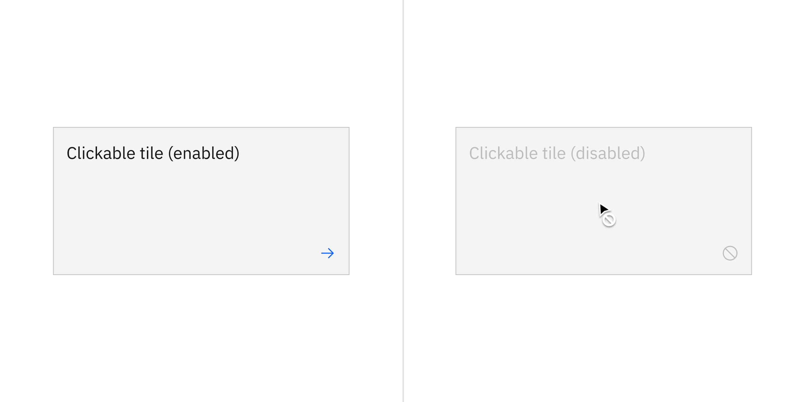
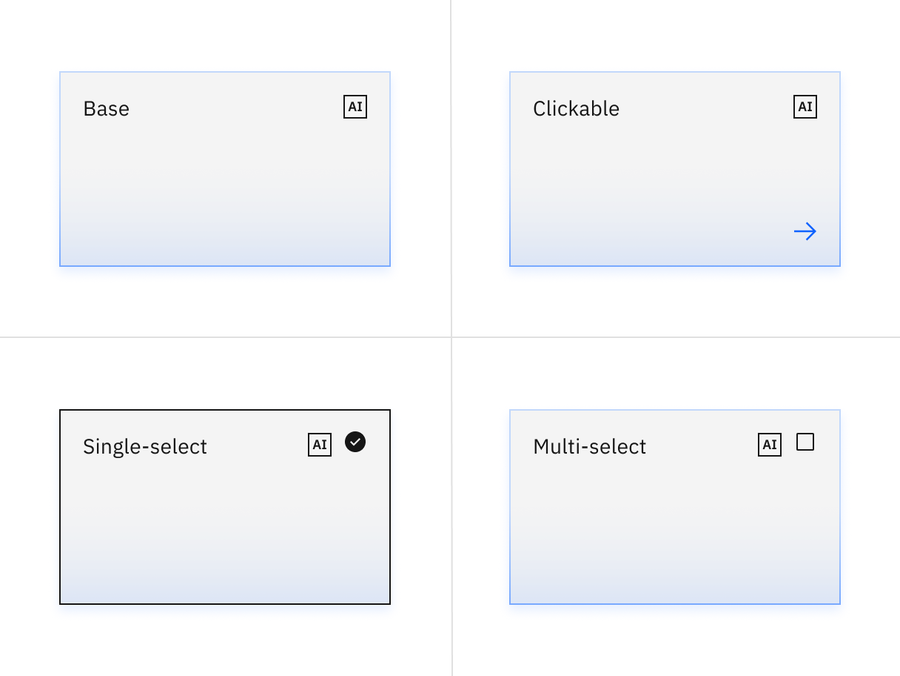

import A11yStatus from 'components/A11yStatus';

<PageDescription>

Tiles are a highly flexible component for displaying a wide variety of content,
including information, getting started, how-to, next steps, and more.

</PageDescription>

<InlineNotification>

Tile now offers multiple experimental features. The experimental
[slug](https://react.carbondesignsystem.com/?path=/story/experimental-unstable-slug-examples--tile)
(aka AI label) changes the visual appearance and adds an AI explainability
feature when AI is present in tile.

 

Additionally, a visual accessibility enhancement is available with
[experimental tiles](https://react.carbondesignsystem.com/?path=/docs/experimental-feature-flags-tile--overview).
We encourage teams to start using these tiles, although current tiles are still
supported.

</InlineNotification>

<AnchorLinks>

<AnchorLink>Live demo</AnchorLink>
<AnchorLink>Overview</AnchorLink>
<AnchorLink>Variants</AnchorLink>
<AnchorLink>Formatting</AnchorLink>
<AnchorLink>Universal behaviors</AnchorLink>
<AnchorLink>AI presence</AnchorLink>
<AnchorLink>Related</AnchorLink>
<AnchorLink>References</AnchorLink>
<AnchorLink>Feedback</AnchorLink>

</AnchorLinks>

## Live demo

<StorybookDemo
  themeSelector
  url="https://react.carbondesignsystem.com"
  variants={[
    {
      label: 'Default',
      variant: 'components-tile--default',
    },
    {
      label: 'Clickable',
      variant: 'components-tile--clickable',
    },
    {
      label: 'Expandable',
      variant: 'components-tile--expandable',
    },
    {
      label: 'Expandable with interactive',
      variant: 'components-tile--expandable-with-interactive',
    },
    {
      label: 'Multiselect',
      variant: 'components-tile--multi-select',
    },
    {
      label: 'Radio',
      variant: 'components-tile--radio',
    },
    {
      label: 'Selectable',
      variant: 'components-tile--selectable',
    },
    {
      label: 'Clickable with Improved Contrast (unstable)',
      variant: 'experimental-feature-flags-tile--clickable',
    },
    {
      label: 'Expandable with Improved Contrast (unstable)',
      variant: 'experimental-feature-flags-tile--expandable',
    },
    {
      label: 'Multiselect with Improved Contrast (unstable)',
      variant: 'experimental-feature-flags-tile--multi-select',
    },
    {
      label: 'Radio with Improved Contrast (unstable)',
      variant: 'experimental-feature-flags-tile--radio',
    },
    {
      label: 'Selectable with Improved Contrast (unstable)',
      variant: 'experimental-feature-flags-tile--selectable',
    },
    {
      label: 'With AI slug',
      variant: 'experimental-unstable-slug-examples--tile',
    },
  ]}
/>

<A11yStatus layout="cards" components="Tile" />

## Overview

Carbon ships a basic tile structure that responds to the grid. Tiles can contain
type, images and/or blocks of color. However, Carbon tiles have no pre-set
styles for the content inside. Tile usage guidance focuses solely on basic tile
functions—not the information hierarchy within the tile or guidance around
additional interactive elements that the tile may contain.

<Row>
<Column colLg={12}>

</Column>
</Row>

#### Tiles versus Cards

Tiles are simple and foundational. Cards can be very complex. Cards are built
upon the tile foundation and have various patterns of information hierarchy,
multiple actions, overflow menus, selectable features, etc. Carbon does not have
a Card pattern yet, but we link out to several card patterns within our pattern
asset library (PAL) ecosystem below:

- [Productive vs. Expressive cards](https://pages.github.ibm.com/cdai-design/pal/components/card/overview/)
  (Carbon for Cloud & Cognitive)
- [Dashboard cards](https://pages.github.ibm.com/ai-applications/design/patterns/dashboards-v2/overview/#dashboard-cards)
  (AI Applications Design)
- [Card](https://www.ibm.com/standards/carbon/components/cards) (Carbon for
  IBM.com)

### When to use

Tiles are reusable components that provide shortcuts to building cards and other
modules. Use tiles to group related information in flexible containers. Here are
some common use cases for when to use tiles:

- To contain related groupings of information or actions
- To guide users to take actions or navigate
- To present options for single or multiple selections
- To hide or show large amounts of content

### When not to use

Tiles reside in the same plane as the background layer—they do not have
**elevation**. Tiles organize essential information and have the same visual
hierarchy as content within the same page.

Do not add a drop shadow to tiles and use them on the screen to reveal secondary
information, actions, or notifications. Use [modals](/components/modal/usage),
[popover](/components/popover/usage), and
[dialogs](https://carbondesignsystem.com/patterns/dialog-pattern/) which have
elevation and are appropriate for this function instead.

## Variants

<InlineNotification>

The
[experimental tiles](https://react.carbondesignsystem.com/?path=/docs/experimental-feature-flags-tile--overview)
are applicable to clickable, selectable and expandable tiles — not to base
tiles.

</InlineNotification>

Tiles can function or be implemented in four ways—base, clickable, selectable,
or expandable. These variations of tiles are flexible enough to support a
variety of different use cases when building more complicated card features.

| Variant                   | Purpose                                                                                                  |
| ------------------------- | -------------------------------------------------------------------------------------------------------- |
| [Base](#base)             | For high-level, short, and digestible content pieces such as features, plans, or services offered        |
| [Clickable](#clickable)   | For prompting an action, navigating or directing to other pieces of information about the subject matter |
| [Selectable](#selectable) | For presenting options to a user in a structured manner, such as a set of pricing plans                  |
| [Expandable](#expandable) | For hiding and revealing a large amount of content to focus on specific pieces of information            |

### Base

Base tiles are used to display information to the user, such as features or
services offered. Base tiles are often seen on marketing pages to promote
content or on highly-interactive dashboards. These tiles can have internal
calls-to-action (CTAs), such as a [button](/components/button/usage) or a
[link](/components/link/usage).

<Row>
<Column colLg={8}>

</Column>
</Row>

### Clickable

Clickable tiles can be used as navigational elements that redirect the user to a
new page. In these situations, the entire tile is in a clickable state. Due to
accessibility concerns, clickable tiles cannot contain separate internal CTAs
but can contain pictograms, icons, or media such as illustrations or images.

<Row>
<Column colLg={8}>

</Column>
</Row>

### Selectable

Selectable tiles work well for presenting options to a user in a structured
manner, such as a set of pricing plans. Selectable tiles may contain internal
CTAs (like links to docs) if the internal CTA is given its own click target.

Selectable tiles can either have a single-select state working like a
[radio button](/components/radio-button/usage), or multi-select state working as
a [checkbox](/components/checkbox/usage).

<Row>
<Column colLg={8}>

<Caption>Single-select tiles</Caption>

<Caption>Multi-select tiles</Caption>

</Column>
</Row>

### Expandable

Expandable tiles are helpful for hiding and showing large amounts of content to
a user. When expanded, tiles push content down the page. They allow the user to
specifically focus on featured content while having access to the rest of the
information. Expandable tiles can contain internal CTAs (like links to docs) if
they are given their own click targets.

<Row>
<Column colLg={8}>

<Caption>Expandable tile with interactive elements</Caption>

<Caption>Expandable tile without interactive elements</Caption>

</Column>
</Row>

## Formatting

### Anatomy

<Row>
<Column colLg={8}>

</Column>
</Row>

1. **Image (optional)** : The image size follows standard Carbon aspect ratios
   (in this case, with a default size of 4:3)

2. **Container**: Contains the content area

3. **Content area**: Contains the information and/or controls needed to complete
   the modal's task. It can include message text and components.

### Sizing

The **width** varies depending on three basic gutter modes: wide, narrow, and
condensed. Tile **height** varies depending on the amount of content placed
within it, but applies the
[spacing](https://carbondesignsystem.com/guidelines/spacing/overview/) and
follows Carbon's standard
[aspect ratios](https://www.carbondesignsystem.com/guidelines/2x-grid/overview/#aspect-ratio).
The minimum height starts with 2:1 aspect ratio. As the content grows, set
vertical spacing between sections within the content area.

### Alignment

#### Icon and call-to-action button

On clickable tiles, use the arrow icon as default with the `$icon-interactive`
token. Place the icon at the bottom right to indicate navigation. Avoid
confusing the user with multiple click targets (like interactive links or
buttons) on clickable tiles.

<DoDontRow>
  <DoDont type="do" caption="Do right align the icon when it is by itself.">

  </DoDont>

  <DoDont type="do" caption="Do right align the icon when there is additional text.">

  </DoDont>
</DoDontRow>

<DoDontRow>

  <DoDont type="do" caption="Do right align the icon when there is an icon or pictogram.">

  </DoDont>

  <DoDont type="dont" caption="Do not add interactive links or components on clickable tiles.">

  </DoDont>
</DoDontRow>

On base tiles, place the interactive link at the bottom left or the button at
the bottom to indicate call-to-action items.

<DoDontRow>
  <DoDont type="do" caption="Do left align the interactive link at the bottom on base tile.">

  </DoDont>

  <DoDont type="do" caption="Do place the button at the bottom on base tile.">

  </DoDont>
</DoDontRow>

#### Tile groups

Tile groups are useful for aligning tiles that have a strong relationship. Tile
groups flow horizontally from left to right usually and have similar
hierarchical importance as with navigation or catalog tiles.

<Row>
<Column colLg={12}>

<Caption>Example image of how tiles are built on the wide grid.</Caption>

</Column>
</Row>

<Row>
<Column colLg={12}>

<Caption>Example image of how tiles are built on the narrow grid.</Caption>

</Column>
</Row>

<Row>
<Column colLg={12}>

<Caption>Example image of how tiles are built on the condensed grid.</Caption>

</Column>
</Row>

<DoDontRow>

  <DoDont type="do" caption="Do match the same type of tiles in a group">

  </DoDont>

  <DoDont type="dont" caption="Do not mix types of tiles in a group.">

  </DoDont>
</DoDontRow>

#### Layout

There are three basic layouts for tiles: **standard**, **vertical masonry**, and
**horizontal masonry**. The standard layout will be the most commonly used
version.

- Standard layout tiles are the same in height and width as all other tiles in
  the group.
- In a vertical masonry layout, tiles can vary in height, but are consistent in
  width.
- In a horizontal masonry layout, tiles can vary in width; different rows of
  tiles may vary in height, but tiles within a row should be consistent in
  height.

<Row>
<Column colLg={8}>

<Caption>
  Examples of tile layouts: standard, vertical masonry, and horizontal masonry.
</Caption>

</Column>
</Row>

## Universal behaviors

The behaviors listed in this section are universal across all tile variants. For
behaviors that are unique to each variant, see each of the component variants
sections below.

### States

For detailed visual information about the various states for this component, see
the [Style](https://carbondesignsystem.com/components/tile/style) tab.

| State      | When to use                                                                                                                                                                                                                                                                                                        |
| ---------- | ------------------------------------------------------------------------------------------------------------------------------------------------------------------------------------------------------------------------------------------------------------------------------------------------------------------ |
| _Enabled_  | When a tile is live but a user is not directly interacting with it. This is commonly referred to as the default or normal state of the component                                                                                                                                                                   |
| _Hover_    | When a user is hovering over the tile with the mouse cursor to interact with it (except base tile)                                                                                                                                                                                                                 |
| _Focus_    | When a user `tabs` to or clicks on the tile, it becomes focused, indicating the user has successfully navigated to the component (except base tile)                                                                                                                                                                |
| _Selected_ | When a user `enters` or clicks on the single-select tile or the multi-select tile to select an option or multiple options                                                                                                                                                                                          |
| _Disabled_ | When the user is not allowed to interact with clickable and selectable (single-select and multi-select) tiles due to either permissions, dependencies, or pre-requisites. The disabled state completely removes the interactive function from a component. The styling is not subject to WCAG contrast compliance. |

<Row>
<Column colLg={8}>

<Caption>
  Clickable tile's disabled state turns the default icon into the error icon.
</Caption>

</Column>
</Row>

### Interactions

#### Mouse

Users can trigger an item by clicking anywhere in any tile container, except
base tiles.

<Row>
<Column colLg={8}>

<Caption>
  Clickable, expandable, and selectable tiles are clickable anywhere within the
  tile.
</Caption>

</Column>
</Row>

<Row>
<Column colLg={8}>

<Caption>Base tiles are static, except buttons or links.</Caption>

</Column>
</Row>

Expandable tiles can either be triggered as a whole or contain internal CTAs
only if they are given their own click targets. In these cases, the tile’s click
target is reduced to only the icon button.

<Row>
<Column colLg={8}>

</Column>
</Row>

#### Keyboard

Specific keyboard interactions will depend on the type of tile you are using and
what content it contains but all types of tiles can take focus.

| Key             | Interaction                                                                                                                                                                 |
| --------------- | --------------------------------------------------------------------------------------------------------------------------------------------------------------------------- |
| Tab             | Move forward through tiles (if tiles themselves are clickable) and interactive elements within the tiles in a logical order                                                 |
| Shift + Tab     | Move backward through tiles (if tiles themselves are clickable) and interactive elements within the tiles in a logical order                                                |
| Return or Enter | Return or enter will open the tile (if the tile itself is clickable). If the tile is not clickable but has interactive elements, their corresponding actions are performed. |
| Space           | If the tile is selectable, the space bar will toggle tile selection.                                                                                                        |

## AI presence

Tile has a modification that takes on the AI visual styling when the AI label is
present in the container. The AI variants function the same as the normal
versions except with the addition of the AI label which is both a visual
indicator and the trigger for the explainability popover.

For more information on designing for AI, see the
[Carbon for AI](/guidelines/carbon-for-ai/) guidelines.

<Row>
<Column colLg={8}>

</Column>
</Row>

## Related

#### Grid

To learn more about how to build tiles correctly on the grid, see Carbon’s
[2x grid](/guidelines/2x-grid/implementation).

#### Aspect ratio

The aspect ratio is important when building tiles and images. For further
guidance, see Carbon’s
[aspect ratio](https://www.carbondesignsystem.com/guidelines/2x-grid/overview/#aspect-ratio)
and its
[implementation](https://www.carbondesignsystem.com/guidelines/2x-grid/implementation#screen-regions).

#### Buttons

When in doubt, use full-span button alignment within tiles. For further
guidance, see Carbon’s
[buttons](https://carbondesignsystem.com/components/button/usage/).

#### Link

Link has variants depending on the context. For further guidance, see Carbon’s
[link](https://carbondesignsystem.com/components/link/usage/).

#### Spacing

Spacing helps deliver clear and functional layouts. For further guidance, see
Carbon’s [spacing](https://carbondesignsystem.com/guidelines/spacing/overview/).

## References

Hagan Rivers,
[Interactions design with cards/tiles](https://medium.com/@hagan.rivers/interaction-design-with-cards-tiles-5a6895aa220d/)
(Medium, 2017)

## Feedback

Help us improve this component by providing feedback, asking questions, and
leaving any other comments on
[GitHub](https://github.com/carbon-design-system/carbon-website/issues/new?assignees=&labels=feedback&template=feedback.md).
