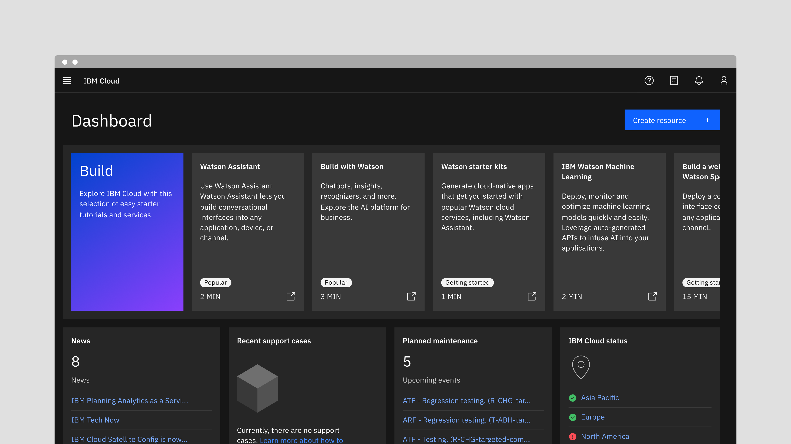
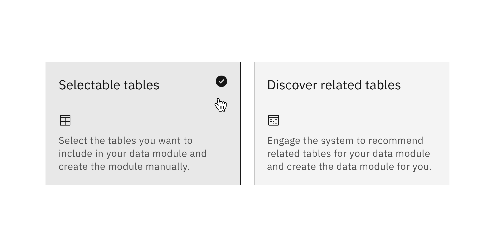

<PageDescription>

Tiles are a highly flexible component for displaying a wide variety of content,
including information, getting started, how-to, next steps, and more.

</PageDescription>

<AnchorLinks>

<AnchorLink>Overview</AnchorLink>
<AnchorLink>Live demo</AnchorLink>
<AnchorLink>Variants</AnchorLink>
<AnchorLink>Feedback</AnchorLink>

</AnchorLinks>

## Overview

Carbon ships a basic tile structure that responds to the grid. Tiles have no
pre-set styles for the content within them. You can customize tiles to fit your
specific use case.

When using a call-to-action (CTA) within a tile, use a
[secondary button](/components/button/usage). Primary buttons should be reserved
for the most important action a user can take on the page.

## Live demo

<ComponentDemo
  components={[
    {
      id: 'tile',
      label: 'Default tile',
    },
    {
      id: 'clickable-tile',
      label: 'Clickable tile',
    },
    {
      id: 'radio-tile',
      label: 'Radio tile',
    },
    {
      id: 'selectable-tile',
      label: 'Selectable tile',
    },
    {
      id: 'expandable-tile',
      label: 'Expandable tile',
    },
  ]}>
  <ComponentVariant
    id="tile"
    knobs={{
      Tile: ['light'],
    }}
    links={{
      React: 'https://react.carbondesignsystem.com/?path=/story/tile--default',
      Angular:
        'https://angular.carbondesignsystem.com/?path=/story/components-tiles--basic',
      Vue:
        'http://vue.carbondesignsystem.com/?path=/story/components-cvtile--default',
      Vanilla: 'https://the-carbon-components.netlify.com/?nav=tile',
    }}>{`
    <Tile>
      Default tile
    </Tile>
  `}</ComponentVariant>
  <ComponentVariant
    id="clickable-tile"
    knobs={{
      ClickableTile: ['light', 'clicked'],
    }}
    links={{
      React: 'https://react.carbondesignsystem.com/?path=/story/tile--default',
      Angular:
        'https://angular.carbondesignsystem.com/?path=/story/components-tiles--basic',
      Vue:
        'http://vue.carbondesignsystem.com/?path=/story/components-cvtile--default',
      Vanilla: 'https://the-carbon-components.netlify.com/?nav=tile',
    }}>{`
    <ClickableTile
      href="#"
    >
      Clickable tile
    </ClickableTile>
  `}</ComponentVariant>
  <ComponentVariant
    id="radio-tile"
    knobs={{
      RadioTile: ['light'],
    }}
    links={{
      React:
        'https://react.carbondesignsystem.com/?path=/story/tile--clickable',
      Angular:
        'https://angular.carbondesignsystem.com/?path=/story/components-tiles--clickable',
      Vue:
        'http://vue.carbondesignsystem.com/?path=/story/components-cvtile--clickable',
      Vanilla: 'https://the-carbon-components.netlify.com/?nav=tile',
    }}>{`
    <TileGroup
      defaultSelected="default-selected"
      legend="Radio tile group"
      name="tile-group"
    >
      <RadioTile
        id="tile-1"
        name="tiles"
        tabIndex={0}
        value="standard"
      >
        Radio tile
      </RadioTile>
      <RadioTile
        id="tile-2"
        name="tiles"
        tabIndex={0}
        value="default-selected"
      >
        Radio tile
      </RadioTile>
      <RadioTile
        id="tile-3"
        name="tiles"
        tabIndex={0}
        value="selected"
      >
        Radio tile
      </RadioTile>
    </TileGroup>
  `}</ComponentVariant>
  <ComponentVariant
    id="selectable-tile"
    knobs={{
      SelectableTile: ['light', 'selected'],
    }}
    links={{
      React:
        'https://react.carbondesignsystem.com/?path=/story/tile--multi-select',
      Angular:
        'https://angular.carbondesignsystem.com/?path=/story/components-tiles--selectable',
      Vue:
        'http://vue.carbondesignsystem.com/?path=/story/components-cvtile--selectable',
      Vanilla: 'https://the-carbon-components.netlify.com/?nav=tile',
    }}>{`
    

      <SelectableTile
        id="tile-1"
        name="tiles"
        tabIndex={0}
        title="title"
        value="value"
      >
        Multiselect tile
      </SelectableTile>
      <SelectableTile
        id="tile-2"
        name="tiles"
        tabIndex={0}
        title="title"
        value="value"
      >
        Multiselect tile
      </SelectableTile>
      <SelectableTile
        id="tile-3"
        name="tiles"
        tabIndex={0}
        title="title"
        value="value"
      >
        Multiselect tile
      </SelectableTile>
    

  `}</ComponentVariant>
  <ComponentVariant
    id="expandable-tile"
    knobs={{
      ExpandableTile: ['light', 'expanded'],
    }}
    links={{
      React:
        'https://react.carbondesignsystem.com/?path=/story/tile--expandable',
      Angular:
        'https://angular.carbondesignsystem.com/?path=/story/components-tiles--expandable',
      Vue:
        'http://vue.carbondesignsystem.com/?path=/story/components-cvtile--expandable',
      Vanilla: 'https://the-carbon-components.netlify.com/?nav=tile',
    }}>{`
    <ExpandableTile
      tabIndex={0}
      tileCollapsedIconText="Interact to Expand tile"
      tileExpandedIconText="Interact to Collapse tile"
      tileMaxHeight={0}
      tilePadding={0}
    >
      <TileAboveTheFoldContent>
        

          Above the fold content here
        

      </TileAboveTheFoldContent>
      <TileBelowTheFoldContent>
        

          Below the fold content here
        

      </TileBelowTheFoldContent>
    </ExpandableTile>
  `}</ComponentVariant>
</ComponentDemo>

## Variants

All of the images below represent examples of types of content that could be
presented within a tile. The styling in these examples is for illustration only;
you are free to create your own layout and design within a tile.

### Read-only

Read-only tiles are used to display information to the user, such as features or
services offered. Read-only tiles are often seen on marketing pages to promote
content. These tiles can have internal calls-to-action (CTAs), such as a
[button](/components/button/usage) or a [link](/components/link/usage).

<Row>
<Column colLg={8}>

</Column>
</Row>

### Clickable

Clickable tiles can be used as navigational items, where the entire tile is a
clickable state, which redirects the user to a new page. Clickable tiles cannot
contain separate internal CTAs.

<Row>
<Column colLg={8}>

</Column>
</Row>

### Selectable

Selectable tiles work like a [radio button](/components/radio-button/usage),
where the entire tile is a click target. Selectable tiles may contain internal
CTAs (like links to docs) if the internal CTA is given its own click target.
Selectable tiles work well for presenting options to a user in a structured
manner, such as a set of pricing plans.

<Row>
<Column colLg={8}>

</Column>
</Row>

### Expandable

Expandable tiles are helpful for hiding/showing larger amounts of content to a
user. They can only be stacked in a single column, and cannot live in a row or
horizontal grid. When expanded, tiles push content down the page. Expandable
tiles may contain internal CTAs (like links to docs) if the internal CTA is
given its own click target.

<Row>
<Column colLg={8}>

</Column>
</Row>

## Feedback

Help us improve this component by providing feedback, asking questions, and
leaving any other comments on
[GitHub](https://github.com/carbon-design-system/carbon-website/issues/new?assignees=&labels=feedback&template=feedback.md).
