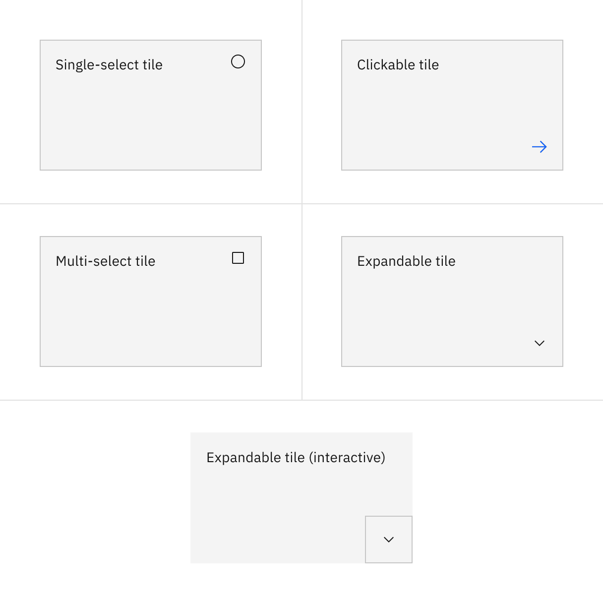
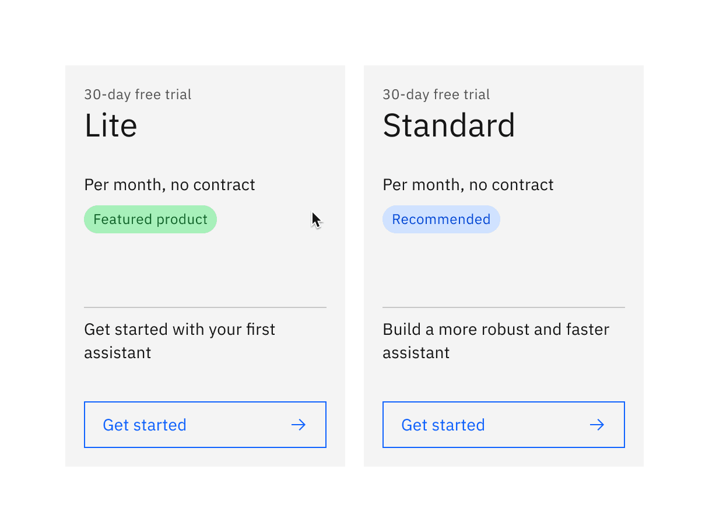
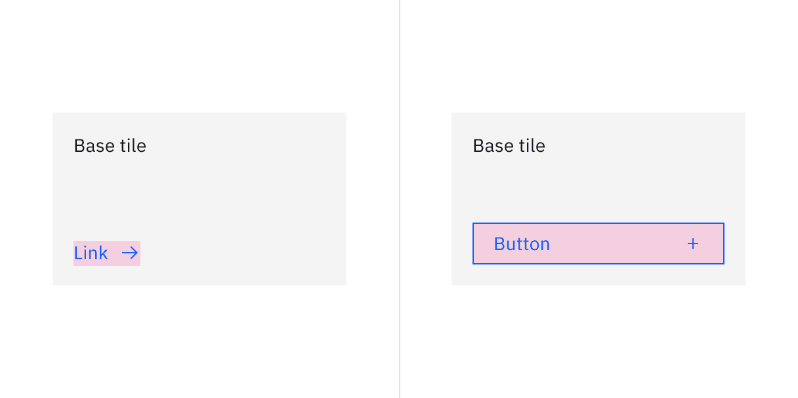
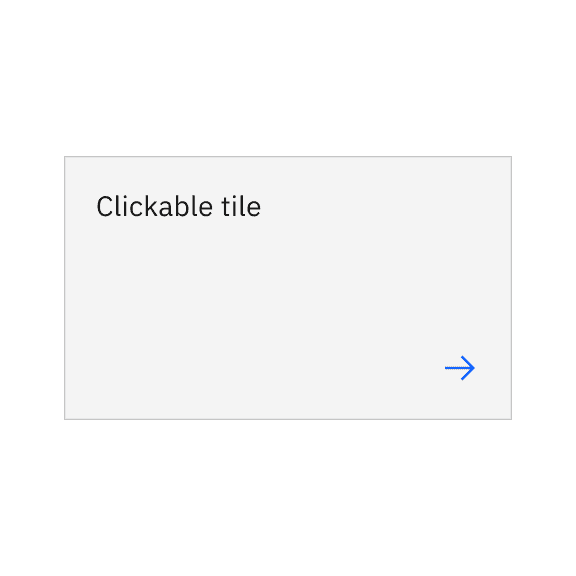
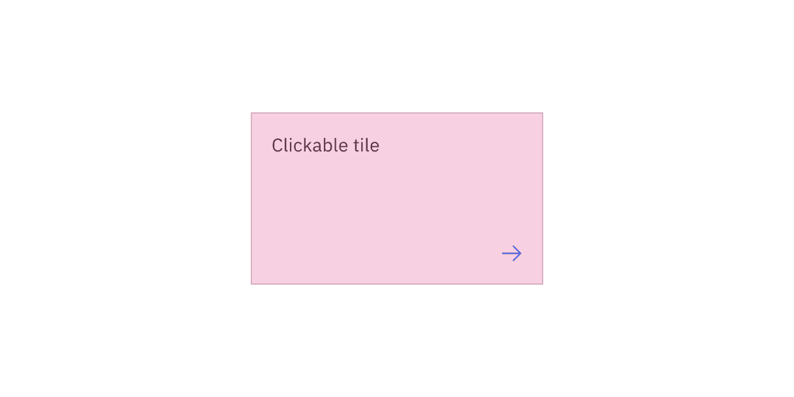

import A11yStatus from 'components/A11yStatus';
import { Tag } from '@carbon/react';

<PageDescription>

<Tag type="blue">Feature flag</Tag>

Tiles are a highly flexible component for displaying a wide variety of content,
including information, getting started, how-to, next steps, and more.

</PageDescription>

<InlineNotification>

Tile
[with AI label](https://react.carbondesignsystem.com/?path=/story/components-tile--with-ai-label)
changes the visual appearance of the component and introduces an AI
explainability feature when AI is present in the component.

</InlineNotification>

<AnchorLinks>

<AnchorLink>Live demo</AnchorLink>
<AnchorLink>Overview</AnchorLink>
<AnchorLink>Variants</AnchorLink>
<AnchorLink>Formatting</AnchorLink>
<AnchorLink>Content</AnchorLink>
<AnchorLink>Base</AnchorLink>
<AnchorLink>Clickable</AnchorLink>
<AnchorLink>Selectable</AnchorLink>
<AnchorLink>Expandable</AnchorLink>
<AnchorLink>AI presence</AnchorLink>
<AnchorLink>Related</AnchorLink>
<AnchorLink>References</AnchorLink>
<AnchorLink>Feedback</AnchorLink>

</AnchorLinks>

## Live demo

<StorybookDemo
  themeSelector
  url="https://react.carbondesignsystem.com"
  variants={[
    {
      label: 'Default',
      variant: 'components-tile--default',
    },
    {
      label: 'Clickable',
      variant: 'components-tile--clickable',
    },
    {
      label: 'Expandable',
      variant: 'components-tile--expandable',
    },
    {
      label: 'Expandable with interactive',
      variant: 'components-tile--expandable-with-interactive',
    },
    {
      label: 'Multiselect',
      variant: 'components-tile--multi-select',
    },
    {
      label: 'Radio',
      variant: 'components-tile--radio',
    },
    {
      label: 'Selectable',
      variant: 'components-tile--selectable',
    },
    {
      label: 'Clickable with Improved Contrast (unstable)',
      variant: 'experimental-feature-flags-tile--clickable',
    },
    {
      label: 'Expandable with Improved Contrast (unstable)',
      variant: 'experimental-feature-flags-tile--expandable',
    },
    {
      label: 'Multiselect with Improved Contrast (unstable)',
      variant: 'experimental-feature-flags-tile--multi-select',
    },
    {
      label: 'Radio with Improved Contrast (unstable)',
      variant: 'experimental-feature-flags-tile--radio',
    },
    {
      label: 'Selectable with Improved Contrast (unstable)',
      variant: 'experimental-feature-flags-tile--selectable',
    },
    {
      label: 'with AI Label',
      variant: 'components-tile--with-ai-label',
    },
  ]}
/>

<A11yStatus layout="cards" components="Tile" />

## Overview

Tile is a component that can contain various content and nested components and
can have interactive functions. Tile is often laid out in groups, is a different
color than the UI background, and responds to the grid. Tiles have no pre-set
styles, and it is up to product teams to determine what to include in tiles
since the use cases can vary widely.

<Row>
<Column colLg={12}>

<Caption>Example of the tile component in a UI</Caption>

</Column>
</Row>

#### Tiles versus cards

Tiles are simple and foundational. Cards can be very complex. Cards are built
upon the tile foundation and have various patterns of information hierarchy,
multiple actions, overflow menus, selectable features, etc. Carbon does not have
a card pattern, but we link out to several card patterns within our pattern
asset library (PAL) ecosystem below:

- [Productive versus Expressive cards](https://pages.github.ibm.com/cdai-design/pal/components/card/overview/)
  (Carbon for IBM Products)
- [Dashboard cards](https://pages.github.ibm.com/ai-applications/design/patterns/dashboards-v2/overview/#dashboard-cards)
  (IBM Sustainability Software Design)
- [Cards](https://www.ibm.com/standards/carbon/components/cards) (Carbon for
  IBM.com)

### When to use

Tiles are reusable components that provide shortcuts to building cards and other
modules. Use tiles to group related information in flexible containers. Here are
some common use cases for when to use tiles:

- To contain related groupings of information or actions
- To guide users to take actions or navigate
- To present options for single or multiple selections
- To hide or show large amounts of content

### When not to use

Tiles reside on the same plane as the page background layer—they do not have
elevation. Tiles organize essential information and have the same visual
hierarchy as content on the same page.

Do not add a drop shadow to tiles and use them to reveal secondary information,
actions, or notifications. Use [modals](/components/modal/usage),
[popover](/components/popover/usage), and
[dialogs](https://carbondesignsystem.com/patterns/dialog-pattern/) which have
elevation and are appropriate for this ues case instead.

### Variants

Tiles can have different functiosn and are implemented in four ways: base,
clickable, selectable, and expandable. These tile variants are flexible to
support various use cases when building more complicated card features.

| Variant                   | Purpose                                                                                                                                               |
| ------------------------- | ----------------------------------------------------------------------------------------------------------------------------------------------------- |
| [Base](#base)             | For high-level, short, and digestible content pieces such as features, plans, or services offered.                                                    |
| [Clickable](#clickable)   | For prompting an action, navigating or directing to other pieces of information about the subject matter. This variant has an available feature flag. |
| [Selectable](#selectable) | For presenting options to a user in a structured manner, such as a set of pricing plans. This variant has available feature flags.                    |
| [Expandable](#expandable) | For hiding and revealing a large amount of content to focus on specific pieces of information. This variant has an available feature flag.            |

### Feature flags

Feature flags have been added to the clickable, selectable, and expandable
variants of tile to improve accessibility and changes its visual appearance, not
its functionality. For code-specific feature flag information, refer to the
[Code tab](https://carbondesignsystem.com/components/tile/code/). These current
variants of tile are not being deprecated, but teams are encouraged to use the
feature flag tile for their products moving forward.

- A border has been added to the clickable, selectable, and expandable variants
  of tile to visually indicate they are operable.
- Single-select tile icons have been changed from checkmark icons to radio
  button icons, where as multi-select tile icons have been changed from
  checkmark icons to checkbox icons. These icons appear in the enabled state
  instead of only on hover before making a selection.

<Row>
<Column colLg={12}>
<Tabs>

<Tab label="Flag enabled">

</Tab>

<Tab label="Flag disabled">

</Tab>

</Tabs>

</Column>
</Row>

## Formatting

### Sizing

Tile width varies depending on the three basic gutter modes: **wide**,
**narrow**, and **condensed**. Tile height varies depending on the content
placed within it while using
[spacing tokens](https://carbondesignsystem.com/elements/spacing/overview/) and
following
[aspect ratios](https://carbondesignsystem.com/elements/2x-grid/usage/#continuity).
The minimum tile height is a 2:1 aspect ratio. As the content grows, set
vertical spacing between sections within the content area.

### Alignment

#### Tile groups

Tile groups are helpful when aligning tiles that have a strong relationship.
Tile groups usually flow horizontally from left to right and have hierarchical
importance, similar to navigation or catalog tiles.

<Row>
<Column colLg={12}>

<Caption>Example image of tiles on the wide grid</Caption>

</Column>
</Row>

<Row>
<Column colLg={12}>

<Caption>Example image of tiles on the narrow grid.</Caption>

</Column>
</Row>

<Row>
<Column colLg={12}>

<Caption>Example image of tiles on the condensed grid</Caption>

</Column>
</Row>

<DoDontRow>

  <DoDont type="do" caption="Do match the tile variants in groups.">

  </DoDont>

  <DoDont type="dont" caption="Do not mix different variants of tiles in groups.">

  </DoDont>
</DoDontRow>

#### Layout

There are three basic layouts for tiles: **standard**, **vertical masonry**, and
**horizontal masonry**. The standard layout is the the most commonly used.

- In a standard layout, tiles are the same in height and width as all other
  tiles in the group.
- In a vertical masonry layout, tiles can vary in height, but are consistent in
  width.
- In a horizontal masonry layout, tiles can vary in width; different rows of
  tiles may vary in height, but tiles within a row should be consistent in
  height.

<Row>
<Column colLg={8}>

<Caption>
  Examples of standard, vertical masonry, and horizontal masonry tile layouts
</Caption>

</Column>
</Row>

## Content

### Main elements

#### Tile text

Tile text can vary based on the content. It can consist of heading text, body
text, label text, and include interactive elements.

### Futher guidance

For further content guidance, see
Carbon’s [content guidelines](https://carbondesignsystem.com/guidelines/content/overview/).

## Base

Base tiles are used to display information to the user, such as features or
services offered. Base tiles are often seen on marketing pages to promote
content or on highly interactive dashboards. These tiles can have internal
calls-to-action (CTAs), such as a [button](/components/button/usage) or
[link](/components/link/usage).

<Row>
<Column colLg={8}>

</Column>
</Row>

### Anatomy

<Row>
<Column colLg={8}>

</Column>
</Row>

1. **Container**: Contains all content in a tile.
2. **Text**: The text in a tile.
3. **Interactive elements (optional)**: Elements like links or buttons in a tile
   that are interactive.

### Alignment

When placing interactive elements within base tiles, place links at the bottom
left of the tile and span buttons in width at the bottom to indicate
call-to-action items.

<DoDontRow>
  <DoDont type="do" caption="Do left align the link at the bottom of the base tile.">

  </DoDont>

  <DoDont type="do" caption="Do span the button in width at the bottom of the base tile.">

  </DoDont>
</DoDontRow>

### States

Base tiles only have an **enabled** state because it is not operable by a mouse
or keyboard. For more information about about base tile states, see the
[Style](https://carbondesignsystem.com/components/tile/style) tab.

### Interactions

#### Mouse

Base tiles are not operable by a mouse unless they contain interactive elements
within them. Interactive elements can be clicked on and activated.

#### Keyboard

- Base tiles do not receive focus unless they contain interactive elements. —
  `Tab` moves focus forward through interactive elements within base tile in a
  logical order. — `Shift` + `Tab` moves focus backward through interactive
  elements within base tile in a logical order. — `Enter` activates the base
  tiles interactive elements.

### Clickable areas

Base tiles can have interactive elements within them, like links or buttons,
which can be clicked on.

<Row>
<Column colLg={8}>

<Caption>Clickable areas of base tile with interactive elements</Caption>

</Column>
</Row>

## Clickable

Clickable tiles can be used as navigational elements that redirect the user to a
new page. In these situations, the entire tile is in a clickable state. Due to
accessibility concerns, clickable tiles cannot contain separate internal CTAs
but can contain pictograms, icons, or media such as illustrations or images.

Clickable tile has an available feature flag.

<Row>
<Column colLg={12}>
<Tabs>

<Tab label="Flag enabled">

</Tab>

<Tab label="Flag disabled">

</Tab>

</Tabs>

</Column>
</Row>

### Anatomy

<Row>
<Column colLg={8}>

<Caption>Anatomy of clickable tile with a feature flag</Caption>

</Column>
</Row>

1. **Container**: Contains all content within a tile.
2. **Text**: The text within a tile.
3. **Icon**: The icon that visually indicates the tile is navigational.
4. **Border**: The border that visually indicates the tile is interactive.

#### Alignment

#### Icons

On clickable tiles, use the arrow icon paired with the `$icon-interactive` color
token. Place the icon at the bottom right to indicate navigation. Avoid
confusing the user with multiple click targets, like interactive links or
buttons, since the whole tile is already clickable.

<DoDontRow>
  <DoDont type="do" caption="Do right align the arrow icon when it is by itself.">

  </DoDont>

  <DoDont type="do" caption="Do right align the arrow icon when there is additional text.">

  </DoDont>
</DoDontRow>

<DoDontRow>

  <DoDont type="do" caption="Do right align the arrow icon when there is an additional icon or pictogram.">

  </DoDont>

  <DoDont type="dont" caption="Do not add interactive links or components on clickable tiles.">

  </DoDont>
</DoDontRow>

### States

Clickable tiles have **enabled**, **hover**, **focus**, and **disabled** states.
For more information about about clcikable tile states, see the
[Style](https://carbondesignsystem.com/components/tile/style) tab.

### Interactions

#### Mouse

The clickable tile is triggered by clicking anywhere within the tile container.

#### Keyboard

— `Tabs`moves focus forward through clickable tiles in a logical order. —
`Shift` + `Tab`moves focus backward through clickable tiles in a logical order.
— `Enter` activates the tile and navigates you to its destination.

### Clickable areas

Clickable tiles can be triggered by clicking anywhere on the tiles container.

<Row>
<Column colLg={8}>

<Caption>Clickable areas of clickable tile with a feature flag</Caption>

</Column>
</Row>

### Selectable

Selectable tiles present different options for users to select from. Selectable
tiles can contain internal CTAs, like links to documentation, if the CTA is
given a click target in addition to the tile's. Selectable tiles can either have
single-selection or multi-selection.

<Row>
<Column colLg={8}>

<Caption>Single-select tiles</Caption>

<Caption>Multi-select tiles</Caption>

</Column>
</Row>

### Expandable

Expandable tiles are helpful for hiding and showing large amounts of content to
a user. When expanded, tiles push content down the page. They allow the user to
specifically focus on featured content while having access to the rest of the
information. Expandable tiles can contain internal CTAs (like links to docs) if
they are given their own click targets.

<Row>
<Column colLg={8}>

<Caption>Expandable tile with interactive elements</Caption>

<Caption>Expandable tile without interactive elements</Caption>

</Column>
</Row>

### States

For detailed visual information about the various states for this component, see
the [Style](https://carbondesignsystem.com/components/tile/style) tab.

| State      | When to use                                                                                                                                                                                                                                                                                                        |
| ---------- | ------------------------------------------------------------------------------------------------------------------------------------------------------------------------------------------------------------------------------------------------------------------------------------------------------------------ |
| _Enabled_  | When a tile is live but a user is not directly interacting with it. This is commonly referred to as the default or normal state of the component                                                                                                                                                                   |
| _Hover_    | When a user is hovering over the tile with the mouse cursor to interact with it (except base tile)                                                                                                                                                                                                                 |
| _Focus_    | When a user `tabs` to or clicks on the tile, it becomes focused, indicating the user has successfully navigated to the component (except base tile)                                                                                                                                                                |
| _Selected_ | When a user `enters` or clicks on the single-select tile or the multi-select tile to select an option or multiple options                                                                                                                                                                                          |
| _Disabled_ | When the user is not allowed to interact with clickable and selectable (single-select and multi-select) tiles due to either permissions, dependencies, or pre-requisites. The disabled state completely removes the interactive function from a component. The styling is not subject to WCAG contrast compliance. |

<Row>
<Column colLg={8}>

<Caption>
  Clickable tile's disabled state turns the default icon into the error icon.
</Caption>

</Column>
</Row>

### Interactions

#### Mouse

Users can trigger an item by clicking anywhere in any tile container, except
base tiles.

<Row>
<Column colLg={8}>

<Caption>
  Clickable, expandable, and selectable tiles are clickable anywhere within the
  tile.
</Caption>

</Column>
</Row>

<Row>
<Column colLg={8}>

<Caption>Base tiles are static, except buttons or links.</Caption>

</Column>
</Row>

Expandable tiles can either be triggered as a whole or contain internal CTAs
only if they are given their own click targets. In these cases, the tile’s click
target is reduced to only the icon button.

<Row>
<Column colLg={8}>

</Column>
</Row>

#### Keyboard

Specific keyboard interactions will depend on the type of tile you are using and
what content it contains but all types of tiles can take focus.

| Key             | Interaction                                                                                                                                                                 |
| --------------- | --------------------------------------------------------------------------------------------------------------------------------------------------------------------------- |
| Tab             | Move forward through tiles (if tiles themselves are clickable) and interactive elements within the tiles in a logical order                                                 |
| Shift + Tab     | Move backward through tiles (if tiles themselves are clickable) and interactive elements within the tiles in a logical order                                                |
| Return or Enter | Return or enter will open the tile (if the tile itself is clickable). If the tile is not clickable but has interactive elements, their corresponding actions are performed. |
| Space           | If the tile is selectable, the space bar will toggle tile selection.                                                                                                        |

## AI presence

Tile has a modification that takes on the AI visual styling when the AI label is
present in the container. The AI variants function the same as the normal
versions except with the addition of the AI label which is both a visual
indicator and the trigger for the explainability popover.

For more information on designing for AI, see the
[Carbon for AI](/guidelines/carbon-for-ai/) guidelines.

<Row>
<Column colLg={8}>

</Column>
</Row>

## Related

#### Grid

To learn more about how to build tiles correctly on the grid, see Carbon’s
[2x grid](/guidelines/2x-grid/implementation).

#### Aspect ratio

The aspect ratio is important when building tiles and images. For further
guidance, see Carbon’s
[aspect ratio](https://www.carbondesignsystem.com/guidelines/2x-grid/overview/#aspect-ratio)
and its
[implementation](https://www.carbondesignsystem.com/guidelines/2x-grid/implementation#screen-regions).

#### Buttons

When in doubt, use full-span button alignment within tiles. For further
guidance, see Carbon’s
[buttons](https://carbondesignsystem.com/components/button/usage/).

#### Link

Link has variants depending on the context. For further guidance, see Carbon’s
[link](https://carbondesignsystem.com/components/link/usage/).

#### Spacing

Spacing helps deliver clear and functional layouts. For further guidance, see
Carbon’s [spacing](https://carbondesignsystem.com/guidelines/spacing/overview/).

## References

Hagan Rivers,
[Interactions design with cards/tiles](https://medium.com/@hagan.rivers/interaction-design-with-cards-tiles-5a6895aa220d/)
(Medium, 2017)

## Feedback

Help us improve this component by providing feedback, asking questions, and
leaving any other comments on
[GitHub](https://github.com/carbon-design-system/carbon-website/issues/new?assignees=&labels=feedback&template=feedback.md).
