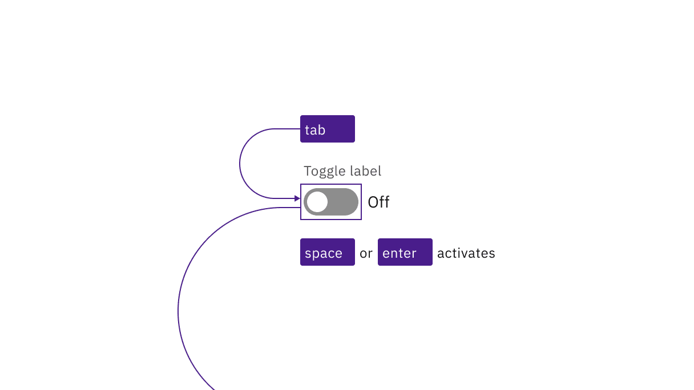
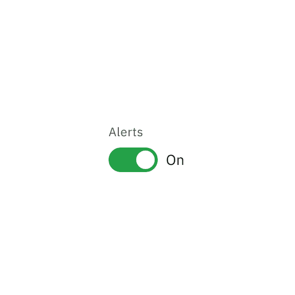
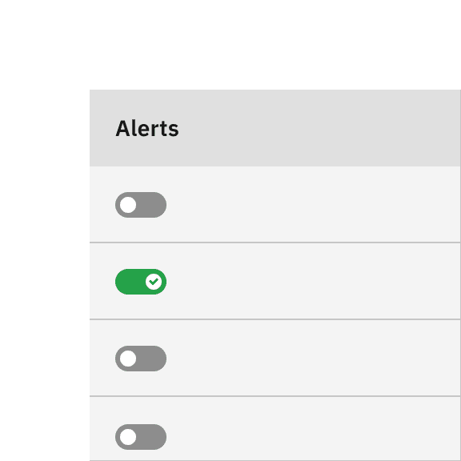
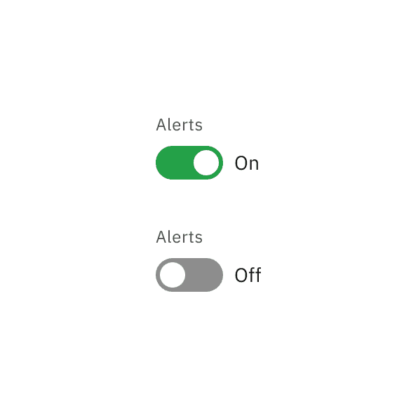
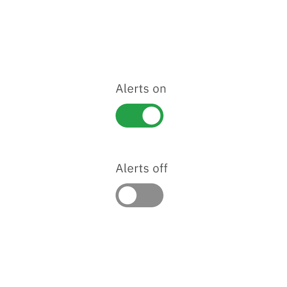

import A11yStatus from 'components/A11yStatus';

import {
  StructuredListWrapper,
  StructuredListHead,
  StructuredListBody,
  StructuredListRow,
  StructuredListInput,
  StructuredListCell,
  OrderedList,
  ListItem,
} from '@carbon/react';

<PageDescription>

No accessibility annotations are needed for toggles, but keep these
considerations in mind if you are modifying Carbon or creating a custom
component.

</PageDescription>

<AnchorLinks>

<AnchorLink>What Carbon provides</AnchorLink>
<AnchorLink>Design recommendations</AnchorLink>
<AnchorLink>Development considerations</AnchorLink>

</AnchorLinks>

## What Carbon provides

Carbon bakes keyboard operation into its components, improving the experience of
blind users and others who operate via keyboard. Carbon also incorporates other
accessibility considerations, some of which are described below.

### Keyboard interaction

Each toggle is in the tab order. Pressing `Enter` or `Space` changes the
toggle's state between off and on.

<Row>
<Column colLg={8}>

<Caption>
  Toggles are reached by Tab and activated by Space or Enter keys.
</Caption>

</Column>
</Row>

### Redundant state information

Carbon’s default toggle uses both color and text to indicate on or off. Where
space constraints make a smaller toggle desirable, Carbon adds a tickmark to the
toggle’s “on” state so that if the text is not included, the component’s on/off
state can be distinguished without relying on use of color. The state is also
captured programmatically for users who cannot see or understand the visual
indicators.

<DoDontRow>
  <DoDont type="do" caption="Do include the on/off text for the toggle's state whenever space permits.">

  </DoDont>
  <DoDont type="do" caption="Where space is confined, use the tickmark variation in lieu of on/off text.">

  </DoDont>
</DoDontRow>

## Design recommendations

Design annotations are not needed, but keep the following point in mind.

### Do not change the toggle's label based on its state

It is essential that designers distinguish between the text indicating the
on/off state of the toggle and the text that is the toggle’s label. The label's
text should not change based on the on/off state.

<DoDontRow>
  <DoDont type="do" caption="Do keep the label consistent. Only change the state text between On and Off.">

  </DoDont>
  <DoDont type="dont" caption="Do not change the label text as a way of indicating the toggle's on/off state.">

  </DoDont>
</DoDontRow>

## Development considerations

Keep this in mind if you’re modifying Carbon or creating a custom component.

- Toggle is implemented as a button with a role of `switch`.
- “On” and “off” text is `aria-hidden`; the state of the toggle is surfaced with
  `aria-checked` set to “true” or “false”.
- The toggle's `label` is set with `for`.
- See the
  [ARIA authoring practices guidance on switch](https://w3c.github.io/aria-practices/#switch)
  for more considerations.

<A11yStatus layout="table" components="Toggle" />
