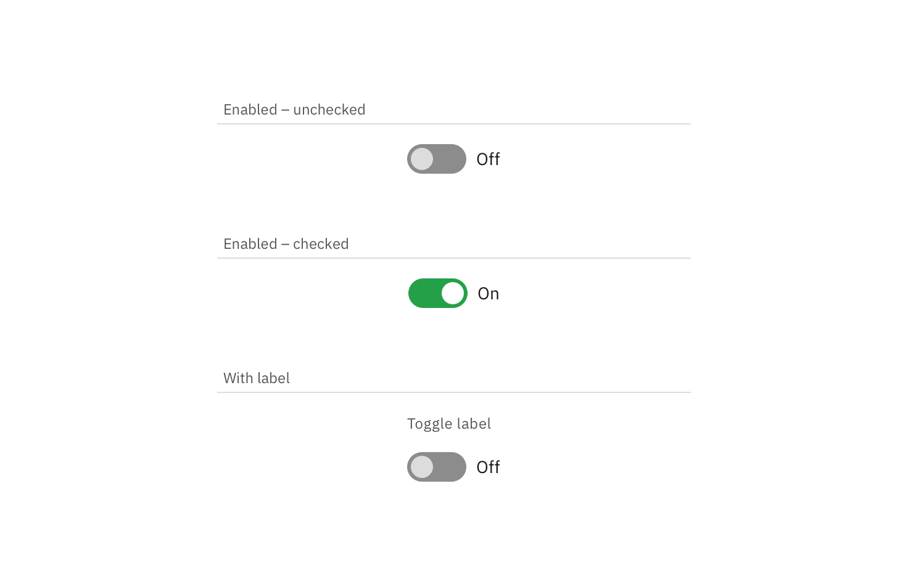

## Color

| Class                                                          | Property         | Color token   |
| -------------------------------------------------------------- | ---------------- | ------------- |
| `.bx--label`                                                   | text color       | `$text-02`    |
| `.bx--toggle__text--left`                                      | text color       | `$text-01`    |
| `.bx--toggle__appearance:before`                               | background-color | `$ui-04`      |
| `.bx--toggle__appearance:after`                                | background-color | `$ui-03`      |
| `.bx--toggle:checked +`   `.bx--toggle__appearance:before` | background-color | `$support-02` |
| `.bx--toggle:checked +`   `.bx--toggle__appearance:after`  | background-color | `$icon-03`    |
| `.bx--toggle:checked`                                          | background-color | `$support-02` |
| `.bx--toggle__check`                                           | fill             | `$support-02` |

<Caption>
  Examples of inactive, inactive hover, and active states for a toggle
</Caption>

### Interactive states

| Class                                                           | Property         | Color token    |
| --------------------------------------------------------------- | ---------------- | -------------- |
| `.bx--toggle__appearance:focus`                                 | border           | `$focus`       |
| `.bx--label:disabled`                                           | text color       | `$disabled-02` |
| `.bx--toggle__text--left:disabled`                              | text color       | `$disabled-02` |
| `.bx--toggle:disabled +`   `.bx--toggle__appearance:before` | background-color | `$disabled-01` |
| `.bx--toggle:disabled +`   `.bx--toggle__appearance:after`  | background-color | `$disabled-02` |

## Typography

Toggle labels should be set in sentence case, with only the first word in a
phrase and any proper nouns capitalized, and no more than three words.

| Class                     | Font-size (px/rem) | Font-weight   | Type token      |
| ------------------------- | ------------------ | ------------- | --------------- |
| `.bx--label`              | 12 / 0.75          | Regular / 400 | `$label-01`     |
| `.bx--toggle__text--left` | 14 / 0.875         | Regular / 400 | `$body-long-01` |

## Structure

### Toggle

| Class                           | Property                  | px / rem  | Spacing token |
| ------------------------------- | ------------------------- | --------- | ------------- |
| `.bx--toggle__appearance`       | width                     | 48 / 3    | –             |
| `.bx--toggle__appearance`       | height                    | 24 / 1.5  | –             |
| `.bx--toggle__appearance:after` | height, width             | 18 / 1.25 | –             |
| `.bx--toggle__label`            | margin-top, margin-bottom | 16 / 1    | `$spacing-05` |
| `.bx--toggle__text--left`       | margin-left               | 8 / 0.5   | `$spacing-03` |

<Caption>Structure and spacing measurements for toggle | px / rem</Caption>

### Small toggle

| Class                                                        | Property                  | px / rem   | Spacing token |
| ------------------------------------------------------------ | ------------------------- | ---------- | ------------- |
| `.bx--toggle--small`                                         | height                    | 16 / 1     | –             |
| `.bx--toggle--small`                                         | width                     | 32 / 2     | –             |
| `.bx--toggle--small +`   `.bx--toggle__appearance:after` | height, width             | 10 / 0.625 | –             |
| `.bx--toggle--small`                                         | margin-top, margin-bottom | 16 / 1     | `$spacing-05` |

<Caption>
  Structure and spacing measurements for small toggle | px / rem
</Caption>
