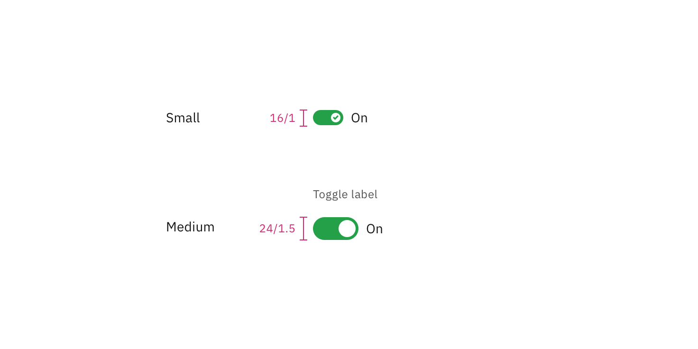

## Color

| Element        | Property         | Color token        |
| -------------- | ---------------- | ------------------ |
| Label          | text color       | `$text-secondary`  |
| Toggle text    | text color       | `$text-primary`    |
| Off background | background-color | `$toggle-off`      |
| Off handle     | background-color | `$icon-on-color`   |
| On background  | background-color | `$support-success` |
| On handle      | background-color | `$icon-on-color`   |
| Checkmark      | fill             | `$support-success` |

<Caption>
  Examples of inactive, inactive hover, and active states for a toggle
</Caption>

### Interactive states

| State    | Element           | Property         | Color token               |
| -------- | ----------------- | ---------------- | ------------------------- |
| Focus    | Toggle            | border           | `$focus`                  |
| Disabled | Label             | text color       | `$text-disabled`          |
|          | Toggle text       | text color       | `$text-disabled`          |
|          | Toggle background | background-color | `$button-disabled`        |
|          | Toggle handle     | background-color | `$icon-on-color-disabled` |

## Typography

Toggle labels should be set in sentence case, with only the first word in a
phrase and any proper nouns capitalized, and no more than three words.

| Element     | Font-size (px/rem) | Font-weight   | Type token      |
| ----------- | ------------------ | ------------- | --------------- |
| Label       | 12 / 0.75          | Regular / 400 | `$label-01`     |
| Toggle text | 14 / 0.875         | Regular / 400 | `$body-long-01` |

## Structure

### Toggle

| Element     | Property                  | px / rem  | Spacing token |
| ----------- | ------------------------- | --------- | ------------- |
| Toggle      | width                     | 48 / 3    | –             |
|             | height                    | 24 / 1.5  | –             |
| Handle      | height, width             | 18 / 1.25 | –             |
| Label       | margin-top, margin-bottom | 16 / 1    | `$spacing-05` |
| Toggle text | margin-left               | 8 / 0.5   | `$spacing-03` |

<Caption>Structure and spacing measurements for toggle | px / rem</Caption>

### Small toggle

| Element      | Property                  | px / rem   | Spacing token |
| ------------ | ------------------------- | ---------- | ------------- |
| Toggle small | height                    | 16 / 1     | –             |
|              | width                     | 32 / 2     | –             |
| Handle       | height, width             | 10 / 0.625 | –             |
| Label        | margin-top, margin-bottom | 16 / 1     | `$spacing-05` |

<Caption>
  Structure and spacing measurements for small toggle | px / rem
</Caption>

