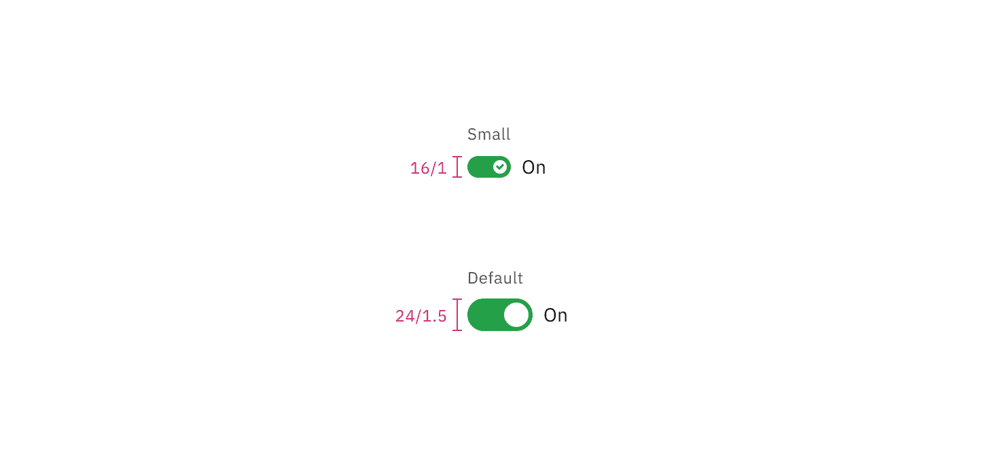

<PageDescription>

The following page documents visual specifications such as color, typography,
structure, and size.

</PageDescription>

<AnchorLinks>

<AnchorLink>Color</AnchorLink>
<AnchorLink>Typography</AnchorLink>
<AnchorLink>Structure</AnchorLink>
<AnchorLink>Size</AnchorLink>
<AnchorLink>Feedback</AnchorLink>

</AnchorLinks>

## Color

Both the default and small toggle variants share the same color and interactive
state properties.

| Element          | Property         | Color token        |
| ---------------- | ---------------- | ------------------ |
| Label text       | text-color       | `$text-secondary`  |
| State text       | text-color       | `$text-primary`    |
| Background (off) | background-color | `$toggle-off`      |
| Handle (off)     | background-color | `$icon-on-color`   |
| Background (on)  | background-color | `$support-success` |
| Handle (on)      | background-color | `$icon-on-color`   |
| Checkmark        | fill             | `$support-success` |

<Row>
<Column colLg={8}>

</Column>
</Row>

<Caption>On and off states of default and small toggle</Caption>

### Interactive state color

The default and small toggle can be switched on and off across focus, disabled,
and read-only states.

| State     | Element    | Property         | Color token               |
| --------- | ---------- | ---------------- | ------------------------- |
| Focus     | Toggle     | border           | `$focus`                  |
| Disabled  | Label text | text-color       | `$text-disabled`          |
|           | State text | text-color       | `$text-disabled`          |
|           | Background | background-color | `$button-disabled`        |
|           | Handle     | background-color | `$icon-on-color-disabled` |
|           | Checkmark  | inner fill       | `$button-disabled`        |
| Read-only | Label text | text-color       | `$text-secondary`         |
|           | State text | text-color       | `$text-primary`           |
|           | Background | background-color | transparent               |
|           | Border     | border           | `$border-subtle` \*       |
|           | Handle     | background-color | `$icon-primary`           |

<Caption fullWidth>
  \* Denotes a contextual color token that will change values based on the layer
  it is placed on.
</Caption>

<Row>
<Column colLg={8}>

</Column>
</Row>

<Caption>Example of default and small toggle interactive state color</Caption>

## Typography

Toggle labels should be set in sentence case, with only the first word in a
phrase and any proper nouns capitalized, and no more than three words.

| Element    | Font-size (px/rem) | Font-weight   | Type token         |
| ---------- | ------------------ | ------------- | ------------------ |
| Label text | 12 / 0.75          | Regular / 400 | `$label-01`        |
| State text | 14 / 0.875         | Regular / 400 | `$body-compact-01` |

## Structure

### Default toggle structure

| Element    | Property                  | px / rem  | Spacing token |
| ---------- | ------------------------- | --------- | ------------- |
| Toggle     | width                     | 48 / 3    | –             |
|            | height                    | 24 / 1.5  | –             |
| Handle     | height, width             | 18 / 1.25 | –             |
| Label text | margin-top, margin-bottom | 16 / 1    | `$spacing-05` |
| State text | margin-left               | 8 / 0.5   | `$spacing-03` |

<Caption>
  Structure and spacing measurements for default toggle | px / rem
</Caption>

### Small toggle structure

| Element    | Property                  | px / rem   | Spacing token |
| ---------- | ------------------------- | ---------- | ------------- |
| Toggle     | width                     | 32 / 2     | –             |
|            | height                    | 16 / 1     | –             |
| Handle     | height, width             | 10 / 0.625 | `$spacing-03` |
| Label text | margin-top, margin-bottom | 16 / 1     | `$spacing-05` |
| State text | margin left               | 8 / 0.5    | `$spacing-03` |

<Caption>
  Structure and spacing measurements for small toggle | px / rem
</Caption>

## Size

| Size       | Height (px / rem) |
| ---------- | ----------------- |
| Small (sm) | 16 / 1            |
| Default    | 24 / 1.5          |

<Caption>Default and small sizes of toggle | px / rem</Caption>

## Feedback

Help us improve this component by providing feedback, asking questions, and
leaving any other comments on
[GitHub](https://github.com/carbon-design-system/carbon-website/issues/new?assignees=&labels=feedback&template=feedback.md).
