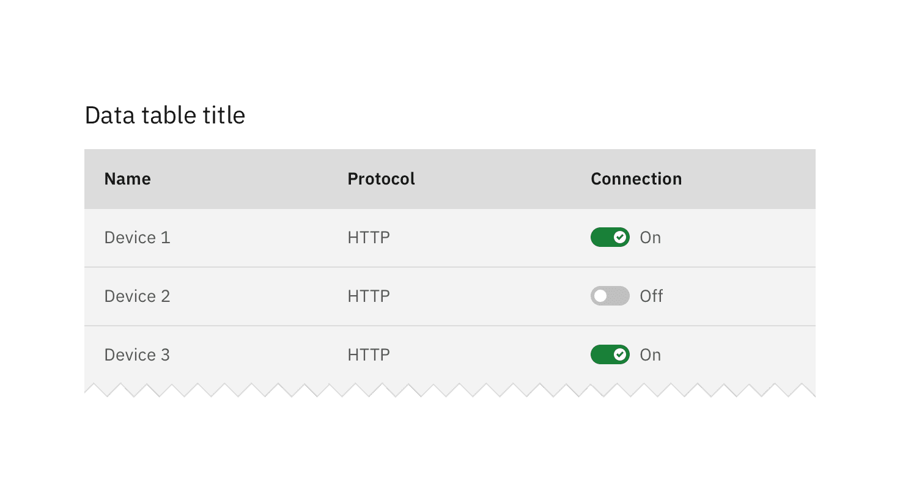

<PageDescription>

A toggle is used to quickly switch between two possible states. They are
commonly used for “on/off” switches.

</PageDescription>

<AnchorLinks>

<AnchorLink>Overview</AnchorLink>
<AnchorLink>Live demo</AnchorLink>
<AnchorLink>Content</AnchorLink>
<AnchorLink>Variants</AnchorLink>
<AnchorLink>Feedback</AnchorLink>

</AnchorLinks>

## Overview

Toggle is a control that is used to quickly switch between two possible states.
Toggles are only used for these binary actions that occur immediately after the
user “flips the switch”. They are commonly used for “on/off” switches.

<Row>
<Column colLg={8}>

</Column>
</Row>

## Live demo

<ComponentDemo
  components={[
    {
      id: 'default-toggle',
      label: 'Toggle',
    },
    {
      id: 'small-toggle',
      label: 'Toggle small',
    },
  ]}>
  <ComponentVariant
    id="default-toggle"
    links={{
      React:
        'https://react.carbondesignsystem.com/?path=/story/toggle--toggled',
      Angular:
        'https://angular.carbondesignsystem.com/?path=/story/components-toggle--basic',
      Vue:
        'http://vue.carbondesignsystem.com/?path=/story/components-cvtoggle--default',
      Vanilla: 'https://the-carbon-components.netlify.com/?nav=toggle',
    }}>{`
    <Toggle
      aria-label="toggle button"
      defaultToggled
      id="toggle-1"
      labelText="Label text"
    />
  `}</ComponentVariant>
  <ComponentVariant
    id="small-toggle"
    links={{
      React:
        'https://react.carbondesignsystem.com/?path=/story/togglesmall--toggled',
      Angular:
        'https://angular.carbondesignsystem.com/?path=/story/components-toggle--basic',
      Vue:
        'http://vue.carbondesignsystem.com/?path=/story/components-cvtoggle--default',
      Vanilla: 'https://the-carbon-components.netlify.com/?nav=toggle',
    }}>{`
    <ToggleSmall
      aria-label="toggle button"
      defaultToggled
      id="toggle-2"
      labelText="Label text"
    />
  `}</ComponentVariant>
</ComponentDemo>

## Content

#### Heading

A heading may accompany a toggle to further clarify on the action the toggle
will perform.

#### Labels

Use labels with a toggle so the action is clear. Labels should be three words or
less and appear on the side of a toggle.

#### Language

Use adjectives rather than verbs to describe labels and the state of the object
affected.

## Variants

### Small toggles

A variation on the regular component is the small toggle. Small toggles are more
compact in size, therefore they can be used in use cases such as
[data tables](/components/data-table/usage).

<Row>
<Column colLg={8}>

</Column>
</Row>

## Feedback

Help us improve this component by providing feedback, asking questions, and
leaving any other comments on
[GitHub](https://github.com/carbon-design-system/carbon-website/issues/new?assignees=&labels=feedback&template=feedback.md).
