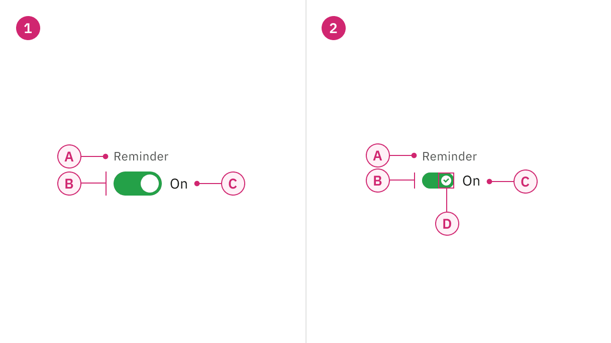

import A11yStatus from 'components/A11yStatus';

<PageDescription>

A toggle is used to quickly switch between two possible states. They are
commonly used for “on/off” switches.

</PageDescription>

<AnchorLinks>

<AnchorLink>Live demo</AnchorLink>
<AnchorLink>Overview</AnchorLink>
<AnchorLink>Formatting</AnchorLink>
<AnchorLink>Content</AnchorLink>
<AnchorLink>Behaviors</AnchorLink>
<AnchorLink>Default toggle</AnchorLink>
<AnchorLink>Small toggle</AnchorLink>
<AnchorLink>Feedback</AnchorLink>

</AnchorLinks>

## Live demo

<StorybookDemo
  themeSelector
  url="https://react.carbondesignsystem.com"
  variants={[
    {
      label: 'Default',
      variant: 'components-toggle--default',
    },
    {
      label: 'Small Toggle',
      variant: 'components-toggle--small-toggle',
    },
  ]}
/>

<A11yStatus layout="cards" components="Toggle" />

## Overview

Toggle is a control that is used to quickly switch between two possible states.
Toggles are only used for these binary actions that occur immediately after the
user “flips the switch”. They are commonly used for “on/off” switches.

<Row>
<Column colLg={8}>

</Column>
</Row>

<Caption>Tags being used in context of a product UI.</Caption>

## Variants

| Variant                           | Purpose                                                                                                                                                                  |
| --------------------------------- | ------------------------------------------------------------------------------------------------------------------------------------------------------------------------ |
| [Default toggle](#default-toggle) | Use the default toggle when you need to specify a label text in addition to the toggle action text. Default toggles appear in forms or within full pages of information. |
| [Small toggle](#small-toggle)     | Use the small toggle when you do not need to specify label or action text. Small toggles are more compact in size and are used inline with other components.             |

<Row>
<Column colLg={8}>

</Column>
</Row>

<Caption>Default and small toggle variants.</Caption>

## Formatting

### Anatomy

Default and Small toggle both comprise of a component label, the toggle button
and an action text. Default toggles are required to display component label and
action text unlike the Small toggle where both these elements are optional.

<Row>
<Column colLg={8}>

</Column>
</Row>

<Caption>Anatomy of Default and Small toggle.</Caption>

<Row>
<Column colSm={2} colMd={4} colLg={4}>

#### 1. Default toggle

A. Label   B. Toggle   C. Action text  

</Column>
<Column colSm={2} colMd={4} colLg={4}>

#### 2. Small toggle

A. Label (optional)   B. Toggle   C. Action text (optional)  

</Column>
</Row>

## Content

#### Label text

Label text must accompany a toggle to further clarify the action that the toggle
performs. Label text is optional for Small toggle.

#### Action text

Use text to describe the binary action of toggle so that the action is clear.
Action text must be three words or less and is displayed on the side of a
toggle. Action text is optional for Small toggle.

#### Language

Use adjectives rather than verbs to describe actions and the state of the object
affected.

### Further guidance

For further content guidance, see Carbon’s
[content guidelines](https://carbondesignsystem.com/guidelines/content/overview/).

## Behaviors

### States

The Default and Small toggles have six states: on, off, focus, disabled,
read-only and skeleton. For more information on toggle states, see the
[style tab](https://carbondesignsystem.com/components/toggle/style/).

| State     | When to use                                                                                                                                                                                                                                                 |
| --------- | ----------------------------------------------------------------------------------------------------------------------------------------------------------------------------------------------------------------------------------------------------------- |
| On        | When a user clicks or uses the arrows keys to switch on the component.                                                                                                                                                                                      |
| Off       | When a user clicks or uses the arrows keys to switch off the component.                                                                                                                                                                                     |
| Focus     | When a user presses tab or clicks on the toggle, it becomes focused, indicating the user has successfully navigated to the component.                                                                                                                       |
| Disabled  | When a user is not allowed to interact with the toggle due to either permissions, dependencies, or pre-requisites. The disabled state completely removes the interactive function from a component. The styling is not subject to WCAG contrast compliance. |
| Read only | When the user can review but not modify the component. This state removes all interactive functions like the disabled state but can still be focusable, accessible by screen readers, and passes visual contrast for readability.                           |
| Skeleton  | Use on an initial page load to indicate that the toggle has not yet fully loaded.                                                                                                                                                                           |

## Default toggle

Default toggles are larger in size than Small toggles. They are commonly used in
forms and can appear within full pages of information that are not restricted in
space. Default toggles are required to display visible label and action text.

<Row>
<Column colLg={8}>

</Column>
</Row>

<Caption>Example of a Default toggle in context.</Caption>

## Small toggle

Small toggles are often used in condensed spaces and appear inline with other
components or content. The label and action text is optional for Small toggle.

<Row>
<Column colLg={8}>

</Column>
</Row>

<Caption>Example of a Small toggle with action text in context.</Caption>

 

Unlike the Default toggle, the Small toggle is more compact in size and displays
a checkmark tick in the on state to ensure the toggle is still accessible
without requiring visible label or action text. for example, inside
[data table](/components/data-table/usage) rows.

<Row>
<Column colLg={8}>

</Column>
</Row>

<Caption>Example of a Small toggle in context.</Caption>

## Feedback

Help us improve this component by providing feedback, asking questions, and
leaving any other comments on
[GitHub](https://github.com/carbon-design-system/carbon-website/issues/new?assignees=&labels=feedback&template=feedback.md).
