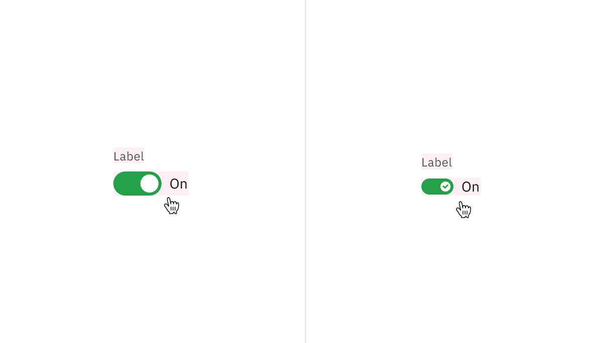
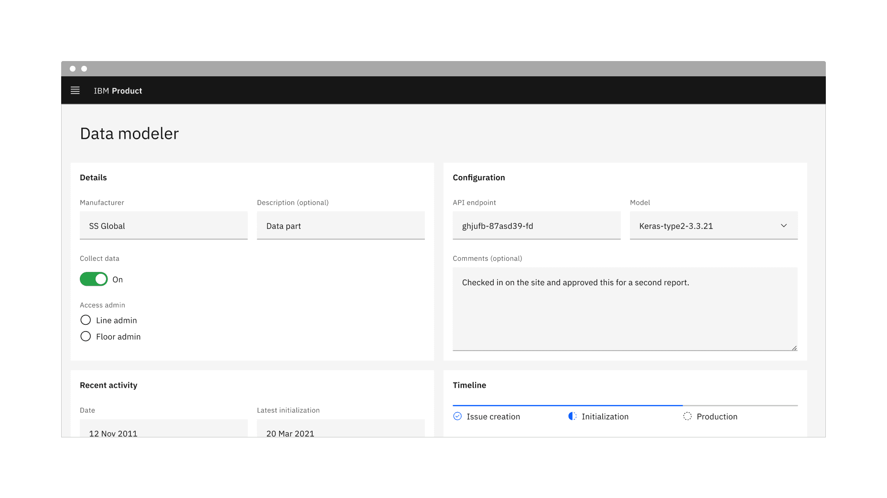

import A11yStatus from 'components/A11yStatus';
import { Tag } from '@carbon/react';

<PageDescription>

<Tag type="blue">Feature flag</Tag>

A toggle is used to quickly switch between two possible states. They are
commonly used for “on/off” switches.

</PageDescription>

<AnchorLinks>

<AnchorLink>Live demo</AnchorLink>
<AnchorLink>Overview</AnchorLink>
<AnchorLink>Formatting</AnchorLink>
<AnchorLink>Content</AnchorLink>
<AnchorLink>Behaviors</AnchorLink>
<AnchorLink>Default toggle</AnchorLink>
<AnchorLink>Small toggle</AnchorLink>
<AnchorLink>Related</AnchorLink>
<AnchorLink>Feedback</AnchorLink>

</AnchorLinks>

## Live demo

<StorybookDemo
  themeSelector
  url="https://react.carbondesignsystem.com"
  variants={[
    {
      label: 'Default',
      variant: 'components-toggle--default',
    },
    {
      label: 'Small toggle',
      variant: 'components-toggle--small-toggle',
    },
  ]}
/>

<A11yStatus layout="cards" components="Toggle" />

## Overview

Toggle is a control that is used to quickly switch between two possible states.
Toggles are only used for these binary actions that occur immediately after the
user “flips the switch”. They are commonly used for “on/off” switches.

<Row>
<Column colLg={8}>

</Column>
</Row>

<Caption>Example of the toggle component in a UI</Caption>

### When to use

- To turn off and on a single option that affects the system or page settings.
- Ideal for settings or preferences that can be immediately applied.
- Recommended for actions where the change is reversible without additional
  confirmation.

### When not to use

- Avoid using toggles if the action requires immediate feedback or confirmation,
  such as deleting a file.
- Don’t use toggles for more than two options; instead, use a
  [dropdown](/components/dropdown/usage/),
  [radio button](/components/radio-button/usage/), or
  [checkbox](/components/checkbox/usage/).
- Avoid using toggles for settings that aren't binary in nature or don't provide
  instant application; instead use a different UI component, like a checkbox, in
  combination with a [button](/components/button/usage/).

### Variants

| Variant                           | Purpose                                                                                                                                                                 |
| --------------------------------- | ----------------------------------------------------------------------------------------------------------------------------------------------------------------------- |
| [Default toggle](#default-toggle) | Use the default toggle when you need to specify a label text in addition to the toggle state text. Default toggles appear in forms or within full pages of information. |
| [Small toggle](#small-toggle)     | Use the small toggle when you do not need to specify label or state text. Small toggles are more compact in size and are used inline with other components.             |

### Feature flags

## Formatting

A [feature flag](/components/overview/feature-flags/) has been added to toggle
to adjust its label spacing and changes its visual appearance, not its
functionality. For code-specific feature flag information, refer to the
[Code](/components/toggle/code/) tab. The current toggle is not being
deprecated, but teams are encouraged to use the feature flag toggle for their
products moving forward. Once the next major release (v12) is released in the
future, this feature flag will become the default version of the component.

The following is the feature flag change made to toggle.

- The spacing between the toggles label and its container is now 8px instead of
  16px to improve consistency across our label spacing in other components.
- This change applies to both the default and small toggles.

<Row>
<Column colLg={8}>
<Tabs>

<Tab label="Flag enabled">

</Tab>

<Tab label="Flag disabled">

</Tab>

</Tabs>

</Column>
</Row>

### Anatomy

Default and small toggles are both comprised of a label text, a toggle button,
and a state text. Default toggles are required to display a component label and
state text, unlike the small toggle, where both these elements are optional. The
small toggle displays a checkmark tick in the "on" state to ensure the toggle is
still accessible when label and state text are unavailable.

<Row>
<Column colLg={8}>

</Column>
</Row>

<Caption>Anatomy of default and small toggle</Caption>

<Row>
<Column colSm={2} colMd={4} colLg={4}>

#### 1. Default toggle

A. Label text   B. Toggle   C. State text  

</Column>
<Column colSm={2} colMd={4} colLg={4}>

#### 2. Small toggle

A. Label text (optional)   B. Toggle   C. State text (optional)  
D. Checkmark tick (on state)  

</Column>
</Row>

### Sizing

The toggle component is available in two sizes: **default** and **small**.

<Row>
<Column colLg={8}>

</Column>
</Row>

<Caption>Sizes of toggle</Caption>

## Content

#### Label text

The label text must accompany the toggle to provide additional context and
clarify its state. However, the label text is optional for small toggle.

#### State text

Use the state text to describe the binary action of toggle so that the action is
clear. It must be three words or less and is displayed on the side of a toggle.
The state text is optional for small toggle.

#### Language

Use adjectives rather than verbs to describe actions and the state of the object
affected.

### Further guidance

For further content guidance, see Carbon’s
[content guidelines](https://carbondesignsystem.com/guidelines/content/overview/).

## Behaviors

### States

The default and small toggle have two main states: **on** and **off**. Other
interactive states are **focus**, **disabled**, **read-only**, and **skeleton**.
For more information on toggle states, see the
[Style](/components/toggle/style/) tab.

| State     | When to use                                                                                                                                                                                                                                                 |
| --------- | ----------------------------------------------------------------------------------------------------------------------------------------------------------------------------------------------------------------------------------------------------------- |
| On        | When a user clicks or uses the arrow keys to switch on the component.                                                                                                                                                                                       |
| Off       | When a user clicks or uses the arrow keys to switch off the component.                                                                                                                                                                                      |
| Focus     | When a user presses tab or clicks on the toggle, it becomes focused, indicating the user has successfully navigated to the component.                                                                                                                       |
| Disabled  | When a user is not allowed to interact with the toggle due to either permissions, dependencies, or pre-requisites. The disabled state completely removes the interactive function from a component. The styling is not subject to WCAG contrast compliance. |
| Read-only | When the user can review but not modify the component. This state removes all interactive functions like the disabled state but can still be focusable, accessible by screen readers, and passes visual contrast for readability.                           |
| Skeleton  | Use on an initial page load to indicate that the toggle has not yet fully loaded.                                                                                                                                                                           |

### Interactions

#### Mouse

Toggle component is triggered on `Click` which switches between the "on" and
"off" states. It also has a visible focus state when selected, ensuring
accessibility.

#### Keyboard

For keyboard navigation, users can focus the toggle using the `Tab` key,
providing visual feedback for keyboard users. Pressing `Enter` or `Space`
changes the toggle's state between "on" and "off".

### Clickable areas

The toggle component has two clickable areas: the toggle switch itself and the
label associated with it. Users can click either area to change the toggle's
state.

<Row>
<Column colLg={8}>

</Column>
</Row>

<Caption>Clickable areas of default and small toggle</Caption>

## Default toggle

The default toggle is larger in size than the small toggle. They are commonly
used in forms and can appear within full pages of information that are not
restricted in space. Default toggles are required to display a visible label and
a state text.

Default toggle has an available
[feature flag](/components/overview/feature-flags/).

<Row>
<Column colLg={8}>
<Tabs>

<Tab label="Flag enabled">

</Tab>

<Tab label="Flag disabled">

</Tab>

</Tabs>

</Column>
</Row>

## Small toggle

Small toggle is often used in condensed spaces and appear inline with other
components or content. The label and state text are optional for small toggle.

Small toggle has an available
[feature flag](/components/overview/feature-flags/).

<Row>
<Column colLg={8}>

</Column>
</Row>

<Caption>Example of a small toggle with state text in context</Caption>

Unlike the default toggle, the small toggle is more compact in size and displays
a checkmark tick in the on state to ensure the toggle is still accessible
without requiring visible label or state text. For example, inside
[data table](/components/data-table/usage) rows.

<Row>
<Column colLg={8}>

</Column>
</Row>

<Caption>Example of a small toggle in context</Caption>

## Related

- [Button](/components/button/usage/)
- [Checkbox](/components/checkbox/usage/)
- [Data table](/components/data-table/usage/)
- [Dropdown](/components/dropdown/usage/)
- [Radio button](/components/radio-button/usage/)

## Feedback

Help us improve this component by providing feedback, asking questions, and
leaving any other comments on
[GitHub](https://github.com/carbon-design-system/carbon-website/issues/new?assignees=&labels=feedback&template=feedback.md).
