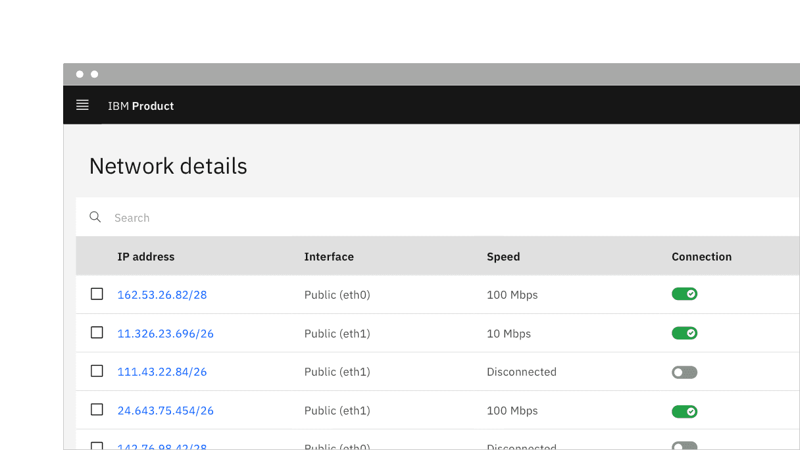

<PageDescription>

A toggle is used to quickly switch between two possible states. They are
commonly used for “on/off” switches.

</PageDescription>

<AnchorLinks>

<AnchorLink>Overview</AnchorLink>
<AnchorLink>Live demo</AnchorLink>
<AnchorLink>Content</AnchorLink>
<AnchorLink>Behaviors</AnchorLink>
<AnchorLink>Default toggle</AnchorLink>
<AnchorLink>Small toggle</AnchorLink>
<AnchorLink>Feedback</AnchorLink>

</AnchorLinks>

## Overview

Toggle is a control that is used to quickly switch between two possible states.
Toggles are only used for these binary actions that occur immediately after the
user “flips the switch”. They are commonly used for “on/off” switches.

## Live demo

<ComponentDemo
  components={[
    {
      id: 'default-toggle',
      label: 'Toggle',
    },
    {
      id: 'small-toggle',
      label: 'Toggle small',
    },
  ]}
>
  <ComponentVariant
    id="default-toggle"
    links={{
      React:
        'https://react.carbondesignsystem.com/?path=/story/components-toggle--default',
      Angular:
        'https://angular.carbondesignsystem.com/?path=/story/components-toggle--basic',
      Vue: 'http://vue.carbondesignsystem.com/?path=/story/components-cvtoggle--default',
      'Web Components':
        'https://web-components.carbondesignsystem.com/?path=/story/components-toggle--default',
    }}
  >
    {`
    <Toggle
      aria-label="toggle button"
      defaultToggled
      id="toggle-1"
      labelText="Label text"
    />
  `}
  </ComponentVariant>
  <ComponentVariant
    id="small-toggle"
    links={{
      React:
        'https://react.carbondesignsystem.com/?path=/story/components-toggle--default',
      Angular:
        'https://angular.carbondesignsystem.com/?path=/story/components-toggle--basic',
      Vue: 'http://vue.carbondesignsystem.com/?path=/story/components-cvtoggle--default',
      'Web Components':
        'https://web-components.carbondesignsystem.com/?path=/story/components-toggle--default',
    }}
  >
    {`
    <ToggleSmall
      aria-label="toggle button"
      defaultToggled
      id="toggle-2"
      labelText="Label text"
    />
  `}
  </ComponentVariant>
</ComponentDemo>

## Variants

| Variant        | Purpose                                                                                                                                                                  |
| -------------- | ------------------------------------------------------------------------------------------------------------------------------------------------------------------------ |
| Default toggle | Use the default toggle when you need to specify a label text in addition to the toggle action text. Default toggles appear in forms or within full pages of information. |
| Small toggle   | Use the small toggle when you do not need to specify label or action text. Small toggles are more compact in size and are used inline with other components.             |

<Row>
<Column colLg={8}>

</Column>
</Row>

<Caption>Default and small toggle variants</Caption>

## Content

#### Label text

Label text must accompany a toggle to further clarify the action that the toggle
performs.

#### Action text

Use text to describe the binary action of toggle so that the action is clear.
Action text must be three words or less and is displayed on the side of a
toggle.

#### Language

Use adjectives rather than verbs to describe actions and the state of the object
affected.

## Behaviors

### States

Toggles have five states: on, off, focus, disabled, and read-only.

<Row>
<Column colLg={8}>

</Column>
</Row>

<Caption>Example of toggle states</Caption>

## Default toggle

Default toggles are larger in size than small toggles. They are commonly used in
forms and can appear within full pages of information that are not restricted in
space. Default toggles are required to display visible label and action text.

<Row>
<Column colLg={8}>

</Column>
</Row>

<Caption>Example of a default toggle in context</Caption>

## Small toggle

Small toggles are often used in condensed spaces and appear inline with other
components or content, for example, inside
[data table](/components/data-table/usage) rows. Unlike the default toggle, the
small toggle is more compact in size and displays a checkmark tick in the on
state to ensure the toggle is still accessible without requiring visible label
or action text.

<Row>
<Column colLg={8}>

</Column>
</Row>

<Caption>Example of a small toggle in context</Caption>

## Feedback

Help us improve this component by providing feedback, asking questions, and
leaving any other comments on
[GitHub](https://github.com/carbon-design-system/carbon-website/issues/new?assignees=&labels=feedback&template=feedback.md).
