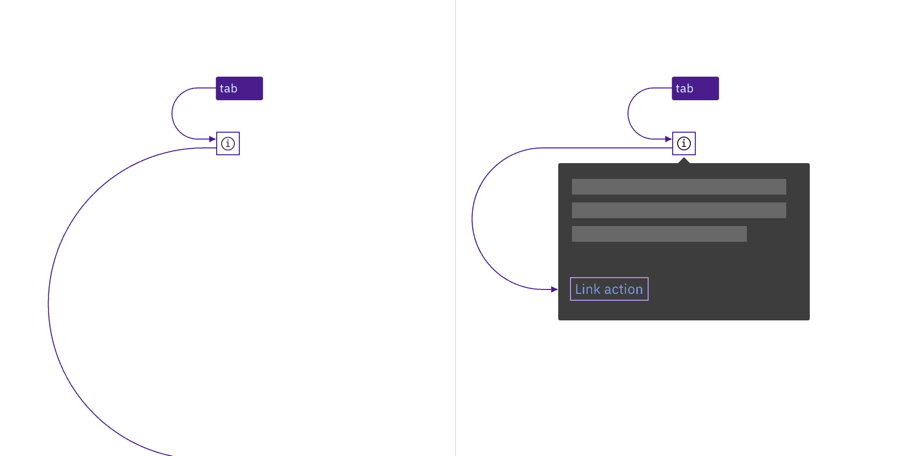

import A11yStatus from 'components/A11yStatus';

import { Toggletip } from '@carbon/react';

<PageDescription>

Toggletips display and hide additional information upon the click of a UI
trigger element and can contain interactive elements.

</PageDescription>

<AnchorLinks>
  <AnchorLink>What Carbon provides</AnchorLink>
  <AnchorLink>Development considerations</AnchorLink>
</AnchorLinks>

## What Carbon provides

Carbon already incorporates accessibility into the toggletip component.
Designers only need to indicate the toggletip’s content.

### Keyboard interactions

Toggletips use an information icon button for the trigger. These buttons are in
the tab order and are activated by pressing `Enter` or `Space`. The activation
toggles the tip open and closed, and focus remains on the trigger.

When the toggletip contains interactive elements, pressing`Tab` will move focus
to the first component in the toggletip. When the toggletip only has
non-interactive text, or when the focus is on the last component in the
toggletip, pressing `Tab` will close the toggletip and move focus to the next
tab stop on the page. Pressing `Esc` also closes an open toggletip and returns
focus to the trigger if the focus is inside the tooltip.

<Row>
<Column colLg={12}>

<Caption>
  The information icon button that triggers the toggletip is in the page tab
  order, as are interactive elements inside an open toggletip.
</Caption>

</Column>
</Row>

<Row>
<Column colLg={12}>

<Caption>
  Toggletips appear when the information icon button is activated and disappear
  by activating the icon again, pressing Esc, or tabbing away from the
  toggletip.
</Caption>

</Column>
</Row>

## Development considerations

Keep these considerations in mind if you are modifying Carbon or creating a
custom component.

- The icon button has `aria-label="Show information"`.
- The button uses `aria-expanded` to set toggletip visibility and
  `aria-controls` to handle navigation to the content.

<A11yStatus layout="table" components="Toggletip" />
