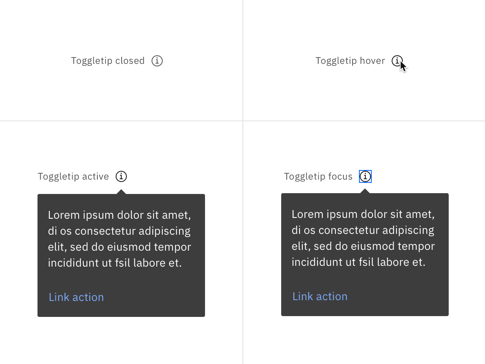
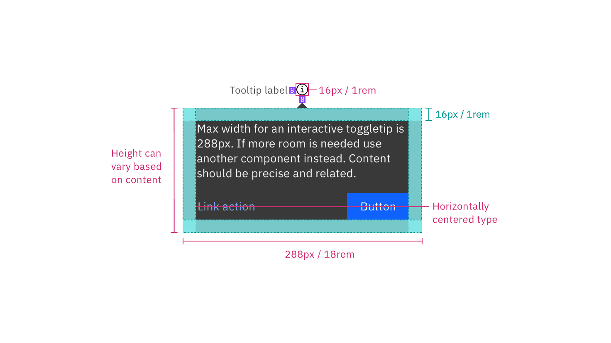
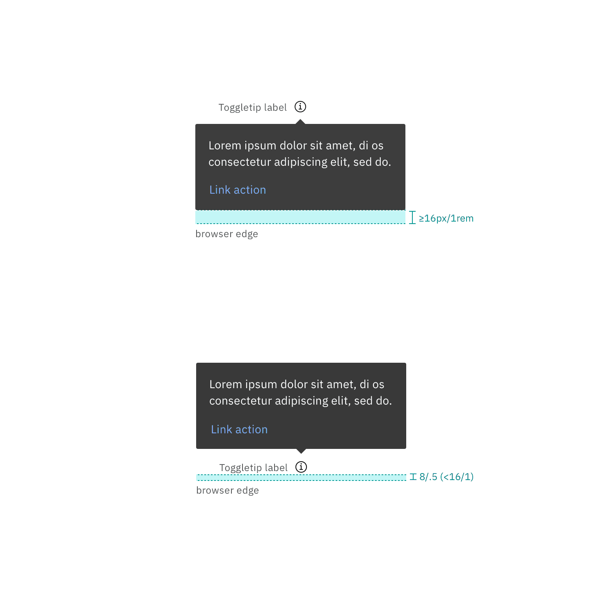

## Color

### Interactive Toggletip

| element        | property         | color token           |
| -------------- | ---------------- | --------------------- |
| Label          | text color       | `$text-secondary`     |
| Trigger button | svg              | `$icon-secondary`     |
| Container      | background-color | `$background-inverse` |
| Text           | color            | `$text-inverse`       |

<Row>
<Column colLg={8}>

</Column>
</Row>

<Caption>Closed (left) and open (right) interactive toggletip colors</Caption>

**Interactive states**

| State  | Element        | Property | Color token     |
| ------ | -------------- | -------- | --------------- |
| Hover  | trigger button | svg      | `$icon-primary` |
| Active | trigger button | svg      | `$icon-primary` |
| Focus  | trigger button | border   | `$focus`        |

<Row>
<Column colLg={8}>

</Column>
</Row>

<Caption>Hover (left) and focus (right) interactive toggletip states</Caption>

### Definition toggletip

| element   | property         | color token           |
| --------- | ---------------- | --------------------- |
| Label     | text color       | `$text-secondary`     |
| Trigger   | border           | `$border-strong`      |
| Container | background-color | `$background-inverse` |
| Text      | color            | `$text-inverse`       |

<Row>
<Column colLg={8}>

</Column>
</Row>

<Caption>Closed (left) and open (right) definition toggletip colors</Caption>

**Interactive states**

| State  | Element          | Property | Color token           |
| ------ | ---------------- | -------- | --------------------- |
| Hover  | trigger          | border   | `$border-interactive` |
| Active | trigger          | border   | `$border-interactive` |
| Focus  | label and border | border   | `$focus`              |

<Row>
<Column colLg={8}>

</Column>
</Row>

<Caption>Hover (left) and focus (right) defintion toggletip states</Caption>

## Typography

| Element                      | font-size (px-rem) | font-weight   | type token       |
| ---------------------------- | ------------------ | ------------- | ---------------- |
| Label (definition toggletip) | 14px / 0.875rem    | Regular / 400 | `$body-short-01` |
| Body text                    | 14px / 0.875rem    | Regular / 400 | `$body-long-01`  |

## Structure

All tooltip types have a varying height based on the amount of content they
contain.

### Interactive toggletip

| Element      | Property      | px / rem | Spacing token |
| ------------ | ------------- | -------- | ------------- |
| Container    | max-width     | 288 / 18 | —             |
|              | padding       | 16 / 1   | `$spacing-05` |
|              | margin-top    | 8 / 0.5  | `$spacing-03` |
| Trigger icon | height, width | 16 / 1   | —             |
|              | margin-left   | 8 / 0.5  | `$spacing-03` |

<Caption>
  Structure and spacing measurements an interactive toggletip. | px / rem
</Caption>

### Definition toggletip

| Element   | Property                    | px / rem | Spacing token |
| --------- | --------------------------- | -------- | ------------- |
| Container | max-width                   | 176 / 11 | —             |
|           | padding-top, padding-bottom | 8 / .5   | `$spacing-04` |
|           | padding-left, padding-right | 8 / .5   | `$spacing-04` |
|           | margin-top                  | 4 / 0.25 | `$spacing-02` |
| Trigger   | border-bottom               | 1 px     | —             |

<Caption>
  Structure and spacing measurements a definition toggletip. | px / rem
</Caption>
